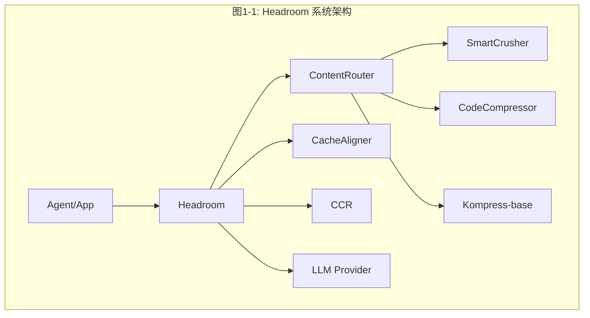

# Headroom 项目代码深度分析计划

## 项目概述

**Headroom** 是一个 AI 上下文压缩层（Context Compression Layer），核心功能是在 AI Agent 的输入到达 LLM 之前，对工具输出、日志、RAG 结果、文件和对话历史进行压缩，实现 60-95% 的 token 节省，同时保持答案质量不变。

- **语言栈**: Python（主代码）+ Rust（高性能核心）+ TypeScript（SDK）
- **构建系统**: Maturin（Python+Rust 混合构建）
- **版本**: 0.22.4
- **许可证**: Apache 2.0

---

## 分析文档结构

将在 `/workspace/ReadCode/` 目录下创建以下文件，每个文件对应一个深度分析维度：

```
ReadCode/
├── 01-项目总览与架构.md          # 项目全局视图和架构设计
├── 02-核心压缩流水线.md          # Pipeline、Transforms、压缩算法
├── 03-代理服务器.md              # Proxy 模式、请求处理、认证
├── 04-CCR可逆压缩.md            # 可逆压缩机制、工具注入、响应处理
├── 05-缓存系统.md               # 缓存策略、前缀追踪、动态检测
├── 06-记忆系统.md               # 跨Agent记忆、分层存储、向量检索
├── 07-压缩算法详解.md            # SmartCrusher/CodeCompressor/Kompress
├── 08-内容路由与检测.md          # ContentRouter、ContentDetector、Masks
├── 09-Rust核心实现.md            # Rust crates 架构与实现
├── 10-CLI与Agent包装.md          # CLI命令、wrap模式、Agent集成
├── 11-Provider与Backend.md       # LLM提供商适配、API路由
├── 12-分词器与定价.md            # Token计数、模型定价
├── 13-图像压缩.md               # 图像优化、ML路由、OCR
├── 14-学习系统.md               # headroom learn、失败挖掘
├── 15-可观测性与遥测.md          # Metrics、Tracing、Telemetry
├── 16-MCP与集成.md              # MCP服务器、LangChain/Agno集成
├── 17-订阅与配额.md              # 订阅管理、速率限制
├── 18-存储与持久化.md            # SQLite、JSONL、向量存储
├── 19-安装与部署.md              # 安装系统、Docker、DevContainer
├── 20-测试体系.md               # 测试策略、基准测试、E2E测试
└── 21-设计理念与演进.md          # 设计哲学、REALIGNMENT、架构演进
```

---

## 写作规范

### 总分总结构

每篇分析文章必须严格遵循**"总—分—总"**的三段式结构：

1. **总（概述）**：开篇先给出模块的全景视图
   - 一句话定义该模块是什么、解决什么问题
   - 核心架构图/流程图（Mermaid）
   - 关键设计决策概述
   - 与其他模块的关系概览

2. **分（详细分析）**：逐层深入每个子模块/组件
   - 每个子模块独立成节，内部也遵循"总—分—总"
   - 核心类/函数详解（含代码引用和关键代码片段）
   - 设计模式和原理分析
   - 数据流和控制流详解
   - 关键算法实现细节
   - 配图说明（Mermaid 图表）

3. **总（总结）**：收束全篇，提炼核心要点
   - 设计亮点与取舍
   - 模块在整个系统中的定位和价值
   - 与其他模块的协作关系总结
   - 演进方向和改进空间

### 图表配置要求

每篇文章必须包含以下类型的 Mermaid 图表，以图文结合方式清晰呈现：

| 图表类型 | 使用场景 | 最少数量 |
|----------|---------|---------|
| `flowchart` / `graph` | 架构图、模块关系图、数据流图 | 每篇至少 2 个 |
| `sequenceDiagram` | 交互时序、请求处理流程 | 涉及多组件交互时至少 1 个 |
| `classDiagram` | 类继承关系、接口设计 | 涉及类体系时至少 1 个 |
| `stateDiagram-v2` | 状态机、生命周期 | 涉及状态转换时至少 1 个 |
| `mindmap` | 知识结构、模块脑图 | 每篇开篇 1 个（概述部分） |

**图表命名规范**：每个图表必须有标题，格式为 `图 X-Y: 描述`（X 为文章编号，Y 为图序号）

**图表示例**：



---

## 各文件详细分析内容

### 01-项目总览与架构.md

**分析目标**: 提供项目的全局视图，让读者快速理解整体架构

**文章结构**:

> **总（概述）**
> - Headroom 一句话定义：AI 上下文压缩层
> - 🗺️ 图1-1: Headroom 知识脑图（mindmap）— 全局知识结构
> - 🏗️ 图1-2: 系统架构总览图（flowchart）— 核心组件和数据流
> - 三种使用模式概览：Library / Proxy / Agent Wrap
> - 与竞品对比表
>
> **分（详细分析）**
>
> 1. **项目定位与核心价值**
>    - Headroom 解决的问题：AI Agent 上下文窗口浪费
>    - 核心价值主张：60-95% token 节省，可逆压缩，本地优先
>
> 2. **技术栈全景**
>    - Python 主代码 + Rust 高性能核心 + TypeScript SDK
>    - 📊 图1-3: 技术栈依赖关系图（flowchart）
>    - Maturin 混合构建系统
>
> 3. **目录结构详解**
>    - 各目录职责和规模
>    - 🌳 图1-4: 目录结构树形图（flowchart）
>
> 4. **系统架构深度解析**
>    - 请求生命周期全流程
>    - 🔄 图1-5: 请求生命周期状态图（stateDiagram-v2）
>    - 核心组件关系
>    - 🔗 图1-6: 核心组件交互时序图（sequenceDiagram）
>
> 5. **入口点分析**
>    - CLI / 库 API / 代理服务器 / MCP / Rust 绑定
>
> **总（总结）**
> - 设计亮点：本地优先 + 可逆 + 插件化
> - Headroom 在 AI 工具链中的定位
> - 🎯 图1-7: Headroom 在 AI 工具生态中的位置（flowchart）
> - 后续章节导航

**涉及文件**:
- `/workspace/README.md`
- `/workspace/pyproject.toml`
- `/workspace/Cargo.toml`
- `/workspace/headroom/__init__.py`
- `/workspace/headroom/_version.py`
- `/workspace/wiki/ARCHITECTURE.md`
- `/workspace/docs/spec/002-architecture.md`
- `/workspace/REALIGNMENT/00-overview.md`
- `/workspace/REALIGNMENT/02-architecture.md`

---

### 02-核心压缩流水线.md

**分析目标**: 深入理解 Headroom 的核心压缩流水线设计和实现

**文章结构**:

> **总（概述）**
> - 压缩流水线是 Headroom 的心脏，串联所有变换组件
> - 🗺️ 图2-1: 压缩流水线知识脑图（mindmap）
> - 🏗️ 图2-2: Pipeline 总体架构图（flowchart）— 从输入到输出的完整路径
> - 核心设计：事件驱动 + 扩展点 + 策略模式
>
> **分（详细分析）**
>
> 1. **Pipeline 架构**
>    - `PipelineStage` 枚举与 `PipelineEvent` 事件模型
>    - `PipelineExtension` 扩展点与 `ExtensionManager` 管理器
>    - 🔗 图2-3: Pipeline 事件驱动时序图（sequenceDiagram）
>
> 2. **压缩主流程**
>    - `compress()` 函数完整执行路径
>    - `CompressionConfig` / `CompressionResult` 模型
>    - 压缩决策逻辑
>
> 3. **Client 实现**
>    - `HeadroomClient` 类设计与 LLM 客户端包装模式
>    - 📊 图2-4: HeadroomClient 类图（classDiagram）
>
> 4. **Transform Pipeline**
>    - `TransformPipeline` 变换组件注册与执行顺序
>    - 并行处理和卸载机制
>
> 5. **CompressionPolicy 与 AdaptiveSizer**
>    - 压缩策略决策与 TOIN 门控逻辑
>    - 🔄 图2-5: 压缩策略决策状态图（stateDiagram-v2）
>
> 6. **Pipeline 生命周期钩子**
>    - `CompressionHooks` 三阶段钩子机制
>
> **总（总结）**
> - 流水线设计的核心优势：可扩展、可观测、可配置
> - 🎯 图2-6: Pipeline 与其他模块协作关系图（flowchart）
> - 演进方向：Rust 加速、更细粒度的扩展点

**涉及文件**:
- `/workspace/headroom/pipeline.py`
- `/workspace/headroom/compress.py`
- `/workspace/headroom/client.py`
- `/workspace/headroom/transforms/pipeline.py`
- `/workspace/headroom/transforms/base.py`
- `/workspace/headroom/transforms/compression_policy.py`
- `/workspace/headroom/transforms/adaptive_sizer.py`
- `/workspace/headroom/transforms/observability.py`
- `/workspace/headroom/hooks.py`
- `/workspace/headroom/config.py`

---

### 03-代理服务器.md

**分析目标**: 深入理解 Proxy 模式的完整实现

**文章结构**:

> **总（概述）**
> - Proxy 是 Headroom 的零代码集成方案，拦截并压缩所有 LLM 请求
> - 🗺️ 图3-1: 代理服务器知识脑图（mindmap）
> - 🏗️ 图3-2: Proxy 总体架构图（flowchart）— 请求拦截→压缩→转发→响应
>
> **分（详细分析）**
>
> 1. **服务器架构**
>    - FastAPI 应用结构与 ASGI 中间件集成
>    - WebSocket 代理支持
>    - 🔗 图3-3: 请求处理时序图（sequenceDiagram）
>
> 2. **代理模式与认证**
>    - `ProxyMode` / `AuthMode` / `CompressionDecision` / `MemoryDecision`
>    - 📊 图3-4: 代理模式类图（classDiagram）
>
> 3. **请求处理**
>    - OpenAI/Anthropic API 路由
>    - 循环保护（LoopbackGuard）与阶段计时（StageTimer）
>    - 🔄 图3-5: 请求处理状态图（stateDiagram-v2）
>
> 4. **扩展系统**
>    - 语义缓存 / 速率限制 / 请求日志 / 节省追踪
>
> 5. **Prometheus 指标与 Warmup**
>    - 指标定义与模型预热机制
>
> **总（总结）**
> - Proxy 模式的核心价值：零代码、全协议、可观测
> - 🎯 图3-6: Proxy 与其他模块协作关系图（flowchart）
> - 演进方向：Rust 原生代理、更多提供商支持

**涉及文件**:
- `/workspace/headroom/proxy/server.py`
- `/workspace/headroom/proxy/modes.py`
- `/workspace/headroom/proxy/auth_mode.py`
- `/workspace/headroom/proxy/compression_decision.py`
- `/workspace/headroom/proxy/memory_decision.py`
- `/workspace/headroom/proxy/memory_handler.py`
- `/workspace/headroom/proxy/memory_injection.py`
- `/workspace/headroom/proxy/models.py`
- `/workspace/headroom/proxy/extensions.py`
- `/workspace/headroom/proxy/helpers.py`
- `/workspace/headroom/proxy/loopback_guard.py`
- `/workspace/headroom/proxy/stage_timer.py`
- `/workspace/headroom/proxy/prometheus_metrics.py`
- `/workspace/headroom/proxy/semantic_cache.py`
- `/workspace/headroom/proxy/rate_limiter.py`
- `/workspace/headroom/proxy/request_logger.py`
- `/workspace/headroom/proxy/savings_tracker.py`
- `/workspace/headroom/proxy/warmup.py`
- `/workspace/headroom/proxy/cost.py`
- `/workspace/headroom/proxy/outcome.py`
- `/workspace/headroom/proxy/debug_introspection.py`
- `/workspace/headroom/proxy/ws_session_registry.py`
- `/workspace/headroom/proxy/image_compression_decision.py`

---

### 04-CCR可逆压缩.md

**分析目标**: 深入理解 CCR（Compress-Context-Retrieve）可逆压缩机制

**文章结构**:

> **总（概述）**
> - CCR 是 Headroom 的核心创新：压缩不丢失，LLM 按需检索原文
> - 🗺️ 图4-1: CCR 知识脑图（mindmap）
> - 🏗️ 图4-2: CCR 工作流程图（flowchart）— 压缩→存储→注入→检索
>
> **分（详细分析）**
>
> 1. **CCR 架构与存储**
>    - 可逆压缩核心思想与 BLAKE3 哈希键生成
>    - 存储后端：内存/SQLite/Redis
>    - 🔗 图4-3: CCR 压缩-检索时序图（sequenceDiagram）
>
> 2. **工具注入**
>    - `headroom_retrieve` 工具注入机制与 LLM 交互协议
>
> 3. **响应处理**
>    - `ResponseHandler` / `BatchProcessor` / `BatchStore`
>
> 4. **上下文追踪**
>    - `ContextTracker` 与跨轮次一致性
>    - 🔄 图4-4: CCR 上下文追踪状态图（stateDiagram-v2）
>
> 5. **MCP 服务器与压缩反馈**
>    - MCP 工具：compress / retrieve / stats
>    - TOIN 集成与压缩质量反馈
>
> **总（总结）**
> - CCR 的核心价值：可逆性是信任的基础
> - 🎯 图4-5: CCR 与 Pipeline/Cache/Memory 协作图（flowchart）
> - 演进方向：更智能的检索策略、跨会话持久化

**涉及文件**:
- `/workspace/headroom/ccr/__init__.py`
- `/workspace/headroom/ccr/tool_injection.py`
- `/workspace/headroom/ccr/response_handler.py`
- `/workspace/headroom/ccr/context_tracker.py`
- `/workspace/headroom/ccr/batch_processor.py`
- `/workspace/headroom/ccr/batch_store.py`
- `/workspace/headroom/ccr/mcp_server.py`
- `/workspace/headroom/cache/compression_cache.py`
- `/workspace/headroom/cache/compression_feedback.py`
- `/workspace/headroom/cache/compression_store.py`
- `/workspace/wiki/ccr.md`

---

### 05-缓存系统.md

**分析目标**: 深入理解缓存优化策略和实现

**文章结构**:

> **总（概述）**
> - 缓存系统是 Headroom 降低成本的关键：提高 KV 缓存命中率 + 压缩结果复用
> - 🗺️ 图5-1: 缓存系统知识脑图（mindmap）
> - 🏗️ 图5-2: 缓存架构总览图（flowchart）— 多层缓存协作
>
> **分（详细分析）**
>
> 1. **缓存架构**
>    - `CacheBackend` 基类与提供商特定缓存
>    - 📊 图5-3: 缓存类继承图（classDiagram）
>
> 2. **前缀追踪与 CacheAligner**
>    - `PrefixTracker` 前缀匹配与 KV 缓存命中优化
>    - 🔗 图5-4: 前缀追踪与缓存对齐时序图（sequenceDiagram）
>
> 3. **动态检测**
>    - `DynamicDetector` 缓存友好模式检测与缓存破坏避免
>
> 4. **语义缓存**
>    - 基于嵌入的语义缓存与相似请求匹配
>
> 5. **压缩缓存**
>    - 压缩结果缓存 / 反馈循环 / 存储持久化
>
> **总（总结）**
> - 多层缓存策略的协同效应
> - 🎯 图5-5: 缓存系统与 Pipeline/Proxy 协作图（flowchart）
> - 演进方向：更智能的缓存失效策略

**涉及文件**:
- `/workspace/headroom/cache/base.py`
- `/workspace/headroom/cache/registry.py`
- `/workspace/headroom/cache/anthropic.py`
- `/workspace/headroom/cache/openai.py`
- `/workspace/headroom/cache/google.py`
- `/workspace/headroom/cache/prefix_tracker.py`
- `/workspace/headroom/cache/dynamic_detector.py`
- `/workspace/headroom/cache/semantic.py`
- `/workspace/headroom/cache/compression_cache.py`
- `/workspace/headroom/cache/compression_feedback.py`
- `/workspace/headroom/cache/compression_store.py`

---

### 06-记忆系统.md

**分析目标**: 深入理解跨 Agent 记忆系统的设计

**文章结构**:

> **总（概述）**
> - 记忆系统让 AI Agent 拥有跨会话、跨 Agent 的持久上下文
> - 🗺️ 图6-1: 记忆系统知识脑图（mindmap）
> - 🏗️ 图6-2: 记忆架构总览图（flowchart）— 分层存储 + 多后端路由
>
> **分（详细分析）**
>
> 1. **记忆架构**
>    - 分层模型（短期/中期/长期）与范围（项目/用户/全局）
>    - 📊 图6-3: 记忆模型类图（classDiagram）
>
> 2. **核心实现**
>    - `MemoryCore` / `MemoryFactory` / `MemoryModels`
>
> 3. **存储路由**
>    - `StorageRouter` 多后端路由（SQLite/Qdrant/Neo4j）
>
> 4. **记忆桥接与提取**
>    - `MemoryBridge` / `Extraction` / `InlineExtractor` / `Budget`
>
> 5. **MCP 服务器与流量学习**
>    - 记忆 MCP 工具 / `TrafficLearner` 自动学习
>    - 🔗 图6-4: 记忆存取时序图（sequenceDiagram）
>
> 6. **SharedContext**
>    - 跨 Agent 上下文共享与 CCR 集成
>
> **总（总结）**
> - 记忆系统的核心价值：跨 Agent 知识积累与复用
> - 🎯 图6-5: 记忆系统与其他模块协作图（flowchart）
> - 演进方向：更智能的记忆淘汰、图数据库增强

**涉及文件**:
- `/workspace/headroom/memory/core.py`
- `/workspace/headroom/memory/factory.py`
- `/workspace/headroom/memory/models.py`
- `/workspace/headroom/memory/config.py`
- `/workspace/headroom/memory/storage_router.py`
- `/workspace/headroom/memory/bridge.py`
- `/workspace/headroom/memory/bridge_config.py`
- `/workspace/headroom/memory/bridge_parsers.py`
- `/workspace/headroom/memory/extraction.py`
- `/workspace/headroom/memory/inline_extractor.py`
- `/workspace/headroom/memory/budget.py`
- `/workspace/headroom/memory/mcp_server.py`
- `/workspace/headroom/memory/tools.py`
- `/workspace/headroom/memory/tracker.py`
- `/workspace/headroom/memory/traffic_learner.py`
- `/workspace/headroom/memory/wrapper.py`
- `/workspace/headroom/memory/wrapper_tools.py`
- `/workspace/headroom/memory/system.py`
- `/workspace/headroom/memory/sync.py`
- `/workspace/headroom/memory/ports.py`
- `/workspace/headroom/memory/easy.py`
- `/workspace/headroom/memory/qdrant_env.py`
- `/workspace/headroom/shared_context.py`
- `/workspace/wiki/memory.md`

---

### 07-压缩算法详解.md

**分析目标**: 深入理解各压缩算法的实现细节

**文章结构**:

> **总（概述）**
> - 压缩算法是 Headroom 的核心引擎，针对不同内容类型使用最优策略
> - 🗺️ 图7-1: 压缩算法知识脑图（mindmap）
> - 🏗️ 图7-2: 压缩算法选择流程图（flowchart）— ContentRouter 路由决策
>
> **分（详细分析）**
>
> 1. **SmartCrusher（智能粉碎器）**
>    - JSON 压缩原理：数组去重、键名缩短、空值移除
>    - 锚点选择 / 分类器 / 构建器 / 分析器
>    - Python 与 Rust 奇偶校验
>    - 📊 图7-3: SmartCrusher 内部组件图（flowchart）
>
> 2. **CodeCompressor（代码压缩器）**
>    - AST 感知压缩：ast-grep / tree-sitter
>    - 支持 6 种语言的结构保留策略
>
> 3. **Kompress-base（ML 文本压缩）**
>    - ModernBERT 架构 + ONNX INT8 量化推理
>    - 🔗 图7-4: Kompress 推理时序图（sequenceDiagram）
>
> 4. **DiffCompressor / LogCompressor / SearchCompressor**
>    - 各领域专用压缩策略
>
> 5. **HTML 提取器**
>    - trafilatura 集成与纯文本转换
>
> **总（总结）**
> - 多算法协同的核心优势：针对性压缩 > 通用压缩
> - 🎯 图7-5: 压缩算法协作与选择决策图（flowchart）
> - 演进方向：更多领域专用压缩器、自适应算法选择

**涉及文件**:
- `/workspace/headroom/transforms/smart_crusher.py`
- `/workspace/headroom/transforms/code_compressor.py`
- `/workspace/headroom/transforms/kompress_compressor.py`
- `/workspace/headroom/transforms/diff_compressor.py`
- `/workspace/headroom/transforms/log_compressor.py`
- `/workspace/headroom/transforms/search_compressor.py`
- `/workspace/headroom/transforms/html_extractor.py`
- `/workspace/headroom/transforms/anchor_selector.py`
- `/workspace/headroom/transforms/compression_units.py`
- `/workspace/headroom/transforms/compression_summary.py`
- `/workspace/headroom/transforms/tag_protector.py`
- `/workspace/headroom/transforms/error_detection.py`
- `/workspace/headroom/transforms/read_lifecycle.py`
- `/workspace/crates/headroom-core/src/transforms/smart_crusher/`
- `/workspace/crates/headroom-core/src/transforms/diff_compressor.rs`
- `/workspace/crates/headroom-core/src/transforms/log_compressor.rs`
- `/workspace/wiki/compression.md`
- `/workspace/wiki/text-compression.md`

---

### 08-内容路由与检测.md

**分析目标**: 深入理解内容类型检测和路由机制

**文章结构**:

> **总（概述）**
> - 内容路由是压缩的入口：正确识别内容类型才能选择最优压缩策略
> - 🗺️ 图8-1: 内容路由知识脑图（mindmap）
> - 🏗️ 图8-2: 内容路由决策流程图（flowchart）— 检测→分类→路由
>
> **分（详细分析）**
>
> 1. **ContentRouter（内容路由器）**
>    - 内容类型检测与路由决策逻辑
>    - 与压缩算法的映射关系
>
> 2. **ContentDetector（内容检测器）**
>    - 基于规则检测 + ML 检测（Magika）
>    - 🔗 图8-3: 内容检测时序图（sequenceDiagram）
>
> 3. **Masks（掩码）**
>    - 压缩掩码定义、应用与恢复
>    - 压缩/解压缩对称性
>
> 4. **TagProtector（标签保护器）**
>    - XML/HTML 标签保护与不变式保证
>    - 📊 图8-4: TagProtector 处理流程图（flowchart）
>
> **总（总结）**
> - 内容路由的核心价值：精准识别 → 精准压缩
> - 🎯 图8-5: 内容路由与压缩算法映射图（flowchart）
> - 演进方向：更细粒度的内容分类、ML 增强检测

**涉及文件**:
- `/workspace/headroom/transforms/content_router.py`
- `/workspace/headroom/transforms/content_detector.py`
- `/workspace/headroom/compression/detector.py`
- `/workspace/headroom/compression/masks.py`
- `/workspace/headroom/compression/universal.py`
- `/workspace/headroom/transforms/tag_protector.py`

---

### 09-Rust核心实现.md

**分析目标**: 深入理解 Rust 高性能核心的实现

**文章结构**:

> **总（概述）**
> - Rust 核心是 Headroom 的性能引擎，提供 Python 无法匹敌的压缩速度
> - 🗺️ 图9-1: Rust 核心知识脑图（mindmap）
> - 🏗️ 图9-2: Rust crates 架构图（flowchart）— 4 个 crate 的职责与关系
>
> **分（详细分析）**
>
> 1. **headroom-core crate**
>    - 模块结构：auth_mode / cache_control / compression / tokenizer / transforms
>    - SmartCrusher / DiffCompressor / LogCompressor Rust 实现
>    - CCR 存储层与 BLAKE3 哈希
>    - 📊 图9-3: headroom-core 模块图（flowchart）
>
> 2. **headroom-proxy crate**
>    - Axum HTTP 服务器 / Bedrock SigV4 / Vertex GCP ADC / WebSocket
>    - 🔗 图9-4: Rust Proxy 请求处理时序图（sequenceDiagram）
>
> 3. **headroom-py crate**
>    - PyO3 绑定与 Python 可调用函数导出
>
> 4. **headroom-parity crate**
>    - Python/Rust 奇偶校验与行为一致性保证
>
> 5. **构建和发布**
>    - Maturin 混合构建 / Release profile 优化 / Wheel 大小优化
>
> **总（总结）**
> - Rust 迁移的核心动机：性能 + 类型安全 + 并发
> - 🎯 图9-5: Python-Rust 交互架构图（flowchart）
> - 演进方向：更多模块迁移到 Rust、独立 Rust 代理

**涉及文件**:
- `/workspace/crates/headroom-core/src/` (所有 .rs 文件)
- `/workspace/crates/headroom-proxy/src/` (所有 .rs 文件)
- `/workspace/crates/headroom-py/src/` (所有 .rs 文件)
- `/workspace/crates/headroom-parity/src/` (所有 .rs 文件)
- `/workspace/crates/*/Cargo.toml`
- `/workspace/Cargo.toml`
- `/workspace/RUST_DEV.md`

---

### 10-CLI与Agent包装.md

**分析目标**: 深入理解 CLI 命令和 Agent 包装机制

**文章结构**:

> **总（概述）**
> - CLI 是用户与 Headroom 交互的主要界面，Agent Wrap 是零代码集成的关键
> - 🗺️ 图10-1: CLI 与 Agent 包装知识脑图（mindmap）
> - 🏗️ 图10-2: CLI 命令架构图（flowchart）— 命令组与子命令
>
> **分（详细分析）**
>
> 1. **CLI 框架**
>    - Click 命令组结构与子命令体系
>    - 📊 图10-3: CLI 命令类图（classDiagram）
>
> 2. **Agent Wrap 模式**
>    - `headroom wrap` 环境变量注入与进程管理
>    - 🔗 图10-4: Agent Wrap 启动时序图（sequenceDiagram）
>
> 3. **Provider 特定包装**
>    - Claude / Codex / Cursor / Aider / Copilot / OpenClaw / OpenHands
>
> 4. **MCP 安装与 Init**
>    - MCP 服务器注册与项目初始化
>
> 5. **Perf 与 Tools**
>    - 性能分析与工具管理
>
> **总（总结）**
> - CLI 设计的核心原则：一键启动、零配置
> - 🎯 图10-5: CLI 与 Proxy/Pipeline 协作图（flowchart）
> - 演进方向：更多 Agent 支持、交互式配置

**涉及文件**:
- `/workspace/headroom/cli/main.py`
- `/workspace/headroom/cli/wrap.py`
- `/workspace/headroom/cli/proxy.py`
- `/workspace/headroom/cli/mcp.py`
- `/workspace/headroom/cli/memory.py`
- `/workspace/headroom/cli/learn.py`
- `/workspace/headroom/cli/init.py`
- `/workspace/headroom/cli/install.py`
- `/workspace/headroom/cli/perf.py`
- `/workspace/headroom/cli/evals.py`
- `/workspace/headroom/cli/tools.py`
- `/workspace/headroom/cli/toin_publish.py`
- `/workspace/headroom/cli/wrap_rtk_metrics.py`
- `/workspace/headroom/providers/anthropic.py`
- `/workspace/headroom/providers/openai.py`
- `/workspace/headroom/providers/cohere.py`
- `/workspace/headroom/providers/google.py`
- `/workspace/headroom/providers/litellm.py`
- `/workspace/headroom/providers/openai_compatible.py`
- `/workspace/wiki/cli.md`

---

### 11-Provider与Backend.md

**分析目标**: 深入理解 LLM 提供商适配层

**文章结构**:

> **总（概述）**
> - Provider 层让 Headroom 支持所有主流 LLM，Backend 层提供 API 翻译
> - 🗺️ 图11-1: Provider 与 Backend 知识脑图（mindmap）
> - 🏗️ 图11-2: Provider 架构总览图（flowchart）— 注册→发现→适配→路由
>
> **分（详细分析）**
>
> 1. **Provider 架构**
>    - `BaseProvider` / `ProviderRegistry` / 提供商发现与选择
>    - 📊 图11-3: Provider 类继承图（classDiagram）
>
> 2. **具体 Provider**
>    - Anthropic / OpenAI / Google / Cohere / LiteLLM
>    - 🔗 图11-4: 请求路由时序图（sequenceDiagram）
>
> 3. **Backend 系统**
>    - `BaseBackend` / LiteLLM Backend / AnyLLM Backend
>
> 4. **代理路由与安装注册**
>    - `ProxyRoutes` 路由定义与模型回退策略
>
> **总（总结）**
> - Provider 层的设计精髓：统一接口 + 提供商特化
> - 🎯 图11-5: Provider 与 Proxy/CLI 协作图（flowchart）
> - 演进方向：更多提供商、自动模型选择

**涉及文件**:
- `/workspace/headroom/providers/base.py`
- `/workspace/headroom/providers/registry.py`
- `/workspace/headroom/providers/anthropic.py`
- `/workspace/headroom/providers/openai.py`
- `/workspace/headroom/providers/google.py`
- `/workspace/headroom/providers/cohere.py`
- `/workspace/headroom/providers/litellm.py`
- `/workspace/headroom/providers/openai_compatible.py`
- `/workspace/headroom/providers/proxy_routes.py`
- `/workspace/headroom/providers/install_registry.py`
- `/workspace/headroom/backends/base.py`
- `/workspace/headroom/backends/litellm.py`
- `/workspace/headroom/backends/anyllm.py`

---

### 12-分词器与定价.md

**分析目标**: 深入理解 Token 计数和模型定价系统

**文章结构**:

> **总（概述）**
> - 分词器是压缩的基础度量，定价系统量化压缩的经济价值
> - 🗺️ 图12-1: 分词器与定价知识脑图（mindmap）
> - 🏗️ 图12-2: 分词器架构图（flowchart）— 注册→选择→计数
>
> **分（详细分析）**
>
> 1. **分词器架构**
>    - `BaseTokenizer` / `TokenizerRegistry` / 可插拔后端
>    - 📊 图12-3: 分词器类图（classDiagram）
>
> 2. **具体分词器**
>    - TiktokenCounter / HuggingFaceTokenizer / MistralTokenizer / Estimator
>
> 3. **定价系统**
>    - Anthropic / OpenAI / LiteLLM 价格表与成本计算
>    - 🔗 图12-4: 定价查询时序图（sequenceDiagram）
>
> **总（总结）**
> - 精确分词 + 实时定价 = 量化压缩价值
> - 🎯 图12-5: 分词器与 Pipeline/Proxy 协作图（flowchart）
> - 演进方向：更多模型支持、实时价格更新

**涉及文件**:
- `/workspace/headroom/tokenizers/base.py`
- `/workspace/headroom/tokenizers/registry.py`
- `/workspace/headroom/tokenizers/tiktoken_counter.py`
- `/workspace/headroom/tokenizers/huggingface.py`
- `/workspace/headroom/tokenizers/mistral.py`
- `/workspace/headroom/tokenizers/estimator.py`
- `/workspace/headroom/tokenizer.py`
- `/workspace/headroom/pricing/registry.py`
- `/workspace/headroom/pricing/anthropic_prices.py`
- `/workspace/headroom/pricing/openai_prices.py`
- `/workspace/headroom/pricing/litellm_pricing.py`

---

### 13-图像压缩.md

**分析目标**: 深入理解图像压缩模块

**文章结构**:

> **总（概述）**
> - 图像压缩是 Headroom 的多模态扩展，40-90% 图像 token 节省
> - 🗺️ 图13-1: 图像压缩知识脑图（mindmap）
> - 🏗️ 图13-2: 图像压缩流程图（flowchart）— 检测→路由→压缩
>
> **分（详细分析）**
>
> 1. **图像压缩架构**
>    - `ImageCompressor` 主类与压缩流程
>
> 2. **ML 路由**
>    - `OnnxRouter` / `TrainedRouter` 压缩决策
>    - 📊 图13-3: ML 路由决策流程图（flowchart）
>
> 3. **Tile 优化与 OCR**
>    - `TileOptimizer` 分块策略 / RapidOCR 集成
>
> 4. **提供商特定处理**
>    - Anthropic / OpenAI 图像格式适配
>    - 🔗 图13-4: 图像压缩请求时序图（sequenceDiagram）
>
> **总（总结）**
> - 图像压缩的核心价值：多模态上下文优化
> - 🎯 图13-5: 图像压缩与 Proxy/Pipeline 协作图（flowchart）
> - 演进方向：视频压缩、更多图像格式

**涉及文件**:
- `/workspace/headroom/image/compressor.py`
- `/workspace/headroom/image/onnx_router.py`
- `/workspace/headroom/image/tile_optimizer.py`
- `/workspace/headroom/image/trained_router.py`
- `/workspace/headroom/proxy/image_compression_decision.py`
- `/workspace/wiki/image-compression.md`

---

### 14-学习系统.md

**分析目标**: 深入理解 headroom learn 的实现

**文章结构**:

> **总（概述）**
> - headroom learn 从失败会话中挖掘修正，自动写入 Agent 指令文件
> - 🗺️ 图14-1: 学习系统知识脑图（mindmap）
> - 🏗️ 图14-2: Learn 工作流程图（flowchart）— 扫描→分析→写入
>
> **分（详细分析）**
>
> 1. **Learn 架构**
>    - 插件化设计：`BaseLearner` 基类
>    - 📊 图14-3: Learn 类继承图（classDiagram）
>
> 2. **核心组件**
>    - Scanner（扫描失败会话）/ Analyzer（分析原因）/ Writer（写入修正）
>    - 🔗 图14-4: Learn 执行时序图（sequenceDiagram）
>
> 3. **具体插件与共享组件**
>    - Claude / Codex / Gemini 会话学习
>    - 共享工具 / 数据模型 / 学习器注册表
>
> **总（总结）**
> - Learn 的核心价值：从失败中自动学习，持续改进
> - 🎯 图14-5: Learn 与 Memory/CLI 协作图（flowchart）
> - 演进方向：更多 Agent 支持、跨项目学习

**涉及文件**:
- `/workspace/headroom/learn/base.py`
- `/workspace/headroom/learn/scanner.py`
- `/workspace/headroom/learn/analyzer.py`
- `/workspace/headroom/learn/writer.py`
- `/workspace/headroom/learn/_shared.py`
- `/workspace/headroom/learn/models.py`
- `/workspace/headroom/learn/registry.py`
- `/workspace/wiki/learn.md`

---

### 15-可观测性与遥测.md

**分析目标**: 深入理解监控和遥测系统

**文章结构**:

> **总（概述）**
> - 可观测性让 Headroom 运行状态透明，遥测驱动压缩策略持续优化
> - 🗺️ 图15-1: 可观测性知识脑图（mindmap）
> - 🏗️ 图15-2: 可观测性架构图（flowchart）— 指标→追踪→遥测→Dashboard
>
> **分（详细分析）**
>
> 1. **OpenTelemetry 集成**
>    - Metrics / Tracing / OTLP 导出
>
> 2. **Prometheus 指标**
>    - 请求计数 / 压缩比率 / 缓存命中率 / 阶段计时
>    - 📊 图15-3: 指标采集流程图（flowchart）
>
> 3. **遥测系统**
>    - TelemetryCollector / Reporter / Beacon / Context / TOIN
>    - 🔗 图15-4: 遥测数据流时序图（sequenceDiagram）
>
> 4. **Dashboard**
>    - 实时监控面板与 SQL 聚合
>
> **总（总结）**
> - 可观测性的核心价值：透明运行 + 数据驱动优化
> - 🎯 图15-5: 可观测性与 Proxy/Pipeline 协作图（flowchart）
> - 演进方向：更丰富的 Dashboard、告警机制

**涉及文件**:
- `/workspace/headroom/observability/metrics.py`
- `/workspace/headroom/observability/tracing.py`
- `/workspace/headroom/proxy/prometheus_metrics.py`
- `/workspace/headroom/proxy/stage_timer.py`
- `/workspace/headroom/telemetry/collector.py`
- `/workspace/headroom/telemetry/reporter.py`
- `/workspace/headroom/telemetry/beacon.py`
- `/workspace/headroom/telemetry/context.py`
- `/workspace/headroom/telemetry/models.py`
- `/workspace/headroom/telemetry/toin.py`
- `/workspace/headroom/dashboard/`
- `/workspace/sql/`
- `/workspace/wiki/metrics.md`

---

### 16-MCP与集成.md

**分析目标**: 深入理解 MCP 服务器和第三方集成

**文章结构**:

> **总（概述）**
> - MCP 和集成层让 Headroom 无缝融入任何 AI 工具链
> - 🗺️ 图16-1: MCP 与集成知识脑图（mindmap）
> - 🏗️ 图16-2: 集成架构总览图（flowchart）— MCP/LangChain/Agno/ASGI/SDK
>
> **分（详细分析）**
>
> 1. **MCP 服务器**
>    - CCR MCP 工具 / Memory MCP 工具 / MCP 协议实现
>
> 2. **MCP 注册表**
>    - Claude Code / Codex 注册与安装显示
>    - 🔗 图16-3: MCP 安装时序图（sequenceDiagram）
>
> 3. **框架集成**
>    - LangChain / Agno / Strands / ASGI / LiteLLM
>    - 📊 图16-4: 集成适配器类图（classDiagram）
>
> 4. **TypeScript SDK**
>    - `compress()` 函数与类型定义
>
> **总（总结）**
> - 集成层的核心价值：Headroom 无处不在
> - 🎯 图16-5: 集成层与核心模块协作图（flowchart）
> - 演进方向：更多框架、官方 SDK

**涉及文件**:
- `/workspace/headroom/ccr/mcp_server.py`
- `/workspace/headroom/memory/mcp_server.py`
- `/workspace/headroom/mcp_registry/base.py`
- `/workspace/headroom/mcp_registry/claude.py`
- `/workspace/headroom/mcp_registry/codex.py`
- `/workspace/headroom/mcp_registry/install.py`
- `/workspace/headroom/mcp_registry/display.py`
- `/workspace/headroom/mcp_registry/ledger.py`
- `/workspace/headroom/integrations/asgi.py`
- `/workspace/headroom/integrations/litellm_callback.py`
- `/workspace/sdk/typescript/`
- `/workspace/wiki/mcp.md`
- `/workspace/wiki/sdk.md`
- `/workspace/wiki/typescript-sdk.md`
- `/workspace/wiki/langchain.md`
- `/workspace/wiki/strands.md`
- `/workspace/wiki/integration-guide.md`

---

### 17-订阅与配额.md

**分析目标**: 深入理解订阅管理和配额系统

**文章结构**:

> **总（概述）**
> - 订阅与配额系统确保 Headroom 在各种付费模式下合理使用资源
> - 🗺️ 图17-1: 订阅与配额知识脑图（mindmap）
> - 🏗️ 图17-2: 订阅架构图（flowchart）— 追踪→配额→限流
>
> **分（详细分析）**
>
> 1. **订阅架构**
>    - `SubscriptionBase` / `SubscriptionClient` / `SubscriptionTracker`
>    - 📊 图17-3: 订阅类继承图（classDiagram）
>
> 2. **配额管理**
>    - `CopilotQuota` / `CodexRateLimits` / 配额注册表
>
> 3. **会话追踪**
>    - `SessionTracking` 与活跃/非活跃窗口
>    - 🔄 图17-4: 订阅窗口状态图（stateDiagram-v2）
>
> **总（总结）**
> - 配额系统的核心价值：在限制中最大化压缩收益
> - 🎯 图17-5: 订阅与 Proxy 协作图（flowchart）
> - 演进方向：更多提供商配额支持

**涉及文件**:
- `/workspace/headroom/subscription/base.py`
- `/workspace/headroom/subscription/client.py`
- `/workspace/headroom/subscription/tracker.py`
- `/workspace/headroom/subscription/models.py`
- `/workspace/headroom/subscription/copilot_quota.py`
- `/workspace/headroom/subscription/codex_rate_limits.py`
- `/workspace/headroom/subscription/session_tracking.py`

---

### 18-存储与持久化.md

**分析目标**: 深入理解存储后端和持久化机制

**文章结构**:

> **总（概述）**
> - 存储层是 Headroom 持久化的基础，支撑 CCR、记忆、遥测等所有持久化需求
> - 🗺️ 图18-1: 存储系统知识脑图（mindmap）
> - 🏗️ 图18-2: 存储架构图（flowchart）— 多后端统一接口
>
> **分（详细分析）**
>
> 1. **存储架构**
>    - `BaseStorage` 基类与后端选择
>    - 📊 图18-3: 存储类图（classDiagram）
>
> 2. **SQLite 后端**
>    - 向量索引（sqlite-vec）/ 图存储 / 遥测数据 / Schema 演进
>
> 3. **JSONL 后端与 CCR 存储**
>    - 日志式存储 / 压缩原文存储与键值检索
>    - 🔗 图18-4: 数据读写时序图（sequenceDiagram）
>
> **总（总结）**
> - 存储层的核心价值：轻量级、本地优先、可扩展
> - 🎯 图18-5: 存储与各模块协作图（flowchart）
> - 演进方向：更高效的向量索引、分布式存储

**涉及文件**:
- `/workspace/headroom/storage/base.py`
- `/workspace/headroom/storage/sqlite.py`
- `/workspace/headroom/storage/jsonl.py`
- `/workspace/sql/` (所有 SQL 文件)
- `/workspace/wiki/filesystem-contract.md`

---

### 19-安装与部署.md

**分析目标**: 深入理解安装系统和部署方案

**文章结构**:

> **总（概述）**
> - 安装系统让 Headroom 一键可用，部署方案覆盖本地/Docker/CI 全场景
> - 🗺️ 图19-1: 安装与部署知识脑图（mindmap）
> - 🏗️ 图19-2: 安装流程图（flowchart）— 检测→规划→安装→验证
>
> **分（详细分析）**
>
> 1. **安装系统**
>    - InstallPlanner / InstallRuntime / InstallProviders / InstallState
>    - InstallHealth / InstallModels / InstallPaths / Supervisors
>    - 🔗 图19-3: 安装流程时序图（sequenceDiagram）
>
> 2. **Docker 部署**
>    - Dockerfile / docker-compose / Native 安装
>
> 3. **DevContainer 与 CI/CD**
>    - 开发容器配置 / GitHub Actions 工作流 / 发布流程
>    - 🔄 图19-4: CI/CD 流水线状态图（stateDiagram-v2）
>
> **总（总结）**
> - 安装系统的核心价值：降低入门门槛
> - 🎯 图19-5: 部署架构与各环境适配图（flowchart）
> - 演进方向：一键云部署、更多平台支持

**涉及文件**:
- `/workspace/headroom/install/` (所有文件)
- `/workspace/Dockerfile`
- `/workspace/docker-compose.yml`
- `/workspace/docker/docker-compose.native.yml`
- `/workspace/.devcontainer/`
- `/workspace/.github/workflows/`
- `/workspace/scripts/install.sh`
- `/workspace/scripts/install.ps1`
- `/workspace/wiki/docker-install.md`
- `/workspace/wiki/persistent-installs.md`
- `/workspace/wiki/macos-deployment.md`

---

### 20-测试体系.md

**分析目标**: 深入理解测试策略和基准测试

**文章结构**:

> **总（概述）**
> - 测试体系保障 Headroom 的质量：200+ 测试文件 + 基准测试 + 奇偶校验
> - 🗺️ 图20-1: 测试体系知识脑图（mindmap）
> - 🏗️ 图20-2: 测试金字塔图（flowchart）— 单元→集成→E2E→基准
>
> **分（详细分析）**
>
> 1. **测试架构**
>    - pytest 配置 / 标记 / conftest fixture
>
> 2. **单元测试与集成测试**
>    - 各模块测试覆盖 / Mock 策略
>
> 3. **E2E 测试**
>    - Docker 化 E2E / 真实 API 测试
>    - 🔗 图20-3: E2E 测试执行时序图（sequenceDiagram）
>
> 4. **基准测试与评估框架**
>    - 压缩/延迟/相关性/成本基准
>    - `headroom.evals` 评估系统
>
> 5. **奇偶校验测试**
>    - Python/Rust SmartCrusher / DiffCompressor 一致性
>    - 📊 图20-4: 奇偶校验流程图（flowchart）
>
> **总（总结）**
> - 测试体系的核心价值：质量保障 + 性能可量化
> - 🎯 图20-5: 测试与开发流程协作图（flowchart）
> - 演进方向：更全面的 E2E、自动化回归

**涉及文件**:
- `/workspace/tests/conftest.py`
- `/workspace/tests/` (关键测试文件)
- `/workspace/benchmarks/` (所有文件)
- `/workspace/headroom/evals/` (所有文件)
- `/workspace/e2e/` (所有文件)
- `/workspace/tests/parity/`

---

### 21-设计理念与演进.md

**分析目标**: 深入理解项目的设计哲学和架构演进

**文章结构**:

> **总（概述）**
> - 设计理念是 Headroom 的灵魂，REALIGNMENT 是架构演进的路线图
> - 🗺️ 图21-1: 设计理念知识脑图（mindmap）
> - 🏗️ 图21-2: 架构演进路线图（flowchart）— Phase A→I 全景
>
> **分（详细分析）**
>
> 1. **设计哲学**
>    - 本地优先 / 可逆压缩 / 插件化 / 提供商无关
>
> 2. **核心设计模式**
>    - 注册表 / 工厂 / 策略 / 管道 / 观察者 / 扩展点
>    - 📊 图21-3: 设计模式应用地图（mindmap）
>
> 3. **REALIGNMENT 文档分析**
>    - Phase A-I 逐阶段分析
>    - 🔄 图21-4: 架构演进状态图（stateDiagram-v2）
>
> 4. **架构演进方向**
>    - Python → Rust 迁移策略 / 性能优化 / 可扩展性
>
> 5. **规范文档**
>    - ADR / 域模型 / 安全合规 / 灾难恢复
>
> **总（总结）**
> - 设计理念贯穿始终，架构演进稳步推进
> - 🎯 图21-5: Headroom 架构全景与未来方向图（flowchart）
> - 总结：从压缩工具到 AI 上下文优化平台

**涉及文件**:
- `/workspace/REALIGNMENT/` (所有文件)
- `/workspace/docs/spec/` (所有文件)
- `/workspace/wiki/ARCHITECTURE.md`
- `/workspace/wiki/LIMITATIONS.md`

---

## 实施步骤

1. **创建 ReadCode 目录**: `mkdir -p /workspace/ReadCode`
2. **按顺序分析每个主题**，每个文件严格遵循"总—分—总"结构：
   - **总**：模块概述 + 架构图（mindmap）+ 核心流程图（flowchart）
   - **分**：逐层深入每个子模块，配以类图、时序图、状态图
   - **总**：设计总结 + 协作关系图 + 演进方向
3. **每个文件确保**：
   - 引用实际代码文件路径（使用可点击链接）
   - 包含关键代码片段
   - 解释设计决策背后的原因
   - 至少包含 3 个 Mermaid 图表
   - 图文结合，以图辅文

## 验证步骤

- 确认每个分析文件覆盖了所有相关源文件
- 确认代码引用路径正确
- 确认设计原理解释准确
- 确认模块间关系描述完整
- 确认每篇文章遵循"总—分—总"结构
- 确认每篇文章至少包含 3 个 Mermaid 图表
- 确认图表标题命名规范一致
