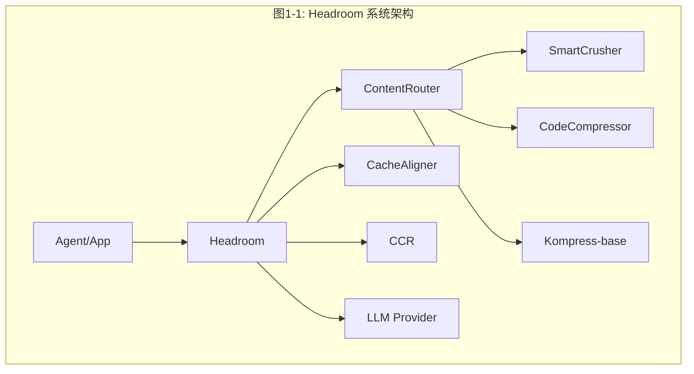

# Headroom 项目代码深度分析计划

## 项目概述

**Headroom** 是一个 AI 上下文压缩层（Context Compression Layer），核心功能是在 AI Agent 的输入到达 LLM 之前，对工具输出、日志、RAG 结果、文件和对话历史进行压缩，实现 60-95% 的 token 节省，同时保持答案质量不变。

- **语言栈**: Python（主代码）+ Rust（高性能核心）+ TypeScript（SDK）
- **构建系统**: Maturin（Python+Rust 混合构建）
- **版本**: 0.22.4
- **许可证**: Apache 2.0

---

## 分析文档结构

将在 `/workspace/ReadCode/` 目录下创建以下文件，每个文件对应一个深度分析维度：

```
ReadCode/
├── 01-项目总览与架构.md          # 项目全局视图和架构设计
├── 02-核心压缩流水线.md          # Pipeline、Transforms、压缩算法
├── 03-代理服务器.md              # Proxy 模式、请求处理、认证
├── 04-CCR可逆压缩.md            # 可逆压缩机制、工具注入、响应处理
├── 05-缓存系统.md               # 缓存策略、前缀追踪、动态检测
├── 06-记忆系统.md               # 跨Agent记忆、分层存储、向量检索
├── 07-压缩算法详解.md            # SmartCrusher/CodeCompressor/Kompress
├── 08-内容路由与检测.md          # ContentRouter、ContentDetector、Masks
├── 09-Rust核心实现.md            # Rust crates 架构与实现
├── 10-CLI与Agent包装.md          # CLI命令、wrap模式、Agent集成
├── 11-Provider与Backend.md       # LLM提供商适配、API路由
├── 12-分词器与定价.md            # Token计数、模型定价
├── 13-图像压缩.md               # 图像优化、ML路由、OCR
├── 14-学习系统.md               # headroom learn、失败挖掘
├── 15-可观测性与遥测.md          # Metrics、Tracing、Telemetry
├── 16-MCP与集成.md              # MCP服务器、LangChain/Agno集成
├── 17-订阅与配额.md              # 订阅管理、速率限制
├── 18-存储与持久化.md            # SQLite、JSONL、向量存储
├── 19-安装与部署.md              # 安装系统、Docker、DevContainer
├── 20-测试体系.md               # 测试策略、基准测试、E2E测试
└── 21-设计理念与演进.md          # 设计哲学、REALIGNMENT、架构演进
```

---

## 各文件详细分析内容

### 01-项目总览与架构.md

**分析目标**: 提供项目的全局视图，让读者快速理解整体架构

**文章结构**:

> **总（概述）**
> - Headroom 一句话定义：AI 上下文压缩层
> - 🗺️ 图1-1: Headroom 知识脑图（mindmap）— 全局知识结构
> - 🏗️ 图1-2: 系统架构总览图（flowchart）— 核心组件和数据流
> - 三种使用模式概览：Library / Proxy / Agent Wrap
> - 与竞品对比表
>
> **分（详细分析）**
>
> 1. **项目定位与核心价值**
>    - Headroom 解决的问题：AI Agent 上下文窗口浪费
>    - 核心价值主张：60-95% token 节省，可逆压缩，本地优先
>
> 2. **技术栈全景**
>    - Python 主代码 + Rust 高性能核心 + TypeScript SDK
>    - 📊 图1-3: 技术栈依赖关系图（flowchart）
>    - Maturin 混合构建系统
>
> 3. **目录结构详解**
>    - 各目录职责和规模
>    - 🌳 图1-4: 目录结构树形图（flowchart）
>
> 4. **系统架构深度解析**
>    - 请求生命周期全流程
>    - 🔄 图1-5: 请求生命周期状态图（stateDiagram-v2）
>    - 核心组件关系
>    - 🔗 图1-6: 核心组件交互时序图（sequenceDiagram）
>
> 5. **入口点分析**
>    - CLI / 库 API / 代理服务器 / MCP / Rust 绑定
>
> **总（总结）**
> - 设计亮点：本地优先 + 可逆 + 插件化
> - Headroom 在 AI 工具链中的定位
> - 🎯 图1-7: Headroom 在 AI 工具生态中的位置（flowchart）
> - 后续章节导航

**涉及文件**:
- `/workspace/README.md`
- `/workspace/pyproject.toml`
- `/workspace/Cargo.toml`
- `/workspace/headroom/__init__.py`
- `/workspace/headroom/_version.py`
- `/workspace/wiki/ARCHITECTURE.md`
- `/workspace/docs/spec/002-architecture.md`
- `/workspace/REALIGNMENT/00-overview.md`
- `/workspace/REALIGNMENT/02-architecture.md`

---

### 02-核心压缩流水线.md

**分析目标**: 深入理解 Headroom 的核心压缩流水线设计和实现

**文章结构**:

> **总（概述）**
> - 核心压缩流水线一句话定义：Headroom 的心脏，将原始内容经多阶段变换压缩为精简上下文
> - 🗺️ 图2-1: 压缩流水线知识脑图（mindmap）— 全局知识结构
> - 🏗️ 图2-2: 流水线核心架构图（flowchart）— 从输入到输出的完整数据流
> - 关键设计决策：事件驱动 + 可插拔变换 + 策略门控
> - 与其他模块的关系：下游被代理服务器/CCR/记忆系统调用，上游依赖压缩算法和缓存
>
> **分（详细分析）**
>
> 1. **Pipeline 架构**
>    - `PipelineStage` 枚举定义与阶段划分
>    - `PipelineEvent` 事件模型与事件驱动设计
>    - `PipelineExtension` 扩展点与 `ExtensionManager` 扩展管理器
>    - 📊 图2-3: Pipeline 事件驱动流程图（flowchart）
>
> 2. **压缩主流程**
>    - `compress()` 函数的完整执行路径
>    - `CompressionConfig` 配置模型与 `CompressionResult` 结果模型
>    - 压缩决策逻辑与跳过条件
>    - 🔄 图2-4: compress() 函数状态转换图（stateDiagram-v2）
>
> 3. **Client 实现**
>    - `HeadroomClient` 类设计与 LLM 客户端包装模式
>    - 上下文管理和变换协调机制
>    - 🔗 图2-5: HeadroomClient 与 Pipeline 交互时序图（sequenceDiagram）
>
> 4. **Transform Pipeline**
>    - `TransformPipeline` 类：变换组件的注册和执行顺序
>    - 并行处理和卸载机制
>    - 变换结果聚合策略
>
> 5. **CompressionPolicy**
>    - 压缩策略决策与 TOIN 门控逻辑
>    - `AdaptiveSizer` 自适应大小调整
>    - 📊 图2-6: CompressionPolicy 决策流程图（flowchart）
>
> 6. **Pipeline 生命周期钩子**
>    - `CompressionHooks` 三阶段钩子：预压缩、偏置计算、后压缩
>    - 自定义扩展机制
>
> **总（总结）**
> - 设计亮点：事件驱动解耦 + 策略门控灵活 + 钩子可扩展
> - 流水线在 Headroom 中的定位：一切压缩操作的统一入口
> - 🎯 图2-7: 流水线与各模块协作关系图（flowchart）
> - 演进方向：Rust 加速 + 更细粒度的策略控制

**涉及文件**:
- `/workspace/headroom/pipeline.py`
- `/workspace/headroom/compress.py`
- `/workspace/headroom/client.py`
- `/workspace/headroom/transforms/pipeline.py`
- `/workspace/headroom/transforms/base.py`
- `/workspace/headroom/transforms/compression_policy.py`
- `/workspace/headroom/transforms/adaptive_sizer.py`
- `/workspace/headroom/transforms/observability.py`
- `/workspace/headroom/hooks.py`
- `/workspace/headroom/config.py`

---

### 03-代理服务器.md

**分析目标**: 深入理解 Proxy 模式的完整实现

**文章结构**:

> **总（概述）**
> - 代理服务器一句话定义：Headroom 的网络入口，以透明代理模式拦截并压缩 LLM 请求
> - 🗺️ 图3-1: 代理服务器知识脑图（mindmap）— 全局知识结构
> - 🏗️ 图3-2: 代理服务器核心架构图（flowchart）— 请求拦截→压缩→转发的完整链路
> - 关键设计决策：多模式代理 + 扩展点插件化 + 流式响应
> - 与其他模块的关系：调用压缩流水线/缓存/CCR/记忆系统，被 CLI/Agent Wrap 启动
>
> **分（详细分析）**
>
> 1. **服务器架构**
>    - FastAPI 应用结构与 ASGI 中间件集成
>    - 请求拦截和处理流程
>    - WebSocket 代理支持
>    - 📊 图3-3: 服务器请求处理流程图（flowchart）
>
> 2. **代理模式**
>    - `ProxyMode` 枚举和模式切换
>    - 认证模式（AuthMode）与压缩决策（CompressionDecision）
>    - 内存决策（MemoryDecision）
>    - 📊 图3-4: 代理模式决策树（flowchart）
>
> 3. **请求处理**
>    - OpenAI/Anthropic API 路由
>    - 请求转发和响应流式处理
>    - 循环保护（LoopbackGuard）与阶段计时（StageTimer）
>    - 🔗 图3-5: 请求处理完整时序图（sequenceDiagram）
>
> 4. **扩展系统**
>    - `ProxyExtensions` 扩展点设计
>    - 语义缓存（SemanticCache）、速率限制（RateLimiter）
>    - 请求日志（RequestLogger）、节省追踪（SavingsTracker）
>
> 5. **Prometheus 指标**
>    - 请求计数和延迟、压缩比率指标
>    - 缓存命中率、阶段计时指标
>    - 📊 图3-6: 可观测性指标流转图（flowchart）
>
> 6. **Warmup 机制**
>    - 模型预热与首次请求优化
>
> **总（总结）**
> - 设计亮点：透明代理零侵入 + 多模式灵活切换 + 扩展点可插拔
> - 代理服务器在 Headroom 中的定位：生产部署的核心入口
> - 🎯 图3-7: 代理服务器与各模块协作关系图（flowchart）
> - 演进方向：Rust Proxy（Phase C）+ 更完善的流式处理

**涉及文件**:
- `/workspace/headroom/proxy/server.py`
- `/workspace/headroom/proxy/modes.py`
- `/workspace/headroom/proxy/auth_mode.py`
- `/workspace/headroom/proxy/compression_decision.py`
- `/workspace/headroom/proxy/memory_decision.py`
- `/workspace/headroom/proxy/memory_handler.py`
- `/workspace/headroom/proxy/memory_injection.py`
- `/workspace/headroom/proxy/models.py`
- `/workspace/headroom/proxy/extensions.py`
- `/workspace/headroom/proxy/helpers.py`
- `/workspace/headroom/proxy/loopback_guard.py`
- `/workspace/headroom/proxy/stage_timer.py`
- `/workspace/headroom/proxy/prometheus_metrics.py`
- `/workspace/headroom/proxy/semantic_cache.py`
- `/workspace/headroom/proxy/rate_limiter.py`
- `/workspace/headroom/proxy/request_logger.py`
- `/workspace/headroom/proxy/savings_tracker.py`
- `/workspace/headroom/proxy/warmup.py`
- `/workspace/headroom/proxy/cost.py`
- `/workspace/headroom/proxy/outcome.py`
- `/workspace/headroom/proxy/debug_introspection.py`
- `/workspace/headroom/proxy/ws_session_registry.py`
- `/workspace/headroom/proxy/image_compression_decision.py`

---

### 04-CCR可逆压缩.md

**分析目标**: 深入理解 CCR（Compress-Context-Retrieve）可逆压缩机制

**分析内容**:
1. **CCR 架构**
   - 可逆压缩的核心思想：压缩后保留原文，LLM 按需检索
   - CCR 存储后端：内存、SQLite、Redis
   - 哈希键生成：BLAKE3 算法

2. **工具注入**
   - `headroom_retrieve` 工具的注入机制
   - 工具定义和参数
   - 与 LLM 的交互协议

3. **响应处理**
   - `ResponseHandler` 处理 LLM 的检索请求
   - 批处理（BatchProcessor）
   - 批存储（BatchStore）

4. **上下文追踪**
   - `ContextTracker` 追踪压缩上下文
   - 上下文版本管理
   - 跨轮次一致性

5. **MCP 服务器**
   - `headroom_compress` 工具
   - `headroom_retrieve` 工具
   - `headroom_stats` 工具

6. **压缩反馈**
   - 压缩质量反馈机制
   - TOIN（Token Optimization Intelligence Network）集成

**涉及文件**:
- `/workspace/headroom/ccr/__init__.py`
- `/workspace/headroom/ccr/tool_injection.py`
- `/workspace/headroom/ccr/response_handler.py`
- `/workspace/headroom/ccr/context_tracker.py`
- `/workspace/headroom/ccr/batch_processor.py`
- `/workspace/headroom/ccr/batch_store.py`
- `/workspace/headroom/ccr/mcp_server.py`
- `/workspace/headroom/cache/compression_cache.py`
- `/workspace/headroom/cache/compression_feedback.py`
- `/workspace/headroom/cache/compression_store.py`
- `/workspace/wiki/ccr.md`

---

### 05-缓存系统.md

**分析目标**: 深入理解缓存优化策略和实现

**分析内容**:
1. **缓存架构**
   - `CacheBackend` 基类接口
   - 提供商特定缓存：Anthropic、OpenAI、Google
   - 缓存注册表（CacheRegistry）

2. **前缀追踪**
   - `PrefixTracker` 前缀匹配和缓存对齐
   - KV 缓存命中优化
   - CacheAligner 与前缀追踪的协作

3. **动态检测**
   - `DynamicDetector` 检测缓存友好的内容模式
   - 缓存破坏检测和避免

4. **语义缓存**
   - 基于嵌入的语义缓存
   - 相似请求匹配

5. **压缩缓存**
   - 压缩结果缓存
   - 压缩反馈循环
   - 压缩存储持久化

**涉及文件**:
- `/workspace/headroom/cache/base.py`
- `/workspace/headroom/cache/registry.py`
- `/workspace/headroom/cache/anthropic.py`
- `/workspace/headroom/cache/openai.py`
- `/workspace/headroom/cache/google.py`
- `/workspace/headroom/cache/prefix_tracker.py`
- `/workspace/headroom/cache/dynamic_detector.py`
- `/workspace/headroom/cache/semantic.py`
- `/workspace/headroom/cache/compression_cache.py`
- `/workspace/headroom/cache/compression_feedback.py`
- `/workspace/headroom/cache/compression_store.py`

---

### 06-记忆系统.md

**分析目标**: 深入理解跨 Agent 记忆系统的设计

**分析内容**:
1. **记忆架构**
   - 分层记忆模型：短期/中期/长期
   - 记忆范围（Scope）：项目/用户/全局
   - 记忆版本控制

2. **核心实现**
   - `MemoryCore` 核心操作
   - `MemoryFactory` 工厂模式创建记忆实例
   - `MemoryModels` 数据模型

3. **存储路由**
   - `StorageRouter` 多后端存储路由
   - SQLite 向量索引
   - Qdrant/Neo4j 外部后端

4. **记忆桥接**
   - `MemoryBridge` 与外部系统桥接
   - 桥接配置和解析器

5. **记忆提取**
   - `Extraction` 从对话中提取记忆
   - `InlineExtractor` 内联提取
   - 预算管理（Budget）

6. **MCP 服务器**
   - 记忆相关的 MCP 工具
   - 工具适配器

7. **流量学习**
   - `TrafficLearner` 从使用模式学习
   - 自动记忆注入

8. **SharedContext**
   - 跨 Agent 上下文共享
   - CCR 架构集成

**涉及文件**:
- `/workspace/headroom/memory/core.py`
- `/workspace/headroom/memory/factory.py`
- `/workspace/headroom/memory/models.py`
- `/workspace/headroom/memory/config.py`
- `/workspace/headroom/memory/storage_router.py`
- `/workspace/headroom/memory/bridge.py`
- `/workspace/headroom/memory/bridge_config.py`
- `/workspace/headroom/memory/bridge_parsers.py`
- `/workspace/headroom/memory/extraction.py`
- `/workspace/headroom/memory/inline_extractor.py`
- `/workspace/headroom/memory/budget.py`
- `/workspace/headroom/memory/mcp_server.py`
- `/workspace/headroom/memory/tools.py`
- `/workspace/headroom/memory/tracker.py`
- `/workspace/headroom/memory/traffic_learner.py`
- `/workspace/headroom/memory/wrapper.py`
- `/workspace/headroom/memory/wrapper_tools.py`
- `/workspace/headroom/memory/system.py`
- `/workspace/headroom/memory/sync.py`
- `/workspace/headroom/memory/ports.py`
- `/workspace/headroom/memory/easy.py`
- `/workspace/headroom/memory/qdrant_env.py`
- `/workspace/headroom/shared_context.py`
- `/workspace/wiki/memory.md`

---

### 07-压缩算法详解.md

**分析目标**: 深入理解三大压缩算法的实现细节

**分析内容**:
1. **SmartCrusher（智能粉碎器）**
   - JSON 压缩原理：数组去重、键名缩短、空值移除
   - 锚点选择（AnchorSelector）：识别保留关键信息
   - 分类器（Classifier）：内容类型分类
   - 构建器（Builder）：压缩结果构建
   - 分析器（Analyzer）：内容模式分析
   - Python 与 Rust 实现的奇偶校验（Parity）

2. **CodeCompressor（代码压缩器）**
   - AST 感知压缩：基于 ast-grep / tree-sitter
   - 支持语言：Python、JS、Go、Rust、Java、C++
   - 代码结构保留策略
   - 注释和空行处理

3. **Kompress-base（ML 文本压缩）**
   - HuggingFace 模型架构（ModernBERT）
   - ONNX INT8 量化推理
   - 训练数据：agentic traces
   - 压缩/摘要生成流程

4. **DiffCompressor（差异压缩器）**
   - Git diff 格式解析
   - Hunk 级别压缩
   - 上下文行保留策略

5. **LogCompressor（日志压缩器）**
   - 日志级别过滤
   - 错误/警告/堆栈追踪保留
   - 时间戳归一化

6. **SearchCompressor（搜索压缩器）**
   - 搜索结果去重和摘要
   - 文件路径压缩

7. **HTML 提取器**
   - HTML 到纯文本转换
   - trafilatura 集成

**涉及文件**:
- `/workspace/headroom/transforms/smart_crusher.py`
- `/workspace/headroom/transforms/code_compressor.py`
- `/workspace/headroom/transforms/kompress_compressor.py`
- `/workspace/headroom/transforms/diff_compressor.py`
- `/workspace/headroom/transforms/log_compressor.py`
- `/workspace/headroom/transforms/search_compressor.py`
- `/workspace/headroom/transforms/html_extractor.py`
- `/workspace/headroom/transforms/anchor_selector.py`
- `/workspace/headroom/transforms/compression_units.py`
- `/workspace/headroom/transforms/compression_summary.py`
- `/workspace/headroom/transforms/tag_protector.py`
- `/workspace/headroom/transforms/error_detection.py`
- `/workspace/headroom/transforms/read_lifecycle.py`
- `/workspace/crates/headroom-core/src/transforms/smart_crusher/`
- `/workspace/crates/headroom-core/src/transforms/diff_compressor.rs`
- `/workspace/crates/headroom-core/src/transforms/log_compressor.rs`
- `/workspace/wiki/compression.md`
- `/workspace/wiki/text-compression.md`

---

### 08-内容路由与检测.md

**分析目标**: 深入理解内容类型检测和路由机制

**文章结构**:

> **总（概述）**
> - 内容路由与检测模块一句话定义：智能识别内容类型并路由至最优压缩策略的决策引擎
> - 🗺️ 图8-1: 内容路由与检测知识脑图（mindmap）— 模块知识结构全景
> - 🏗️ 图8-2: 内容路由核心架构图（flowchart）— 检测→路由→压缩的数据流
> - 关键设计决策：规则优先 vs ML 优先的检测策略选择
> - 与压缩算法模块（07章）和流水线模块（02章）的协作关系
>
> **分（详细分析）**
>
> 1. **ContentRouter（内容路由器）**
>    - 内容类型枚举：JSON、代码、日志、搜索结果、HTML、纯文本
>    - 路由决策逻辑：类型→压缩算法映射表
>    - 📊 图8-3: ContentRouter 路由决策流程图（flowchart）
>    - 与 SmartCrusher / CodeCompressor 等算法的对接机制
>
> 2. **ContentDetector（内容检测器）**
>    - 基于规则的快速检测：关键词、正则、结构特征
>    - ML 内容检测（Magika）：深度学习内容分类
>    - 📊 图8-4: 规则检测与 ML 检测的分层策略图（flowchart）
>    - 检测信号聚合与置信度评分
>
> 3. **Masks（掩码）**
>    - 压缩掩码定义与数据模型
>    - 掩码应用（apply）和恢复（restore）的对称操作
>    - 📊 图8-5: 掩码应用与恢复流程图（sequenceDiagram）
>    - 压缩/解压缩的对称性保证
>
> 4. **TagProtector（标签保护器）**
>    - XML/HTML 标签识别与保护机制
>    - 防止压缩破坏结构化标记的不变式保证
>    - 📊 图8-6: TagProtector 保护-压缩-恢复流程图（stateDiagram-v2）
>    - 与 ContentRouter 的协作：先保护后路由
>
> **总（总结）**
> - 设计亮点：规则+ML 双层检测策略的精度与性能平衡
> - 模块定位：压缩流水线的"智能调度中心"
> - 🎯 图8-7: 内容路由与上下游模块协作关系图（flowchart）
> - 演进方向：更精细的内容类型分类、自适应路由策略

**涉及文件**:
- `/workspace/headroom/transforms/content_router.py`
- `/workspace/headroom/transforms/content_detector.py`
- `/workspace/headroom/compression/detector.py`
- `/workspace/headroom/compression/masks.py`
- `/workspace/headroom/compression/universal.py`
- `/workspace/headroom/transforms/tag_protector.py`

---

### 09-Rust核心实现.md

**分析目标**: 深入理解 Rust 高性能核心的实现

**文章结构**:

> **总（概述）**
> - Rust 核心实现一句话定义：用 Rust 重写 Python 热路径，提供高性能压缩、代理和分词能力
> - 🗺️ 图9-1: Rust 核心实现知识脑图（mindmap）— 四大 crate 及其职责全景
> - 🏗️ 图9-2: Rust crates 架构与依赖关系图（flowchart）— core→proxy→py→parity 的层次关系
> - 关键设计决策：Python→Rust 渐进式迁移策略
> - 与 Python 层的交互方式：PyO3 绑定 + Maturin 构建
>
> **分（详细分析）**
>
> 1. **headroom-core crate**
>    - 模块结构：auth_mode、cache_control、compression、correlation、signals、tokenizer、transforms
>    - SmartCrusher Rust 实现：与 Python 版本的奇偶校验
>    - DiffCompressor / LogCompressor Rust 实现
>    - 📊 图9-3: headroom-core 内部模块关系图（flowchart）
>    - Tokenizer trait 和 tiktoken/HuggingFace 后端
>    - CCR 存储层（内存/SQLite/Redis）与 BLAKE3 哈希键生成
>
> 2. **headroom-proxy crate**
>    - Axum HTTP 服务器架构
>    - 请求处理和转发流程
>    - 📊 图9-4: Rust Proxy 请求处理时序图（sequenceDiagram）
>    - Bedrock SigV4 签名与 Vertex GCP ADC 认证
>    - WebSocket 代理实现
>
> 3. **headroom-py crate**
>    - PyO3 绑定机制与类型转换
>    - Python 可调用函数导出
>    - 📊 图9-5: PyO3 绑定调用链路图（flowchart）
>    - 与 Maturin 构建系统的集成
>
> 4. **headroom-parity crate**
>    - Python/Rust 实现奇偶校验框架
>    - 确保两端行为一致的测试策略
>
> 5. **构建和发布**
>    - Maturin 混合构建流程
>    - Release profile 优化（LTO、strip、codegen-units）
>    - Wheel 大小优化策略
>
> **总（总结）**
> - 设计亮点：渐进式迁移策略保证稳定性，PyO3 桥接实现零成本抽象
> - 模块定位：性能关键路径的 Rust 加速层
> - 🎯 图9-6: Rust 核心与 Python 层协作关系图（flowchart）
> - 演进方向：Python Retirement（Phase H），更多模块迁移至 Rust

**涉及文件**:
- `/workspace/crates/headroom-core/src/` (所有 .rs 文件)
- `/workspace/crates/headroom-proxy/src/` (所有 .rs 文件)
- `/workspace/crates/headroom-py/src/` (所有 .rs 文件)
- `/workspace/crates/headroom-parity/src/` (所有 .rs 文件)
- `/workspace/crates/*/Cargo.toml`
- `/workspace/Cargo.toml`
- `/workspace/RUST_DEV.md`

---

### 10-CLI与Agent包装.md

**分析目标**: 深入理解 CLI 命令和 Agent 包装机制

**分析内容**:
1. **CLI 框架**
   - Click 命令组结构
   - `headroom` 主命令
   - 子命令：proxy、wrap、mcp、memory、learn、init、install、perf、evals、tools

2. **Agent Wrap 模式**
   - `headroom wrap claude|codex|cursor|aider|copilot`
   - 环境变量注入
   - 代理配置自动设置
   - 进程管理

3. **Provider 特定包装**
   - Claude Code 包装
   - Codex 包装
   - Cursor 包装
   - Aider 包装
   - Copilot CLI 包装
   - OpenClaw 包装
   - OpenHands 包装

4. **MCP 安装**
   - `headroom mcp install` 命令
   - MCP 服务器注册
   - Claude/Codex/Cursor 注册机制

5. **Init 命令**
   - 项目初始化
   - 配置文件生成

6. **Perf 命令**
   - 性能分析
   - 延迟统计

**涉及文件**:
- `/workspace/headroom/cli/main.py`
- `/workspace/headroom/cli/wrap.py`
- `/workspace/headroom/cli/proxy.py`
- `/workspace/headroom/cli/mcp.py`
- `/workspace/headroom/cli/memory.py`
- `/workspace/headroom/cli/learn.py`
- `/workspace/headroom/cli/init.py`
- `/workspace/headroom/cli/install.py`
- `/workspace/headroom/cli/perf.py`
- `/workspace/headroom/cli/evals.py`
- `/workspace/headroom/cli/tools.py`
- `/workspace/headroom/cli/toin_publish.py`
- `/workspace/headroom/cli/wrap_rtk_metrics.py`
- `/workspace/headroom/providers/anthropic.py`
- `/workspace/headroom/providers/openai.py`
- `/workspace/headroom/providers/cohere.py`
- `/workspace/headroom/providers/google.py`
- `/workspace/headroom/providers/litellm.py`
- `/workspace/headroom/providers/openai_compatible.py`
- `/workspace/wiki/cli.md`

---

### 11-Provider与Backend.md

**分析目标**: 深入理解 LLM 提供商适配层

**分析内容**:
1. **Provider 架构**
   - `BaseProvider` 基类
   - `ProviderRegistry` 注册表
   - 提供商发现和选择

2. **具体 Provider**
   - Anthropic：API 格式、缓存控制、流式处理
   - OpenAI：Chat Completions、Responses API、WebSocket
   - Google：Gemini 原生 API
   - Cohere：Command 系列模型
   - LiteLLM：统一代理层

3. **Backend 系统**
   - `BaseBackend` 基类
   - LiteLLM Backend
   - AnyLLM Backend
   - API 翻译层

4. **代理路由**
   - `ProxyRoutes` 路由定义
   - 请求路径匹配
   - 模型回退策略

5. **安装注册**
   - `InstallRegistry` 提供商安装注册

**涉及文件**:
- `/workspace/headroom/providers/base.py`
- `/workspace/headroom/providers/registry.py`
- `/workspace/headroom/providers/anthropic.py`
- `/workspace/headroom/providers/openai.py`
- `/workspace/headroom/providers/google.py`
- `/workspace/headroom/providers/cohere.py`
- `/workspace/headroom/providers/litellm.py`
- `/workspace/headroom/providers/openai_compatible.py`
- `/workspace/headroom/providers/proxy_routes.py`
- `/workspace/headroom/providers/install_registry.py`
- `/workspace/headroom/backends/base.py`
- `/workspace/headroom/backends/litellm.py`
- `/workspace/headroom/backends/anyllm.py`

---

### 12-分词器与定价.md

**分析目标**: 深入理解 Token 计数和模型定价系统

**分析内容**:
1. **分词器架构**
   - `BaseTokenizer` 基类接口
   - `TokenizerRegistry` 注册表
   - 可插拔后端设计

2. **具体分词器**
   - TiktokenCounter：OpenAI 模型分词
   - HuggingFaceTokenizer：开源模型分词
   - MistralTokenizer：Mistral 模型分词
   - Estimator：通用估算器

3. **定价系统**
   - Anthropic 价格表
   - OpenAI 价格表
   - LiteLLM 定价数据库
   - `PricingRegistry` 注册表
   - 成本计算逻辑

**涉及文件**:
- `/workspace/headroom/tokenizers/base.py`
- `/workspace/headroom/tokenizers/registry.py`
- `/workspace/headroom/tokenizers/tiktoken_counter.py`
- `/workspace/headroom/tokenizers/huggingface.py`
- `/workspace/headroom/tokenizers/mistral.py`
- `/workspace/headroom/tokenizers/estimator.py`
- `/workspace/headroom/tokenizer.py`
- `/workspace/headroom/pricing/registry.py`
- `/workspace/headroom/pricing/anthropic_prices.py`
- `/workspace/headroom/pricing/openai_prices.py`
- `/workspace/headroom/pricing/litellm_pricing.py`

---

### 13-图像压缩.md

**分析目标**: 深入理解图像压缩模块

**分析内容**:
1. **图像压缩架构**
   - `ImageCompressor` 主类
   - 压缩流程：检测 → 分析 → 路由 → 压缩

2. **ML 路由**
   - `OnnxRouter` ONNX 模型路由
   - `TrainedRouter` 训练模型路由
   - 压缩决策：何时压缩、压缩比例

3. **Tile 优化**
   - `TileOptimizer` 图像分块优化
   - 大图分割策略

4. **OCR 集成**
   - RapidOCR ONNX 后端
   - Python 版本兼容处理

5. **提供商特定处理**
   - Anthropic 图像格式
   - OpenAI 图像格式

**涉及文件**:
- `/workspace/headroom/image/compressor.py`
- `/workspace/headroom/image/onnx_router.py`
- `/workspace/headroom/image/tile_optimizer.py`
- `/workspace/headroom/image/trained_router.py`
- `/workspace/headroom/proxy/image_compression_decision.py`
- `/workspace/wiki/image-compression.md`

---

### 14-学习系统.md

**分析目标**: 深入理解 headroom learn 的实现

**分析内容**:
1. **Learn 架构**
   - 插件化设计：`BaseLearner` 基类
   - 扫描器（Scanner）：扫描失败会话
   - 分析器（Analyzer）：分析失败原因
   - 写入器（Writer）：写入修正到 CLAUDE.md/AGENTS.md

2. **具体插件**
   - Claude 会话学习
   - Codex 会话学习
   - Gemini 会话学习

3. **共享组件**
   - `_shared.py` 共享工具
   - `models.py` 数据模型
   - `registry.py` 学习器注册表

**涉及文件**:
- `/workspace/headroom/learn/base.py`
- `/workspace/headroom/learn/scanner.py`
- `/workspace/headroom/learn/analyzer.py`
- `/workspace/headroom/learn/writer.py`
- `/workspace/headroom/learn/_shared.py`
- `/workspace/headroom/learn/models.py`
- `/workspace/headroom/learn/registry.py`
- `/workspace/wiki/learn.md`

---

### 15-可观测性与遥测.md

**分析目标**: 深入理解监控和遥测系统

**文章结构**:

> **总（概述）**
> - 可观测性与遥测一句话定义：为 Headroom 提供全方位运行时可观测能力的监控与遥测子系统
> - 🗺️ 图15-1: 可观测性与遥测知识脑图（mindmap）— 全局知识结构
> - 🏗️ 图15-2: 可观测性架构总览图（flowchart）— 核心组件和数据流
> - 三大支柱概览：Metrics / Tracing / Telemetry
> - 与代理服务器、压缩流水线、CCR 等模块的关系
>
> **分（详细分析）**
>
> 1. **OpenTelemetry 集成**
>    - Metrics 指标定义与采集
>    - Tracing 分布式追踪与 Span 管理
>    - OTLP 导出配置与管道
>    - 📊 图15-3: OpenTelemetry 数据流图（flowchart）
>
> 2. **Prometheus 指标体系**
>    - 请求计数与延迟直方图
>    - 压缩比率指标（compression_ratio）
>    - 缓存命中率指标（cache_hit_rate）
>    - 阶段计时指标（stage_timer）
>    - 📊 图15-4: Prometheus 指标采集与暴露流程（flowchart）
>
> 3. **遥测系统核心**
>    - `TelemetryCollector` 收集器：聚合多源遥测数据
>    - `TelemetryReporter` 报告器：格式化与上报
>    - `TelemetryBeacon` 信标：轻量级心跳与状态广播
>    - `TelemetryContext` 上下文：请求级遥测上下文传播
>    - `TelemetryModels` 数据模型
>    - 📊 图15-5: 遥测系统组件交互时序图（sequenceDiagram）
>
> 4. **TOIN 遥测集成**
>    - TOIN（Token Optimization Intelligence Network）遥测数据上报
>    - 遥测数据与压缩反馈的闭环
>
> 5. **Dashboard 监控面板**
>    - 实时监控面板架构
>    - SQL 查询与聚合逻辑
>    - 可视化指标展示
>
> **总（总结）**
> - 设计亮点：多层级可观测（进程级→请求级→操作级）、低开销采集
> - 可观测性在 Headroom 系统中的定位：运维保障与性能优化的基石
> - 🎯 图15-6: 可观测性模块协作关系图（flowchart）
> - 演进方向：Rust 原生指标、更丰富的分布式追踪、自适应采样

**涉及文件**:
- `/workspace/headroom/observability/metrics.py`
- `/workspace/headroom/observability/tracing.py`
- `/workspace/headroom/proxy/prometheus_metrics.py`
- `/workspace/headroom/proxy/stage_timer.py`
- `/workspace/headroom/telemetry/collector.py`
- `/workspace/headroom/telemetry/reporter.py`
- `/workspace/headroom/telemetry/beacon.py`
- `/workspace/headroom/telemetry/context.py`
- `/workspace/headroom/telemetry/models.py`
- `/workspace/headroom/telemetry/toin.py`
- `/workspace/headroom/dashboard/`
- `/workspace/sql/`
- `/workspace/wiki/metrics.md`

---

### 16-MCP与集成.md

**分析目标**: 深入理解 MCP 服务器和第三方集成

**分析内容**:
1. **MCP 服务器**
   - CCR MCP 工具：compress、retrieve、stats
   - Memory MCP 工具
   - MCP 协议实现

2. **MCP 注册表**
   - Claude Code 注册
   - Codex 注册
   - 安装和显示

3. **LangChain 集成**
   - `HeadroomChatModel` 包装器
   - 回调集成

4. **Agno 集成**
   - `HeadroomAgnoModel` 包装器

5. **Strands 集成**
   - AWS Strands Agents SDK 集成

6. **ASGI 中间件**
   - `CompressionMiddleware` 中间件
   - FastAPI/Starlette 集成

7. **LiteLLM 回调**
   - `HeadroomCallback` 回调

8. **TypeScript SDK**
   - `compress()` 函数
   - 类型定义

**涉及文件**:
- `/workspace/headroom/ccr/mcp_server.py`
- `/workspace/headroom/memory/mcp_server.py`
- `/workspace/headroom/mcp_registry/base.py`
- `/workspace/headroom/mcp_registry/claude.py`
- `/workspace/headroom/mcp_registry/codex.py`
- `/workspace/headroom/mcp_registry/install.py`
- `/workspace/headroom/mcp_registry/display.py`
- `/workspace/headroom/mcp_registry/ledger.py`
- `/workspace/headroom/integrations/asgi.py`
- `/workspace/headroom/integrations/litellm_callback.py`
- `/workspace/sdk/typescript/`
- `/workspace/wiki/mcp.md`
- `/workspace/wiki/sdk.md`
- `/workspace/wiki/typescript-sdk.md`
- `/workspace/wiki/langchain.md`
- `/workspace/wiki/strands.md`
- `/workspace/wiki/integration-guide.md`

---

### 17-订阅与配额.md

**分析目标**: 深入理解订阅管理和配额系统

**分析内容**:
1. **订阅架构**
   - `SubscriptionBase` 基类
   - `SubscriptionClient` 客户端
   - `SubscriptionTracker` 追踪器

2. **配额管理**
   - `CopilotQuota` GitHub Copilot 配额
   - `CodexRateLimits` Codex 速率限制
   - 配额注册表

3. **会话追踪**
   - `SessionTracking` 会话级别追踪
   - 活跃/非活跃窗口

**涉及文件**:
- `/workspace/headroom/subscription/base.py`
- `/workspace/headroom/subscription/client.py`
- `/workspace/headroom/subscription/tracker.py`
- `/workspace/headroom/subscription/models.py`
- `/workspace/headroom/subscription/copilot_quota.py`
- `/workspace/headroom/subscription/codex_rate_limits.py`
- `/workspace/headroom/subscription/session_tracking.py`

---

### 18-存储与持久化.md

**分析目标**: 深入理解存储后端和持久化机制

**分析内容**:
1. **存储架构**
   - `BaseStorage` 基类接口
   - 存储后端选择

2. **SQLite 后端**
   - 向量索引（sqlite-vec）
   - 图存储
   - 遥测数据存储
   - SQL Schema 演进

3. **JSONL 后端**
   - 日志式存储
   - 追加写入

4. **CCR 存储**
   - 压缩原文存储
   - 键值检索

**涉及文件**:
- `/workspace/headroom/storage/base.py`
- `/workspace/headroom/storage/sqlite.py`
- `/workspace/headroom/storage/jsonl.py`
- `/workspace/sql/` (所有 SQL 文件)
- `/workspace/wiki/filesystem-contract.md`

---

### 19-安装与部署.md

**分析目标**: 深入理解安装系统和部署方案

**分析内容**:
1. **安装系统**
   - `InstallPlanner` 安装规划
   - `InstallRuntime` 运行时检测
   - `InstallProviders` 提供商安装
   - `InstallState` 状态管理
   - `InstallHealth` 健康检查
   - `InstallModels` 模型安装
   - `InstallPaths` 路径管理
   - `Supervisors` 进程管理

2. **Docker 部署**
   - Dockerfile 分析
   - docker-compose 配置
   - Native 安装

3. **DevContainer**
   - 开发容器配置
   - Memory stack 容器

4. **CI/CD**
   - GitHub Actions 工作流
   - 发布流程

**涉及文件**:
- `/workspace/headroom/install/` (所有文件)
- `/workspace/Dockerfile`
- `/workspace/docker-compose.yml`
- `/workspace/docker/docker-compose.native.yml`
- `/workspace/.devcontainer/`
- `/workspace/.github/workflows/`
- `/workspace/scripts/install.sh`
- `/workspace/scripts/install.ps1`
- `/workspace/wiki/docker-install.md`
- `/workspace/wiki/persistent-installs.md`
- `/workspace/wiki/macos-deployment.md`

---

### 20-测试体系.md

**分析目标**: 深入理解测试策略和基准测试

**分析内容**:
1. **测试架构**
   - pytest 配置和标记
   - 测试文件组织（200+ 文件）
   - conftest.py 共享 fixture

2. **单元测试**
   - 各模块测试覆盖
   - Mock 策略

3. **集成测试**
   - 代理集成测试
   - 提供商集成测试
   - 内存集成测试

4. **E2E 测试**
   - Docker 化 E2E 测试
   - 真实 API 测试

5. **基准测试**
   - 压缩基准测试
   - 延迟基准测试
   - 相关性基准测试
   - 代理成本基准测试

6. **评估框架**
   - `headroom.evals` 评估系统
   - 数据集和指标
   - 基准套件

7. **奇偶校验测试**
   - Python/Rust 实现一致性
   - SmartCrusher 奇偶校验
   - DiffCompressor 奇偶校验

**涉及文件**:
- `/workspace/tests/conftest.py`
- `/workspace/tests/` (关键测试文件)
- `/workspace/benchmarks/` (所有文件)
- `/workspace/headroom/evals/` (所有文件)
- `/workspace/e2e/` (所有文件)
- `/workspace/tests/parity/`

---

### 21-设计理念与演进.md

**分析目标**: 深入理解项目的设计哲学和架构演进

**分析内容**:
1. **设计哲学**
   - 本地优先（Local-first）
   - 可逆压缩（Reversible）
   - 插件化架构
   - 提供商无关

2. **核心设计模式**
   - 注册表模式（Registry Pattern）
   - 工厂模式（Factory Pattern）
   - 策略模式（Strategy Pattern）
   - 管道模式（Pipeline Pattern）
   - 观察者模式（Observer Pattern）
   - 扩展点模式（Extension Point）

3. **REALIGNMENT 文档分析**
   - Bug 列表和修复策略
   - Phase A：Lockdown（锁定）
   - Phase B：Live Zone（活跃区）
   - Phase C：Rust Proxy
   - Phase D：Bedrock/Vertex
   - Phase E：Cache Stabilization
   - Phase F：Auth Mode
   - Phase G：RTK Observability
   - Phase H：Python Retirement
   - Phase I：Test Infra

4. **架构演进方向**
   - Python → Rust 迁移策略
   - 性能优化路径
   - 可扩展性设计

5. **规范文档**
   - 架构规范（ADR）
   - 域模型
   - 安全合规
   - 灾难恢复

**涉及文件**:
- `/workspace/REALIGNMENT/` (所有文件)
- `/workspace/docs/spec/` (所有文件)
- `/workspace/wiki/ARCHITECTURE.md`
- `/workspace/wiki/LIMITATIONS.md`

---

## 写作规范

### 总分总结构

每篇分析文章必须严格遵循**"总—分—总"**的三段式结构：

1. **总（概述）**：开篇先给出模块的全景视图
   - 一句话定义该模块是什么、解决什么问题
   - 核心架构图/流程图（Mermaid）
   - 关键设计决策概述
   - 与其他模块的关系概览

2. **分（详细分析）**：逐层深入每个子模块/组件
   - 每个子模块独立成节，内部也遵循"总—分—总"
   - 核心类/函数详解（含代码引用和关键代码片段）
   - 设计模式和原理分析
   - 数据流和控制流详解
   - 关键算法实现细节
   - 配图说明（Mermaid 图表）

3. **总（总结）**：收束全篇，提炼核心要点
   - 设计亮点与取舍
   - 模块在整个系统中的定位和价值
   - 与其他模块的协作关系总结
   - 演进方向和改进空间

### 图表配置要求

每篇文章必须包含以下类型的 Mermaid 图表，以图文结合方式清晰呈现：

| 图表类型 | 使用场景 | 最少数量 |
|----------|---------|---------|
| `flowchart` / `graph` | 架构图、模块关系图、数据流图 | 每篇至少 2 个 |
| `sequenceDiagram` | 交互时序、请求处理流程 | 涉及多组件交互时至少 1 个 |
| `classDiagram` | 类继承关系、接口设计 | 涉及类体系时至少 1 个 |
| `stateDiagram-v2` | 状态机、生命周期 | 涉及状态转换时至少 1 个 |
| `mindmap` | 知识结构、模块脑图 | 每篇开篇 1 个（概述部分） |

**图表命名规范**：每个图表必须有标题，格式为 `图 X-Y: 描述`（X 为文章编号，Y 为图序号）

**图表示例**：



---

## 实施步骤

1. **创建 ReadCode 目录**: `mkdir -p /workspace/ReadCode`
2. **按顺序分析每个主题**，每个文件严格遵循"总—分—总"结构：
   - **总**：模块概述 + 架构图（mindmap）+ 核心流程图（flowchart）
   - **分**：逐层深入每个子模块，配以类图、时序图、状态图
   - **总**：设计总结 + 协作关系图 + 演进方向
3. **每个文件确保**：
   - 引用实际代码文件路径（使用可点击链接）
   - 包含关键代码片段
   - 解释设计决策背后的原因
   - 至少包含 3 个 Mermaid 图表
   - 图文结合，以图辅文

## 验证步骤

- 确认每个分析文件覆盖了所有相关源文件
- 确认代码引用路径正确
- 确认设计原理解释准确
- 确认模块间关系描述完整
- 确认每篇文章遵循"总—分—总"结构
- 确认每篇文章至少包含 3 个 Mermaid 图表
- 确认图表标题命名规范一致
