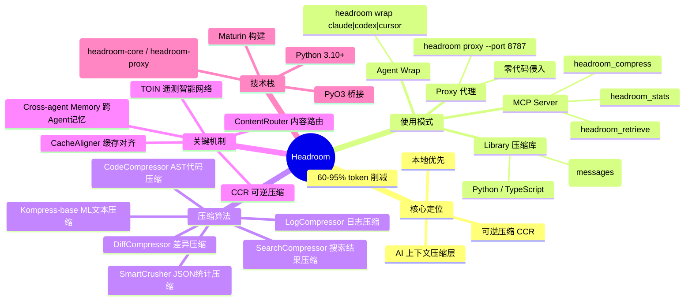
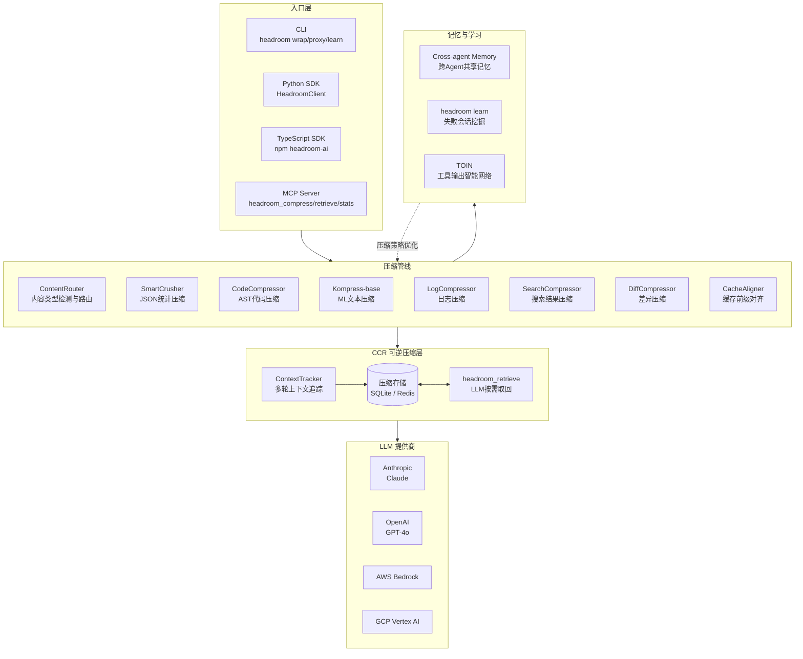
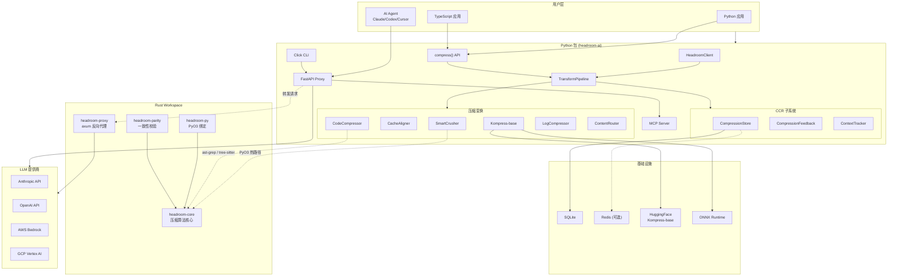
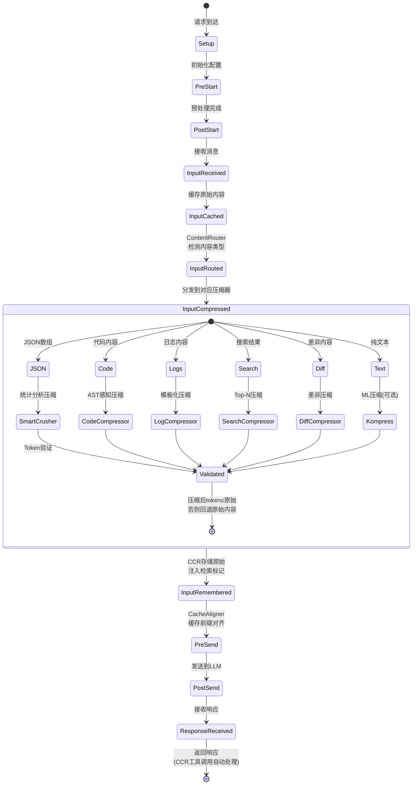
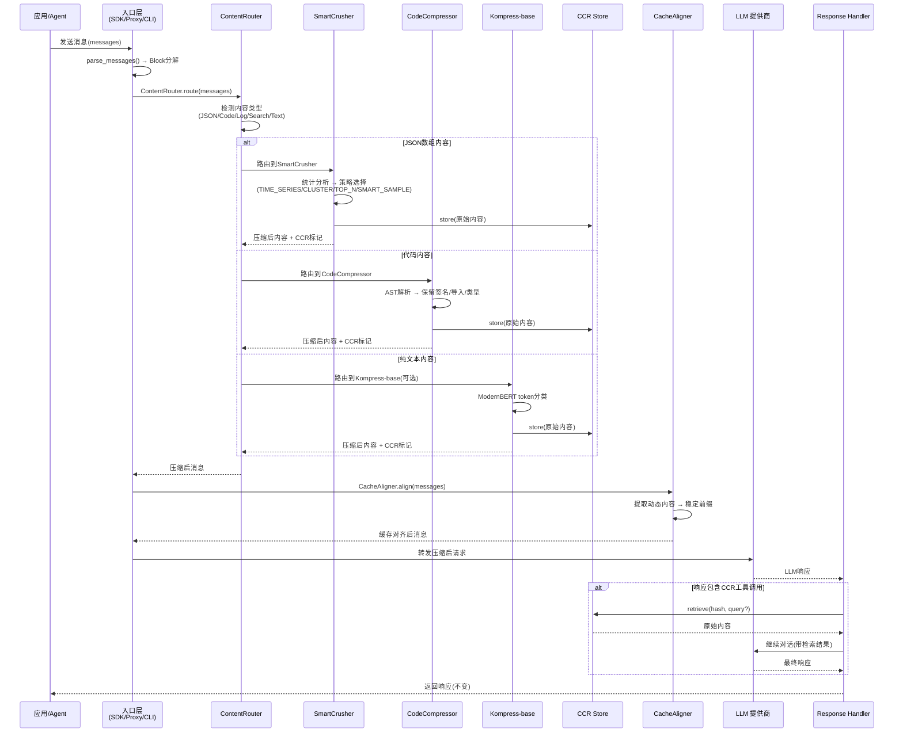
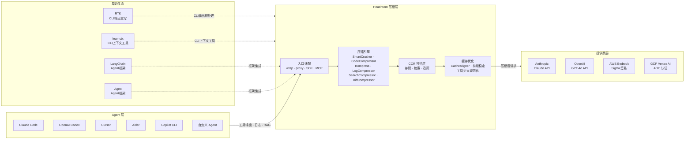

# 01 — 项目总览与架构

> Headroom：AI 上下文压缩层 —— 在工具输出、日志、RAG 片段和对话历史到达 LLM 之前，将 token 消耗削减 60–95%，且答案不变。

---

## 总（概述）

### 一句话定义

**Headroom 是一个 AI 上下文压缩层**，它拦截 AI Agent 发往 LLM 的请求，对工具输出、日志、代码、搜索结果等内容进行智能压缩后再转发，同时通过 CCR（Compress-Cache-Retrieve）机制保证压缩可逆——LLM 可随时按需取回原始数据。

### 图1-1：Headroom 知识脑图



### 图1-2：系统架构总览图



### 三种使用模式概览

| 模式 | 入口 | 特点 | 适用场景 |
|------|------|------|----------|
| **Library** | `from headroom import compress` | 内嵌应用，一行调用 | Python/TS 应用内集成 |
| **Proxy** | `headroom proxy --port 8787` | 零代码修改，透明代理 | 任何 OpenAI 兼容客户端 |
| **MCP Server** | `headroom mcp install` | 标准 MCP 协议，工具注入 | Claude Code / Cursor 等 MCP 客户端 |
| **Agent Wrap** | `headroom wrap claude` | 一键包装 Agent | Claude Code、Codex、Aider 等 |

### 与竞品对比表

| | 覆盖范围 | 部署方式 | 本地运行 | 可逆压缩 |
|---|---|---|:---:|:---:|
| **Headroom** | 全部上下文：工具输出、RAG、日志、文件、历史 | Proxy · Library · Middleware · MCP | ✅ | ✅ |
| [RTK](https://github.com/rtk-ai/rtk) | CLI 命令输出 | CLI 包装器 | ✅ | ❌ |
| [lean-ctx](https://github.com/yvgude/lean-ctx) | CLI 命令、MCP 工具、编辑器规则 | CLI 包装器 · MCP | ✅ | ❌ |
| [Compresr](https://compresr.ai) / [Token Co.](https://thetokencompany.ai) | 发送到其 API 的文本 | 托管 API 调用 | ❌ | ❌ |
| OpenAI Compaction | 对话历史 | 提供商原生 | ❌ | ❌ |

---

## 分（详细分析）

### 1. 项目定位与核心价值

Headroom 解决的核心问题是：**AI Agent 在调用工具后产生的海量输出（JSON、日志、搜索结果等）消耗了大量 token，其中大部分是冗余的，但用户仍在为这些浪费付费。**

具体而言：

- **工具输出巨大**：AI Agent 调用搜索、数据库查询、API 后，返回的 JSON 动辄数千 token
- **大部分数据冗余**：60 个指标点中 55 个显示 `cpu: 45%`，50 条日志重复同一错误
- **上下文窗口被占满**：模型有 128K token 限制，膨胀的工具输出挤占了有效空间
- **每次 token 都要付费**：冗余数据既浪费金钱又增加延迟

Headroom 的核心价值主张：

1. **智能压缩而非盲目截断**：通过统计分析保留关键信息（异常、突变、错误），而非简单丢弃尾部数据
2. **压缩可逆**：CCR 机制确保原始数据永不删除，LLM 可按需取回
3. **确定性变换**：压缩过程不调用 LLM，结果可预测、可复现，无额外 API 成本
4. **多内容类型覆盖**：JSON、代码（AST）、日志、搜索结果、差异、纯文本均有专用压缩器

### 2. 技术栈全景

Headroom 采用 **Python + Rust 双语言架构**，通过 PyO3 桥接，Maturin 统一构建。

#### Python 侧

- **核心依赖**：tiktoken（分词）、pydantic（配置模型）、litellm（模型注册）、click（CLI）、rich（终端输出）
- **代理服务**：FastAPI + uvicorn + httpx（HTTP 代理）
- **ML 压缩**：PyTorch + Transformers（Kompress-base 模型）、ONNX Runtime（推理加速）
- **记忆系统**：hnswlib（向量索引）、sqlite-vec（向量存储）、sentence-transformers（嵌入）
- **图像压缩**：Pillow + SigLIP + RapidOCR（ML 路由 + OCR）
- **集成框架**：LangChain、Agno、Strands、LiteLLM 等

#### Rust 侧

- **核心库**（`headroom-core`）：压缩算法、分词器、CCR、信号检测、认证模式
- **代理服务**（`headroom-proxy`）：axum HTTP 框架、reqwest 客户端、SSE 解析、Bedrock/Vertex 原生路由
- **PyO3 绑定**（`headroom-py`）：将 Rust 压缩器暴露给 Python
- **一致性校验**（`headroom-parity`）：Python/Rust 压缩结果对比

### 图1-3：技术栈依赖关系图



### 3. 目录结构详解

项目根目录包含 Python 包 `headroom/`、Rust workspace `crates/`、测试 `tests/`、文档 `docs/` 和 `wiki/`、基准测试 `benchmarks/`、端到端测试 `e2e/`、示例 `examples/`、以及 REALIGNMENT 重构计划。

### 图1-4：目录结构树形图

```mermaid
flowchart TB
    Root["/workspace"]

    Root --> Headroom["headroom/<br/>Python 主包"]
    Root --> Crates["crates/<br/>Rust Workspace"]
    Root --> Tests["tests/<br/>测试套件"]
    Root --> Docs["docs/<br/>文档站"]
    Root --> Wiki["wiki/<br/>Wiki 文档"]
    Root --> Bench["benchmarks/<br/>基准测试"]
    Root --> E2E["e2e/<br/>端到端测试"]
    Root --> Examples["examples/<br/>示例代码"]
    Root --> Realignment["REALIGNMENT/<br/>重构计划"]
    Root --> Scripts["scripts/<br/>构建脚本"]
    Root --> Plugins["plugins/<br/>插件"]
    Root --> SDK["sdk/typescript/<br/>TS SDK"]

    Headroom --> HInit["__init__.py<br/>懒加载导出"]
    Headroom --> HCore["核心模块<br/>client.py · compress.py<br/>config.py · pipeline.py<br/>parser.py · tokenizer.py"]
    Headroom --> HTransforms["transforms/<br/>压缩变换管线"]
    Headroom --> HCache["cache/<br/>缓存优化"]
    Headroom --> HCCR["ccr/<br/>CCR 可逆压缩"]
    Headroom --> HProxy["proxy/<br/>HTTP 代理服务"]
    Headroom --> HProviders["providers/<br/>提供商适配"]
    Headroom --> HMemory["memory/<br/>记忆系统"]
    Headroom --> HLearn["learn/<br/>失败学习"]
    Headroom --> HCLI["cli/<br/>命令行接口"]
    Headroom --> HIntegrations["integrations/<br/>框架集成"]
    Headroom --> HImage["image/<br/>图像压缩"]
    Headroom --> HTelemetry["telemetry/<br/>遥测/TOIN"]

    Crates --> CCore["headroom-core<br/>压缩算法核心"]
    Crates --> CProxy["headroom-proxy<br/>axum 反向代理"]
    Crates --> CPy["headroom-py<br/>PyO3 绑定"]
    Crates --> CParity["headroom-parity<br/>一致性校验"]

    CCore --> CCTransforms["transforms/<br/>SmartCrusher · LogCompressor<br/>SearchCompressor · DiffCompressor<br/>live_zone · tag_protector"]
    CCore --> CCCCR["ccr/<br/>SQLite · Redis · 内存后端"]
    CCore --> CCTokenizer["tokenizer/<br/>tiktoken · HF 分词器"]
    CCore --> CCSignals["signals/<br/>行重要性 · 关键词检测"]
    CCore --> CCAuth["auth_mode.rs<br/>认证模式分类"]

    CProxy --> CPHandlers["handlers/<br/>chat_completions · responses"]
    CProxy --> CPSSE["sse/<br/>Anthropic · OpenAI 解析"]
    CProxy --> CPBedrock["bedrock/<br/>SigV4 · Invoke"]
    CProxy --> CPVertex["vertex/<br/>ADC · RawPredict"]
    CProxy --> CPCache["cache_stabilization/<br/>cache_control · tool_def_normalize"]
```



#### 关键目录说明

| 目录 | 职责 | 关键文件 |
|------|------|----------|
| [headroom/](file:///workspace/headroom) | Python 主包 | [__init__.py](file:///workspace/headroom/__init__.py)（懒加载导出）、[compress.py](file:///workspace/headroom/compress.py)（一行压缩 API） |
| [headroom/transforms/](file:///workspace/headroom/transforms) | 压缩变换管线 | [smart_crusher.py](file:///workspace/headroom/transforms/smart_crusher.py)、[content_router.py](file:///workspace/headroom/transforms/content_router.py)、[pipeline.py](file:///workspace/headroom/transforms/pipeline.py) |
| [headroom/ccr/](file:///workspace/headroom/ccr) | CCR 可逆压缩 | [tool_injection.py](file:///workspace/headroom/ccr/tool_injection.py)、[response_handler.py](file:///workspace/headroom/ccr/response_handler.py)、[context_tracker.py](file:///workspace/headroom/ccr/context_tracker.py) |
| [headroom/proxy/](file:///workspace/headroom/proxy) | HTTP 代理服务 | [server.py](file:///workspace/headroom/proxy/server.py)（FastAPI 主入口） |
| [headroom/providers/](file:///workspace/headroom/providers) | 提供商适配 | [anthropic.py](file:///workspace/headroom/providers/anthropic.py)、[openai.py](file:///workspace/headroom/providers/openai.py)、[registry.py](file:///workspace/headroom/providers/registry.py) |
| [headroom/memory/](file:///workspace/headroom/memory) | 记忆系统 | [core.py](file:///workspace/headroom/memory/core.py)、[system.py](file:///workspace/headroom/memory/system.py) |
| [headroom/learn/](file:///workspace/headroom/learn) | 失败学习 | [scanner.py](file:///workspace/headroom/learn/scanner.py)、[writer.py](file:///workspace/headroom/learn/writer.py) |
| [crates/headroom-core/](file:///workspace/crates/headroom-core) | Rust 压缩核心 | [lib.rs](file:///workspace/crates/headroom-core/src/lib.rs)、[transforms/](file:///workspace/crates/headroom-core/src/transforms) |
| [crates/headroom-proxy/](file:///workspace/crates/headroom-proxy) | Rust 代理服务 | [main.rs](file:///workspace/crates/headroom-proxy/src/main.rs)、[proxy.rs](file:///workspace/crates/headroom-proxy/src/proxy.rs) |

### 4. 系统架构深度解析

#### 4.1 请求生命周期

Headroom 暴露了一个稳定的请求生命周期，跨越 `compress()`、SDK 和代理三种使用模式：

```
Setup → Pre-Start → Post-Start → Input Received → Input Cached → Input Routed → Input Compressed → Input Remembered → Pre-Send → Post-Send → Response Received
```

### 图1-5：请求生命周期状态图



#### 生命周期各阶段详解

| 阶段 | 职责 | 核心组件 |
|------|------|----------|
| **Setup** | 初始化管线配置 | `HeadroomConfig` |
| **Input Received** | 接收原始消息，解析为 Block | `parser.py` |
| **Input Cached** | 缓存原始内容到 CCR 存储 | `CompressionStore` |
| **Input Routed** | ContentRouter 检测内容类型 | `ContentRouter` |
| **Input Compressed** | 按类型分发到专用压缩器 | SmartCrusher / CodeCompressor / LogCompressor 等 |
| **Input Remembered** | CCR 存储原始 + 注入检索标记 | `tool_injection.py` |
| **Pre-Send** | 缓存前缀对齐、工具定义规范化 | `CacheAligner` |
| **Response Received** | 处理 LLM 响应，自动处理 CCR 工具调用 | `response_handler.py` |

#### 4.2 核心组件交互

### 图1-6：核心组件交互时序图



#### 关键交互说明

1. **ContentRouter 是调度中枢**：它检测每条消息的内容类型（JSON 数组、代码、日志、搜索结果、差异、纯文本），然后路由到对应的专用压缩器。

2. **SmartCrusher 是主力压缩器**：对 JSON 数组进行统计分析，识别常量字段、突变点、聚类模式，选择最优压缩策略：
   - `TIME_SERIES`：保留突变点，摘要稳定区间
   - `CLUSTER`：聚类相似日志，每类保留 1-2 条
   - `TOP_N`：搜索结果按分数排序保留 Top N
   - `SMART_SAMPLE`：统计采样 + 常量提取

3. **CCR 保证可逆性**：每次压缩都将原始内容存入 CCR Store，并在压缩后内容中注入检索标记。LLM 可通过 `headroom_retrieve` 工具按需取回原始数据。

4. **CacheAligner 优化缓存命中**：提取系统提示中的动态内容（日期、UUID、API Key 等），将其移到消息尾部，使前缀保持稳定，从而提高 Anthropic/OpenAI 的 KV 缓存命中率。

5. **Response Handler 自动处理 CCR 工具调用**：当 LLM 在响应中调用 `headroom_retrieve` 时，Response Handler 自动执行检索并继续对话，对调用者透明。

### 5. 入口点分析

Headroom 提供多个入口点，覆盖不同使用场景：

#### 5.1 CLI 入口

CLI 是最常用的入口，定义在 [pyproject.toml](file:///workspace/pyproject.toml) 的 `[project.scripts]` 中：

```toml
[project.scripts]
headroom = "headroom.cli:main"
```

主要子命令：

| 子命令 | 功能 | 入口文件 |
|--------|------|----------|
| `headroom proxy` | 启动 HTTP 代理 | [cli/proxy.py](file:///workspace/headroom/cli/proxy.py) |
| `headroom wrap <agent>` | 包装 AI Agent | [cli/wrap.py](file:///workspace/headroom/cli/wrap.py) |
| `headroom learn` | 失败会话挖掘 | [cli/learn.py](file:///workspace/headroom/cli/learn.py) |
| `headroom mcp` | MCP 服务器 | [cli/mcp.py](file:///workspace/headroom/cli/mcp.py) |
| `headroom stats` | 压缩统计 | [cli/tools.py](file:///workspace/headroom/cli/tools.py) |

#### 5.2 Library 入口

一行压缩 API，最简集成方式：

```python
from headroom import compress

result = compress(messages, model="claude-sonnet-4-5-20250929")
# result.messages          → 压缩后的消息
# result.tokens_saved      → 节省的 token 数
# result.compression_ratio → 压缩比（如 0.35 表示节省 65%）
```

核心实现在 [compress.py](file:///workspace/headroom/compress.py)，它内部调用 `TransformPipeline` 执行压缩管线。

#### 5.3 SDK 入口

`HeadroomClient` 包装现有 LLM 客户端，透明拦截请求：

```python
from headroom import HeadroomClient, OpenAIProvider
from openai import OpenAI

client = HeadroomClient(
    original_client=OpenAI(),
    provider=OpenAIProvider(),
    default_mode="optimize",
)
response = client.chat.completions.create(model="gpt-4o", messages=[...])
```

核心实现在 [client.py](file:///workspace/headroom/client.py)，通过 `ChatCompletions` 包装器拦截 `create()` 调用。

#### 5.4 Rust Proxy 入口

Rust 代理服务独立运行，基于 axum 框架：

```rust
// crates/headroom-proxy/src/main.rs
#[tokio::main]
async fn main() -> Result<(), Box<dyn std::error::Error + Send + Sync>> {
    let args = CliArgs::parse();
    let config = Config::from_cli(args);
    let state = AppState::new(config.clone())?;
    // ... Bedrock 凭证加载、GCP ADC 初始化
    let app = build_app(state);
    axum::serve(listener, app).await?;
}
```

#### 5.5 PyO3 桥接入口

Rust 核心能力通过 PyO3 暴露给 Python，实现在 [headroom-py/src/lib.rs](file:///workspace/crates/headroom-py/src/lib.rs)：

```rust
// 将 Rust SmartCrusher 暴露为 Python 类
#[pyclass]
struct SmartCrusher { inner: RustSmartCrusher }

// 将 Rust DiffCompressor 暴露给 Python ContentRouter
#[pyclass]
struct DiffCompressor { inner: RustDiffCompressor }
```

Maturin 构建系统将 Rust 编译为 `headroom/_core.so`，与 Python 源码一起打包为单一 wheel，确保 `pip install headroom-ai` 一步到位。

#### 5.6 包导出机制

[\_\_init\_\_.py](file:///workspace/headroom/__init__.py) 采用懒加载模式，避免 `import headroom` 时加载所有依赖：

```python
_LAZY_EXPORTS: dict[str, tuple[str, str]] = {
    "HeadroomClient": ("headroom.client", "HeadroomClient"),
    "SmartCrusher": ("headroom.transforms", "SmartCrusher"),
    "compress": ("headroom.compress", "compress"),
    # ... 60+ 导出项
}

def __getattr__(name: str) -> Any:
    """Resolve package exports lazily while preserving legacy import paths."""
    module_attr = _LAZY_EXPORTS.get(name)
    if module_attr is not None:
        module_name, attr_name = module_attr
        value = getattr(import_module(module_name), attr_name)
        globals()[name] = value
        return value
```

---

## 总（总结）

### 设计亮点

1. **双语言架构的渐进式迁移**：Python 提供快速迭代和丰富生态，Rust 提供高性能热路径。通过 PyO3 桥接，SmartCrusher 等核心组件已迁移到 Rust，而 ContentRouter 等复杂逻辑仍留在 Python。REALIGNMENT 计划最终将代理服务完全迁移到 Rust（Phase H）。

2. **CCR 可逆压缩是核心护城河**：不同于竞品的"压缩即丢失"，Headroom 保证压缩可逆——原始数据永不删除，LLM 可按需取回。这使得压缩可以更激进，因为最坏情况也只是取回原始数据。

3. **确定性变换，零额外 API 成本**：所有压缩算法基于统计分析、AST 解析、规则匹配，不调用 LLM。结果可预测、可复现，延迟 <10ms。

4. **多入口统一管线**：Library、Proxy、MCP Server、Agent Wrap 四种使用模式共享同一压缩管线，确保行为一致。

5. **缓存安全不变量**：REALIGNMENT 计划定义了 10 条严格不变量（I1-I10），确保压缩过程不破坏 LLM 提供商的缓存机制——这是区别于"丢弃历史消息"思路的根本性设计转变。

6. **懒加载包设计**：`__init__.py` 的懒加载机制确保 `import headroom` 不会触发 ML 栈、代理服务、提供商 SDK 等重量级依赖的加载。

### 图1-7：Headroom 在 AI 工具生态中的位置



### 后续章节导航

| 章节 | 主题 | 预计内容 |
|------|------|----------|
| 02 | 压缩算法深度解析 | SmartCrusher 统计分析、CodeCompressor AST 解析、Kompress ML 压缩 |
| 03 | CCR 可逆压缩机制 | 压缩存储、检索 API、工具注入、响应处理、上下文追踪、反馈循环 |
| 04 | 代理服务架构 | Python Proxy vs Rust Proxy、SSE 解析、Bedrock/Vertex 原生路由 |
| 05 | 缓存优化策略 | CacheAligner、前缀稳定、工具定义规范化、cache_control 自动放置 |
| 06 | 记忆与学习系统 | Cross-agent Memory、headroom learn、TOIN 遥测智能网络 |
| 07 | REALIGNMENT 重构计划 | 缓存安全不变量、Live-zone 引擎、Python 退休路线 |
| 08 | 集成与扩展 | LangChain/Agno/Strands 集成、MCP 协议、ASGI 中间件 |
| 09 | 测试与质量保障 | 测试策略、一致性校验、基准测试、端到端测试 |
