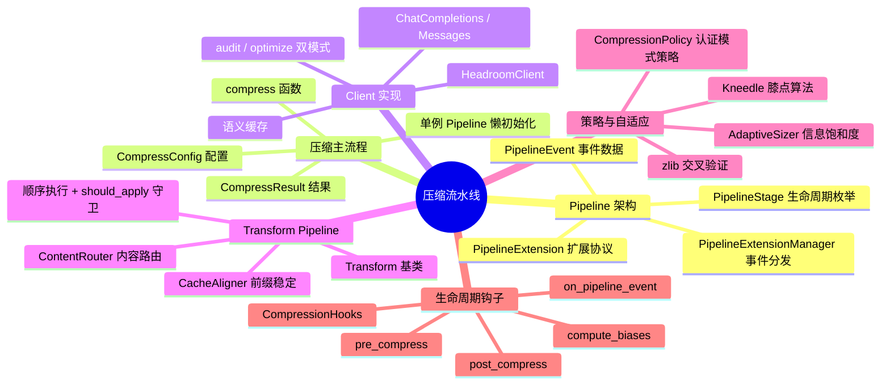
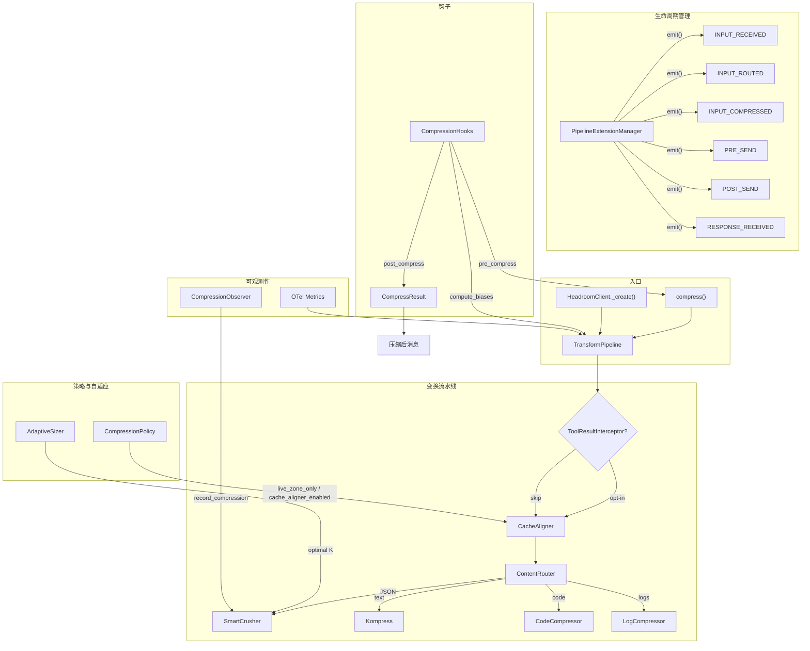
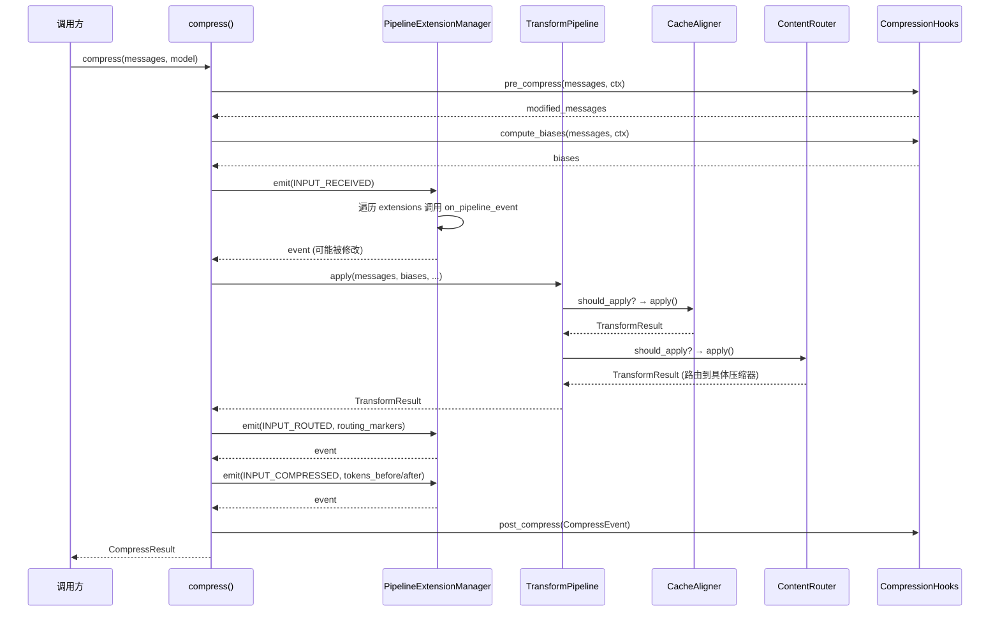
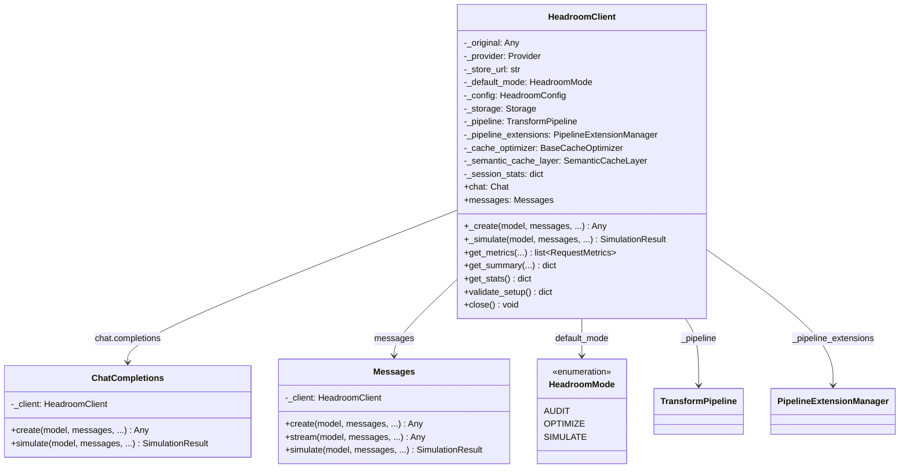
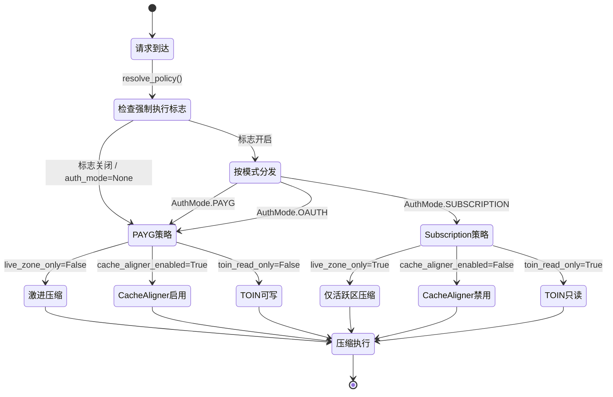

# 核心压缩流水线

## 总（概述）

压缩流水线是 Headroom 的心脏。无论是通过 `compress()` 一行代码压缩消息，还是通过 `HeadroomClient` 代理完整的 LLM 请求，所有数据最终都要流经同一条变换管道：消息先被 CacheAligner 稳定前缀以命中 KV 缓存，再由 ContentRouter 按内容类型路由到 SmartCrusher（JSON）、Kompress（文本）、CodeCompressor（代码）等专用压缩器。整条流水线由 `PipelineExtensionManager` 驱动生命周期事件，由 `CompressionHooks` 暴露前/后压缩钩子，由 `CompressionPolicy` 按认证模式控制策略边界，由 `AdaptiveSizer` 用信息饱和度算法动态决定保留多少数据。

### 图2-1: 压缩流水线知识脑图



### 图2-2: Pipeline 总体架构图



---

## 分（详细分析）

### 1. Pipeline 架构

Headroom 的 Pipeline 架构围绕四个核心概念构建：**PipelineStage**（生命周期阶段枚举）、**PipelineEvent**（事件数据载体）、**PipelineExtension**（扩展协议）、**PipelineExtensionManager**（事件分发器）。

#### PipelineStage：11 个规范阶段

[pipeline.py](file:///workspace/headroom/pipeline.py) 定义了 11 个规范阶段，构成 `CANONICAL_PIPELINE_STAGES` 元组：

```python
class PipelineStage(str, Enum):
    SETUP = "setup"
    PRE_START = "pre_start"
    POST_START = "post_start"
    INPUT_RECEIVED = "input_received"
    INPUT_CACHED = "input_cached"
    INPUT_ROUTED = "input_routed"
    INPUT_COMPRESSED = "input_compressed"
    INPUT_REMEMBERED = "input_remembered"
    PRE_SEND = "pre_send"
    POST_SEND = "post_send"
    RESPONSE_RECEIVED = "response_received"
```

这些阶段覆盖了从 SDK 初始化（`SETUP`）到请求完成（`RESPONSE_RECEIVED`）的完整生命周期。每个阶段都有明确的语义：`INPUT_RECEIVED` 标记消息首次进入流水线，`INPUT_ROUTED` 标记 ContentRouter 完成内容路由，`INPUT_COMPRESSED` 标记压缩完成，`PRE_SEND`/`POST_SEND` 界定 API 调用边界。

#### PipelineEvent：可变事件载体

`PipelineEvent` 是一个 dataclass，携带阶段、操作类型、请求 ID、消息列表、工具列表、头部、响应和元数据。关键设计：**扩展可以就地修改 `messages`、`tools`、`headers`、`metadata`，也可以返回一个全新的 `PipelineEvent` 替换原事件**。这种"就地修改或替换"的双重机制兼顾了简单扩展（只需改字段）和复杂扩展（需要完全控制事件）。

#### PipelineExtension：Protocol 协议

`PipelineExtension` 是一个 `Protocol`，只要求实现 `on_pipeline_event(event) -> PipelineEvent | None`。返回 `None` 表示不修改事件，返回新的 `PipelineEvent` 则替换。这种轻量协议让第三方扩展无需继承基类即可接入。

#### PipelineExtensionManager：事件分发器

`PipelineExtensionManager` 是整个事件系统的枢纽。它的构造函数接受三个参数：

- `hooks`：一个 `CompressionHooks` 实例（如果它有 `on_pipeline_event` 方法，会被自动加入扩展列表）
- `extensions`：显式传入的扩展列表
- `discover`：是否通过 `importlib.metadata` 自动发现入口点（entry point group: `headroom.pipeline_extension`）

核心方法 `emit()` 创建 `PipelineEvent`，然后依次调用所有扩展的 `on_pipeline_event`。如果扩展返回新的 `PipelineEvent`，后续扩展看到的就是更新后的事件——这是**链式传递**模式。异常不会中断链路，只会记录警告日志——这是**fail-open**设计，确保观测性扩展的故障不会阻塞压缩。

### 图2-3: Pipeline 事件驱动时序图



---

### 2. 压缩主流程

#### compress() 函数：一行代码的完整流水线

[compress.py](file:///workspace/headroom/compress.py) 中的 `compress()` 函数是 Headroom 最简洁的入口——无需代理、无需配置，只需传入消息和模型名：

```python
def compress(
    messages: list[dict[str, Any]],
    model: str = "claude-sonnet-4-5-20250929",
    model_limit: int = 200000,
    optimize: bool = True,
    hooks: Any = None,
    config: CompressConfig | None = None,
    **kwargs: Any,
) -> CompressResult:
```

核心流程分为六步：

1. **守卫检查**：空消息或 `optimize=False` 时直接返回原消息
2. **配置合并**：`CompressConfig` + `kwargs` 覆盖，支持 `compress(messages, target_ratio=0.5)` 的简写
3. **钩子预处理**：调用 `hooks.pre_compress()` 和 `hooks.compute_biases()`
4. **事件通知**：`emit(INPUT_RECEIVED)` 让扩展有机会修改输入
5. **流水线执行**：`pipeline.apply()` 执行 CacheAligner → ContentRouter 变换链
6. **事件通知 + 钩子后处理**：`emit(INPUT_ROUTED)` → `emit(INPUT_COMPRESSED)` → `hooks.post_compress()`

异常处理采用**降级策略**：任何压缩异常都记录到 OTel metrics 并返回原始消息，确保调用方永远不会因为压缩失败而丢失数据。

#### CompressConfig：用户友好的压缩配置

`CompressConfig` 提供三个维度的控制：

| 维度 | 字段 | 默认值 | 说明 |
|------|------|--------|------|
| **压缩范围** | `compress_user_messages` | `False` | 编码代理通常跳过用户消息 |
| | `compress_system_messages` | `True` | 语音代理可关闭以保护指令 |
| | `protect_recent` | `4` | 不压缩最近 N 条消息 |
| | `protect_analysis_context` | `True` | 检测"分析"意图并保护代码 |
| **压缩强度** | `target_ratio` | `None` | Kompress 保留比率，`None`=模型决定(~15%) |
| | `min_tokens_to_compress` | `250` | 低于此值不压缩 |
| **模型变体** | `kompress_model` | `None` | ML 压缩模型 ID，`"disabled"` 跳过 ML 压缩 |

#### CompressResult：压缩结果

`CompressResult` 返回压缩后的消息、前后 token 数、节省量、压缩比和应用的变换列表。`compression_ratio` 的语义是"节省比例"——0.35 表示节省了 35% 的 token。

#### 单例 Pipeline 懒初始化

`compress()` 使用线程安全的双重检查锁定模式初始化单例 `TransformPipeline`：

```python
_pipeline = None
_pipeline_lock = threading.Lock()

def _get_pipeline() -> Any:
    global _pipeline
    if _pipeline is not None:
        return _pipeline
    with _pipeline_lock:
        if _pipeline is not None:
            return _pipeline
        _pipeline = TransformPipeline()
        return _pipeline
```

这确保了多次调用 `compress()` 共享同一个 Pipeline 实例，避免重复构建变换链的开销。

---

### 3. Client 实现

#### HeadroomClient 类设计

[client.py](file:///workspace/headroom/client.py) 中的 `HeadroomClient` 是 Headroom 的完整 SDK 入口，包装任意 LLM 客户端并注入压缩、缓存对齐和语义缓存能力。

### 图2-4: HeadroomClient 类图



#### 双模式设计：Audit 与 Optimize

`HeadroomClient` 的核心决策点是 `HeadroomMode`：

- **AUDIT 模式**：只分析不修改。计算 token 数、检测浪费信号、评估缓存对齐分数，但消息原样传递。适合 A/B 测试和渐进式启用。
- **OPTIMIZE 模式**：执行完整变换链 + 缓存优化 + 语义缓存。消息被压缩后再发送给底层 LLM。

在 `_create()` 方法中，模式决定分支清晰：

```python
if mode == HeadroomMode.OPTIMIZE:
    result = self._pipeline.apply(messages, model, ...)
    # ... 缓存优化 ...
else:
    optimized_messages = messages  # 原样传递
```

#### 双 API 风格适配

`ChatCompletions`（OpenAI 风格）和 `Messages`（Anthropic 风格）是两个轻量包装类，将不同 API 风格的参数统一转发到 `_create()` 方法。`api_style` 参数在内部用于选择正确的传输层调用。

#### 语义缓存层

当 `enable_semantic_cache=True` 时，`HeadroomClient` 在缓存优化器之上包装 `SemanticCacheLayer`。请求先检查语义缓存是否命中——如果命中，直接返回缓存响应，完全跳过 LLM 调用。这是 Headroom 最激进的优化：不仅压缩 token，还可能消除整个 API 调用。

---

### 4. Transform Pipeline

#### Transform 基类

[transforms/base.py](file:///workspace/headroom/transforms/base.py) 定义了所有变换的抽象基类：

```python
class Transform(ABC):
    name: str = "base"

    @abstractmethod
    def apply(self, messages, tokenizer, **kwargs) -> TransformResult:
        pass

    def should_apply(self, messages, tokenizer, **kwargs) -> bool:
        return True
```

两个关键设计点：

1. **`should_apply()` 守卫**：每个变换可以自主决定是否执行。`CacheAligner` 在 `CompressionPolicy.cache_aligner_enabled=False` 时返回 `False`，`ContentRouter` 可以根据消息内容决定是否路由。
2. **`frozen_message_count` 协议**：通过 `kwargs` 传入，告知变换前 N 条消息已被提供方缓存，不得修改。`split_frozen()` 辅助函数将消息分为冻结部分和可变部分。

#### 变换注册与执行顺序

[transforms/pipeline.py](file:///workspace/headroom/transforms/pipeline.py) 中的 `TransformPipeline._build_default_transforms()` 定义了默认变换链的构建顺序：

```python
def _build_default_transforms(self) -> list[Transform]:
    transforms: list[Transform] = []

    # 0. Tool-result interceptors (opt-in)
    if getattr(self.config, "intercept_tool_results", False) or ...:
        transforms.append(ToolResultInterceptorTransform())

    # 1. Cache Aligner (prefix stabilization)
    if self.config.cache_aligner.enabled:
        transforms.append(CacheAligner(self.config.cache_aligner))

    # 2. Content-aware Compression
    transforms.append(ContentRouter())

    return transforms
```

顺序至关重要：
- **ToolResultInterceptor**（opt-in）先运行，缩小工具输出体积，让下游压缩器处理更少的数据
- **CacheAligner** 在压缩前稳定前缀，确保提供方 KV 缓存命中
- **ContentRouter** 最后运行，按内容类型路由到专用压缩器

#### apply() 方法：顺序执行 + 精确计时

`apply()` 方法是流水线的执行核心。它按顺序执行每个变换，并做了几项关键优化：

1. **深拷贝一次**：在流水线开始时对消息做一次深拷贝，后续变换直接修改拷贝
2. **避免重复 token 计数**：每个变换在自己的 `TransformResult` 中报告前后 token 数，流水线只在最后做一次完整计数
3. **OpenTelemetry 集成**：每个变换被包裹在 OTel span 中，记录 token 变化、耗时等指标
4. **Diff Artifact**：可选的调试功能，记录每个变换的详细 diff

```python
for transform in self.transforms:
    if not transform.should_apply(current_messages, tokenizer, **kwargs):
        continue
    result = transform.apply(current_messages, tokenizer, **kwargs)
    current_messages = result.messages
    all_transforms.extend(result.transforms_applied)
    all_timing[transform.name] = duration_ms
```

#### simulate()：零副作用预览

`simulate()` 方法直接调用 `apply(record_metrics=False)`，因为 `apply()` 本身就在拷贝上操作，所以模拟不会修改原始消息，也不会记录指标。

---

### 5. CompressionPolicy 与 AdaptiveSizer

#### CompressionPolicy：认证模式驱动的策略边界

[transforms/compression_policy.py](file:///workspace/headroom/transforms/compression_policy.py) 实现了按认证模式（AuthMode）区分的压缩策略。这是 Phase F 引入的关键安全机制——不同付费等级的用户获得不同的压缩行为：

| 字段 | PAYG / OAuth | Subscription |
|------|-------------|-------------|
| `live_zone_only` | `False` | `True` |
| `cache_aligner_enabled` | `True` | `False` |
| `volatile_token_threshold` | 128 | 32 |
| `max_lossy_ratio` | 0.45 | 0.25 |
| `toin_read_only` | `False` | `True` |

设计哲学：
- **PAYG/OAuth**：激进策略。允许修改缓存前缀、更高的有损压缩上限、TOIN 可写入学习数据
- **Subscription**：保守策略。只压缩活跃区域、禁用 CacheAligner（解决 #327/#388 的缓存不稳定投诉）、TOIN 只读（一致性优先于学习）

`resolve_policy()` 是唯一公共入口，它结合环境变量 `HEADROOM_PROXY_AUTH_MODE_POLICY_ENFORCEMENT` 和认证模式决定最终策略。当强制执行关闭时，所有模式都使用 PAYG 策略作为防御性默认值。

### 图2-5: 压缩策略决策状态图



#### AdaptiveSizer：信息饱和度驱动的自适应大小

[transforms/adaptive_sizer.py](file:///workspace/headroom/transforms/adaptive_sizer.py) 解决了一个核心问题：**保留多少条目才是最优的？** 传统方案使用硬编码的 `max_items=15`，但不同数据的最优 K 差异巨大。

AdaptiveSizer 采用三层决策系统：

**Tier 1（快速路径）**：处理平凡情况
- 少于 8 个条目 → 全部保留
- SimHash 聚类发现 ≤3 个唯一组 → 保留唯一组数量

**Tier 2（标准路径）**：Kneedle 算法
1. 按重要性排序条目，提取词级 bigram
2. 构建累积唯一 bigram 覆盖曲线
3. 用 Kneedle 算法找膝点——边际信息增益急剧下降的位置
4. 如果没有找到膝点，用多样性比率（`unique_count / n`）计算保留分数

**Tier 3（验证路径）**：zlib 压缩比交叉验证
- 比较子集和全集的 zlib 压缩比
- 如果差异超过 15%，说明子集遗漏了多样性内容，K 增加 20%

```python
def compute_optimal_k(items, bias=1.0, min_k=3, max_k=None) -> int:
    # Tier 1: fast path
    if n <= 8: return n
    unique_count = count_unique_simhash(items)
    if unique_count <= 3: return max(min_k, unique_count)

    # Tier 2: Kneedle
    curve = compute_unique_bigram_curve(items)
    knee = find_knee(curve)

    # Tier 3: zlib validation
    k = _validate_with_zlib(items, k, effective_max)
    return k
```

`bias` 参数允许上层覆盖统计结果：`conservative`（1.5）保留 50% 更多，`aggressive`（0.7）压缩更狠。这通过 [config.py](file:///workspace/headroom/config.py) 中的 `CompressionProfile` 和 `DEFAULT_TOOL_PROFILES` 映射到具体工具——Grep 用保守策略，WebFetch 用激进策略。

---

### 6. Pipeline 生命周期钩子

#### CompressionHooks：三钩子 + 一协议

[hooks.py](file:///workspace/headroom/hooks.py) 定义了四个扩展点：

**1. `pre_compress(messages, ctx) -> messages`**：压缩前修改消息

用途：跨轮去重、记忆注入、预过滤、阶段检测。返回修改后的消息列表。

**2. `compute_biases(messages, ctx) -> dict[int, float]`**：按消息设置压缩偏向

返回 `{消息索引: 偏向值}` 的映射：
- `1.0` = 默认压缩
- `>1.0` = 保留更多（压缩更保守）
- `<1.0` = 压缩更激进

典型应用：位置感知压缩（中间消息偏向更高，因为 LLM 注意力在中间最弱）、阶段感知预算（旧的探索消息偏向更低）。

**3. `post_compress(event)`**：压缩后观察

纯观测性钩子，用于失败驱动学习、分析看板、A/B 测试、异常检测。

**4. `on_pipeline_event(event) -> PipelineEvent | None`**：规范生命周期事件

这是 `CompressionHooks` 同时实现 `PipelineExtension` 协议的桥梁。`PipelineExtensionManager` 在构造时检查 hooks 是否有 `on_pipeline_event` 方法，如果有就自动加入扩展列表。

#### CompressContext 与 CompressEvent

两个数据类为钩子提供上下文：

- `CompressContext`：压缩前上下文（模型、用户查询、轮次号、工具调用列表、提供方）
- `CompressEvent`：压缩后事件（前后 token 数、节省量、压缩比、应用的变换列表）

#### 默认行为：全 No-Op

`CompressionHooks` 的所有方法都有 no-op 默认实现——OSS 行为不变，除非子类覆盖。这是 Headroom 的设计哲学：**默认安全，显式定制**。

---

## 总（总结）

### 流水线设计核心优势

Headroom 的压缩流水线体现了五个核心设计原则：

1. **渐进式降级**：从 `compress()` 一行代码到 `HeadroomClient` 完整代理，从 AUDIT 到 OPTIMIZE，用户可以逐步启用更激进的优化，每一步都有明确的回退路径。压缩失败时返回原始消息，扩展异常时 fail-open 不阻塞主流程。

2. **策略与机制分离**：`CompressionPolicy` 将"压缩多激进"的决策从"如何压缩"的实现中分离出来。认证模式决定策略边界，变换组件只关心机制。`AdaptiveSizer` 将"保留多少"的决策从"保留哪些"的选择中分离——统计决定 K，相关性决定具体条目。

3. **事件驱动可扩展**：`PipelineExtensionManager` + `PipelineExtension` 协议提供了零侵入的扩展机制。第三方通过 Python entry point 注册扩展，无需修改 Headroom 代码。链式传递 + fail-open 确保扩展既强大又安全。

4. **可观测性内建**：从 OTel span 到 `CompressionObserver` 协议，从 `TransformResult.timing` 到 `DiffArtifact`，流水线的每一步都可追踪。`CompressionObserver` 的设计哲学——"观测性故障不应破坏压缩"——是对真实生产事故的直接回应。

5. **数据驱动的自适应**：`AdaptiveSizer` 用 Kneedle 算法 + SimHash + zlib 三层验证替代硬编码阈值。TOIN（Tool Output Intelligence Network）反馈环让压缩策略随使用模式进化。这不是静态配置，而是一个学习系统。

### 图2-6: Pipeline 与其他模块协作关系图

```mermaid
flowchart LR
    subgraph 用户接口
        COMP["compress()"]
        HC["HeadroomClient"]
    end

    subgraph 核心流水线
        TP["TransformPipeline"]
        PEM["PipelineExtensionManager"]
    end

    subgraph 变换组件
        CA["CacheAligner"]
        CR["ContentRouter"]
        SC["SmartCrusher"]
        KP["Kompress"]
    end

    subgraph 策略与自适应
        CP["CompressionPolicy"]
        AS["AdaptiveSizer"]
        RS["RelevanceScorer"]
    end

    subgraph 钩子与扩展
        HK["CompressionHooks"]
        PE["PipelineExtension"]
    end

    subgraph 基础设施
        TK["Tokenizer"]
        ST["Storage"]
        OT["OTel / Metrics"]
        OB["CompressionObserver"]
    end

    COMP --> TP
    HC --> TP
    HC --> PEM

    TP --> CA
    TP --> CR
    CR --> SC
    CR --> KP

    SC --> AS
    SC --> RS
    SC --> OB
    CA --> CP

    PEM --> HK
    PEM --> PE

    TP --> TK
    HC --> ST
    TP --> OT

    CP --> |"cache_aligner_enabled"| CA
    CP --> |"live_zone_only"| TP
    HK --> |"biases"| TP
