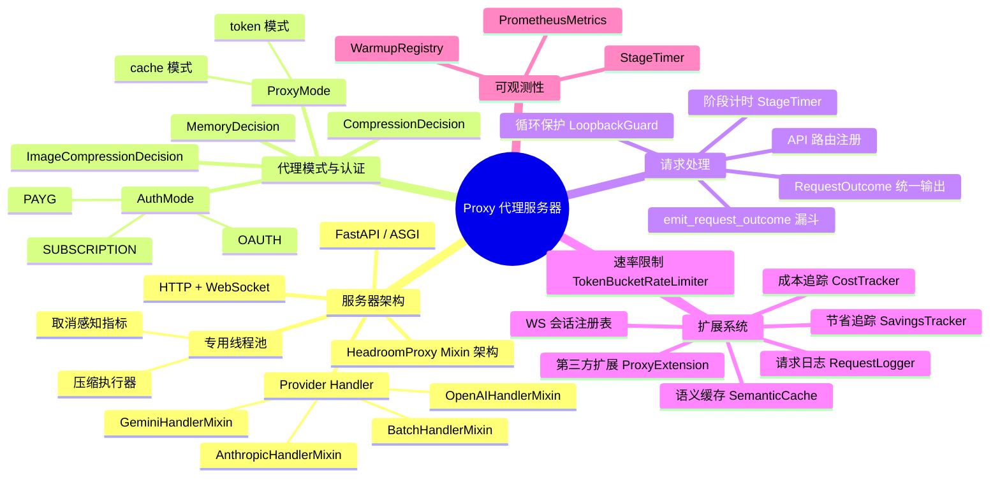
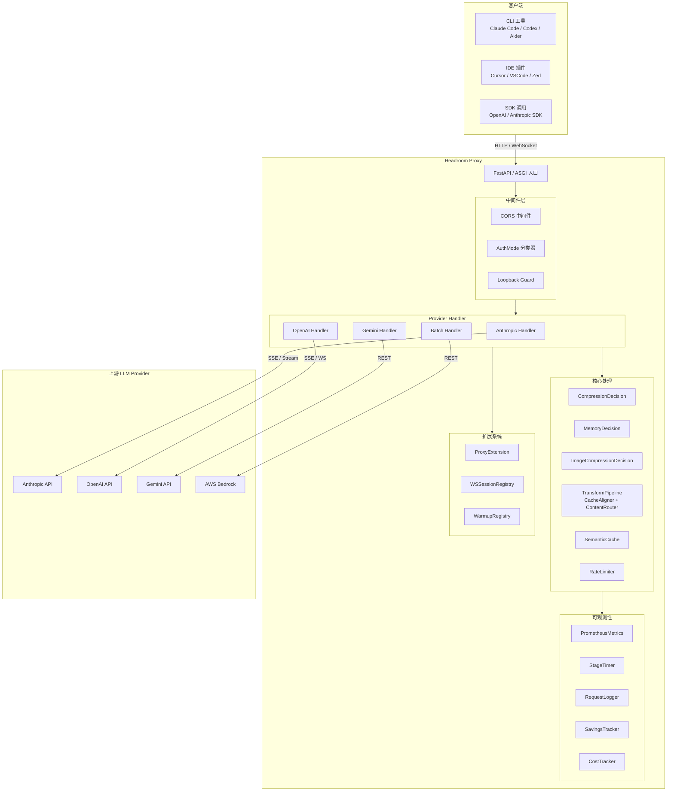
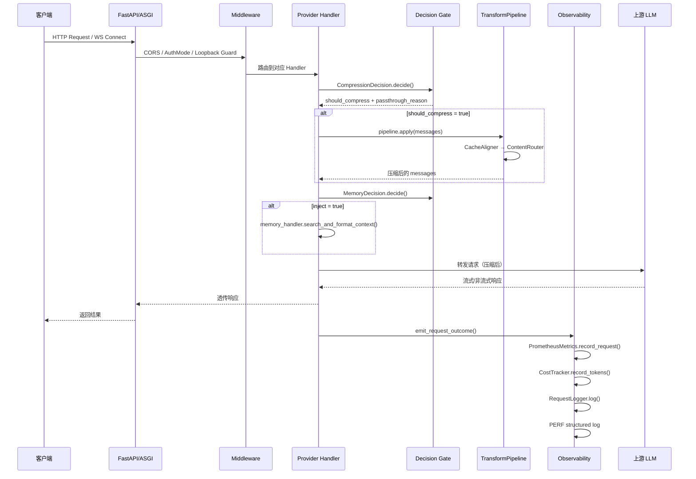
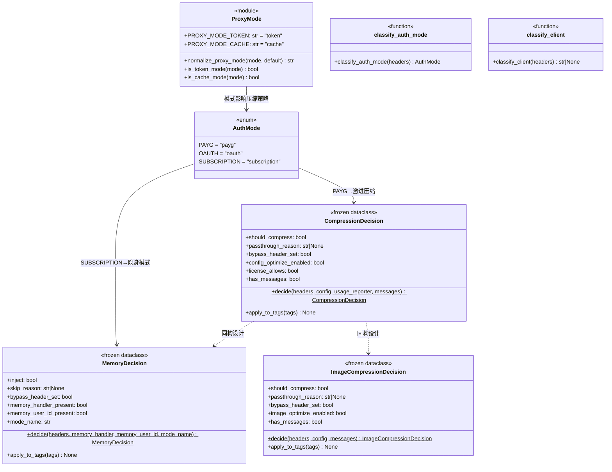
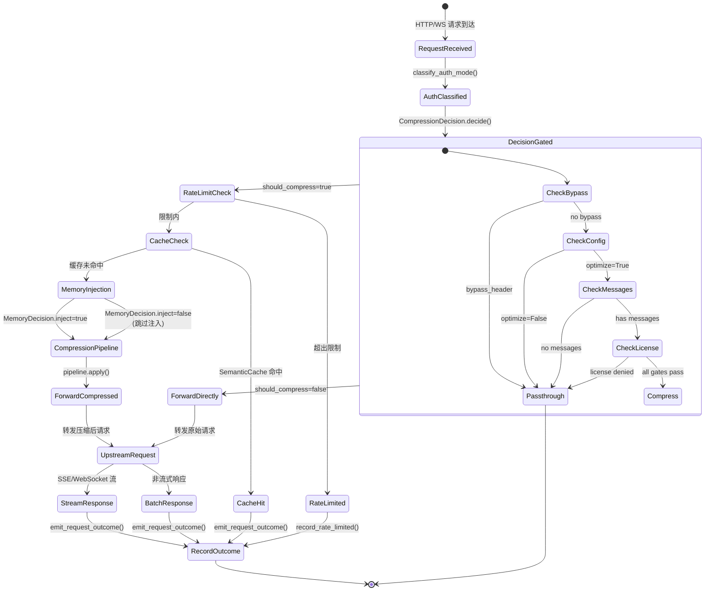
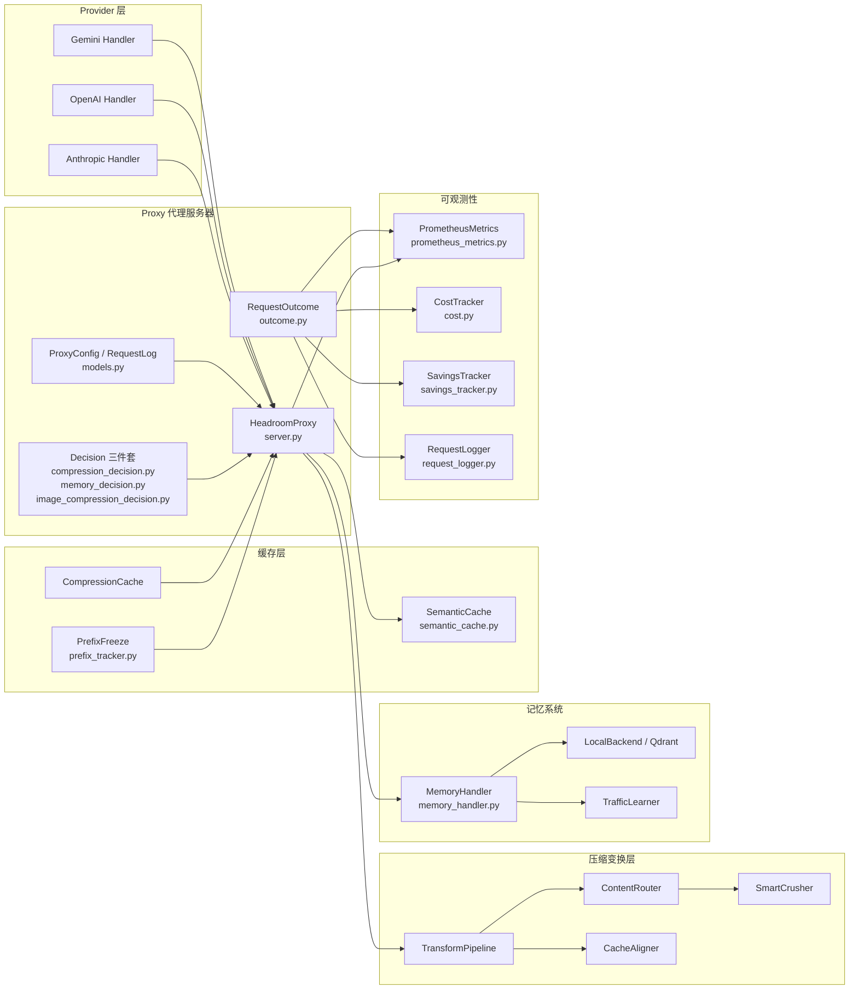

# 第03篇：代理服务器（Proxy）

## 总（概述）

Headroom Proxy 是整个系统的**零代码集成方案**——用户无需修改任何客户端代码，只需将 LLM API 的 Base URL 指向 Proxy，即可自动获得上下文压缩、语义缓存、速率限制、成本追踪等全部能力。Proxy 基于 FastAPI/ASGI 构建，同时支持 HTTP 和 WebSocket 双协议，以 Mixin 架构组织多 Provider 处理逻辑，并通过扩展系统实现语义缓存、速率限制、请求日志、节省追踪等横切关注点。

### 图3-1: 代理服务器知识脑图



### 图3-2: Proxy 总体架构图



---

## 分（详细分析）

### 1. 服务器架构（FastAPI / ASGI / WebSocket）

Headroom Proxy 的核心类 [HeadroomProxy](file:///workspace/headroom/proxy/server.py) 采用 **Mixin 组合模式**，通过多重继承将不同 Provider 的处理逻辑组装到同一个类中：

```python
class HeadroomProxy(
    StreamingMixin,
    AnthropicHandlerMixin,
    OpenAIHandlerMixin,
    GeminiHandlerMixin,
    BatchHandlerMixin,
):
```

这种设计使得每个 Provider 的处理逻辑独立维护，同时共享公共的压缩管道、指标收集和请求日志基础设施。

**关键架构决策：**

- **FastAPI + ASGI**：基于 Starlette 的异步框架，原生支持 SSE 流式响应和 WebSocket
- **专用压缩线程池**：CPU 密集型的 Rust 压缩操作运行在独立的 `ThreadPoolExecutor` 中，避免阻塞事件循环。参见 [server.py](file:///workspace/headroom/proxy/server.py) 中的 `_run_compression_in_executor` 方法
- **Pre-upstream 并发控制**：通过 `asyncio.Semaphore` 限制 Anthropic 路径的并发预处理数量，防止冷启动重放风暴
- **Rust 核心校验**：启动时检查 `headroom._core` 扩展是否可加载，缺失时默认拒绝启动（可通过环境变量降级）

`HeadroomProxy.__init__` 中的初始化顺序经过精心设计——`metrics` 在 `transforms` 之前创建，以便 `ContentRouter` 在构造时就能接收 `self.metrics` 作为压缩观察者：

```python
self.metrics = PrometheusMetrics(cost_tracker=self.cost_tracker)
# ... 之后创建 transforms
transforms = [
    CacheAligner(CacheAlignerConfig(enabled=False)),
    ContentRouter(router_config, observer=self.metrics),
]
```

#### 图3-3: 请求处理时序图



---

### 2. 代理模式与认证

#### ProxyMode：运行模式

[modes.py](file:///workspace/headroom/proxy/modes.py) 定义了两种互斥的代理运行模式：

| 模式 | 常量 | 行为 |
|------|------|------|
| **token** | `PROXY_MODE_TOKEN` | 优先压缩——可重写历史消息以最大化 token 节省 |
| **cache** | `PROXY_MODE_CACHE` | 优先缓存稳定性——冻结历史轮次，保护 Provider 前缀缓存 |

模式通过 `HEADROOM_MODE` 环境变量设置，支持多种别名归一化（如 `token_mode` → `token`，`cost_savings` → `cache`）：

```python
_MODE_ALIASES = {
    "token": PROXY_MODE_TOKEN,
    "token_mode": PROXY_MODE_TOKEN,
    "token_savings": PROXY_MODE_TOKEN,
    "cache": PROXY_MODE_CACHE,
    "cache_mode": PROXY_MODE_CACHE,
    "cost_savings": PROXY_MODE_CACHE,
}
```

#### AuthMode：认证模式

[auth_mode.py](file:///workspace/headroom/proxy/auth_mode.py) 实现了三级认证分类，直接决定压缩策略的激进程度：

| AuthMode | 含义 | 压缩策略 |
|----------|------|----------|
| **PAYG** | 按 API Key 付费 | 激进压缩，允许有损压缩器 |
| **OAUTH** | OAuth / IAM / ADC 令牌 | 仅无损压缩，不自动注入缓存控制 |
| **SUBSCRIPTION** | 订阅制 CLI/IDE | 隐身模式——不修改 User-Agent，不注入 X-Headroom 头 |

分类决策链的优先级为：**Subscription UA > OAuth Bearer > PAYG sk-* > JWT > x-api-key > 默认 PAYG**。

```python
def classify_auth_mode(headers: Mapping[str, Any] | Any) -> AuthMode:
    # 1. User-Agent → Subscription
    ua_lower = _header_get(headers, "user-agent").lower()
    for prefix in SUBSCRIPTION_UA_PREFIXES:
        if prefix in ua_lower:
            return AuthMode.SUBSCRIPTION
    # 2. Authorization → OAuth / PAYG
    auth = _header_get(headers, "authorization")
    if auth.startswith("Bearer "):
        token = auth[len("Bearer "):]
        if token.startswith("sk-ant-oat-"):
            return AuthMode.OAUTH
        if token.startswith("sk-ant-api") or token.startswith("sk-"):
            return AuthMode.PAYG
        if len(token.split(".")) >= 3:
            return AuthMode.OAUTH
    # ...
```

#### 三大 Decision 类型

[CompressionDecision](file:///workspace/headroom/proxy/compression_decision.py)、[MemoryDecision](file:///workspace/headroom/proxy/memory_decision.py) 和 [ImageCompressionDecision](file:///workspace/headroom/proxy/image_compression_decision.py) 是三个不可变（`frozen=True`）的决策值类型，统一了原先散布在多个 Handler 中的内联判断逻辑。

**CompressionDecision** 的决策优先级：

1. `bypass_header` — 用户显式绕过（`x-headroom-bypass: true`）
2. `compression_disabled` — 运维关闭（`config.optimize=False`）
3. `no_messages` — 空消息列表
4. `license_denied` — 许可证拒绝

```python
@dataclass(frozen=True)
class CompressionDecision:
    should_compress: bool
    passthrough_reason: str | None
    bypass_header_set: bool
    config_optimize_enabled: bool
    license_allows: bool
    has_messages: bool
```

**MemoryDecision** 的决策优先级：

1. `bypass_header` — 用户显式绕过
2. `no_handler` — 无 Memory 后端
3. `no_user_id` — 缺少用户 ID
4. `mode_disabled` — 运维禁用
5. `mode_tool` — 工具模式（不自动注入）

每个 Decision 都提供 `apply_to_tags()` 方法，将跳过原因写入 `RequestOutcome.tags`，供 Dashboard 切片分析。

#### 图3-4: 代理模式类图



---

### 3. 请求处理（API 路由 / 循环保护 / 阶段计时）

#### API 路由注册

Proxy 通过 [register_provider_routes](file:///workspace/headroom/proxy/server.py) 将各 Provider 的 API 端点注册到 FastAPI 应用。每个 Handler Mixin 负责自己 Provider 的路由处理，包括：

- **Anthropic**：`/v1/messages`（SSE 流式）、`/v1/messages/batches`
- **OpenAI**：`/v1/chat/completions`（SSE）、`/v1/responses`（WebSocket Codex）
- **Gemini**：`/v1/models/{model}:generateContent`、`/v1/models/{model}:streamGenerateContent`

#### 循环保护：LoopbackGuard

[loopback_guard.py](file:///workspace/headroom/proxy/loopback_guard.py) 为 `/debug/*` 端点提供**仅回环访问**保护。关键设计决策：返回 **404** 而非 403，使调试端点对外部扫描器不可见——与"无此路由"无法区分：

```python
def require_loopback(request: Request) -> None:
    client = getattr(request, "client", None)
    host = getattr(client, "host", None) if client is not None else None
    if not is_loopback_host(host):
        raise HTTPException(status_code=404)  # 不是 403！
```

`is_loopback_host` 支持 IPv4、IPv6 和 IPv6-mapped IPv4（`::ffff:127.0.0.1`），覆盖 Linux 双栈套接字的默认行为。

#### 阶段计时：StageTimer

[stage_timer.py](file:///workspace/headroom/proxy/stage_timer.py) 提供轻量级的同步+异步上下文管理器，用于测量请求处理各阶段的耗时：

```python
class StageTimer:
    def measure(self, name: str) -> StageMeasurement:
        """返回一个记录命名阶段耗时的上下文管理器"""
        return StageMeasurement(self, name)

    def summary(self) -> dict[str, float]:
        """返回已记录阶段耗时的快照（毫秒）"""
        return dict(self._stages)
```

使用方式：

```python
timer = StageTimer()
async with timer.measure("upstream_connect"):
    # 连接上游...
    pass
async with timer.measure("compression"):
    # 压缩...
    pass
# timer.summary() → {"upstream_connect": 45.2, "compression": 12.8}
```

计时数据通过 `emit_stage_timings_log` 同时写入结构化日志和 Prometheus 指标。

#### RequestOutcome：统一输出漏斗

[outcome.py](file:///workspace/headroom/proxy/outcome.py) 定义了 `RequestOutcome` 不可变数据类，作为所有 Provider Handler 的**统一请求结果类型**。它解决了原先 18 个 `metrics.record_request` 调用点参数不一致的问题：

```python
@dataclass(frozen=True)
class RequestOutcome:
    request_id: str
    provider: str
    model: str
    original_tokens: int
    optimized_tokens: int
    output_tokens: int
    tokens_saved: int
    attempted_input_tokens: int
    cache_read_tokens: int = 0
    # ... 更多字段
```

`emit_request_outcome` 函数是**唯一的输出漏斗**，按序执行四个下游效果：

1. `PrometheusMetrics.record_request()` — 指标收集
2. `CostTracker.record_tokens()` — 成本追踪
3. `RequestLogger.log()` — 请求日志
4. 结构化 PERF 日志行

#### 图3-5: 请求处理状态图



---

### 4. 扩展系统

#### 语义缓存：SemanticCache

[semantic_cache.py](file:///workspace/headroom/proxy/semantic_cache.py) 实现了基于消息内容哈希的响应缓存，使用 `OrderedDict` 实现 O(1) LRU 淘汰：

```python
class SemanticCache:
    def _compute_key(self, messages: list[dict], model: str) -> str:
        normalized = json.dumps({"model": model, "messages": messages}, sort_keys=True)
        return hashlib.sha256(normalized.encode()).hexdigest()[:32]
```

- **最大条目数**：默认 1000，超出时 LRU 淘汰最旧条目
- **TTL**：默认 3600 秒，过期条目在 `get()` 时惰性删除
- **线程安全**：使用 `asyncio.Lock` 保护并发访问

#### 速率限制：TokenBucketRateLimiter

[rate_limiter.py](file:///workspace/headroom/proxy/rate_limiter.py) 实现了令牌桶算法，按 API Key 或 IP 地址限制请求频率和 Token 用量：

```python
class TokenBucketRateLimiter:
    def __init__(self, requests_per_minute=60, tokens_per_minute=100000):
        self._request_buckets: dict[str, RateLimitState] = defaultdict(...)
        self._token_buckets: dict[str, RateLimitState] = defaultdict(...)
```

- **双层桶**：请求频率桶 + Token 用量桶，独立计数
- **桶上限**：最多 1000 个桶（`MAX_RATE_LIMITER_BUCKETS`），防止 DoS
- **惰性清理**：超过上限时自动清理 10 分钟未使用的桶
- **令牌补充**：基于经过时间按速率线性补充

#### 请求日志：RequestLogger

[request_logger.py](file:///workspace/headroom/proxy/request_logger.py) 将请求日志写入内存 deque（最大 10,000 条）和可选的 JSONL 文件。Phase G PR-G3 引入了 **base64 图片脱敏**——递归遍历请求/响应 JSON，将超过 1024 字节的 base64 图片数据替换为大小占位符：

```python
IMAGE_BASE64_REPLACEMENT_TEMPLATE = "<image:base64-redacted bytes={n}>"
```

脱敏策略采用**路径感知**方式：仅对已知图片字段（`data`、`url`、`image_url`、`image`）或以 `data:image/` 开头的字符串执行替换，避免误脱敏加密 blob、签名令牌等非图片内容。

#### 节省追踪：SavingsTracker

[savings_tracker.py](file:///workspace/headroom/proxy/savings_tracker.py) 将累计压缩节省持久化到本地 JSON 文件，确保代理重启后历史数据不丢失：

```python
class SavingsTracker:
    def record_request(self, *, model, input_tokens, tokens_saved, ...):
        # 更新 lifetime 累计
        # 更新 display_session（60 分钟不活动自动重置）
        # 追加 history 检查点
        # 原子写入 JSON 文件（tempfile + rename）
```

关键设计：

- **原子写入**：先写临时文件再 `rename`，防止写入中断导致数据损坏
- **Display Session**：60 分钟不活动自动重置的"展示会话"，用于 Dashboard 实时视图
- **历史压缩**：保留最近 5000 个检查点，超过 365 天的自动清理
- **多粒度聚合**：支持按小时/天/周/月聚合，供前端图表展示
- **LiteLLM 定价集成**：使用 LiteLLM 的社区定价数据库计算美元节省

#### 成本追踪：CostTracker

[cost.py](file:///workspace/headroom/proxy/cost_tracker.py) 中的 `CostTracker` 跟踪每个模型的 Token 用量和成本，支持预算限制：

```python
class CostTracker:
    def estimate_cost(self, model, input_tokens, output_tokens,
                      cache_read_tokens=0, cache_write_tokens=0) -> float | None:
        # 使用 LiteLLM 的定价数据库
        # 原生支持 cache_read / cache_creation 定价
```

- **Provider 缓存经济学**：不同 Provider 的缓存折扣不同（Anthropic 读 0.1x/写 1.25x，OpenAI 读 0.5x/写 1.0x）
- **模型名解析缓存**：避免重复的同步 LiteLLM 查找阻塞事件循环
- **预算控制**：支持按小时/天/月的预算限制
- **前缀缓存统计**：`build_prefix_cache_stats()` 构建按 Provider 分组的缓存命中率、节省金额等

#### WebSocket 会话注册表

[ws_session_registry.py](file:///workspace/headroom/proxy/ws_session_registry.py) 为 Codex WebSocket 会话提供生命周期追踪：

```python
class WebSocketSessionRegistry:
    def register(self, handle: WSSessionHandle) -> None: ...
    def deregister(self, session_id, cause) -> WSSessionHandle | None: ...
    def attach_tasks(self, session_id, tasks) -> None: ...
```

- **终止原因分类**：`client_disconnect`、`upstream_disconnect`、`upstream_error`、`response_completed` 等
- **幂等注销**：Handler 的 `finally` 块安全调用
- **Prometheus 集成**：`active_ws_sessions` 和 `active_relay_tasks` 实时仪表

#### 第三方扩展：ProxyExtension

[extensions.py](file:///workspace/headroom/proxy/extensions.py) 通过 Python Entry Points 机制提供第三方扩展点：

```python
# pyproject.toml 声明
[project.entry-points."headroom.proxy_extension"]
my_extension = "my_pkg.extension:install"
```

扩展是**显式启用**的——即使安装了也不会自动运行，必须通过 `--proxy-extension` 或 `HEADROOM_PROXY_EXTENSIONS` 环境变量启用。支持通配符 `*` 启用所有已发现扩展。

---

### 5. Prometheus 指标与 Warmup

#### PrometheusMetrics

[prometheus_metrics.py](file:///workspace/headroom/proxy/prometheus_metrics.py) 是 Proxy 的核心可观测性组件，追踪请求计数、Token 用量、延迟、开销、TTFB、每阶段计时、浪费信号、前缀缓存统计和累计节省历史。

**指标分类：**

| 类别 | 示例指标 | 说明 |
|------|----------|------|
| 请求计数 | `headroom_requests_total` | 总请求数 |
| Token 用量 | `headroom_tokens_saved_total` | 压缩节省的 Token |
| 延迟 | `headroom_latency_ms_sum/count/min/max` | 请求延迟直方图 |
| 开销 | `headroom_overhead_ms_*` | Headroom 处理开销（不含 LLM 时间） |
| TTFB | `headroom_ttfb_ms_*` | 首字节时间 |
| 阶段计时 | `headroom_stage_timing_ms_*` | 按 (path, stage) 分组的处理阶段耗时 |
| 缓存 | `headroom_cache_read_tokens_total` | Provider 前缀缓存读取 |
| WS 生命周期 | `headroom_active_ws_sessions` | 活跃 WebSocket 会话数 |
| 浪费信号 | `headroom_waste_signal_tokens_total` | 检测到的浪费 Token |

**并发安全设计**：

- 通用指标使用 `asyncio.Lock`（`self._lock`）保护
- 阶段计时使用 `threading.Lock`（`self._stage_timing_lock`）保护——因为更新操作无 await，同步锁更轻量，且不会与 `export()` 的字符串构建竞争
- `defaultdict(int)` 写入在 GIL 下原子性足够，`record_compression` 等方法无需加锁

`export()` 方法生成标准 Prometheus 文本格式，供 `/metrics` 端点抓取。

#### WarmupRegistry

[warmup.py](file:///workspace/headroom/proxy/warmup.py) 管理代理启动时的**预热资产注册表**，确保首次请求不会触发 N 个并行加载：

```python
@dataclass
class WarmupRegistry:
    kompress: WarmupSlot = field(default_factory=WarmupSlot)
    magika: WarmupSlot = field(default_factory=WarmupSlot)
    code_aware: WarmupSlot = field(default_factory=WarmupSlot)
    tree_sitter: WarmupSlot = field(default_factory=WarmupSlot)
    smart_crusher: WarmupSlot = field(default_factory=WarmupSlot)
    memory_backend: WarmupSlot = field(default_factory=WarmupSlot)
    memory_embedder: WarmupSlot = field(default_factory=WarmupSlot)
```

每个 `WarmupSlot` 有四种状态：

| 状态 | 含义 |
|------|------|
| `loaded` | 资产成功加载 |
| `loading` | 正在加载（异步预热） |
| `null` | 未配置或未启用 |
| `error` | 加载失败（请求时仍可走懒加载路径） |

预热状态通过 `/debug/warmup` 端点暴露，方便运维诊断冷启动问题。

---

## 总（总结）

### Proxy 核心价值

Headroom Proxy 的核心价值在于**零侵入、全透明**的 LLM 请求优化：

1. **零代码集成**：只需改 Base URL，客户端无需任何修改
2. **决策统一化**：`CompressionDecision` / `MemoryDecision` / `ImageCompressionDecision` 三个不可变值类型消除了多 Handler 间的逻辑漂移
3. **输出漏斗化**：`RequestOutcome` + `emit_request_outcome()` 确保每个请求的四个下游效果（指标、成本、日志、PERF）永远一致
4. **可观测性优先**：从 StageTimer 到 PrometheusMetrics，每个关键路径都有结构化指标
5. **安全纵深**：LoopbackGuard（404 隐身）、图片脱敏、速率限制、桶上限防护
6. **持久化节省**：SavingsTracker 原子写入 + display session + 多粒度聚合，重启不丢数据
7. **扩展友好**：Entry Point 机制 + 显式启用策略，第三方扩展安全可控

### 图3-6: Proxy 与其他模块协作关系图



Proxy 作为 Headroom 系统的入口和调度中心，向下协调压缩变换、记忆系统、缓存层三大核心能力，向上对接 Anthropic / OpenAI / Gemini 等 Provider，向内通过 Decision 三件套实现策略控制，向外通过 PrometheusMetrics / CostTracker / SavingsTracker / RequestLogger 实现全链路可观测。这种分层解耦的架构使得每个模块都可以独立演进，而 Proxy 作为"零代码集成"的承诺始终不变。
