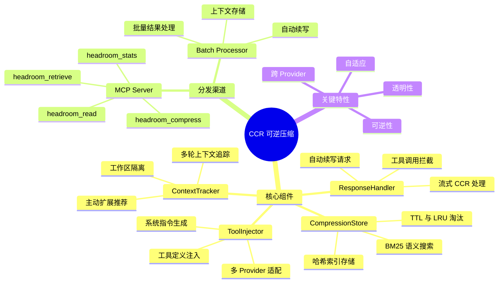
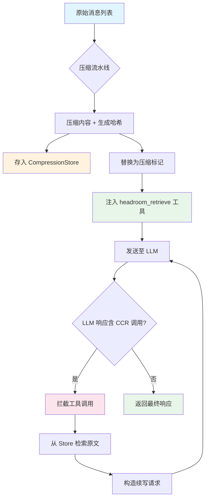
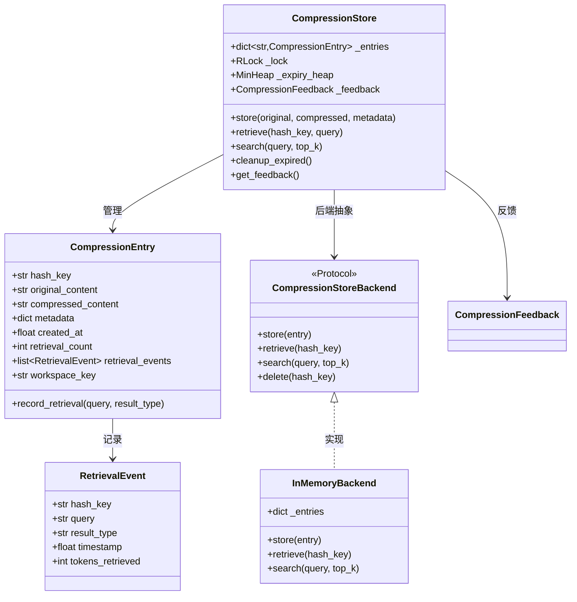
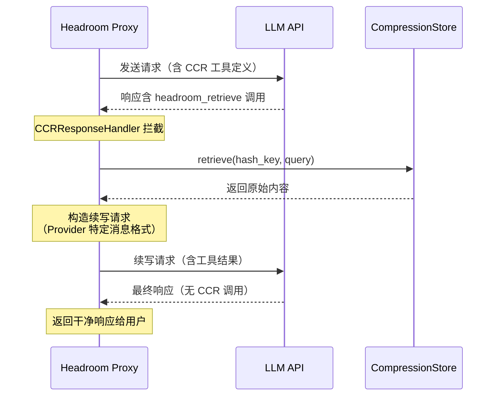
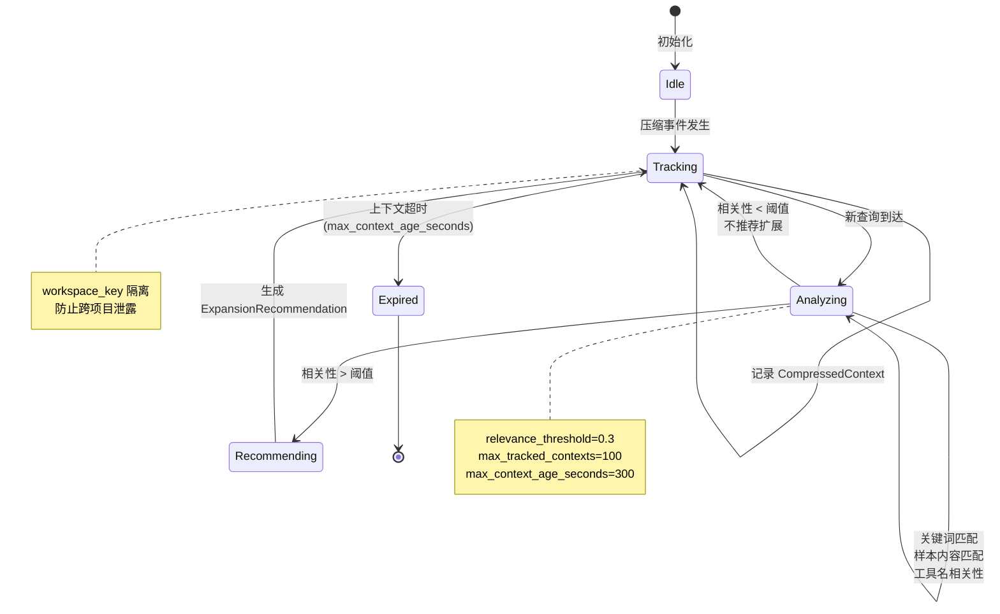
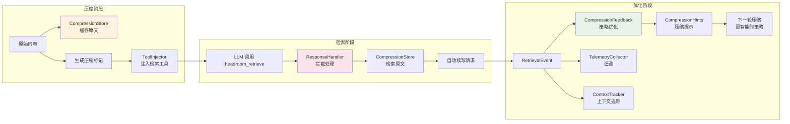

# CCR 可逆压缩

## 总：概述

CCR（Compress-Cache-Retrieve）是 Headroom 项目中最核心的创新架构之一，它解决了 LLM 上下文压缩的一个根本矛盾：**压缩后信息丢失，但 LLM 可能仍需要原始数据**。传统压缩方案是"单向"的——一旦压缩，原始数据就从上下文中消失，LLM 只能看到摘要或占位符。而 CCR 通过"可逆"设计，让 LLM 在需要时可以主动检索被压缩的原始内容，实现了"压缩不丢信息"的理想效果。

CCR 的核心思想极其简洁：**压缩时缓存原文，LLM 需要时按需取回**。具体而言，当 Headroom 的压缩流水线将一段内容（如工具返回的大段结果）替换为简短的压缩标记时，原始数据会被存入 `CompressionStore`，并以哈希值作为索引。同时，系统会向 LLM 的请求中注入一个 `headroom_retrieve` 工具定义，LLM 看到压缩标记后可以调用该工具取回原始数据。整个检索过程由 `CCRResponseHandler` 透明处理——LLM 的工具调用被拦截、执行、结果注入，然后自动发起续写请求，对用户完全无感。





## 分：核心架构详解

### 一、CCR 架构与存储

CCR 架构的核心是 `CompressionStore`——一个线程安全的内存存储引擎，它承载了所有被压缩内容的原始数据，并提供了高效的检索和淘汰机制。

`CompressionStore` 的设计哲学是"存储即服务"：它不仅是一个简单的键值存储，还集成了 BM25 全文搜索、TTL 过期、LRU 淘汰、反馈追踪等能力。每个存储条目（`CompressionEntry`）包含原始内容、压缩内容、元数据、检索计数等信息。



关键源文件：[compression_store.py](file:///workspace/headroom/cache/compression_store.py)

`CompressionStore` 的哈希策略采用 SHA-256 前 24 位（96 bits），兼顾唯一性和紧凑性。同时支持 `explicit_hash` 参数，允许外部指定哈希函数。存储后端通过 `CompressionStoreBackend` 协议抽象，默认使用 `InMemoryBackend`，可通过环境变量 `HEADROOM_CCR_BACKEND` 切换为外部后端。

```python
# compression_store.py 中的核心存储逻辑
class CompressionStore:
    def store(
        self,
        original_content: str,
        compressed_content: str,
        metadata: dict | None = None,
        explicit_hash: str | None = None,
        workspace_key: str | None = None,
    ) -> str:
        hash_key = explicit_hash or hashlib.sha256(
            original_content.encode()
        ).hexdigest()[:24]

        entry = CompressionEntry(
            hash_key=hash_key,
            original_content=original_content,
            compressed_content=compressed_content,
            metadata=metadata or {},
            workspace_key=workspace_key,
        )

        with self._lock:
            self._entries[hash_key] = entry
            heapq.heappush(self._expiry_heap, (entry.expires_at, hash_key))

        return hash_key
```

淘汰机制采用最小堆（Min-Heap）实现 O(log n) 的过期清理，同时通过 LRU 策略在容量超限时优先淘汰最久未访问的条目。`CompressionStore` 还通过 `ContextVar` 实现请求级作用域，支持多租户 SaaS 场景下的存储隔离。

### 二、工具注入

工具注入是 CCR 的"桥梁"组件——它负责在压缩发生时，将 `headroom_retrieve` 工具定义注入到 LLM 请求中，让 LLM 知道它可以调用这个工具来检索被压缩的内容。

[tool_injection.py](file:///workspace/headroom/ccr/tool_injection.py) 中的 `CCRToolInjector` 是核心类，它完成三项工作：

1. **扫描压缩标记**：使用正则表达式检测消息中的压缩标记格式 `[N items compressed to M. Retrieve more: hash=abc123]`
2. **注入工具定义**：根据 Provider 类型（Anthropic/OpenAI/Google）生成对应格式的工具定义
3. **注入系统指令**：向系统消息中追加 CCR 使用说明

```python
# tool_injection.py 中的工具定义生成
CCR_TOOL_NAME = "headroom_retrieve"

def create_ccr_tool_definition(provider: str) -> dict:
    """根据 Provider 创建工具定义"""
    if provider == "anthropic":
        return {
            "name": CCR_TOOL_NAME,
            "description": "Retrieve compressed content by hash key...",
            "input_schema": {
                "type": "object",
                "properties": {
                    "hash_key": {"type": "string", "description": "24-char hex hash"},
                    "query": {"type": "string", "description": "What you're looking for"},
                },
                "required": ["hash_key"],
            },
        }
    elif provider == "openai":
        return {
            "type": "function",
            "function": {
                "name": CCR_TOOL_NAME,
                # ... OpenAI 格式
            },
        }
    # Google 格式...
```

一个重要的设计细节是 **PR-B7 sticky-on 机制**：一旦会话中发生过 CCR 压缩，`session_has_done_ccr` 标志被置为 True，后续所有轮次都会持续注入 `headroom_retrieve` 工具。这避免了"缓存失效"问题——如果工具定义在后续轮次消失，Provider 的前缀缓存会被破坏，导致额外的写入开销。

哈希验证严格限制为 24 位十六进制字符（96 bits），确保工具调用参数的合法性：

```python
# tool_injection.py 中的哈希验证
HASH_PATTERN = re.compile(r"[a-f0-9]{24}")

def parse_tool_call(tool_call, provider: str) -> tuple[str, str | None]:
    """解析 CCR 工具调用，提取 hash_key 和 query"""
    # ... Provider 特定解析逻辑
    if not HASH_PATTERN.fullmatch(hash_key):
        raise ValueError(f"Invalid CCR hash: {hash_key}")
    return hash_key, query
```

### 三、响应处理

`CCRResponseHandler` 是 CCR 架构中"透明性"的关键保障。它拦截 LLM 响应中的 CCR 工具调用，执行检索，然后自动发起续写 API 调用，整个过程对用户完全透明。

[response_handler.py](file:///workspace/headroom/ccr/response_handler.py) 实现了两种处理模式：

1. **非流式模式**：直接检测完整响应中的 CCR 工具调用
2. **流式模式**：通过 `StreamingCCRBuffer` 缓冲流式响应块，检测到 CCR 调用时切换为缓冲模式



流式 CCR 处理是技术难点。`StreamingCCRHandler` 需要在 SSE 流中检测 CCR 工具调用，这要求缓冲足够多的流式块来判断是否包含工具调用。一旦检测到，立即切换为缓冲模式——停止向客户端转发流式数据，收集完整响应后执行 CCR 检索和续写，最后将续写结果以流式方式返回。

```python
# response_handler.py 中的流式 CCR 处理
class StreamingCCRHandler:
    def __init__(self, response_handler, provider, ...):
        self._buffer = StreamingCCRBuffer(provider)
        self._mode = "pass_through"  # or "buffered"

    async def handle_chunk(self, chunk):
        if self._mode == "pass_through":
            self._buffer.add_chunk(chunk)
            if self._buffer.has_ccr_tool_call():
                self._mode = "buffered"
                return None  # 停止转发
            return chunk
        else:
            self._buffer.add_chunk(chunk)
            if self._buffer.is_complete():
                # 执行 CCR 检索 + 续写
                result = await self._handle_buffered_ccr()
                return result
```

`ResponseHandlerConfig` 控制最大检索轮次（默认 3 轮）和是否从响应中剥离 CCR 相关内容。Provider 特定的消息构造确保续写请求格式正确——Anthropic 使用 `tool_result` 内容块，OpenAI 使用 `tool` 角色消息，Google 使用 `functionResponse` 格式。

### 四、上下文追踪与状态管理

`ContextTracker` 解决了 CCR 的"多轮遗忘"问题：当压缩发生在第 N 轮，LLM 在第 N+K 轮可能完全不知道之前压缩了什么。`ContextTracker` 跟踪所有压缩事件，分析新查询与已压缩内容的相关性，主动推荐应该扩展的上下文。

[context_tracker.py](file:///workspace/headroom/ccr/context_tracker.py) 的核心数据结构：

```python
@dataclass
class CompressedContext:
    hash_key: str           # 压缩条目的哈希
    turn_number: int        # 压缩发生的轮次
    tool_name: str          # 产生压缩的工具名
    original_count: int     # 原始条目数
    compressed_count: int   # 压缩后条目数
    query_context: str      # 压缩时的查询上下文
    sample_content: str     # 原始内容的采样
    workspace_key: str      # 工作区隔离键

@dataclass
class ExpansionRecommendation:
    hash_key: str           # 推荐扩展的哈希
    reason: str             # 推荐原因
    relevance_score: float  # 相关性分数 (0-1)
    expand_full: bool       # 是否完整扩展
    search_query: str       # 搜索查询
```



相关性计算采用多维度加权策略：

1. **关键词重叠**：查询关键词与 `sample_content` 的交集比例
2. **查询上下文匹配**：当前查询与压缩时 `query_context` 的语义相似度
3. **工具名相关性**：某些工具（如 `Read`、`Grep`）的返回值更可能被后续查询引用

`ContextTracker` 采用单例模式（`get_context_tracker()`），但在生产环境中通过代理服务器实例管理，确保工作区隔离。`workspace_key` 参数防止跨项目的压缩内容泄露——不同项目的压缩事件互不可见。

### 五、MCP Server 与反馈系统

CCR 的 MCP Server 将压缩能力暴露为标准 MCP 工具，使任何支持 MCP 协议的客户端都能使用 CCR 功能。同时，`CompressionFeedback` 构建了一个自适应反馈闭环，从检索模式中学习并优化压缩策略。

[mcp_server.py](file:///workspace/headroom/ccr/mcp_server.py) 暴露四个工具：

| 工具 | 功能 | 说明 |
|------|------|------|
| `headroom_compress` | 压缩内容 | 存入原文，返回压缩标记 |
| `headroom_retrieve` | 检索原文 | 按哈希取回原始内容 |
| `headroom_stats` | 查看统计 | 压缩/检索次数、节省 Token 数 |
| `headroom_read` | 文件读取缓存 | 通过 CCR 缓存文件内容（特性标志控制） |

MCP Server 的会话级 TTL 为 1 小时（对比默认 5 分钟），因为 MCP 会话通常持续时间更长。跨进程统计共享通过文件锁定的共享统计文件实现。

`CompressionFeedback`（[compression_feedback.py](file:///workspace/headroom/cache/compression_feedback.py)）从检索事件中学习：

```python
class CompressionFeedback:
    """分析检索模式，优化压缩策略"""

    HIGH_RETRIEVAL = 0.5    # 高检索率阈值
    MEDIUM_RETRIEVAL = 0.2  # 中检索率阈值
    MIN_SAMPLES = 5         # 最小样本数

    def analyze_tool_pattern(self, tool_name: str) -> CompressionHints:
        """分析特定工具的检索模式"""
        pattern = self._tool_patterns.get(tool_name)

        if pattern.retrieval_rate > self.HIGH_RETRIEVAL:
            # 高检索率 → 降低压缩激进度
            return CompressionHints(
                aggressiveness="low",
                recommended_strategy="skip_if_high_retrieval",
            )

        if pattern.full_retrieval_ratio > 0.7:
            # 全文检索占主导 → 跳过压缩
            return CompressionHints(
                recommended_strategy="skip_compression",
            )

        if pattern.search_retrieval_ratio > 0.5:
            # 搜索检索占主导 → 保持压缩 + 增加搜索
            return CompressionHints(
                recommended_strategy="compress_with_search",
            )
```

反馈管道将待处理事件分发至三个消费者：`CompressionFeedback`（策略优化）、`TelemetryCollector`（遥测数据）、`TOIN`（Token 优化信息网络）。这种设计确保了 CCR 系统的持续自优化能力。

## 总：总结

CCR 可逆压缩架构通过"压缩时缓存、需要时检索"的核心思想，优雅地解决了 LLM 上下文压缩中的信息丢失问题。其设计体现了几个关键工程原则：

1. **透明性**：LLM 的 CCR 工具调用被完全拦截和处理，用户无需感知检索过程
2. **自适应**：通过 `CompressionFeedback` 从检索模式中学习，动态调整压缩策略
3. **隔离性**：`workspace_key` 确保跨项目内容不泄露，`ContextVar` 支持多租户隔离
4. **可扩展**：`CompressionStoreBackend` 协议允许替换存储后端，MCP Server 支持任意客户端接入



CCR 的"可逆"特性使 Headroom 能够采用更激进的压缩策略——即使过度压缩，LLM 也能通过检索取回所需信息。这种"先压缩、后按需还原"的模式，是 Headroom 在 Token 优化领域区别于传统方案的核心竞争力。
