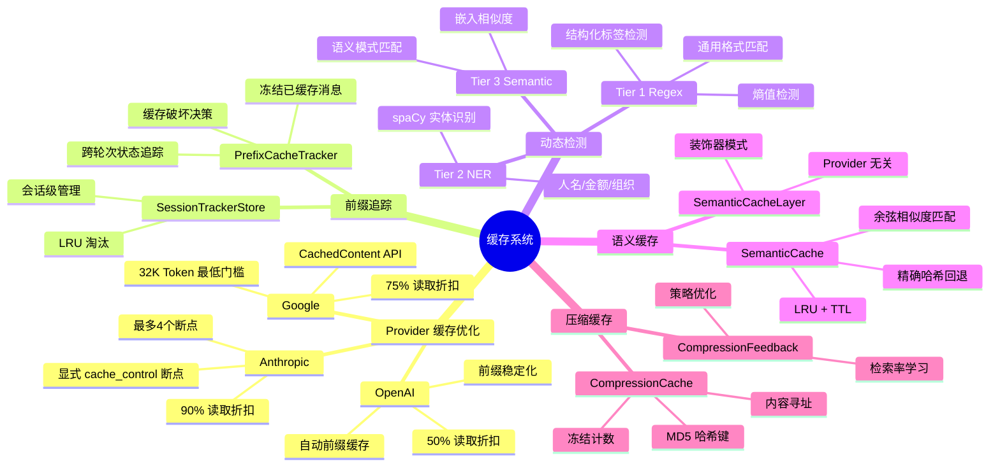
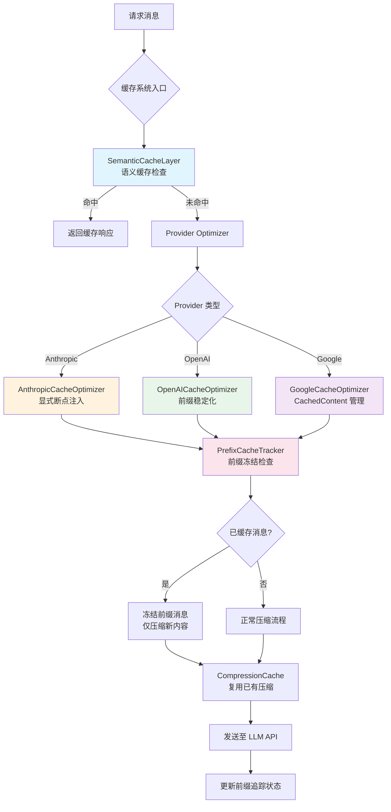
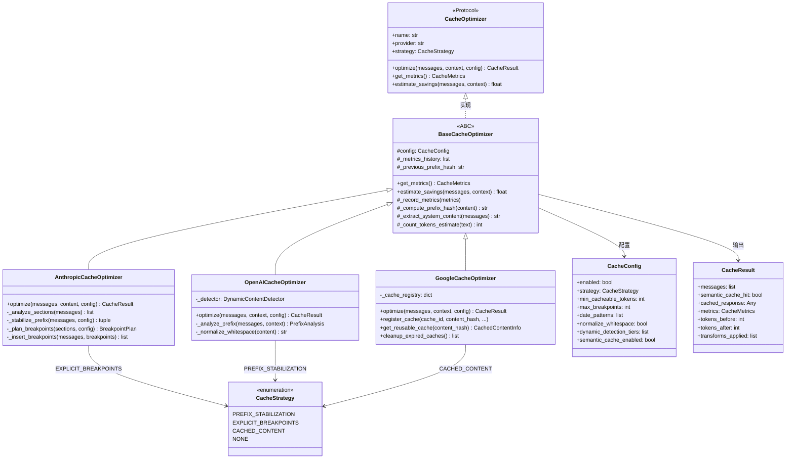
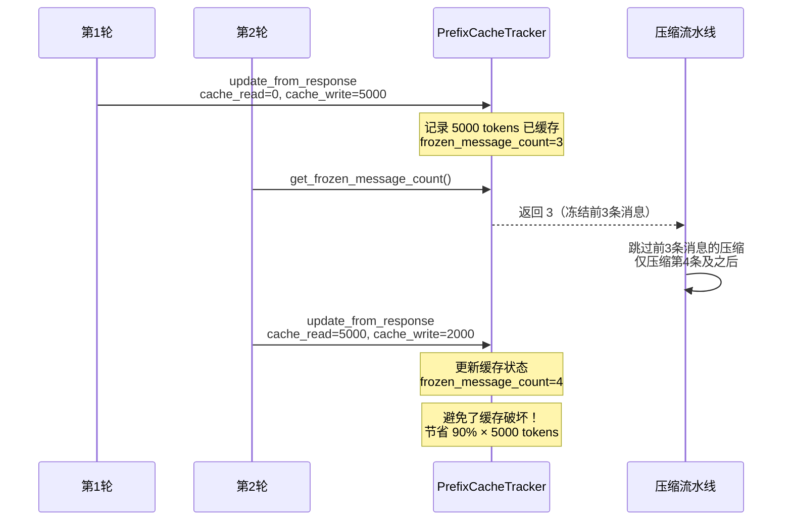

# 缓存系统

## 总：概述

Headroom 的缓存系统是一个多层、多策略的缓存优化框架，旨在最大化 LLM API 的缓存命中率，降低 Token 成本。与简单的键值缓存不同，Headroom 的缓存系统需要应对三大挑战：**不同 Provider 的缓存机制各异**（Anthropic 显式断点、OpenAI 自动前缀、Google CachedContent）、**动态内容破坏缓存前缀**（日期、会话 ID、用户数据等）、**压缩与缓存的冲突**（压缩修改消息会破坏已缓存的 KV-cache）。

缓存系统的架构分为五个层次：

1. **Provider 缓存优化器**：针对 Anthropic/OpenAI/Google 三大 Provider 的缓存机制，提供专门的优化策略
2. **前缀追踪器**：跨轮次追踪 Provider 的前缀缓存状态，避免压缩破坏已缓存内容
3. **动态内容检测器**：三层检测体系（Regex/NER/Semantic）识别并提取动态内容，稳定缓存前缀
4. **语义缓存**：基于嵌入相似度的查询级缓存，对语义相似的查询返回缓存响应
5. **压缩缓存**：内容寻址的 LRU 缓存，跨轮次复用压缩结果





## 分：核心模块详解

### 一、缓存架构与类图

缓存系统的核心抽象定义在 [base.py](file:///workspace/headroom/cache/base.py) 中，采用 Protocol + ABC 双层设计：`CacheOptimizer` 协议定义接口契约，`BaseCacheOptimizer` 抽象基类提供通用实现。



[registry.py](file:///workspace/headroom/cache/registry.py) 实现了插件注册系统 `CacheOptimizerRegistry`，支持按 Provider 名称获取优化器、Tier 级别选择（oss/enterprise）、自定义优化器注册。默认在模块导入时自动注册三个 Provider 优化器。

### 二、前缀追踪与缓存保护

前缀追踪是缓存系统中最精妙的设计——它解决了一个关键矛盾：**Headroom 的压缩会修改消息内容，而修改已缓存的前缀会破坏 Provider 的 KV-cache**。以 Anthropic 为例，缓存读取享受 90% 折扣，但缓存写入额外收取 25% 费用。如果压缩破坏了缓存，不仅失去折扣，还要支付写入溢价。

[prefix_tracker.py](file:///workspace/headroom/cache/prefix_tracker.py) 的 `PrefixCacheTracker` 通过追踪 API 响应中的缓存指标来解决这个问题：



核心决策逻辑在 `should_force_compress()` 方法中：当压缩节省的 Token 比例超过 Provider 的缓存读取折扣时，才允许破坏缓存进行压缩。例如，对于 Anthropic（90% 读取折扣），只有当压缩能节省超过 90% 的 Token 时才值得破坏缓存——这几乎不会发生，因此前缀冻结策略非常有效。

```python
# prefix_tracker.py 中的缓存破坏决策
_PROVIDER_READ_DISCOUNT = {
    "anthropic": 0.9,  # 90% 折扣
    "openai": 0.5,     # 50% 折扣
    "gemini": 0.9,
    "bedrock": 0.9,
}

def should_force_compress(self, message_index, message_tokens, estimated_compressed_tokens):
    """压缩节省是否超过缓存折扣？"""
    if message_index >= self._cached_message_count:
        return True  # 不在冻结前缀中，总是压缩

    savings_fraction = (message_tokens - estimated_compressed_tokens) / message_tokens
    read_discount = _PROVIDER_READ_DISCOUNT.get(self.provider, 0.5)
    return savings_fraction > read_discount
```

`SessionTrackerStore` 管理跨会话的追踪器实例，通过 `x-headroom-session-id` 请求头或 `model + system_prompt` 哈希计算会话 ID，并定期清理过期会话。

### 三、动态内容检测

动态内容检测是缓存前缀稳定化的核心手段。[dynamic_detector.py](file:///workspace/headroom/cache/dynamic_detector.py) 实现了三层检测体系，每层增加延迟但提升检测能力：

**Tier 1: Regex（~0ms）**——始终启用，包含三种策略：
- **结构化检测**：识别 "Label: value" 模式，其中 Label 指示动态内容（如 `date:`, `session:`, `user:`）
- **通用格式匹配**：ISO 8601 日期、UUID、Unix 时间戳、JWT Token 等真正通用的格式
- **熵值检测**：通过 Shannon 熵识别高随机性字符串（Token、哈希、ID）

```python
# dynamic_detector.py 中的熵值计算
def calculate_entropy(s: str) -> float:
    """计算字符串的 Shannon 熵，归一化到 0-1"""
    if not s:
        return 0.0
    freq = {}
    for char in s:
        freq[char] = freq.get(char, 0) + 1
    length = len(s)
    entropy = 0.0
    for count in freq.values():
        p = count / length
        entropy -= p * math.log2(p)
    max_entropy = math.log2(length) if length > 1 else 1.0
    return entropy / max_entropy if max_entropy > 0 else 0.0
```

**Tier 2: NER（~5-10ms）**——可选，使用 spaCy 识别命名实体（人名、金额、组织、地点），需要安装 spaCy 和语言模型。

**Tier 3: Semantic（~20-50ms）**——可选，使用 sentence-transformers 计算嵌入相似度，与已知动态模式（如 "The current date is"、"Your session ID"）进行语义匹配。

`DynamicContentDetector` 统一管理三层检测器，按顺序执行，后续层可以看到前层的检测结果以避免重复：

```python
# dynamic_detector.py 中的统一检测
class DynamicContentDetector:
    def detect(self, content: str) -> DetectionResult:
        all_spans = []
        tiers_used = []

        # Tier 1: Regex
        if self._regex_detector:
            regex_spans = self._regex_detector.detect(content)
            all_spans.extend(regex_spans)
            tiers_used.append("regex")

        # Tier 2: NER（可以看到 Tier 1 结果）
        if self._ner_detector:
            ner_spans, _ = self._ner_detector.detect(content, all_spans)
            all_spans.extend(ner_spans)
            tiers_used.append("ner")

        # Tier 3: Semantic
        if self._semantic_detector:
            sem_spans, _ = self._semantic_detector.detect(content, all_spans)
            all_spans.extend(sem_spans)
            tiers_used.append("semantic")

        # 分离静态和动态内容
        static_content, dynamic_content = self._split_content(content, all_spans)
        return DetectionResult(spans=all_spans, static_content=static_content,
                              dynamic_content=dynamic_content, tiers_used=tiers_used)
```

检测到的动态内容被提取并移动到消息末尾的 `[Current Context]` 区段，确保前缀部分保持稳定，最大化缓存命中率。

### 四、语义缓存

语义缓存是查询级别的缓存——与 Provider 的 Prompt 缓存（缓存 KV-cache）不同，它缓存完整的 LLM 响应，对语义相似的查询直接返回缓存结果。

[semantic.py](file:///workspace/headroom/cache/semantic.py) 实现了两层查找策略：

1. **精确哈希匹配**：先计算消息列表的 SHA-256 哈希，在 `_hash_index` 中查找精确匹配（O(1)）
2. **语义相似度匹配**：如果精确匹配未命中，计算查询的嵌入向量，在所有缓存条目中搜索余弦相似度最高的（O(n)）

```python
# semantic.py 中的双层查找
class SemanticCache:
    def get(self, query: str, messages_hash: str | None = None) -> CacheEntry | None:
        # 精确哈希匹配（快速路径）
        if messages_hash and self.config.use_exact_matching:
            key = self._hash_index.get(messages_hash)
            if key and key in self._cache:
                entry = self._cache[key]
                self._touch(key)  # LRU 更新
                self._hits += 1
                return entry

        # 语义相似度匹配（慢速路径）
        if self._embedding_fn:
            query_embedding = self._embedding_fn(query)
            best_match, best_similarity = self._find_similar(query_embedding)
            if best_similarity >= self.config.similarity_threshold:
                self._touch(best_match)
                self._hits += 1
                return self._cache[best_match]

        self._misses += 1
        return None
```

`SemanticCacheLayer` 采用装饰器模式，包装任意 `BaseCacheOptimizer`，在委托给 Provider 优化器之前先检查语义缓存：

```python
class SemanticCacheLayer:
    def process(self, messages, context, config=None) -> CacheResult:
        # 提取查询和消息哈希
        query = context.query or self._extract_query(messages)
        messages_hash = self._compute_messages_hash(messages)

        # 检查语义缓存
        cached = self.cache.get(query, messages_hash)
        if cached:
            return CacheResult(
                messages=messages,
                semantic_cache_hit=True,
                cached_response=cached.response,
                metrics=CacheMetrics(estimated_cache_hit=True, estimated_savings_percent=100.0),
            )

        # 未命中 → 委托给 Provider 优化器
        return self.provider_optimizer.optimize(messages, context, config)
```

语义缓存的配置包括相似度阈值（默认 0.95）、最大条目数（1000）、TTL（300 秒），以及是否启用精确哈希回退。

### 五、压缩缓存

压缩缓存（[compression_cache.py](file:///workspace/headroom/cache/compression_cache.py)）解决的是"重复压缩"问题：当相同或相似的内容在多轮对话中反复出现时（如工具返回的文件内容），无需每次重新压缩，直接复用之前的压缩结果。

`CompressionCache` 采用内容寻址设计——以内容的 MD5 前 16 位作为缓存键，映射到压缩版本：

```python
# compression_cache.py
class CompressionCache:
    """内容寻址的 LRU 压缩缓存"""

    def __init__(self, max_size: int = 1000, ttl_seconds: int = 300):
        self._cache: OrderedDict[str, CachedCompression] = OrderedDict()
        self._lock = RLock()
        self._max_size = max_size
        self._ttl_seconds = ttl_seconds

    def content_hash(self, content: str) -> str:
        """MD5[:16] 作为缓存键"""
        return hashlib.md5(content.encode()).hexdigest()[:16]

    def apply_cached(self, messages: list[dict]) -> list[dict]:
        """将缓存中的压缩结果应用到消息列表"""
        # 替换 tool_result 中的内容为缓存压缩版本
        ...

    def should_defer_compression(self) -> bool:
        """TTL 感知的延迟决策——避免在 TTL 中途破坏缓存"""
        ...
```

`compute_frozen_count()` 方法计算从消息列表开头连续稳定的消息数量（尾部消息始终排除，因为它是新添加的）。`mark_stable()` / `mark_stable_from_messages()` 标记内容未变化，为下一轮的冻结计数提供依据。

`should_defer_compression()` 实现了 TTL 感知的延迟策略：如果缓存的压缩结果还在 TTL 早期阶段，推迟新的压缩以避免"中途破坏缓存"——这与前缀追踪器的逻辑一脉相承，都是为了避免不必要的缓存失效。

`CompressionFeedback`（[compression_feedback.py](file:///workspace/headroom/cache/compression_feedback.py)）从检索事件中学习，为每个工具维护 `LocalToolPattern`，追踪检索率、全文检索比例、搜索检索比例等指标，生成 `CompressionHints` 指导后续压缩策略。

## 总：总结

Headroom 的缓存系统是一个精心设计的多层防御体系，每一层解决不同维度的缓存问题：

| 层次 | 解决的问题 | 核心机制 |
|------|-----------|---------|
| Provider 优化器 | 不同 Provider 缓存机制差异 | 策略模式 + 插件注册 |
| 前缀追踪 | 压缩破坏已缓存 KV-cache | 冻结已缓存消息 + 成本决策 |
| 动态检测 | 动态内容破坏缓存前缀 | 三层检测 + 内容分离 |
| 语义缓存 | 语义相似查询重复调用 LLM | 嵌入相似度 + 精确哈希 |
| 压缩缓存 | 重复内容重复压缩 | 内容寻址 + TTL 感知 |

```mermaid
flowchart TB
    subgraph 请求处理流程
        A[请求消息] --> B[语义缓存检查]
        B -->|命中| C[返回缓存响应<br/>100% 节省]
        B -->|未命中| D[Provider 优化器]
    end

    subgraph Provider 优化
        D --> E[动态内容检测<br/>稳定前缀]
        E --> F[前缀追踪检查<br/>冻结已缓存消息]
        F --> G[压缩缓存复用<br/>避免重复压缩]
        G --> H[发送优化后请求]
    end

    subgraph 反馈闭环
        H --> I[API 响应]
        I --> J[更新前缀追踪状态]
        I --> K[记录检索事件]
        K --> L[CompressionFeedback<br/>策略优化]
        L --> M[下一轮更智能的<br/>压缩与缓存决策]
    end

    CCR<br/>压缩缓存复用]
        E --> F[前缀冻结检查]
        F --> G[发送至 LLM API]
    end

    subgraph 响应后处理
        G --> H[更新前缀追踪状态]
        H --> I[存储语义缓存]
        I --> J[更新压缩缓存]
        J --> K[反馈学习]
    end

    K -->|CompressionHints| D

    style C fill:#c8e6c9
    style E fill:#fff3e0
    style F fill:#fce4ec
    style K fill:#e8f5e9
```

缓存系统的设计哲学是"**不破坏已有缓存**"——无论是前缀追踪的冻结策略、动态内容的分离移动、还是压缩缓存的 TTL 延迟，都遵循这一原则。在 LLM API 调用中，缓存命中的收益远大于压缩节省的收益（90% vs 可能的 30-50%），因此保护缓存是第一优先级。这种"缓存优先、压缩其次"的策略，是 Headroom 在实际生产环境中实现显著成本降低的关键。
