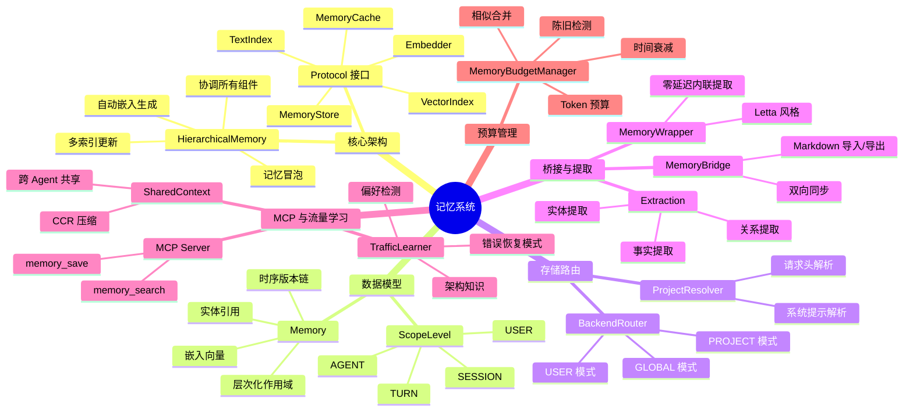
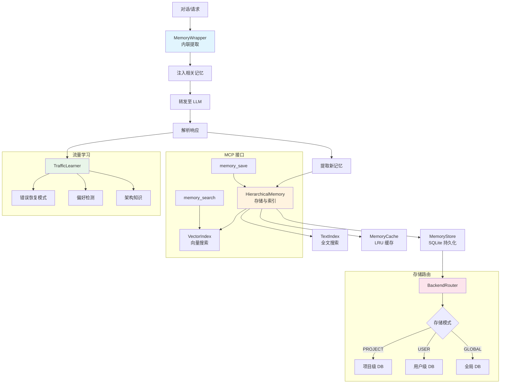
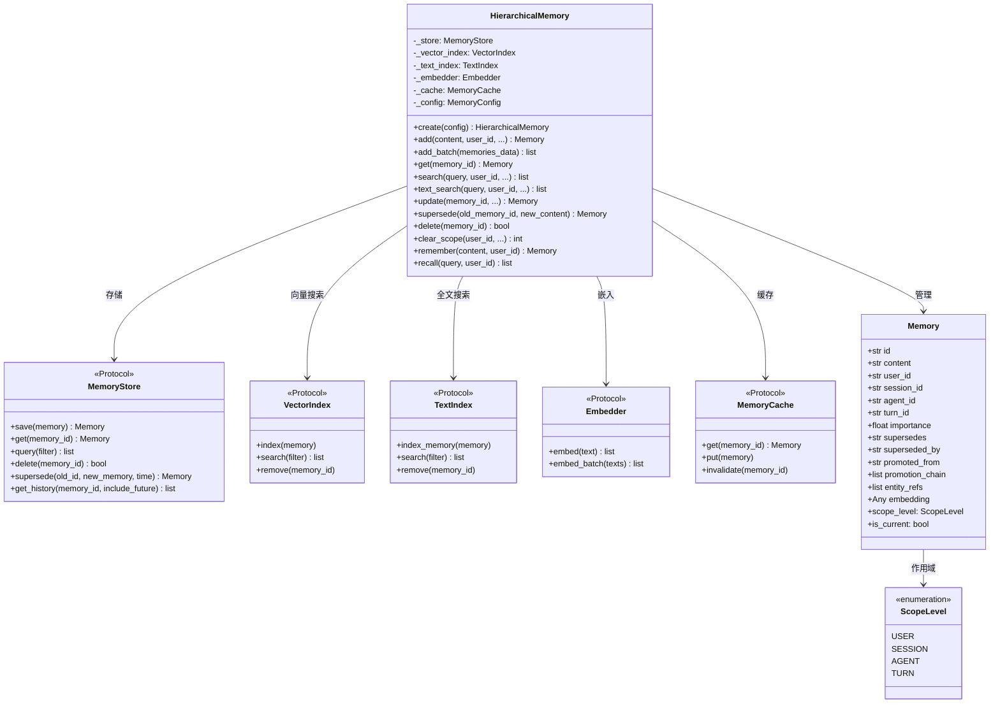
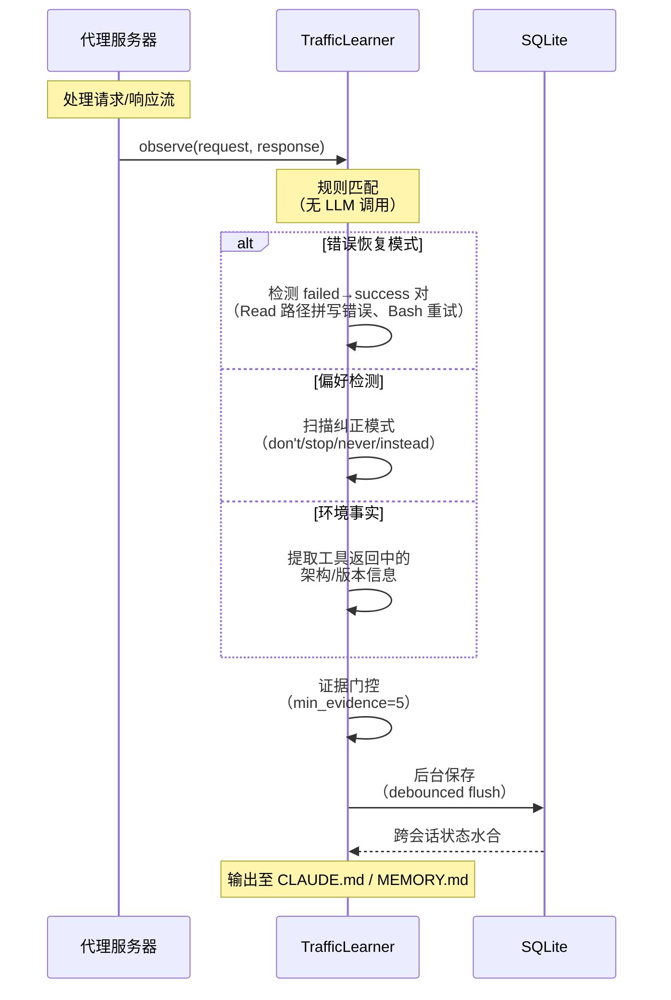
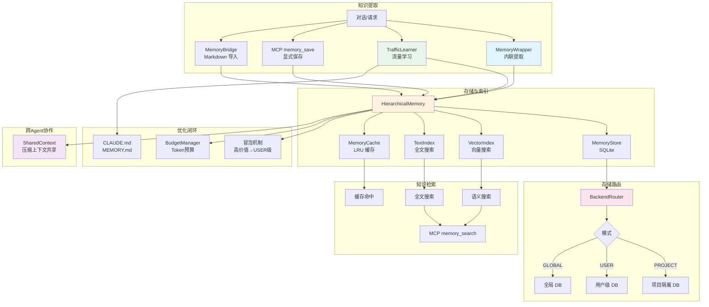

# 记忆系统

## 总：概述

Headroom 的记忆系统是一个层次化、时序感知的长期记忆架构，为 LLM Agent 提供跨会话、跨 Agent 的知识持久化与检索能力。与传统的"对话历史"不同，记忆系统关注的是**结构化知识的提取、存储和检索**——从对话中提取事实、实体和关系，按层次化作用域组织，支持语义搜索和时序查询。

记忆系统的设计灵感来自 Letta（原 MemGPT）和 Mem0，但在架构上做出了关键创新：

1. **Protocol 驱动的端口-适配器架构**：所有核心组件（存储、向量索引、文本索引、嵌入器、缓存）都通过 Protocol 接口定义，实现完全的依赖注入和可替换性
2. **层次化作用域**：User → Session → Agent → Turn 四级作用域，支持精细的可见性控制
3. **时序版本链**：通过 supersession 链实现记忆的时序演化，保留完整历史
4. **零延迟内联提取**：MemoryWrapper 在 LLM 调用中同步提取记忆，无需额外 LLM 调用
5. **流量学习**：TrafficLearner 从代理流量中自动提取模式（错误恢复、偏好、架构知识），无需 LLM 参与





## 分：核心模块详解

### 一、记忆架构与类图

记忆系统的核心编排器是 `HierarchicalMemory`（[core.py](file:///workspace/headroom/memory/core.py)），它协调存储、向量索引、文本索引、嵌入器和缓存五个组件，提供统一的记忆操作 API。



`Memory` 数据模型（[models.py](file:///workspace/headroom/memory/models.py)）是记忆系统的核心实体，它包含了层次化作用域（user_id → session_id → agent_id → turn_id）、时序信息（valid_from/valid_until）、版本链（supersedes/superseded_by）、冒泡链（promoted_from/promotion_chain）等完整元数据。

`ScopeLevel` 通过 `scope_level` 属性自动计算——如果 `turn_id` 存在则为 TURN，否则依次检查 agent_id、session_id，最终默认为 USER。这种设计使得作用域判断无需额外存储。

### 二、核心实现

`HierarchicalMemory` 的 `add()` 方法是记忆创建的核心入口，它完成以下步骤：

1. 创建 `Memory` 对象
2. 自动生成嵌入向量（`auto_embed=True`）
3. 保存到存储后端
4. 索引到向量搜索和全文搜索
5. 更新缓存
6. 可选的冒泡处理（`auto_bubble`）

```python
# core.py 中的记忆创建
async def add(self, content, user_id, session_id=None, agent_id=None,
              turn_id=None, importance=0.5, auto_embed=True, auto_bubble=None):
    memory = Memory(content=content, user_id=user_id,
                    session_id=session_id, agent_id=agent_id,
                    turn_id=turn_id, importance=importance)

    if auto_embed:
        embedding = await self._embedder.embed(content)
        memory.embedding = embedding

    await self._store.save(memory)

    if memory.embedding is not None:
        await self._vector_index.index(memory)
    await self._index_for_text_search(memory)

    if self._cache is not None:
        await self._cache.put(memory)

    should_bubble = auto_bubble if auto_bubble is not None else self._config.auto_bubble
    if should_bubble:
        await self._maybe_bubble(memory)

    return memory
```

**冒泡机制**（`_maybe_bubble`）是层次化记忆的关键特性：当 Session/Agent/Turn 级别的记忆重要性超过阈值（默认 0.7）时，自动创建一个 USER 级别的副本，使高价值知识能跨会话持久可见。冒泡记忆保留了 `promoted_from` 和 `promotion_chain`，可以追溯其来源。

**时序版本链**通过 `supersede()` 方法实现——当记忆内容需要更新时，不直接修改原记忆，而是创建新版本并建立链接：

```python
# core.py 中的时序替换
async def supersede(self, old_memory_id, new_content, supersede_time=None, auto_embed=True):
    old_memory = await self._store.get(old_memory_id)
    if old_memory is None:
        raise ValueError(f"Memory {old_memory_id} not found")

    new_memory = Memory(content=new_content, user_id=old_memory.user_id,
                        session_id=old_memory.session_id, ...)

    if auto_embed:
        new_memory.embedding = await self._embedder.embed(new_content)

    new_memory = await self._store.supersede(old_memory_id, new_memory, supersede_time)
    # 更新索引和缓存...
    return new_memory
```

### 三、存储路由

存储路由（[storage_router.py](file:///workspace/headroom/memory/storage_router.py)）解决了"记忆跨项目泄露"的关键安全问题（GH #462）。它为每个项目提供物理隔离的 SQLite 数据库，从结构上杜绝跨项目数据混淆。

三种存储模式：

| 模式 | 隔离级别 | 数据库路径 | 适用场景 |
|------|---------|-----------|---------|
| PROJECT | 项目级 | `{root}/projects/{key}/memory.db` | 默认模式，最安全 |
| USER | 用户级 | `{root}/users/{user_id}/memory.db` | 单用户多项目 |
| GLOBAL | 全局 | `{root}/memory.db` | 兼容旧数据 |

`ProjectResolver` 按优先级解析项目身份：

1. **Tier 1**：`x-headroom-project-id` 请求头（显式指定）
2. **Tier 2**：`x-headroom-cwd` 请求头（显式工作目录）
3. **Tier 3**：CLI 级别的项目根覆盖
4. **Tier 4**：解析系统提示中的 `<env>` 块提取工作目录

```python
# storage_router.py 中的项目解析
class ProjectResolver:
    def resolve(self, ctx: RequestContext) -> tuple[str, str] | None:
        # Tier 1: 显式项目 ID
        explicit = self._first_nonempty_header(ctx.headers, "x-headroom-project-id")
        if explicit:
            return self._sanitize_basename(explicit), explicit

        # Tier 2: 显式工作目录
        explicit_cwd = self._first_nonempty_header(ctx.headers, "x-headroom-cwd")
        if explicit_cwd:
            return self._identity_from_cwd(explicit_cwd)

        # Tier 3: CLI 覆盖
        if ctx.project_root_override:
            return self._identity_from_cwd(ctx.project_root_override)

        # Tier 4: 系统提示解析
        sys_cwd = self._extract_cwd_from_system_prompt(ctx.system_prompt)
        if sys_cwd:
            return self._identity_from_cwd(sys_cwd)

        return None  # 未解析 → 应用 fallback 策略
```

当项目无法解析时，`unresolved_project_fallback` 配置决定行为：
- `"empty"`（默认，安全）：拒绝加载任何记忆，避免跨项目泄露
- `"global"`（兼容旧版）：回退到全局数据库，存在跨项目泄露风险

`BackendRouter` 维护一个 LRU 缓存的 `LocalBackend` 实例（默认最多 16 个），避免频繁创建/销毁数据库连接。每个后端实例绑定到特定的数据库文件路径。

### 四、桥接与提取

**MemoryBridge**（[bridge.py](file:///workspace/headroom/memory/bridge.py)）实现了 Markdown 文件与 Headroom 记忆系统的双向桥接，支持 Claude Code 的 MEMORY.md、ChatGPT 的 facts 等格式。

桥接流程包含三个阶段：

1. **导入**（Markdown → Headroom）：解析 Markdown 文件为 `ParsedSection`，通过语义去重检查后存入记忆系统
2. **导出**（Headroom → Markdown）：从记忆系统获取所有记忆，按主题分组后格式化为 Markdown
3. **同步**（双向）：先导入新/变更的 Section，再导出有机记忆（非桥接导入的）回 Markdown

```python
# bridge.py 中的双向同步
async def sync(self, paths=None, user_id=None) -> SyncStats:
    stats = SyncStats()

    # Phase 1: 导入
    stats.import_stats = await self.import_from_markdown(paths=paths, user_id=user_id)

    # Phase 2: 导出新有机记忆
    last_sync_str = self._sync_state.get("last_sync")
    since = datetime.fromisoformat(last_sync_str) if last_sync_str else None
    new_memories = await self._get_new_organic_memories(user_id, since)

    if new_memories and paths:
        primary_path = Path(paths[0]).expanduser()
        count = await self._append_to_markdown(primary_path, new_memories)
        stats.memories_exported = count

    self._save_sync_state()
    return stats
```

同步状态通过 JSON 文件持久化，记录每个文件的哈希值和 Section 到 Memory ID 的映射，实现增量同步和避免重复导入。

**Extraction**（[extraction.py](file:///workspace/headroom/memory/extraction.py)）提供了从对话中提取事实、实体和关系的提示词和工具定义。其核心创新是**单次提取**——通过在主 LLM 的工具调用中嵌入提取字段（`facts`、`extracted_entities`、`extracted_relationships`），避免了 Mem0 传统流程中的 3-4 次额外 LLM 调用：

```
传统 Mem0 流程（低效）：
  User → Main LLM → memory_save(content) → Mem0.add() → Mem0 LLM 提取事实
                                                      → Mem0 LLM 提取实体
                                                      → Mem0 LLM 提取关系
  总计：3-4 次 LLM 调用！

优化后的 Headroom 流程（高效）：
  User → Main LLM（含提取提示词）→ memory_save(facts, entities, relationships)
                                   → 直接写入存储
  总计：1 次 LLM 调用！
```

**MemoryWrapper**（[wrapper.py](file:///workspace/headroom/memory/wrapper.py)）实现了 Letta 风格的零延迟内联记忆提取，包装任意 LLM 客户端：

```python
# wrapper.py 中的核心流程
class MemoryWrapper:
    async def chat(self, messages, **kwargs):
        # 1. 注入相关记忆
        memories = await self._api.search(query=..., user_id=...)
        messages = self._inject_memories(messages, memories)

        # 2. 添加记忆指令
        messages = self._add_instruction(messages)

        # 3. 转发至 LLM
        response = await self._client.chat(messages, **kwargs)

        # 4. 解析响应，提取新记忆
        new_memories = self._parse_response(response)
        await self._api.add_batch(new_memories)

        # 5. 返回干净响应
        return self._clean_response(response)
```

### 五、MCP Server 与流量学习

**MCP Server**（[mcp_server.py](file:///workspace/headroom/memory/mcp_server.py)）将记忆能力暴露为标准 MCP 工具：

- `memory_search`：语义搜索记忆，过滤已取代的记忆
- `memory_save`：持久化事实，自动在相似度 ≥ 0.70 时触发 supersession

MCP Server 的 `_warm_up_backend()` 方法在启动时预加载嵌入器并重新索引缺失嵌入的记忆，使用 ONNX 后端实现快速启动。

**TrafficLearner**（[traffic_learner.py](file:///workspace/headroom/memory/traffic_learner.py)）是记忆系统中最独特的组件——它从代理流量中自动提取模式，无需任何 LLM 调用，实现零延迟学习。



`TrafficLearner` 的模式提取基于纯规则匹配，分为四类：

| 类别 | 检测方式 | 示例 |
|------|---------|------|
| ERROR_RECOVERY | 匹配 failed→success 工具调用对 | Read 路径拼写错误后修正 |
| ENVIRONMENT | 工具返回中的架构/版本信息 | 操作系统版本、Python 版本 |
| PREFERENCE | Token 扫描纠正模式 | "don't use X, use Y instead" |
| ARCHITECTURE | 项目结构推断 | 目录布局、依赖关系 |

关键设计决策：

1. **证据门控**（`min_evidence=5`）：模式必须被多次观察才能被采纳，避免一次性噪声
2. **矛盾丢弃**：如果新模式与已有模式矛盾，丢弃证据较少的一方
3. **系统提示剥离**：过滤 Agent 框架注入的系统提醒，避免噪声
4. **后台保存**：使用 debounce 机制定期刷新到 CLAUDE.md/MEMORY.md，不影响请求延迟
5. **跨会话状态**：通过 SQLite 持久化，重启后自动水合

**SharedContext**（[shared_context.py](file:///workspace/headroom/shared_context.py)）实现了跨 Agent 的压缩上下文共享，复用 CCR 架构：

```python
# shared_context.py
class SharedContext:
    """Agent 间压缩上下文共享"""

    def put(self, key: str, content: str, agent_id: str) -> ContextEntry:
        # 使用 headroom.compress 压缩
        compressed = self._compress(content)
        entry = ContextEntry(
            key=key, original_content=content,
            compressed_content=compressed.compressed,
            original_tokens=compressed.original_tokens,
            compressed_tokens=compressed.compressed_tokens,
        )
        self._entries[key] = entry
        return entry

    def get(self, key: str) -> str | None:
        # 其他 Agent 获取压缩版本
        entry = self._entries.get(key)
        return entry.compressed_content if entry else None
```

`SharedContext` 使用 TTL 过期（默认 1 小时）、最大条目限制（100）、LRU 淘汰，确保内存使用可控。Agent 通过 `put()` 放入内容，其他 Agent 通过 `get()` 获取压缩版本——这种"发布-订阅"式的上下文共享，使多 Agent 协作时无需传递完整上下文。

**MemoryTracker**（[tracker.py](file:///workspace/headroom/memory/tracker.py)）是单例的内存使用追踪器，注册各组件的统计函数，生成包含进程级内存（RSS/VMS）和组件级内存（条目数/大小/命中率/淘汰数）的完整报告。`estimate_object_size()` 方法递归估算 Python 对象的内存占用，为预算执行提供数据基础。

**MemoryBudgetManager**（[budget.py](file:///workspace/headroom/memory/budget.py)）管理记忆文件的 Token 预算，按 Agent 类型设定不同的预算上限（Claude 2000、Cursor 3000 等），通过时间衰减、陈旧检测、相似合并三步优化记忆集合：

1. **时间衰减**：重要性按 `importance × e^(-rate × age)` 衰减，访问次数提供反向提升
2. **陈旧检测**：检查记忆引用的文件路径是否仍存在（通过 `git ls-files` 或文件系统检查）
3. **相似合并**：使用 Jaccard 词集相似度（阈值 0.85）合并高度相似的记忆

## 总：总结

Headroom 的记忆系统是一个完整的"感知-记忆-行动"闭环：从对话中提取知识（Extraction/MemoryWrapper/TrafficLearner），按层次化作用域组织存储（HierarchicalMemory/BackendRouter），通过多种方式检索（语义搜索/全文搜索/MCP 工具），并持续优化（冒泡/预算管理/反馈学习）。



记忆系统的核心设计原则：

1. **Protocol 驱动**：所有组件通过 Protocol 接口解耦，支持任意后端替换（SQLite/PostgreSQL/Qdrant/Neo4j）
2. **物理隔离**：项目级存储路由从结构上杜绝跨项目数据泄露
3. **零延迟提取**：内联提取和规则学习避免额外 LLM 调用
4. **时序完整性**：supersession 链保留知识演化历史，支持时间点查询
5. **自适应优化**：冒泡、预算管理、流量学习形成持续优化闭环

这些设计使 Headroom 的记忆系统不仅是一个简单的向量数据库，而是一个具备"感知-记忆-推理"能力的知识管理基础设施，为 LLM Agent 提供了真正的长期记忆能力。
