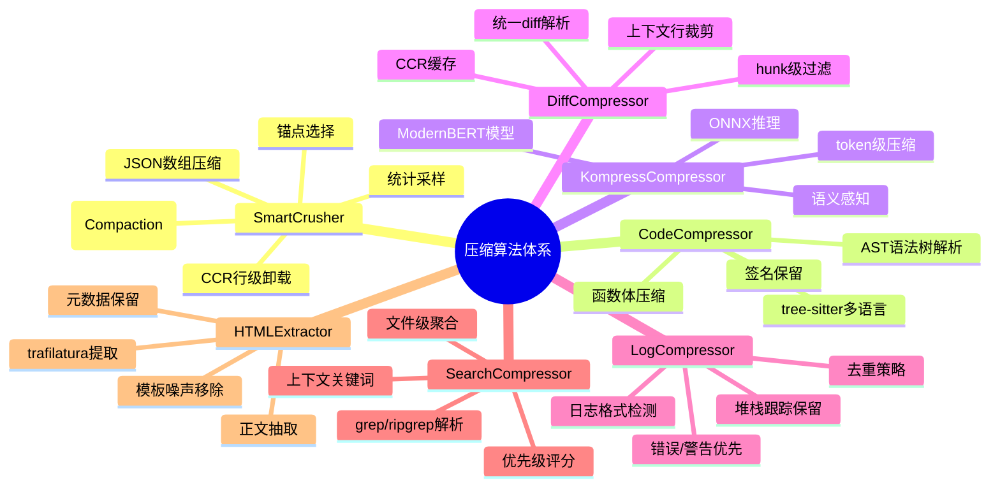
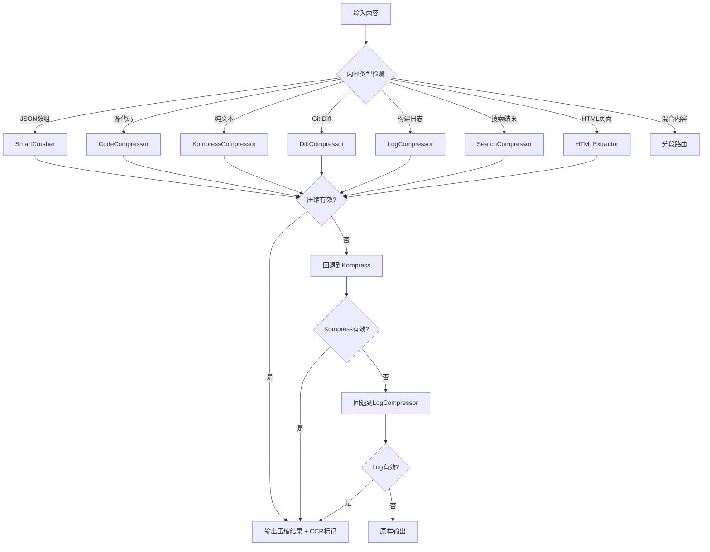
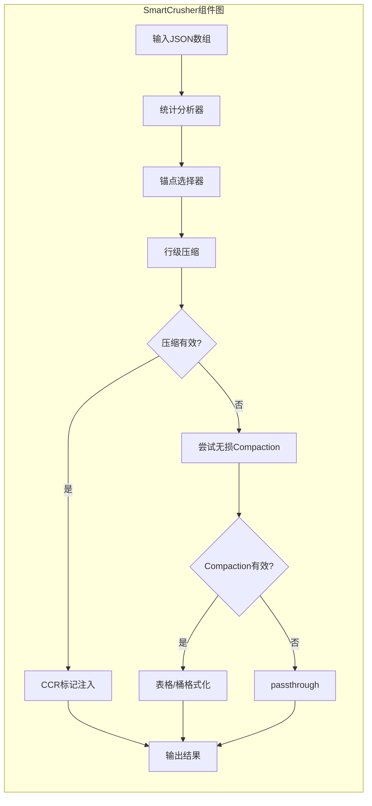
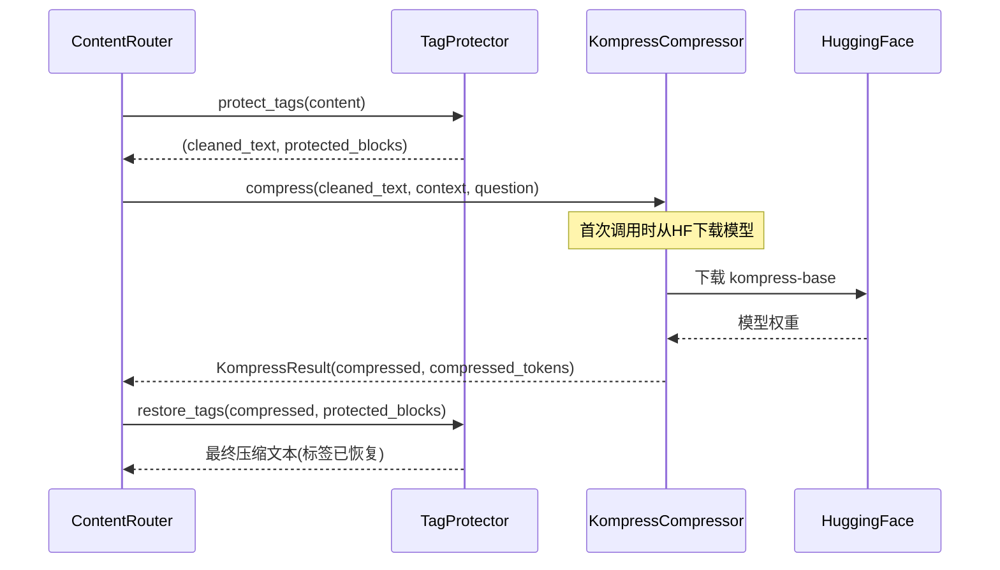
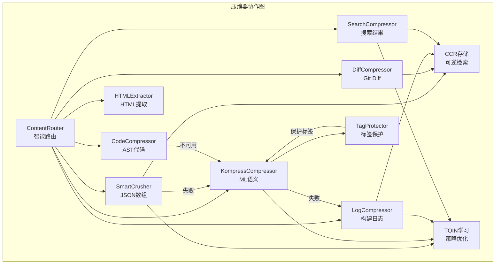

# 第07篇：压缩算法详解

## 总——概述

Headroom 的压缩子系统是整个项目的核心引擎，负责将 LLM 上下文中冗余的工具输出、日志、搜索结果、代码等内容进行智能压缩，以释放宝贵的 token 空间。该子系统并非单一算法，而是一组针对不同内容类型精心设计的压缩器组合，通过 `ContentRouter` 进行智能路由，实现"对症下药"式的压缩策略选择。

压缩子系统的设计哲学可以概括为三点：

1. **内容感知**：不同类型的内容使用不同的压缩策略，JSON 数组用 SmartCrusher，代码用 AST 解析，日志用结构化过滤
2. **可逆压缩**：通过 CCR（Compress-Cache-Retrieve）机制，被丢弃的内容可以在 LLM 需要时按需恢复
3. **渐进降级**：当首选压缩器无法产生有效压缩时，自动回退到下一个可用的压缩器





---

## 分——各压缩器详解

### 一、SmartCrusher：JSON 数组压缩器

[smart_crusher.py](file:///workspace/headroom/transforms/smart_crusher.py) 是 Headroom 中使用频率最高的压缩器，专门处理 JSON 数组格式的工具输出。该模块已在 Stage 3c.1b 完全迁移至 Rust 实现（通过 PyO3 桥接），Python 端仅保留数据类定义和调用接口。

**核心压缩流程**：

1. **输入验证**：检查是否为 JSON 数组，元素数量是否达到 `min_items_to_analyze`（默认5）
2. **统计分析**：计算字段的方差、唯一性、相似度等统计指标
3. **锚点选择**：基于 `AnchorSelector` 动态分配首部/尾部/中间锚点位置
4. **行级压缩**：保留锚点行，丢弃冗余行，生成 CCR 卸载标记
5. **无损路径**（PR4新增）：尝试通过 `DocumentCompactor` 进行表格/桶/CCR 格式化

关键代码片段——CCR 哨兵标记机制：

```python
# smart_crusher.py 中的 CCR 哨兵
CCR_SENTINEL_KEY = "_ccr_dropped"

def is_ccr_sentinel(item: Any) -> bool:
    """True if `item` is a CCR-dropped sentinel object."""
    return isinstance(item, dict) and CCR_SENTINEL_KEY in item
```

当 SmartCrusher 丢弃行时，会在保留的数组中插入 `{"_ccr_dropped": "<<ccr:HASH N_rows_offloaded>>"}` 哨兵对象，LLM 看到此标记后可通过 CCR 检索工具获取原始数据。



**配置参数**（[SmartCrusherConfig](file:///workspace/headroom/transforms/smart_crusher.py)）：

| 参数 | 默认值 | 说明 |
|------|--------|------|
| `min_items_to_analyze` | 5 | 最小分析元素数 |
| `min_tokens_to_crush` | 200 | 最小 token 数才触发压缩 |
| `variance_threshold` | 2.0 | 方差阈值，低于此值认为字段值相似 |
| `max_items_after_crush` | 15 | 压缩后最大保留项数 |
| `first_fraction` | 0.3 | 首部锚点比例 |
| `last_fraction` | 0.15 | 尾部锚点比例 |
| `enable_ccr_marker` | True | 是否注入 CCR 检索标记 |

### 二、CodeCompressor：AST 感知代码压缩器

[code_compressor.py](file:///workspace/headroom/transforms/code_compressor.py) 基于 tree-sitter AST 解析实现语法安全的代码压缩。与 token 级压缩不同，它保证输出始终是语法有效的代码。

**压缩策略**：

1. **AST 解析**：使用 tree-sitter 将代码解析为语法树
2. **结构提取**：保留 imports、类/函数签名、类型注解、错误处理
3. **重要性排序**：通过语义分析对函数进行重要性排序
4. **函数体压缩**：保留签名，压缩函数体
5. **语法重组**：重新组装为有效代码

支持的语言分为两个层级：
- **Tier 1**（完整支持）：Python、JavaScript、TypeScript
- **Tier 2**（基础支持）：Go、Rust、Java、C、C++

```python
# code_compressor.py 中的 tree-sitter 可用性检查
def _check_tree_sitter_available() -> bool:
    global _tree_sitter_available
    if _tree_sitter_available is None:
        try:
            import tree_sitter_language_pack
            _tree_sitter_available = True
        except ImportError:
            _tree_sitter_available = False
    return _tree_sitter_available
```

该压缩器默认在 `ContentRouter` 中被禁用（`enable_code_aware: bool = False`），因为项目推荐使用代码图 MCP 工具代替。当启用时，代码内容会路由至此压缩器；若不可用则回退到 Kompress。

### 三、KompressCompressor：ML 语义压缩器

[kompress_compressor.py](file:///workspace/headroom/transforms/kompress_compressor.py) 是基于 ModernBERT 模型的 token 级语义压缩器，能理解文本语义并智能删除冗余 token。它是纯文本内容的默认压缩路径，也是其他压缩器失败时的回退选择。

**技术架构**：

- **模型**：ModernBERT（从 HuggingFace `chopratejas/kompress-base` 自动下载）
- **推理后端**：支持 ONNX、PyTorch、CoreML 多后端自动选择
- **并发控制**：通过信号量限制并发推理数（`HEADROOM_KOMPRESS_MAX_CONCURRENT`）
- **模型缓存**：模块级缓存，同一模型 ID 只加载一次

```python
# kompress_compressor.py 后端选择
KompressBackend = Literal["auto", "onnx", "onnx_cpu", "onnx_coreml", "pytorch", "pytorch_mps"]

# 模型缓存：model_id -> (model, tokenizer, backend)
_kompress_cache: dict[str, tuple[Any, Any, str]] = {}
_kompress_lock = threading.Lock()
```

**Tag 保护机制**：Kompress 在压缩前会调用 `tag_protector.protect_tags()` 保护自定义 XML 标签（如 `<system-reminder>`、`<thinking>`），压缩后再通过 `restore_tags()` 恢复，避免 ML 模型误删结构化标签。



### 四、DiffCompressor：Git Diff 压缩器

[diff_compressor.py](file:///workspace/headroom/transforms/diff_compressor.py) 已在 Stage 3b 完全迁移至 Rust 实现。它专门处理 unified diff 格式的输出，通过 hunk 级别的智能过滤实现压缩。

**压缩策略**：

1. **Diff 解析**：将输入解析为文件→hunk 的层级结构
2. **Hunk 过滤**：基于 `max_hunks_per_file`（默认10）限制每个文件保留的 hunk 数
3. **上下文裁剪**：将每个 hunk 的上下文行从默认3行裁剪至 `max_context_lines`（默认2行）
4. **文件级限制**：超过 `max_files`（默认20）的文件直接丢弃
5. **CCR 缓存**：被丢弃的内容存入 CCR，可按需检索

```python
# diff_compressor.py 配置
@dataclass
class DiffCompressorConfig:
    max_context_lines: int = 2       # 上下文行数
    max_hunks_per_file: int = 10     # 每文件最大hunk数
    max_files: int = 20              # 最大文件数
    always_keep_additions: bool = True   # 始终保留新增行
    always_keep_deletions: bool = True   # 始终保留删除行
    enable_ccr: bool = True          # 启用CCR缓存
    min_lines_for_ccr: int = 50      # CCR最小行数阈值
```

### 五、LogCompressor：日志压缩器

[log_compressor.py](file:///workspace/headroom/transforms/log_compressor.py) 已在 Phase 3e.5 迁移至 Rust 实现。它针对构建/测试日志输出进行结构化压缩，保留关键错误信息，过滤冗余日志。

**核心特性**：

- **格式检测**：自动识别 pytest、npm、cargo、make、jest、generic 等日志格式
- **优先级策略**：ERROR > WARN > INFO > DEBUG，始终保留首个和末个错误
- **堆栈跟踪保留**：跨语言识别 Python/JS/Java 堆栈跟踪，保持完整性
- **警告去重**：保守去重策略——仅归一化尾部变量区域，保留消息标识符
- **摘要行保留**：如 `PASSED`、`FAILED`、`SKIPPED` 等测试摘要行

Rust 移植修复的关键 Bug：
1. **堆栈跟踪状态机**：Python 版在空行处终止，丢失链式异常的后续跟踪；Rust 版按语言分派，Python traceback 内的空行不会中断跟踪
2. **保守去重**：Python 版全局归一化数字/路径/十六进制，导致不同错误类别被错误合并；Rust 版仅在 `:`/`=` 后的尾部区域归一化

### 六、SearchCompressor：搜索结果压缩器

[search_compressor.py](file:///workspace/headroom/transforms/search_compressor.py) 已在 Phase 3e.2 迁移至 Rust 实现。它处理 grep/ripgrep 格式的搜索结果（`file:line:content`）。

**压缩流程**：

1. **行解析**：将搜索结果按文件分组
2. **优先级评分**：基于 `signals::LineImportanceDetector` trait 对每行评分
3. **匹配选择**：每文件保留 `max_matches_per_file`（默认5）条，全局保留 `max_total_matches`（默认30）条
4. **首尾保留**：始终保留每个文件的首个和末个匹配
5. **CCR 缓存**：被丢弃的匹配行存入 CCR

Rust 移植修复的关键 Bug：
1. **Windows 路径**：Python 版正则将驱动器号冒号（`C:\Users\…`）误认为行号分隔符
2. **文件名中的连字符**：Python 版排除路径中的 `-`，导致 `pre-commit-config.yaml` 等文件名解析错误

### 七、HTMLExtractor：HTML 内容提取器

[html_extractor.py](file:///workspace/headroom/transforms/html_extractor.py) 与其他压缩器不同，它不是 token 级压缩，而是**内容提取**——从 HTML 页面中提取正文，移除脚本、样式、导航、广告等结构性噪声。

**技术实现**：

- 基于 [trafilatura](https://trafilatura.readthedocs.io/) 库
- 典型缩减率：70-90%，零内容损失
- 输出格式：Markdown 或纯文本
- 元数据提取：标题、作者、日期

```python
# html_extractor.py 配置
@dataclass
class HTMLExtractorConfig:
    output_format: str = "markdown"   # 输出格式
    include_links: bool = True        # 保留链接
    include_images: bool = False      # 保留图片
    include_tables: bool = True       # 保留表格
    favor_precision: bool = False     # 精确模式（内容少但质量高）
    favor_recall: bool = True         # 召回模式（内容多但可能有噪声）
```

### 八、辅助模块

#### AnchorSelector（锚点选择器）

[anchor_selector.py](file:///workspace/headroom/transforms/anchor_selector.py) 为 SmartCrusher 提供动态锚点位置分配。它根据数据模式（搜索结果、日志、时间序列、通用）、查询关键词、信息密度和去重需求，智能决定保留哪些位置的数据项。

#### CompressionUnits（压缩单元）

[compression_units.py](file:///workspace/headroom/transforms/compression_units.py) 定义了 `CompressionUnit` 数据类，作为 Provider 适配器与 ContentRouter 之间的标准化接口。每个压缩单元包含文本内容、Provider 信息、端点、角色、缓存区域等元数据，并记录压缩决策的原因分类。

#### CompressionSummary（压缩摘要）

[compression_summary.py](file:///workspace/headroom/transforms/compression_summary.py) 生成被丢弃内容的分类摘要，帮助 LLM 判断是否需要通过 CCR 检索原始数据。例如：`"[480 items omitted: 150 log entries (3 with errors), 200 test results (12 failures)]"`。

---

## 总——协作与总结

Headroom 的压缩算法体系是一个精心设计的多策略协作系统。各压缩器不是孤立运行的，而是通过 `ContentRouter` 的路由机制和回退链紧密协作：

1. **智能路由**：`ContentRouter` 根据内容类型自动选择最优压缩器
2. **回退链**：SmartCrusher → Kompress → LogCompressor 的三级回退确保总能尝试压缩
3. **CCR 统一**：所有有损压缩器共享 CCR 机制，保证可逆性
4. **Tag 保护**：Kompress 压缩前统一保护自定义 XML 标签
5. **TOIN 学习**：压缩结果反馈至 TOIN 系统，持续优化压缩策略



**总结**：Headroom 的压缩算法体系体现了"内容感知、渐进降级、可逆压缩"三大设计原则。每种压缩器都针对特定内容类型进行了深度优化，而 ContentRouter 的智能路由和回退链确保了系统在任意输入下都能做出最佳压缩决策。Rust 移植进一步提升了性能，同时修复了 Python 实现中的多个解析 Bug，使整个压缩子系统在生产环境中更加可靠。
