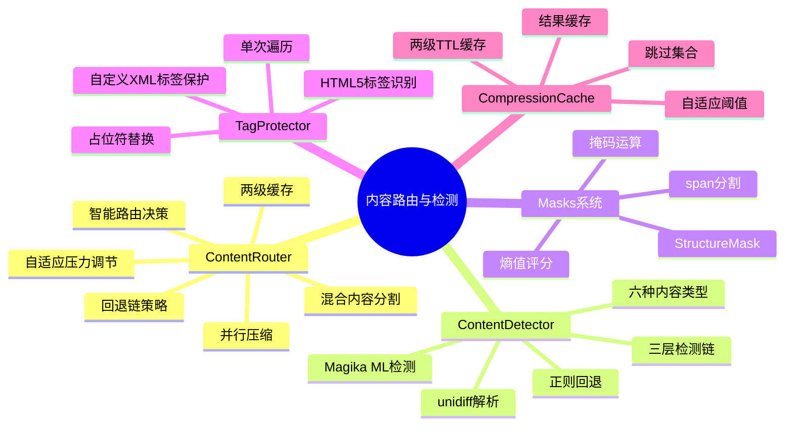
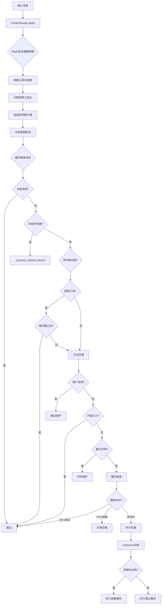
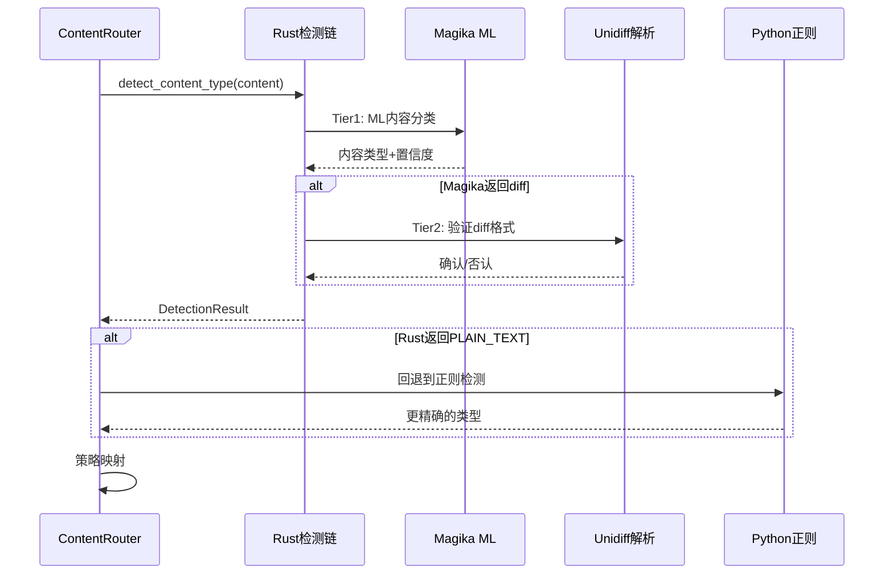
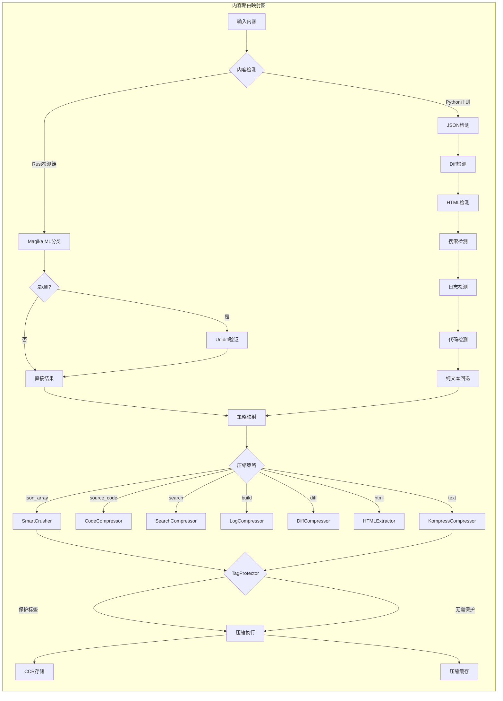

# 第08篇：内容路由与检测

## 总——概述

内容路由与检测是 Headroom 压缩子系统的"大脑"——它决定了每一段内容应该交给哪个压缩器处理，以及是否应该被保护而跳过压缩。这个决策过程涉及三个核心问题：

1. **这是什么内容？**（内容类型检测）
2. **应该用哪个压缩器？**（路由策略）
3. **是否需要保护某些部分？**（标签保护与掩码）

Headroom 的内容路由系统经历了从纯 Python 正则检测到 Rust ML 检测链的演进。当前架构采用三层检测链（Magika → unidiff → PlainText），配合 Python 侧的混合内容分割和策略映射，实现了高精度、低延迟的内容分类。





---

## 分——各模块详解

### 一、ContentRouter：智能内容路由器

[content_router.py](file:///workspace/headroom/transforms/content_router.py) 是 Headroom 压缩子系统的入口点。它实现了 `Transform` 接口，负责分析消息内容、选择最优压缩策略、执行压缩并返回结果。

**核心数据结构**：

```python
class CompressionStrategy(Enum):
    CODE_AWARE = "code_aware"       # AST代码压缩
    SMART_CRUSHER = "smart_crusher" # JSON数组压缩
    SEARCH = "search"               # 搜索结果压缩
    LOG = "log"                     # 日志压缩
    KOMPRESS = "kompress"           # ML语义压缩
    TEXT = "text"                   # 纯文本(→Kompress)
    DIFF = "diff"                   # Git Diff压缩
    HTML = "html"                   # HTML内容提取
    MIXED = "mixed"                 # 混合内容
    PASSTHROUGH = "passthrough"     # 直通不压缩
```

**路由决策流程**：

1. **混合内容检测**：通过 `is_mixed_content()` 检查内容是否包含多种类型（代码围栏、JSON 块、散文、搜索结果）
2. **内容类型检测**：调用 `_detect_content()` 执行 Rust 三层检测链
3. **策略映射**：将 `ContentType` 映射到 `CompressionStrategy`
4. **策略执行**：调用对应压缩器，失败时沿回退链降级

**两级压缩缓存**：

`CompressionCache` 实现了高效的两级 TTL 缓存：

- **Tier 1（跳过集合）**：已知不可压缩内容的哈希集合，查询约 100ns
- **Tier 2（结果缓存）**：已压缩内容的缓存结果，避免重复压缩
- **TTL 过期**：默认 30 分钟，自然限制内存增长

```python
class CompressionCache:
    def get(self, key: int) -> tuple[str, float, str] | None:
        """Tier 2: 获取缓存压缩结果"""
    def is_skipped(self, key: int) -> bool:
        """Tier 1: 检查是否已知不可压缩"""
    def put(self, key: int, compressed: str, ratio: float, strategy: str):
        """存储压缩结果"""
    def mark_skip(self, key: int):
        """标记为不可压缩"""
    def move_to_skip(self, key: int):
        """从结果缓存移至跳过集合(阈值收紧时)"""
```

**自适应压力调节**：

ContentRouter 根据上下文压力动态调整压缩阈值：

```python
# 低压力(<30%): min_ratio = 0.85 (宽松，拒绝边际压缩)
# 高压力(>80%): min_ratio = 0.65 (激进，接受任何有效压缩)
min_ratio = min_ratio_relaxed + (min_ratio_aggressive - min_ratio_relaxed) * context_pressure
```

**三阶段并行压缩**：

`apply()` 方法实现了三阶段处理流程：

1. **Pass 1（顺序）**：分类每条消息——冻结、保护、缓存命中、小内容等立即解决，缓存未命中收集为待处理任务
2. **Pass 2（并行）**：所有缓存未命中的压缩任务在线程池中并发执行
3. **Pass 3（顺序）**：将结果按消息顺序缝合回原位，更新缓存

**内容保护机制**：

ContentRouter 实现了多层内容保护：

| 保护类型 | 条件 | 说明 |
|----------|------|------|
| 用户消息 | `skip_user_messages=True` | 用户消息包含分析目标 |
| 系统/开发者消息 | `skip_system=True` | 缓存热指令字节 |
| 冻结消息 | `frozen_message_count` | 在 Provider 前缀缓存中 |
| 最近代码 | `protect_recent_code=4` | 最近4条消息中的代码 |
| 分析意图 | `protect_analysis_context=True` | 检测到分析/审查意图时保护代码 |
| cache_control 块 | 块含 `cache_control` | 客户端缓存断点 |
| 已压缩内容 | 含 CCR 检索标记 | 避免重复压缩 |

### 二、ContentDetector：内容类型检测

[content_detector.py](file:///workspace/headroom/transforms/content_detector.py) 实现了 Python 侧的基于正则的内容类型检测。它定义了六种内容类型和优先级检测链：

```python
class ContentType(Enum):
    JSON_ARRAY = "json_array"       # JSON数组
    SOURCE_CODE = "source_code"     # 源代码
    SEARCH_RESULTS = "search"       # 搜索结果
    BUILD_OUTPUT = "build"          # 构建日志
    GIT_DIFF = "diff"               # Git Diff
    HTML = "html"                   # HTML页面
    PLAIN_TEXT = "text"             # 纯文本(回退)
```

**检测优先级链**：

1. **JSON 检测**（最高优先级）→ 尝试 `json.loads`，区分数组/对象
2. **Diff 检测** → 扫描前500行，匹配 `diff --git`、`--- a/`、`@@` 等模式
3. **HTML 检测** → 检查 DOCTYPE、`<html>`、`<head>`、`<body>` 等标签
4. **搜索结果检测** → 匹配 `file:line:content` 格式，需≥30%行匹配
5. **日志检测** → 匹配 ERROR/WARN/INFO 等模式，需≥10%行匹配
6. **代码检测** → 按语言模式匹配（Python/JS/TS/Go/Rust/Java），需≥3次匹配
7. **纯文本回退**

**Rust 检测链集成**：

在 [content_router.py](file:///workspace/headroom/transforms/content_router.py) 中，`_detect_content()` 函数优先使用 Rust 检测链：

```python
def _detect_content(content: str) -> DetectionResult:
    """Rust检测链: magika → unidiff → PlainText"""
    from headroom._core import detect_content_type as _rust_detect
    rust_result = _rust_detect(content)
    content_type = ContentType(rust_result.content_type)
    # 当Rust返回PLAIN_TEXT时，回退到Python正则检测
    if content_type is ContentType.PLAIN_TEXT:
        regex_result = _regex_detect_content_type(content)
        if regex_result.content_type is not ContentType.PLAIN_TEXT:
            return regex_result
    return DetectionResult(content_type=content_type, ...)
```



### 三、MagikaDetector：ML 内容检测

[detector.py](file:///workspace/headroom/compression/detector.py) 实现了基于 Google Magika 的 ML 内容检测。Magika 是一个深度学习模型，支持 100+ 内容类型，准确率 99%+，本地运行延迟约 5ms。

**标签映射体系**：

```python
_CODE_LABELS = frozenset({"python", "javascript", "typescript", "go", "rust", ...})
_STRUCTURED_LABELS = frozenset({"json", "jsonl", "yaml", "toml", "xml", "html", ...})
_LOG_LABELS = frozenset({"log", "syslog"})
_MARKDOWN_LABELS = frozenset({"markdown", "rst", "asciidoc", "org"})
```

**检测器选择**：

```python
def get_detector(prefer_magika: bool = True) -> MagikaDetector | FallbackDetector:
    if prefer_magika and MagikaDetector.is_available():
        return MagikaDetector()
    return FallbackDetector()
```

当 Magika 不可用时，`FallbackDetector` 提供基于简单启发式的降级检测（JSON 尝试解析、代码关键词匹配、日志关键词匹配）。

### 四、Masks 系统：结构掩码

[masks.py](file:///workspace/headroom/compression/masks.py) 定义了结构感知压缩的核心抽象——`StructureMask`。它将内容分为"结构性"（必须保留）和"可压缩"（可以压缩）两类 token，实现了结构检测与内容压缩的关注点分离。

**核心数据结构**：

```python
@dataclass
class StructureMask:
    tokens: Sequence[str | int]    # token序列
    mask: list[bool]               # True=保留, False=可压缩
    metadata: dict                 # 处理器特定元数据
```

**掩码运算**：

- **`union(other)`**：并集——任一掩码标记保留则保留（保守策略）
- **`intersection(other)`**：交集——两个掩码都标记保留才保留（激进策略）

**熵值评分**：

`EntropyScore` 通过 Shannon 熵识别高信息密度 token（UUID、哈希等），这些 token 不可重建且语义重要，应标记为保留：

```python
@dataclass
class EntropyScore:
    value: float           # 归一化熵值 0.0-1.0
    should_preserve: bool  # 熵值≥阈值时为True

    @classmethod
    def compute(cls, text: str, threshold: float = 0.85) -> EntropyScore:
        # 计算Shannon熵并归一化
```

**掩码应用**：

`apply_mask_to_text()` 函数将掩码转换为连续 span，对结构性 span 原样保留，对可压缩 span 调用压缩函数：

```python
def apply_mask_to_text(text, mask, compress_fn, tokenizer_decode=None) -> str:
    spans = mask_to_spans(mask)
    for span in spans:
        if span.is_structural:
            result_parts.append(span_text)       # 原样保留
        else:
            result_parts.append(compress_fn(span_text))  # 压缩
```

### 五、UniversalCompressor：通用压缩器

[universal.py](file:///workspace/headroom/compression/universal.py) 实现了"检测→结构提取→掩码压缩→CCR存储"的完整压缩管线：

1. 使用 Magika 检测内容类型
2. 通过 `StructureHandler` 提取结构掩码
3. 可选叠加熵值掩码（union 策略）
4. 对非结构区域应用 Kompress 压缩
5. 将原始内容存入 CCR

### 六、TagProtector：标签保护器

[tag_protector.py](file:///workspace/headroom/transforms/tag_protector.py) 已在 Phase 3e.4 迁移至 Rust 实现。它保护自定义/工作流 XML 标签（如 `<system-reminder>`、`<thinking>`）不被 ML 压缩器误删。

**工作原理**：

1. **扫描**：单次遍历输入文本，识别所有非 HTML5 的 XML 标签
2. **替换**：将标签块替换为 `{{HEADROOM_TAG_N}}` 占位符
3. **压缩**：ML 压缩器处理不含标签的干净文本
4. **恢复**：将占位符替换回原始标签块

```mermaid
flowchart LR
    A[原始文本<br/>含&lt;thinking&gt;标签] --> B[Rust单次遍历]
    B --> C[占位符替换<br/>{{HEADROOM_TAG_0}}]
    C --> D[Kompress压缩]
    D --> E[压缩后文本<br/>占位符仍存在]
    E --> F[restore_tags恢复]
    F --> G[最终文本<br/>标签已恢复]

    style B fill:#f9f,stroke:#333
    style F fill:#f9f,stroke:#333
```

**Rust 移植修复的5个 Bug**：

1. **O(n²) 嵌套标签**：Python 版迭代正则替换至稳定，Rust 版单次线性遍历
2. **首次出现替换 Bug**：`str.replace(orig, ph, 1)` 替换首个文本匹配而非匹配偏移，导致相同标签块合并
3. **50次迭代静默截断**：Python 版硬编码 `max_iterations=50`，深层嵌套输入被静默截断
4. **自闭合标签重复替换**：Python 版对自闭合标签运行第二次循环，存在同样的首次出现替换 Bug
5. **占位符碰撞**：输入含 `{{HEADROOM_TAG_…}}` 字面量时，Python 版静默忽略，Rust 版检测并加盐

**两种保护模式**：

- `compress_tagged_content=False`（默认）：保护整个 `<tag>content</tag>` 块
- `compress_tagged_content=True`：仅保护标签标记，标签间内容可被压缩

---

## 总——总结与映射

Headroom 的内容路由与检测系统形成了一个完整的"检测→路由→保护→压缩"管线。各模块的职责清晰划分：

| 模块 | 职责 | 关键特性 |
|------|------|----------|
| ContentRouter | 路由决策与消息遍历 | 两级缓存、自适应阈值、并行压缩 |
| ContentDetector | Python 正则内容分类 | 六种类型、优先级链 |
| MagikaDetector | ML 内容分类 | 100+ 类型、99%+ 准确率 |
| Masks | 结构掩码抽象 | union/intersection、熵值评分 |
| TagProtector | XML 标签保护 | 单次遍历、占位符替换 |



**总结**：内容路由与检测系统的核心价值在于"精准分类、智能路由、安全保护"。Rust 检测链提供了高精度的第一层分类，Python 正则作为补充处理边缘情况；两级缓存和自适应阈值确保了系统在不同负载下的最优表现；TagProtector 和多层保护机制则保证了压缩过程不会破坏关键内容。这种分层架构使得每个模块都可以独立演进和优化，同时通过清晰的接口契约保持整体一致性。
