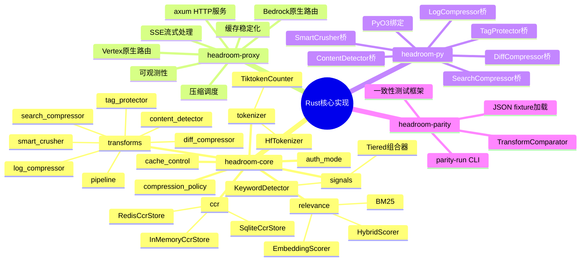
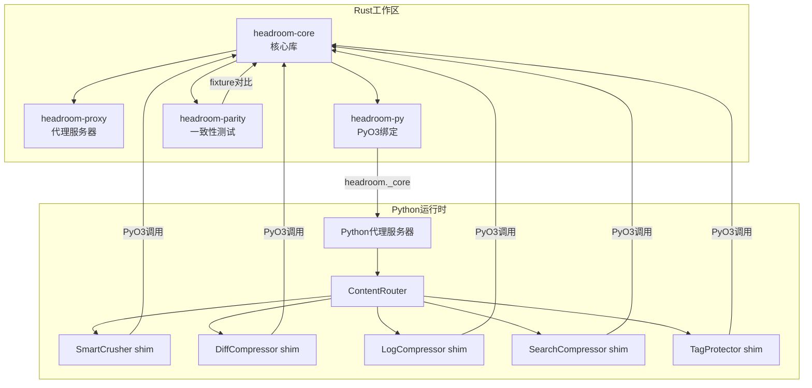
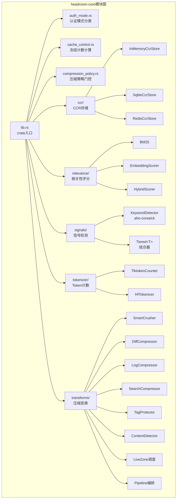
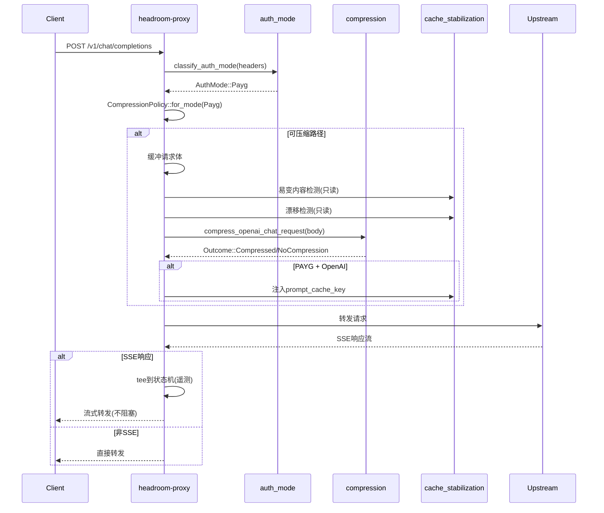

# 第09篇：Rust 核心实现

## 总——概述

Headroom 项目的 Rust 重写是其性能演进的关键里程碑。从最初的纯 Python 实现，到逐步将热路径压缩器移植到 Rust，再到构建独立的 Rust 代理服务器，Headroom 形成了一个 Python-Rust 混合架构：

- **Python 层**：负责代理服务器、API 适配、配置管理等高层逻辑
- **Rust 层**：负责压缩算法、内容检测、token 计数等计算密集型任务
- **PyO3 桥接**：通过 `headroom._core` 模块将 Rust 能力暴露给 Python

Rust 工作区包含四个 crate，各有明确职责：

| Crate | 类型 | 职责 |
|-------|------|------|
| `headroom-core` | 库 | 核心类型、压缩算法、检测链、CCR 存储 |
| `headroom-proxy` | 二进制 | 独立 Rust 代理服务器（axum） |
| `headroom-py` | cdylib | PyO3 绑定，暴露 `headroom._core` |
| `headroom-parity` | 库+CLI | Python-Rust 一致性测试框架 |





---

## 分——各 Crate 详解

### 一、headroom-core：核心库

[headroom-core](file:///workspace/crates/headroom-core) 是整个 Rust 实现的基础 crate，包含所有压缩算法、检测链、CCR 存储和共享类型。

**模块结构**：

```
src/
├── lib.rs                    # crate入口，re-exports
├── auth_mode.rs              # 认证模式分类(PAYG/OAuth/Subscription)
├── cache_control.rs          # 缓存控制，compute_frozen_count
├── compression_policy.rs     # 压缩策略(按认证模式门控)
├── ccr/                      # CCR存储后端
│   ├── mod.rs
│   └── backends/
│       ├── in_memory.rs      # 内存后端(测试用)
│       ├── sqlite.rs         # SQLite后端(生产默认)
│       └── redis.rs          # Redis后端(多worker)
├── relevance/                # 相关性评分
│   ├── base.rs               # Scorer trait
│   ├── bm25.rs               # BM25评分器
│   ├── embedding.rs          # BGE嵌入评分器
│   └── hybrid.rs             # 混合评分器
├── signals/                  # 信号检测系统
│   ├── keyword_detector.rs   # aho-corasick关键词检测
│   ├── line_importance.rs    # LineImportanceDetector trait
│   └── tiered.rs             # Tiered<T>组合器
├── tokenizer/                # Token计数
│   ├── tiktoken_impl.rs      # tiktoken-rs实现
│   ├── hf_impl.rs            # HuggingFace tokenizer
│   └── registry.rs           # 模型→计数器映射
└── transforms/               # 压缩变换
    ├── smart_crusher/        # SmartCrusher(含compaction子模块)
    ├── diff_compressor.rs    # DiffCompressor
    ├── log_compressor.rs     # LogCompressor
    ├── search_compressor.rs  # SearchCompressor
    ├── tag_protector.rs      # TagProtector
    ├── content_detector.rs   # 内容检测(Rust链)
    ├── magika_detector.rs    # Magika ML检测
    ├── unidiff_detector.rs   # unidiff检测
    ├── live_zone.rs          # Live-Zone调度
    ├── pipeline/             # 压缩管线
    │   ├── orchestrator.rs   # 管线编排器
    │   ├── traits.rs         # LosslessTransform/LossyTransform
    │   ├── reformats/        # 无损重格式化
    │   └── offloads/         # 有损卸载
    └── adaptive_sizer.rs     # 自适应大小调整
```

**关键依赖**（[Cargo.toml](file:///workspace/crates/headroom-core/Cargo.toml)）：

| 依赖 | 用途 |
|------|------|
| `tiktoken-rs` | OpenAI BPE token 计数 |
| `tokenizers` | HuggingFace 纯 Rust tokenizer |
| `hf-hub` | HuggingFace Hub 客户端（rustls，无 OpenSSL） |
| `fastembed` | BGE 嵌入模型（ONNX Runtime） |
| `magika` | Google ML 内容分类器 |
| `unidiff` | 统一 diff 解析器 |
| `aho-corasick` | 多关键词高效扫描 |
| `dashmap` | 并发 HashMap（CCR 存储） |
| `rusqlite` | SQLite CCR 后端（bundled，无系统依赖） |
| `blake3` | CCR key 计算（比 SHA-256 更快） |
| `rayon` | 并行管线编排 |



### 二、headroom-proxy：代理服务器

[headroom-proxy](file:///workspace/crates/headroom-proxy) 是一个基于 axum 的透明反向代理，可以独立部署在 Python 代理前面，处理 HTTP/SSE/WebSocket 流量。

**模块结构**：

```
src/
├── main.rs                   # 入口，CLI解析，启动
├── lib.rs                    # 库入口，模块声明
├── proxy.rs                  # 核心路由与转发逻辑
├── config.rs                 # 配置(CLI参数+环境变量)
├── error.rs                  # 错误类型
├── headers.rs                # 请求/响应头处理
├── health.rs                 # /healthz 健康检查
├── websocket.rs              # WebSocket 代理
├── responses_items.rs        # OpenAI Responses 项目处理
├── bedrock/                  # AWS Bedrock 原生路由
│   ├── invoke.rs             # InvokeModel 处理
│   ├── invoke_streaming.rs   # 流式 InvokeModel
│   ├── sigv4.rs              # SigV4 签名
│   ├── envelope.rs           # 请求/响应封装
│   ├── eventstream.rs        # EventStream 解析
│   └── eventstream_to_sse.rs # EventStream→SSE 转换
├── vertex/                   # GCP Vertex AI 路由
│   ├── raw_predict.rs        # :rawPredict 处理
│   ├── stream_raw_predict.rs # 流式 :streamRawPredict
│   ├── adc.rs                # GCP ADC 认证
│   └── envelope.rs           # 请求封装
├── compression/              # 压缩调度
│   ├── anthropic.rs          # Anthropic live-zone
│   ├── live_zone_anthropic.rs
│   ├── live_zone_openai.rs
│   ├── live_zone_responses.rs
│   └── model_limits.rs       # 模型 token 限制
├── handlers/                 # HTTP 处理器
│   ├── chat_completions.rs   # /v1/chat/completions
│   ├── responses.rs          # /v1/responses
│   └── conversations.rs      # /v1/conversations
├── sse/                      # SSE 流处理
│   ├── framing.rs            # SSE 帧解析器
│   ├── anthropic.rs          # Anthropic 状态机
│   ├── openai_chat.rs        # OpenAI Chat 状态机
│   └── openai_responses.rs   # OpenAI Responses 状态机
├── cache_stabilization/      # 缓存稳定化
│   ├── anthropic_cache_control.rs
│   ├── drift_detector.rs     # 缓存漂移检测
│   ├── openai_cache_key.rs   # prompt_cache_key 注入
│   ├── tool_def_normalize.rs # 工具定义归一化
│   └── volatile_detector.rs  # 易变内容检测
└── observability/            # 可观测性
    ├── prometheus.rs         # Prometheus 指标
    ├── proxy_metrics.rs      # 代理级指标
    ├── compression_ratio.rs  # 压缩比指标
    └── cache_hit_rate.rs     # 缓存命中率
```

**核心请求处理流程**：

[proxy.rs](file:///workspace/crates/headroom-proxy/src/proxy.rs) 中的 `forward_http()` 函数是请求处理的核心：

1. **认证模式分类**：`classify_auth_mode()` 从请求头推断 PAYG/OAuth/Subscription
2. **压缩策略解析**：`CompressionPolicy::for_mode()` 根据认证模式确定压缩策略
3. **压缩门控**：检查是否为 POST + JSON + LLM 端点
4. **请求体缓冲**：对可压缩请求缓冲 body（流式请求直接转发）
5. **缓存稳定化**：运行易变内容检测和漂移检测（只读观察）
6. **压缩调度**：按端点分派到 Anthropic/OpenAI Chat/OpenAI Responses 压缩器
7. **缓存 key 注入**：PAYG 模式下自动注入 OpenAI `prompt_cache_key`
8. **响应流式转发**：SSE 响应 tee 到状态机进行遥测



**路由表**：

| 路径 | 方法 | 处理器 |
|------|------|--------|
| `/healthz` | GET | 健康检查 |
| `/healthz/upstream` | GET | 上游可达性检查 |
| `/metrics` | GET | Prometheus 指标 |
| `/v1/chat/completions` | POST | OpenAI Chat 压缩 |
| `/v1/responses` | POST | OpenAI Responses 压缩 |
| `/v1/conversations/*` | * | Conversations API 透传 |
| `/model/:id/invoke` | POST | Bedrock InvokeModel |
| `/model/:id/invoke-with-response-stream` | POST | Bedrock 流式 |
| `/v1beta1/projects/:p/.../:m_action` | POST | Vertex AI |
| `*` | ANY | 透传转发 |

### 三、headroom-py：PyO3 绑定

[headroom-py](file:///workspace/crates/headroom-py) 通过 PyO3 将 Rust 核心能力暴露为 Python 模块 `headroom._core`。它是 Python-Rust 混合架构的关键桥梁。

**暴露的 Python 类和函数**：

| Python 名称 | Rust 来源 | 说明 |
|-------------|-----------|------|
| `SmartCrusher` | `RustSmartCrusher` | JSON 数组压缩 |
| `SmartCrusherConfig` | `RustSmartCrusherConfig` | SmartCrusher 配置 |
| `CrushResult` | `RustCrushResult` | 压缩结果 |
| `DiffCompressor` | `RustDiffCompressor` | Diff 压缩 |
| `DiffCompressorConfig` | `DiffCompressorConfig` | Diff 配置 |
| `DiffCompressionResult` | `DiffCompressionResult` | Diff 结果 |
| `SearchCompressor` | `RustSearchCompressor` | 搜索结果压缩 |
| `LogCompressor` | `RustLogCompressor` | 日志压缩 |
| `DetectionResult` | `RustDetectionResult` | 内容检测结果 |
| `detect_content_type()` | `rust_detect_chain` | 内容类型检测 |
| `is_json_array_of_dicts()` | `rust_is_json_array_of_dicts` | JSON 数组检查 |
| `protect_tags()` | `rust_protect_tags` | 标签保护 |
| `restore_tags()` | `rust_restore_tags` | 标签恢复 |
| `is_html_tag()` | `rust_is_known_html_tag` | HTML 标签检查 |
| `known_html_tag_names()` | `rust_known_html_tag_names` | HTML 标签名列表 |
| `score_line()` | `KeywordDetector::score` | 行重要性评分 |
| `content_has_error_indicators()` | `KeywordDetector::contains_error_indicator` | 错误指示检查 |
| `keyword_registry_snapshot()` | `KeywordRegistry::default_set` | 关键词注册表快照 |
| `compress_openai_responses_live_zone()` | `rust_compress_openai_responses_live_zone` | OpenAI Responses 压缩 |

**GIL 释放模式**：

所有计算密集型操作都通过 `py.allow_threads()` 释放 GIL，允许 Python 侧的 uvicorn worker 和 asyncio 任务在 Rust 计算期间继续运行：

```rust
fn crush(&self, py: Python<'_>, content: &str, query: &str, bias: f64) -> PyCrushResult {
    let content = content.to_string();  // 复制输入，脱离GIL生命周期
    let query = query.to_string();
    let inner = py.allow_threads(|| self.inner.crush(&content, &query, bias));
    PyCrushResult { inner }
}
```

**构建配置**：

[headroom-py/Cargo.toml](file:///workspace/crates/headroom-py/Cargo.toml) 的关键配置：

```toml
[lib]
name = "_core"
crate-type = ["cdylib"]
test = false    # cdylib无法独立运行cargo test
doctest = false
bench = false

[features]
extension-module = ["pyo3/extension-module"]  # maturin构建时启用
```

### 四、headroom-parity：一致性测试框架

[headroom-parity](file:///workspace/crates/headroom-parity) 是 Rust 与 Python 实现之间的一致性验证框架，确保移植后的 Rust 代码产生与 Python 相同的输出。

**核心抽象**：

```rust
pub trait TransformComparator {
    fn name(&self) -> &str;
    fn run(&self, input: &serde_json::Value, config: &serde_json::Value)
        -> Result<serde_json::Value>;
}
```

**已实现的比较器**：

| 比较器 | 状态 | 说明 |
|--------|------|------|
| `DiffCompressorComparator` | ✅ 完整 | 驱动 Rust DiffCompressor 对比 fixture |
| `TokenizerComparator` | ✅ 完整 | tiktoken-rs vs Python tiktoken |
| `SmartCrusherComparator` | ✅ 完整 | 使用 `without_compaction` 匹配旧 fixture |
| `ContentDetectorComparator` | ✅ 完整 | Rust 检测链 vs Python 正则 |
| `LogCompressorComparator` | ⏳ 存根 | Phase 0 存根，返回 Skipped |
| `CacheAlignerComparator` | ⏳ 存根 | Phase 0 存根 |
| `CcrComparator` | ⏳ 存根 | Phase 0 存根 |

**Fixture 格式**：

```json
{
  "transform": "diff_compressor",
  "input": "...",
  "config": {"max_context_lines": 2, ...},
  "output": {"compressed": "...", "original_line_count": 100, ...},
  "recorded_at": "2026-04-23T00:00:00Z",
  "input_sha256": "deadbeef..."
}
```

**f64 归一化**：`compare_fixture()` 通过 `to_string` + `from_str` 往返解决 serde_json 的 f64 精度不对称问题（`json!(0.95)` vs 从 JSON 解析的 `0.9500000000000001`）。

### 五、构建与发布

**工作区配置**（[Cargo.toml](file:///workspace/Cargo.toml)）：

```toml
[workspace]
resolver = "2"
members = [
    "crates/headroom-core",
    "crates/headroom-proxy",
    "crates/headroom-py",
    "crates/headroom-parity",
]
default-members = [
    "crates/headroom-core",
    "crates/headroom-proxy",
    "crates/headroom-parity",
]
# headroom-py 排除在 default-members 外，因为 cdylib 不能通过 cargo run 执行
```

**Release 优化配置**：

```toml
[profile.release]
strip = "symbols"       # 剥离符号表，节省 ~6.4 MB
lto = "thin"            # 跨 crate 链接时优化
codegen-units = 1       # 单代码生成单元，更好的内联和死代码消除
# 注意：不设置 panic = "abort"，因为代理是长期运行的异步进程
```

此配置将 Linux wheel 从 ~18 MB 缩减至 ~10-11 MB，在 PyPI 10 GB 存储限制内多释放约 30+ 个版本槽位。

**常用构建命令**：

| 命令 | 说明 |
|------|------|
| `make test` | `cargo test --workspace` |
| `make test-parity` | 构建 headroom-py + 运行 parity-run |
| `make bench` | `cargo bench --workspace` |
| `make build-proxy` | Release 构建 headroom-proxy |
| `make build-wheel` | `maturin build --release` |
| `make fmt` | `cargo fmt --all` |
| `make lint` | `cargo fmt --check` + `cargo clippy` |

**CCR 后端选择**：

| 后端 | 适用场景 | 持久化 | 多 worker 安全 |
|------|----------|--------|----------------|
| `InMemoryCcrStore` | 测试、单 worker 原型 | 否 | 否 |
| `SqliteCcrStore`（默认） | 单实例生产 | 是（文件） | 是（需 sticky session） |
| `RedisCcrStore`（可选） | 多主机/水平扩展 | 是（Redis） | 是（无需 sticky） |

---

## 总——总结与交互架构

Headroom 的 Rust 核心实现体现了"渐进移植、混合运行、一致性保证"的工程策略：

1. **渐进移植**：从 DiffCompressor 开始，逐步将 SmartCrusher、SearchCompressor、LogCompressor、TagProtector 移植到 Rust，每次移植都通过 parity fixture 验证字节一致性
2. **混合运行**：Python 代理通过 PyO3 调用 Rust 压缩器，Rust 代理可独立部署，两种模式共享同一套核心算法
3. **一致性保证**：parity 框架持续验证 Rust 与 Python 的输出一致性，f64 归一化处理精度差异

```mermaid
flowchart TB
    subgraph 交互架构图
        direction TB

        subgraph 部署模式A[模式A: Python代理 + Rust引擎]
            PA_Client[Client] --> PA_Python[Python Proxy<br/>uvicorn]
            PA_Python --> PA_Core[headroom._core<br/>PyO3 cdylib]
            PA_Core --> PA_Rust[headroom-core<br/>Rust压缩算法]
        end

        subgraph 部署模式B[模式B: Rust代理(独立)]
            PB_Client[Client] --> PB_RustProxy[headroom-proxy<br/>axum]
            PB_RustProxy --> PB_Core[headroom-core<br/>Rust压缩算法]
            PB_RustProxy --> PB_Upstream[Upstream LLM<br/>API Provider]
        end

        subgraph 开发工具链
            DT_Parity[headroom-parity<br/>一致性测试]
            DT_Fixtures[JSON Fixtures<br/>tests/parity/]
            DT_Recorder[Python Recorder<br/>scripts/record_fixtures.py]

            DT_Recorder --> DT_Fixtures
            DT_Fixtures --> DT_Parity
            DT_Parity --> PA_Rust
        end

        subgraph 构建管线
            BP_Maturin[maturin build<br/>Python wheel]
            BP_Cargo[cargo build<br/>Rust binary]
            BP_CI[CI: linux/macos<br/>多平台wheel]

            BP_Cargo --> PB_RustProxy
            BP_Maturin --> PA_Core
            BP_CI --> BP_Maturin
        end
    end
```

**总结**：Headroom 的 Rust 核心实现不仅是性能优化，更是架构升级。通过将计算密集型任务下沉到 Rust，Headroom 获得了更好的并发性能（GIL 释放）、更低的内存占用（零拷贝解析）和更高的可靠性（编译时类型检查、Bug 修复）。PyO3 桥接层保持了 Python 生态的灵活性，而独立的 Rust 代理则为未来完全脱离 Python 运行铺平了道路。parity 框架确保了两种实现的一致性，使得渐进式迁移成为可能。
