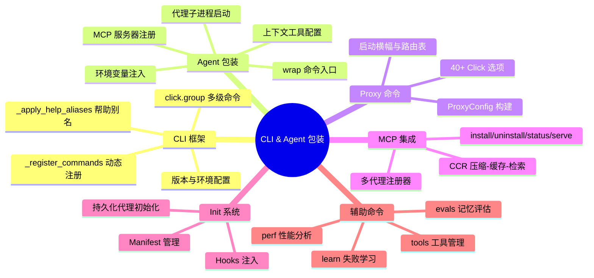
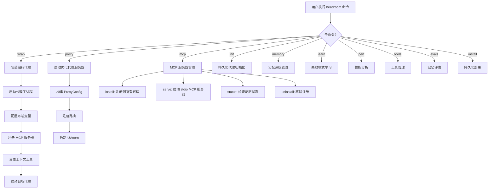
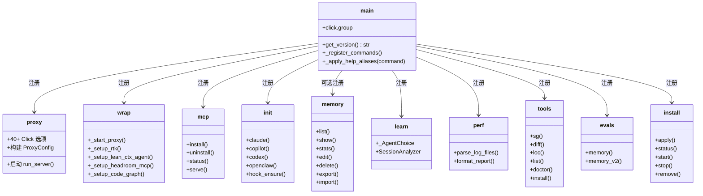
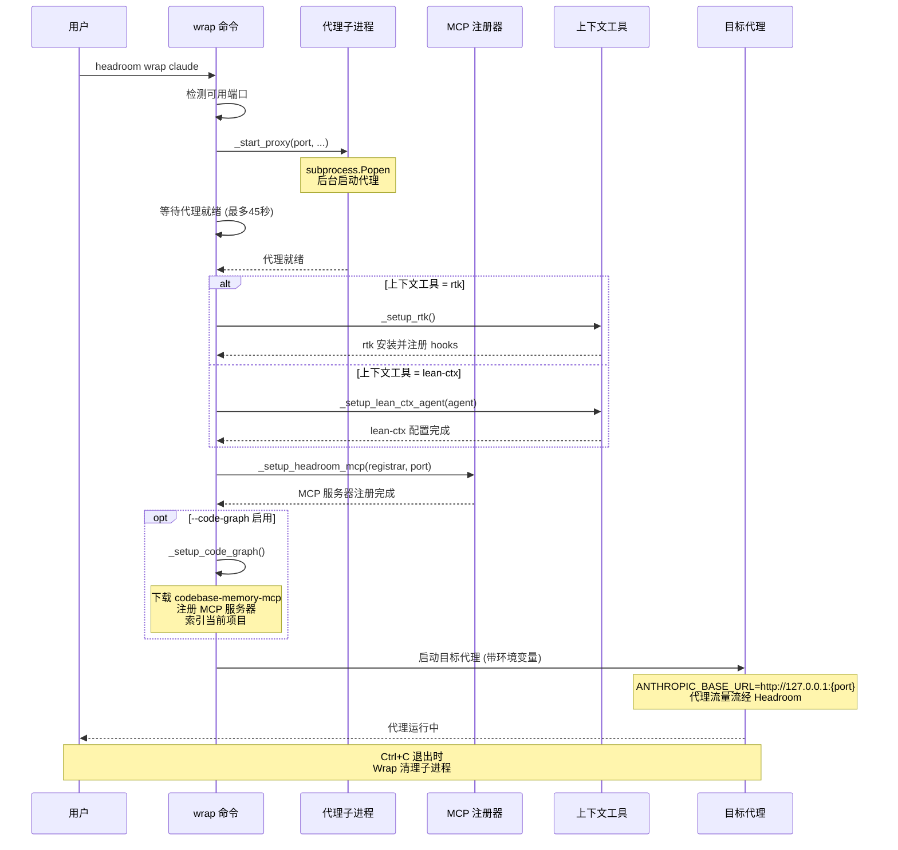
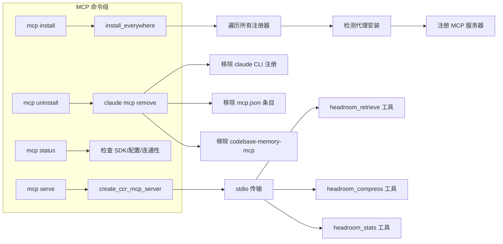
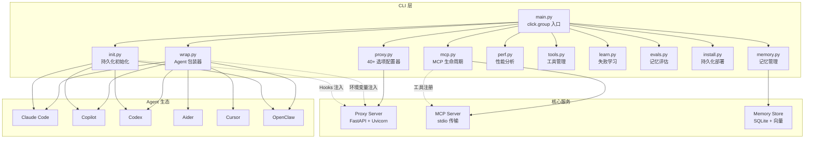

# CLI 与 Agent 包装

## 一、总——概述

Headroom 的 CLI 层是用户与系统交互的入口，而 Agent 包装机制则是将 Headroom 的优化能力无缝注入各类编码代理的关键桥梁。整个 CLI 子系统基于 Python `click` 框架构建，采用 `@click.group` + `@click.command` 的多级命令结构，将 proxy、wrap、mcp、memory、learn、init、install、perf、evals、tools 等十余个子命令组织为统一的命令树。Agent 包装则通过 `headroom wrap <agent>` 命令，在后台启动代理子进程并自动配置环境变量，使 Claude Code、GitHub Copilot、Codex、Aider、Cursor、OpenClaw 等代理的流量透明地流经 Headroom 代理，实现上下文压缩、缓存优化和记忆注入。



**图 10-1：CLI 与 Agent 包装思维导图**



**图 10-2：CLI 命令分发流程图**

---

## 二、分——详细分析

### 2.1 CLI 框架

#### 2.1.1 入口与命令注册

Headroom 的 CLI 入口定义在 [main.py](file:///workspace/headroom/cli/main.py) 中，使用 `@click.group` 装饰器创建顶层命令组：

```python
@click.group(context_settings=CLI_CONTEXT_SETTINGS)
@click.version_option(get_version(), "--version", "-v", prog_name="headroom")
@click.pass_context
def main(ctx: click.Context) -> None:
    """Headroom - The Context Optimization Layer for LLM Applications."""
    ctx.ensure_object(dict)
```

关键设计要点：

1. **延迟导入**：`_register_commands()` 通过延迟导入各子模块（evals, init, install, learn, mcp, perf, proxy, tools, wrap），避免循环依赖并加速启动。Memory 模块因依赖 numpy/hnswlib 而被标记为可选导入。

2. **帮助别名**：`_apply_help_aliases()` 递归遍历命令树，确保 `-?` 在所有层级均可用，提升用户体验。

3. **上下文设置**：`CLI_CONTEXT_SETTINGS = {"help_option_names": ["--help", "-?"]}` 统一配置帮助选项。



**图 10-3：CLI 命令类图**

#### 2.1.2 Proxy 命令——40+ 选项的巨型配置器

[proxy.py](file:///workspace/headroom/cli/proxy.py) 是 CLI 中最复杂的命令，拥有超过 40 个 Click 选项，覆盖代理服务器的方方面面：

| 选项类别 | 代表性选项 | 说明 |
|---------|-----------|------|
| 网络配置 | `--host`, `--port`, `--workers` | 绑定地址、端口和工作进程数 |
| 优化模式 | `--mode [token\|cache]` | token 优先压缩或 cache 优先缓存 |
| 内存系统 | `--memory`, `--memory-storage`, `--memory-top-k` | 记忆系统开关、存储策略和检索数量 |
| 流量学习 | `--learn`, `--min-evidence` | 实时流量学习与最小证据阈值 |
| 后端配置 | `--backend`, `--anyllm-provider`, `--region` | API 后端选择与区域配置 |
| 代码感知 | `--code-aware`, `--code-graph` | AST 压缩和代码图索引 |
| 预算控制 | `--budget` | 每日预算上限（USD） |
| 无状态模式 | `--stateless` | 禁用所有文件系统写入 |

Proxy 命令的核心流程是将所有 Click 选项汇聚为 `ProxyConfig` 数据类，然后调用 `run_server(config)` 启动 Uvicorn 服务器。启动后会打印详细的横幅信息，包括路由表、内存状态、扩展状态等：

```python
config = ProxyConfig(
    host=host, port=port,
    mode=effective_mode,
    optimize=not no_optimize,
    memory_enabled=False if is_stateless else (memory or (learn and not no_learn)),
    backend=backend,
    ...
)
run_server(config, print_banner=False)
```

### 2.2 Agent 包装

#### 2.2.1 Wrap 命令核心流程

[wrap.py](file:///workspace/headroom/cli/wrap.py) 实现了 `headroom wrap <agent>` 命令，这是用户最常用的入口之一。其核心流程为：



**图 10-4：Agent 包装时序图**

#### 2.2.2 代理子进程启动

`_start_proxy()` 函数负责在后台启动 Headroom 代理子进程：

```python
def _start_proxy(port, *, learn=False, memory=False, agent_type="unknown",
                 code_graph=False, backend=None, ...) -> subprocess.Popen:
    cmd = [sys.executable, "-m", "headroom.cli", "proxy", "--port", str(port)]
    if learn:
        cmd.append("--learn")
    if memory:
        cmd.append("--memory")
    if code_graph:
        cmd.append("--code-graph")

    log_path = _get_log_path()
    log_file = open(log_path, "a")
    proc = subprocess.Popen(cmd, stdout=log_file, stderr=log_file,
                            env=proxy_env, start_new_session=os.name == "posix")
    # 等待代理就绪（最多45秒）
    for _i in range(45):
        time.sleep(1)
        if _check_proxy(port):
            return proc
```

关键设计：
- **日志重定向**：代理日志写入 `~/.headroom/logs/proxy.log`，避免管道缓冲区死锁
- **进程隔离**：POSIX 系统使用 `start_new_session=True` 创建新会话
- **健康检查**：通过 TCP 连接检测代理是否就绪，最多等待 45 秒（ML 组件加载可能需要 20-30 秒）
- **标志转发**：`--learn`、`--memory`、`--code-graph`、`--backend` 等标志透明转发给代理子进程

#### 2.2.3 上下文工具配置

Wrap 命令支持两种上下文工具，通过 `HEADROOM_CONTEXT_TOOL` 环境变量选择：

1. **RTK (Rust Token Killer)**：默认工具，通过 `_setup_rtk()` 安装并注册 Claude hooks。RTK 通过拦截和压缩 shell 命令输出（如 git status、pytest 等）来节省 token。

2. **lean-ctx**：通过 `_setup_lean_ctx_agent()` 配置，支持多种代理的轻量级上下文管理。

RTK 的指令注入采用标记化方式，将使用说明写入 `AGENTS.md` 或 `.cursorrules`：

```python
RTK_INSTRUCTIONS_BLOCK = """\
<!-- headroom:rtk-instructions -->
# RTK (Rust Token Killer) - Token-Optimized Commands
When running shell commands, **always prefix with `rtk`**.
...
<!-- /headroom:rtk-instructions -->
"""
```

#### 2.2.4 MCP 服务器注册

`_setup_headroom_mcp()` 将 Headroom 的 MCP 服务器注册到目标代理中，使代理能够调用 `headroom_retrieve` 工具来检索被压缩的内容：

```python
def _setup_headroom_mcp(registrar, port, *, verbose=False, force=False):
    if not registrar.detect():
        return
    proxy_url = f"http://127.0.0.1:{port}"
    spec = build_headroom_spec(proxy_url)
    result = registrar.register_server(spec, force=force)
```

该函数是通用的——`ClaudeRegistrar`、`CodexRegistrar` 及任何未来的代理注册器都走同一路径。

#### 2.2.5 代码图设置

`_setup_code_graph()` 安装并配置 `codebase-memory-mcp`，为代理提供代码结构查询能力：

1. 下载 `codebase-memory-mcp` 二进制文件
2. 通过 `claude mcp add` 注册为 MCP 服务器
3. 索引当前项目（快速幂等操作，约 1 秒）

### 2.3 Provider 包装

Wrap 命令为每种代理提供了专门的 Provider 包装逻辑，负责构建正确的环境变量和启动参数：

| 代理 | Provider 模块 | 环境变量注入 | 特殊处理 |
|------|-------------|-------------|---------|
| Claude Code | `providers.claude` | `ANTHROPIC_BASE_URL` | RTK hooks 注册/清理 |
| GitHub Copilot | `providers.copilot` | `COPILOT_API_URL` | OAuth 认证检测 |
| Codex | `providers.codex` | `OPENAI_BASE_URL` | config.toml 注入 |
| Aider | `providers.aider` | 多个 API key 变量 | 模型映射 |
| Cursor | `providers.cursor` | 配置说明输出 | 无自动注入 |
| OpenClaw | `providers.openclaw` | 插件入口构建 | Gateway provider ID 规范化 |

### 2.4 MCP 安装

[mcp.py](file:///workspace/headroom/cli/mcp.py) 提供了 MCP 服务器的完整生命周期管理：



**图 10-5：MCP 命令流程图**

MCP 服务的核心是 CCR（Compress-Cache-Retrieve）模式：
1. 代理压缩大型 tool_result 载荷，输出 `[Retrieve more: hash=...]` 标记
2. 当代理需要完整内容时，调用 `headroom_retrieve` 工具
3. MCP 服务器从代理获取原始内容

`mcp serve` 命令使用 stdio 传输，由 Claude Code 自动调用：

```python
@mcp.command("serve")
def mcp_serve(proxy_url, direct, debug):
    server = create_ccr_mcp_server(proxy_url=effective_proxy_url)
    async def run():
        await server.run_stdio()
        await server.cleanup()
    asyncio.run(run())
```

### 2.5 Init 系统

[init.py](file:///workspace/headroom/cli/init.py) 提供了持久化的代理初始化能力，与 `wrap` 的一次性包装不同，`init` 将配置写入代理的持久化配置文件：

```python
def _ensure_claude_hooks(path, profile, port):
    payload = _json_file(path)
    env_map = dict(payload.get("env") or {})
    env_map["ANTHROPIC_BASE_URL"] = f"http://127.0.0.1:{port}"
    payload["env"] = env_map

    hooks = dict(payload.get("hooks") or {})
    command = _hook_command("--profile", profile)
    for event, matcher in (("SessionStart", "startup|resume"),
                           ("PreToolUse", _powershell_matcher())):
        # 注入 headroom hook，保留已有 hooks
        ...
    payload["hooks"] = hooks
    _write_json(path, payload)
```

Init 系统的核心概念：
- **Profile**：每个初始化配置对应一个 profile（`init-user` 为全局，`init-{slug}-{hash}` 为项目级）
- **Hook 注入**：向 Claude/Copilot/Codex 的配置文件注入 `headroom init hook ensure` 命令
- **Manifest 管理**：使用 `DeploymentManifest` 跟踪部署状态
- **幂等性**：所有操作都是幂等的，重复执行不会产生副作用

### 2.6 Perf 与 Tools

#### Perf 性能分析

[perf.py](file:///workspace/headroom/cli/perf.py) 从代理日志中提取性能数据：

```python
@main.command()
@click.option("--hours", default=168.0, help="分析最近 N 小时的日志")
@click.option("--raw", is_flag=True, help="显示原始 PERF 记录")
def perf(hours, raw):
    report = parse_log_files(last_n_hours=hours)
    if raw:
        for r in report.perf_records:
            click.echo(f"{r.timestamp} {r.request_id} model={r.model} ...")
    else:
        click.echo(format_report(report))
```

报告包含：token 节省率、缓存命中率、转换分解、TOIN 学习状态和可操作建议。

#### Tools 工具管理

[tools.py](file:///workspace/headroom/cli/tools.py) 管理三个捆绑的 CLI 工具：

| 命令 | 工具 | 用途 |
|------|------|------|
| `headroom sg` | ast-grep | AST 感知的结构化搜索/替换 |
| `headroom diff` | difftastic | 结构化差异比较 |
| `headroom loc` | scc | 快速代码行数统计 |

直通命令使用 `os.execv` 替换当前进程（POSIX），确保正确的信号处理和 fd/pty 透传：

```python
def _exec_tool(tool, argv):
    path = binaries.resolve(tool)
    cmd = [str(path), *argv]
    if not _is_windows():
        os.execv(cmd[0], cmd)  # 永不返回
    else:
        completed = subprocess.run(cmd, check=False)
        sys.exit(completed.returncode)
```

管理命令包括 `tools list`（显示注册表）、`tools doctor`（诊断状态）和 `tools install`（预取二进制文件）。

---

## 三、总——总结



**图 10-6：CLI 与 Agent 包装协作图**

Headroom 的 CLI 与 Agent 包装层体现了以下核心设计思想：

1. **透明代理**：通过环境变量注入（`ANTHROPIC_BASE_URL`、`OPENAI_BASE_URL` 等），使代理流量透明流经 Headroom，无需修改代理代码。

2. **渐进式集成**：从最简单的 `wrap`（一次性包装）到 `init`（持久化初始化）再到 `install`（持久化部署），用户可以按需选择集成深度。

3. **多代理统一**：通过 Provider 抽象和 MCP 注册器模式，同一套 CLI 可以服务于 Claude Code、Copilot、Codex 等多种代理，新增代理只需实现对应的 Provider 和 Registrar。

4. **幂等安全**：所有配置操作（hook 注入、MCP 注册、config 修改）都是幂等的，重复执行不会产生副作用，且使用标记（marker）机制精确识别 Headroom 管理的配置块。

5. **工具生态**：捆绑的 ast-grep、difftastic、scc 工具通过 `os.execv` 透传，既保持了原生工具的完整功能，又通过 `binaries` 模块实现了跨平台的二进制管理。
