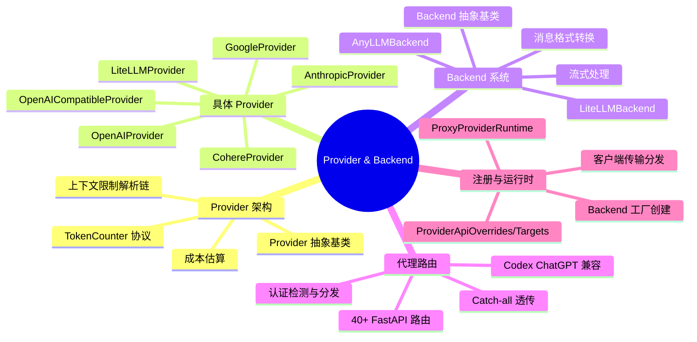
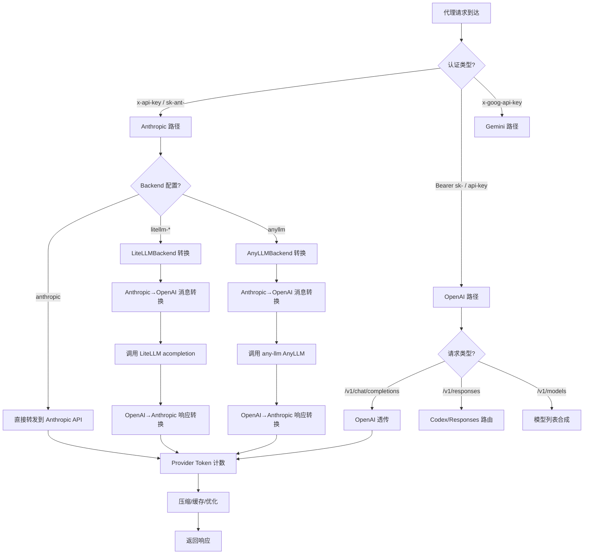
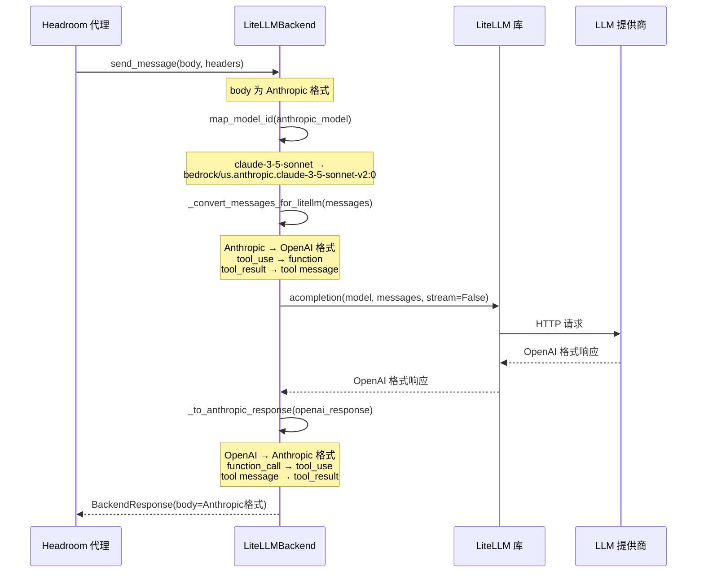
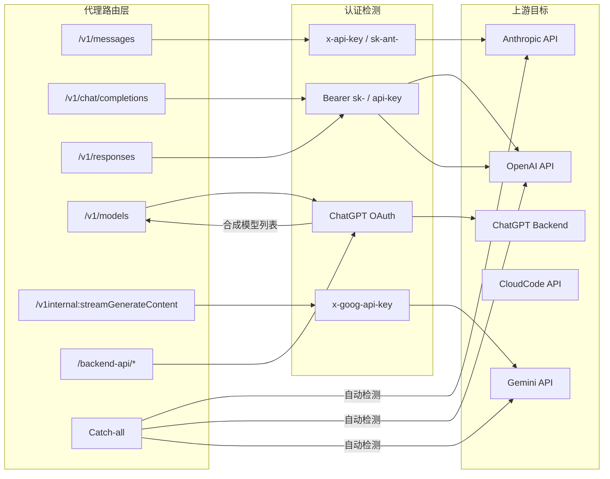
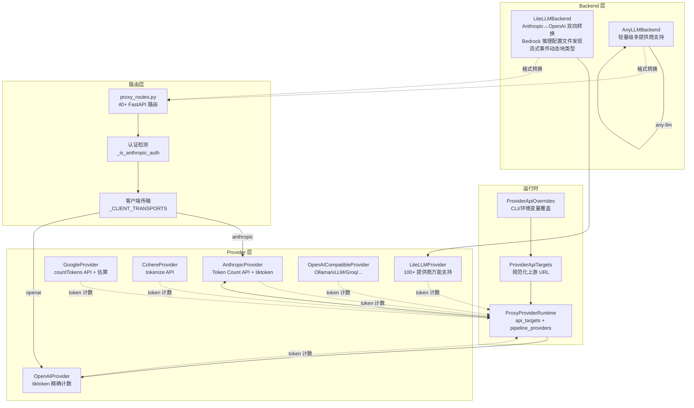

# Provider 与 Backend

## 一、总——概述

Headroom 的 Provider 与 Backend 系统构成了代理服务器的"大脑"——Provider 负责理解每个 LLM 厂商的模型特性（token 计数、上下文限制、定价），而 Backend 则负责在 Anthropic Messages API 和厂商特定 API 之间进行请求/响应的格式转换。这套双层抽象使得 Headroom 代理能够以统一的 Anthropic 协议对外服务，同时在内部无缝对接 OpenAI、Google、AWS Bedrock、Azure 等 100+ 个 LLM 提供商。

Provider 层的核心是 `Provider` 抽象基类和 `TokenCounter` 协议，每个具体 Provider（Anthropic、OpenAI、Google、Cohere、LiteLLM、OpenAI-Compatible）封装了厂商特定的 token 计数、上下文限制解析和成本估算逻辑。Backend 层则以 `Backend` 抽象基类为核心，`LiteLLMBackend` 和 `AnyLLMBackend` 两个实现分别通过 LiteLLM 和 any-llm 库实现了完整的 Anthropic↔OpenAI 消息格式双向转换。



**图 11-1：Provider 与 Backend 思维导图**



**图 11-2：Provider 与 Backend 请求处理流程图**

---

## 二、分——详细分析

### 2.1 Provider 架构

#### 2.1.1 核心抽象

Provider 架构建立在两个核心抽象之上，定义在 [base.py](file:///workspace/headroom/providers/base.py) 中：

**TokenCounter 协议**（`@runtime_checkable`）定义了 token 计数的标准接口：

```python
@runtime_checkable
class TokenCounter(Protocol):
    def count_text(self, text: str) -> int: ...
    def count_message(self, message: dict[str, Any]) -> int: ...
    def count_messages(self, messages: list[dict[str, Any]]) -> int: ...
```

**Provider 抽象基类**封装了模型相关的全部行为：

```python
class Provider(ABC):
    @property
    @abstractmethod
    def name(self) -> str: ...

    @abstractmethod
    def get_token_counter(self, model: str) -> TokenCounter: ...

    @abstractmethod
    def get_context_limit(self, model: str) -> int: ...

    @abstractmethod
    def supports_model(self, model: str) -> bool: ...

    def estimate_cost(self, input_tokens, output_tokens, model, cached_tokens=0) -> float | None:
        return None  # 可选实现

    def get_output_buffer(self, model, default=4000) -> int:
        return default  # 可选覆盖
```



```mermaid
classDiagram
    class TokenCounter {
        <<Protocol>>
        +count_text(text: str) int
        +count_message(message: dict) int
        +count_messages(messages: list) int
    }

    class Provider {
        <<ABC>>
        +name: str*
        +get_token_counter(model: str) TokenCounter*
        +get_context_limit(model: str) int*
        +supports_model(model: str) bool*
        +estimate_cost(...) float|None
        +get_output_buffer(model, default) int
    }

    class AnthropicProvider {
        +name = "anthropic"
        +get_token_counter() AnthropicTokenCounter
        +get_context_limit() int
        +supports_model() bool
        +estimate_cost() float
    }

    class OpenAIProvider {
        +name = "openai"
        +get_token_counter() OpenAITokenCounter
        +get_context_limit() int
        +supports_model() bool
        +estimate_cost() float
    }

    class GoogleProvider {
        +name = "google"
        +get_token_counter() GeminiTokenCounter
        +get_context_limit() int
        +supports_model() bool
    }

    class CohereProvider {
        +name = "cohere"
        +get_token_counter() CohereTokenCounter
        +get_context_limit() int
        +supports_model() bool
    }

    class LiteLLMProvider {
        +name = "litellm"
        +supports_model() bool  ← always True
        +get_token_counter() LiteLLMTokenCounter
        +get_context_limit() int
        +estimate_cost() float
    }

    class OpenAICompatibleProvider {
        +name = "openai-compatible"
        +register_model()
        +get_token_counter() TokenCounter
        +get_context_limit() int
    }

    Provider <|-- AnthropicProvider
    Provider <|-- OpenAIProvider
    Provider <|-- GoogleProvider
    Provider <|-- CohereProvider
    Provider <|-- LiteLLMProvider
    Provider <|-- OpenAICompatibleProvider

    AnthropicTokenCounter ..|> TokenCounter
    OpenAITokenCounter ..|> TokenCounter
    GeminiTokenCounter ..|> TokenCounter
    CohereTokenCounter ..|> TokenCounter
    LiteLLMTokenCounter ..|> TokenCounter
```

**图 11-3：Provider 类图**

#### 2.1.2 上下文限制解析链

每个 Provider 的 `get_context_limit()` 方法都实现了一条多级解析链，以 Anthropic Provider 为例（[anthropic.py](file:///workspace/headroom/providers/anthropic.py)）：

1. **显式配置**：`ANTHROPIC_CONTEXT_LIMITS` 字典直接查找
2. **环境变量**：`HEADROOM_MODEL_LIMITS` 自定义覆盖
3. **LiteLLM 查询**：`litellm_get_model_info()` 获取模型元数据
4. **模式匹配**：基于模型名称前缀推断（如 `claude-3` → 200K）
5. **默认值**：最终回退到 200,000

```python
# Anthropic 上下文限制解析链（简化）
def get_context_limit(self, model: str) -> int:
    # 1. 显式配置
    if model in ANTHROPIC_CONTEXT_LIMITS:
        return ANTHROPIC_CONTEXT_LIMITS[model]
    # 2. 环境变量覆盖
    env_limits = os.environ.get("HEADROOM_MODEL_LIMITS")
    if env_limits and model in parsed_env_limits:
        return parsed_env_limits[model]
    # 3. LiteLLM 查询
    if litellm_get_model_info:
        info = litellm_get_model_info(model)
        if info and "max_input_tokens" in info:
            return info["max_input_tokens"]
    # 4. 模式匹配
    if model.startswith("claude-"):
        return 200000
    # 5. 默认值
    return 200000
```

这种多级解析链的设计确保了：即使某个信息源不可用（如 LiteLLM 未安装），系统仍能通过其他途径获取合理的上下文限制。

### 2.2 具体 Provider

#### 2.2.1 AnthropicProvider

[anthropic.py](file:///workspace/headroom/providers/anthropic.py) 是最核心的 Provider 实现，其 `AnthropicTokenCounter` 支持两种计数模式：

- **精确模式**：当提供 Anthropic 客户端时，使用 Token Count API 进行精确计数
- **近似模式**：使用 tiktoken 的 `cl100k_base` 编码进行近似计数

定价方面，Anthropic Provider 维护了完整的 `ANTHROPIC_PRICING` 字典，支持 `input`、`output`、`cached_input` 三种定价维度，并优先使用 LiteLLM 的成本数据库。

#### 2.2.2 OpenAIProvider

[openai.py](file:///workspace/headroom/providers/openai.py) 使用 tiktoken 进行精确的 token 计数，通过 `_MODEL_ENCODINGS` 字典将模型名映射到编码名（`o200k_base`、`cl100k_base` 等）。

特色功能：
- **定价过期警告**：`_PRICING_STALE_DAYS = 60`，超过 60 天的定价数据会触发警告
- **模型家族推断**：通过模式匹配推断未知模型的家族（如 `gpt-4o-*` → GPT-4o 家族）
- **DeepSeek 支持**：内置 DeepSeek 模型的上下文限制（最高 1M tokens）

#### 2.2.3 LiteLLMProvider

[litellm.py](file:///workspace/headroom/providers/litellm.py) 是"万能"Provider，通过 LiteLLM 库支持 100+ 个 LLM 提供商：

```python
class LiteLLMProvider(Provider):
    def supports_model(self, model: str) -> bool:
        return True  # LiteLLM 处理验证

    def get_context_limit(self, model: str) -> int:
        info = litellm_get_model_info(model)
        if info and "max_input_tokens" in info:
            return info["max_input_tokens"]
        return 128000  # 合理默认值

    def estimate_cost(self, input_tokens, output_tokens, model, cached_tokens=0):
        return litellm.completion_cost(
            model=model, prompt="", completion="",
            prompt_tokens=input_tokens, completion_tokens=output_tokens,
        )
```

关键设计：`LiteLLMTokenCounter` 内置 `EstimatingTokenCounter` 作为回退，当 LiteLLM 的 `token_counter()` 失败时自动降级。

#### 2.2.4 OpenAICompatibleProvider

[openai_compatible.py](file:///workspace/headroom/providers/openai_compatible.py) 支持任何实现 OpenAI API 格式的服务，通过 `ModelCapabilities` 数据类注册模型：

```python
@dataclass
class ModelCapabilities:
    model: str
    context_window: int = 128000
    max_output_tokens: int = 4096
    supports_tools: bool = True
    supports_vision: bool = False
    tokenizer_backend: str | None = None
    input_cost_per_1m: float | None = None
    output_cost_per_1m: float | None = None
```

提供了工厂函数快速创建常见服务的 Provider：Ollama、Together、Groq、Fireworks、vLLM、LM Studio 等。

### 2.3 Backend 系统

#### 2.3.1 Backend 抽象基类

[backends/base.py](file:///workspace/headroom/backends/base.py) 定义了 Backend 的核心接口：

```python
class Backend(ABC):
    @property
    @abstractmethod
    def name(self) -> str: ...

    @abstractmethod
    async def send_message(self, body, headers) -> BackendResponse: ...

    @abstractmethod
    def stream_message(self, body, headers) -> AsyncIterator[StreamEvent]: ...

    @abstractmethod
    def map_model_id(self, anthropic_model: str) -> str: ...

    @abstractmethod
    def supports_model(self, model: str) -> bool: ...

    # 可选：OpenAI 格式支持
    async def send_openai_message(self, body, headers) -> BackendResponse:
        raise NotImplementedError(...)

    async def stream_openai_message(self, body, headers) -> AsyncIterator[str]:
        raise NotImplementedError(...)
```

`BackendResponse` 和 `StreamEvent` 两个数据类标准化了响应格式：

```python
@dataclass
class BackendResponse:
    body: dict[str, Any]          # Anthropic Messages API 格式
    status_code: int = 200
    headers: dict[str, str] = field(default_factory=dict)
    error: str | None = None

@dataclass
class StreamEvent:
    event_type: str               # message_start, content_block_delta 等
    data: dict[str, Any]          # Anthropic SSE 格式
    raw_sse: str | None = None    # 原始 SSE 行
```



**图 11-4：LiteLLMBackend 请求处理时序图**

#### 2.3.2 LiteLLMBackend

[litellm.py](file:///workspace/headroom/backends/litellm.py) 是最完整的 Backend 实现，核心能力包括：

**Provider 注册表**：内置了 5 个主要 Provider 的配置：

```python
PROVIDER_REGISTRY = {
    "bedrock": ProviderConfig(
        name="bedrock", display_name="AWS Bedrock",
        model_map={...}, uses_region=True,
        env_vars=["AWS_ACCESS_KEY_ID", "AWS_SECRET_ACCESS_KEY"],
    ),
    "vertex_ai": ProviderConfig(...),
    "openrouter": ProviderConfig(...),
    "azure": ProviderConfig(...),
    "databricks": ProviderConfig(...),
}
```

**Bedrock 推理配置文件发现**：`_fetch_bedrock_inference_profiles()` 通过 boto3 的 `list_inference_profiles()` API 动态获取可用的 Bedrock 推理配置文件，并构建模型映射。当 AWS API 不可用时，回退到静态映射 `_build_bedrock_fallback_map()`。

**消息格式转换**：`_convert_messages_for_litellm()` 处理 Anthropic→OpenAI 的消息转换：

| Anthropic 格式 | OpenAI 格式 |
|---------------|------------|
| `tool_use` block | `function` call in `tool_calls` |
| `tool_result` block | `tool` role message |
| `image` block | `image_url` content |
| `thinking` block | 丢弃（不适用于 OpenAI） |

**响应格式转换**：`_to_anthropic_response()` 处理 OpenAI→Anthropic 的响应转换，包括流式事件的动态块类型发射。

**环境变量隔离**：导入 litellm 时快照 `os.environ`，导入后撤销 litellm 的 `dotenv.load_dotenv()` 副作用，防止 API 密钥泄露。

#### 2.3.3 AnyLLMBackend

[anyllm.py](file:///workspace/headroom/backends/anyllm.py) 是 LiteLLMBackend 的轻量替代方案，使用 `any-llm` 库：

```python
class AnyLLMBackend(Backend):
    def __init__(self, provider="openai", api_key=None, api_base=None):
        self.llm = AnyLLM.create(self.provider)

    def map_model_id(self, model: str) -> str:
        return model  # any-llm 处理命名

    def supports_model(self, model: str) -> bool:
        return True  # 支持任何模型
```

与 LiteLLMBackend 相比，AnyLLMBackend 更简单但功能也更有限——它不支持 Bedrock 推理配置文件发现、区域前缀等高级特性。

### 2.4 代理路由与注册

#### 2.4.1 ProxyProviderRuntime

[registry.py](file:///workspace/headroom/providers/registry.py) 中的 `ProxyProviderRuntime` 是代理运行时的核心状态对象：

```python
@dataclass(frozen=True)
class ProxyProviderRuntime:
    api_targets: ProviderApiTargets
    pipeline_providers: dict[str, Provider]

    def api_target(self, provider_name: str) -> str: ...
    def pipeline_provider(self, provider_name: str) -> Provider: ...
    def model_metadata_provider(self, headers) -> str: ...
    def select_passthrough_base_url(self, headers) -> str: ...
```

`build_proxy_provider_runtime()` 创建运行时实例，默认包含 `AnthropicProvider` 和 `OpenAIProvider` 两个管线 Provider。

#### 2.4.2 API 目标解析

`ProviderApiOverrides` → `ProviderApiTargets` 的解析链处理上游 API URL 的配置：

```python
def resolve_api_overrides(*, anthropic_api_url, openai_api_url, ...) -> ProviderApiOverrides:
    return ProviderApiOverrides(
        anthropic=anthropic_api_url or env.get("ANTHROPIC_TARGET_API_URL"),
        openai=openai_api_url or env.get("OPENAI_TARGET_API_URL"),
        ...
    )

def resolve_api_targets(overrides) -> ProviderApiTargets:
    return ProviderApiTargets(
        anthropic=_normalize_api_url(overrides.anthropic, default=DEFAULT_ANTHROPIC_API_URL),
        ...
    )
```

URL 规范化处理包括：去除尾部斜杠、去除 `/v1` 后缀。

#### 2.4.3 Backend 工厂

`create_proxy_backend()` 根据配置创建 Backend 实例：

```python
def create_proxy_backend(*, backend, anyllm_provider, bedrock_region, logger, ...) -> Backend | None:
    if backend == "anthropic":
        return None  # 直接转发，无需 Backend
    if backend == "anyllm" or backend.startswith("anyllm-"):
        return AnyLLMBackend(provider=anyllm_provider)
    # 其他: litellm-{provider}
    return LiteLLMBackend(provider=provider, region=bedrock_region)
```

#### 2.4.4 认证检测与路由分发

`_is_anthropic_auth()` 通过请求头检测认证类型，决定请求路由：

```python
def _is_anthropic_auth(headers: Mapping[str, str]) -> bool:
    authorization = headers.get("authorization") or ""
    return bool(
        headers.get("x-api-key")
        or headers.get("anthropic-version")
        or authorization.startswith("Bearer sk-ant-")
    )
```

`call_client_transport()` 根据认证风格分发到对应的传输处理器：

```python
_CLIENT_TRANSPORTS = {
    "anthropic": _call_anthropic_transport,
    "openai": _call_openai_transport,
}
```

#### 2.4.5 代理路由注册

[proxy_routes.py](file:///workspace/headroom/providers/proxy_routes.py) 中的 `register_provider_routes()` 注册了 40+ 条 FastAPI 路由，覆盖：

| 端点路径 | 目标 | 说明 |
|---------|------|------|
| `/v1/messages` | Anthropic API | Claude Messages API |
| `/v1/chat/completions` | OpenAI API | Chat Completions API |
| `/v1/responses` | OpenAI API | Codex Responses API (HTTP + WebSocket) |
| `/v1/models` | 合成/透传 | 模型列表（Codex ChatGPT 认证特殊处理） |
| `/v1internal:streamGenerateContent` | CloudCode API | Cloud Code Assist 兼容 |
| `/backend-api/*` | ChatGPT | Codex 订阅模式后端 API |
| Catch-all | 自动检测 | 基于认证头自动路由 |

Codex ChatGPT 认证的特殊处理：由于 ChatGPT OAuth bearer 无法访问 `chatgpt.com/backend-api/models`，代理会合成一个 OpenAI 兼容的模型列表响应：

```python
_CHATGPT_AUTH_CODEX_MODELS = (
    "gpt-5.5", "gpt-5.4", "gpt-5.3", "gpt-5.2", "gpt-5.1", "gpt-5",
)
```



**图 11-5：代理路由与认证分发图**

---

## 三、总——总结



**图 11-6：Provider 与 Backend 协作图**

Headroom 的 Provider 与 Backend 系统体现了以下核心设计思想：

1. **协议统一**：对外始终以 Anthropic Messages API 格式服务，内部通过 Backend 层透明转换到任意厂商 API，使下游客户端无需感知后端差异。

2. **多级解析链**：上下文限制、定价等模型元数据通过"显式配置→环境变量→LiteLLM 查询→模式匹配→默认值"的多级链解析，确保在任何信息源缺失时仍能获得合理值。

3. **渐进式精度**：Token 计数从精确 API（Anthropic Token Count API、tiktoken）到估算回退（EstimatingTokenCounter），在精度和可用性之间取得平衡。

4. **环境隔离**：LiteLLM 的 `dotenv.load_dotenv()` 副作用通过 `os.environ` 快照/恢复机制隔离，防止 API 密钥泄露。

5. **认证驱动路由**：基于请求头认证模式（`x-api-key` vs `Bearer sk-` vs `x-goog-api-key`）自动选择上游目标，实现了单一代理端口服务多种客户端的架构。
