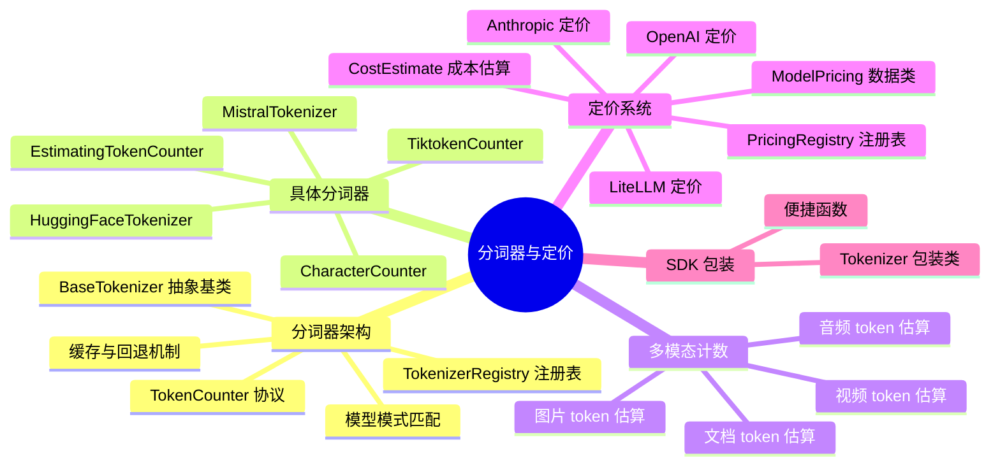
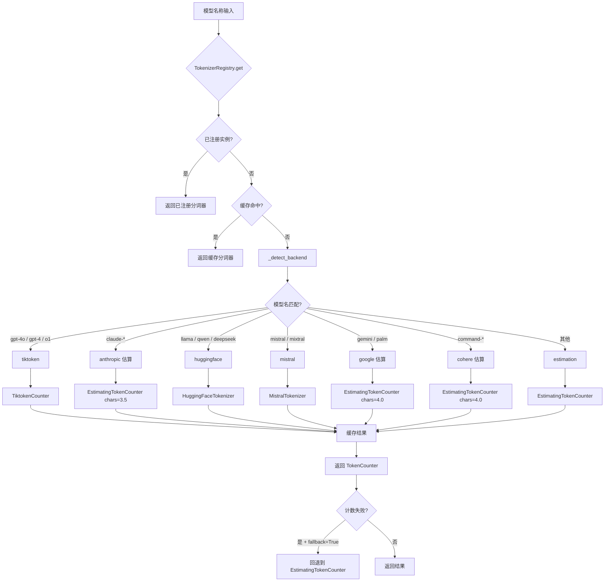
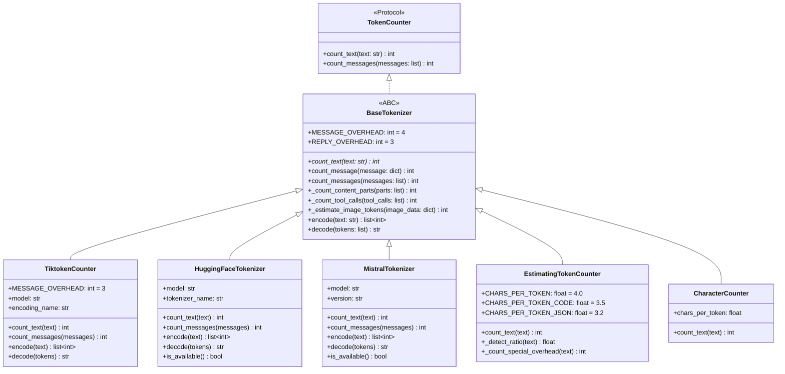
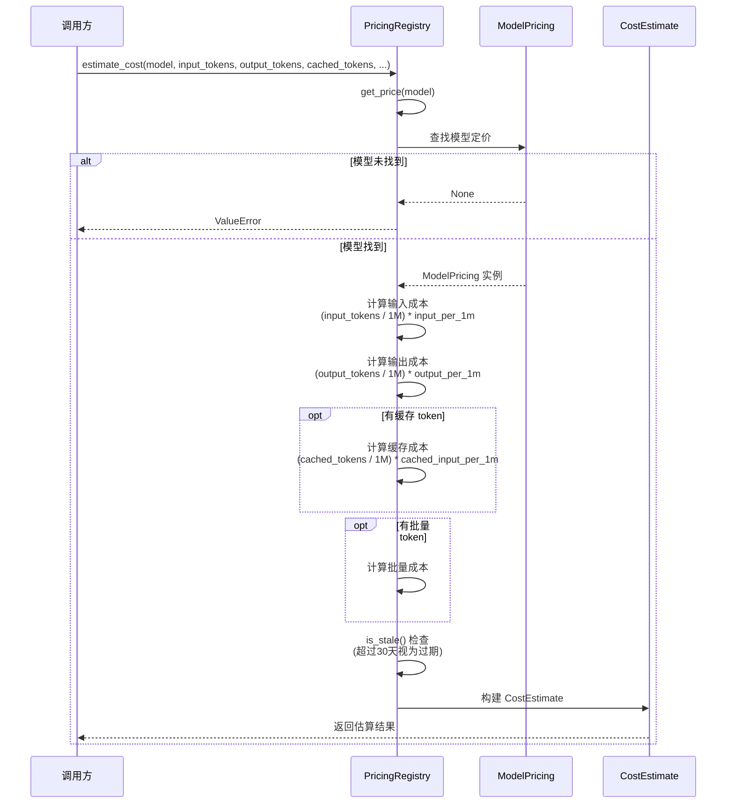
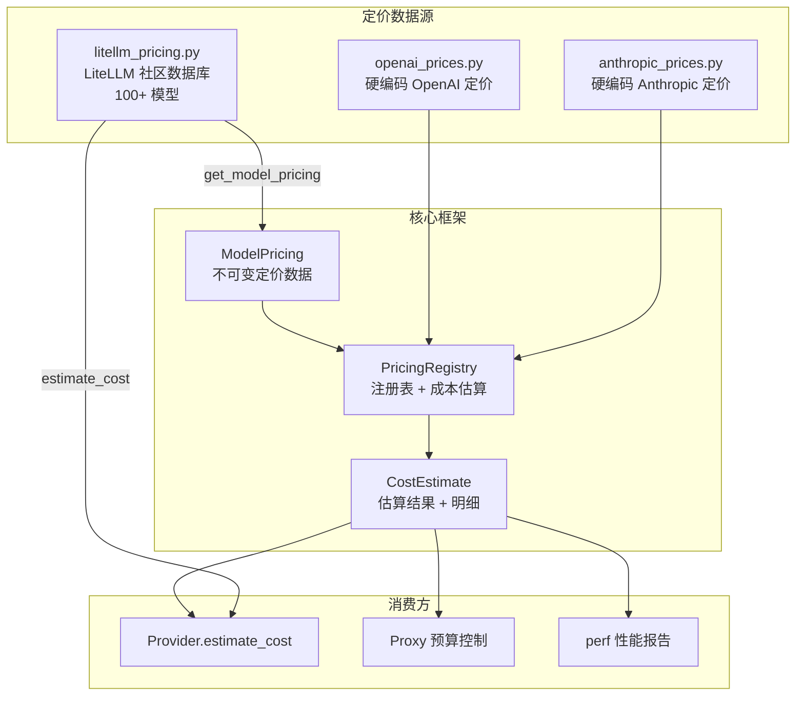

# 分词器与定价

## 一、总——概述

分词器（Tokenizer）和定价（Pricing）系统是 Headroom 代理进行上下文优化和成本控制的基石。分词器负责精确计算文本和消息的 token 数量，为压缩决策、缓存策略和上下文窗口管理提供数据支撑；定价系统则根据 token 使用量估算 API 调用成本，支持预算控制和成本报告。

Headroom 的分词器架构采用"注册表 + 多后端"模式：`TokenizerRegistry` 单例注册表通过模型名称自动选择最佳后端（tiktoken、HuggingFace、Mistral、估算），并支持自定义注册和缓存。`BaseTokenizer` 抽象基类提供了消息计数的通用实现，各后端只需实现 `count_text()` 方法即可。当精确分词器不可用时，`EstimatingTokenCounter` 通过字符/内容类型启发式方法提供约 90% 准确度的估算。

定价系统同样采用分层架构：`PricingRegistry` 提供通用的成本估算框架，`anthropic_prices` 和 `openai_prices` 维护硬编码的厂商定价数据，而 `litellm_pricing` 则通过 LiteLLM 的社区维护数据库提供 100+ 模型的实时定价。



**图 12-1：分词器与定价思维导图**



**图 12-2：分词器选择流程图**

---

## 二、分——详细分析

### 2.1 分词器架构

#### 2.1.1 核心抽象

分词器架构建立在 [base.py](file:///workspace/headroom/tokenizers/base.py) 中的两个核心抽象之上：

**TokenCounter 协议**定义了最小接口契约：

```python
@runtime_checkable
class TokenCounter(Protocol):
    def count_text(self, text: str) -> int: ...
    def count_messages(self, messages: list[dict[str, Any]]) -> int: ...
```

**BaseTokenizer 抽象基类**提供了消息计数的完整通用实现，子类只需实现 `count_text()`：

```python
class BaseTokenizer(ABC):
    MESSAGE_OVERHEAD = 4    # 每条消息的开销（role、格式等）
    REPLY_OVERHEAD = 3      # 助手回复起始 token

    @abstractmethod
    def count_text(self, text: str) -> int: ...

    def count_message(self, message: dict[str, Any]) -> int:
        return self.count_messages([message]) - self.REPLY_OVERHEAD

    def count_messages(self, messages: list[dict[str, Any]]) -> int:
        total = 0
        for message in messages:
            total += self.MESSAGE_OVERHEAD
            total += self.count_text(message.get("role", ""))
            # 处理 content（字符串 / 多部分列表）
            # 处理 tool_calls / function_call / name
        total += self.REPLY_OVERHEAD
        return total
```



**图 12-3：分词器类图**

#### 2.1.2 多模态内容计数

`BaseTokenizer._count_content_parts()` 是分词器架构中最复杂的方法，处理多种内容格式的 token 计数：

| 内容类型 | 格式 | Token 估算策略 |
|---------|------|--------------|
| 文本 | `{"type": "text", "text": "..."}` | 精确计数 |
| 图片 (Anthropic) | `{"type": "image"}` | 1600（保守上限） |
| 图片 (Strands SDK) | `{"image": {"source": {"bytes": ...}}}` | Pillow 解码 + Anthropic 公式 `(w*h)/750` |
| 图片 (OpenAI) | `{"type": "image_url"}` | low=85, high=170 |
| 音频 | `{"type": "input_audio"}` | 200 |
| 工具调用 | `{"type": "tool_use"}` | name + input JSON 计数 |
| 工具结果 | `{"type": "tool_result"}` | content 计数 |
| 文档 (Strands SDK) | `{"document": {"source": {"bytes": ...}}}` | ~1500 tokens/页，按 3KB/页估算 |
| 视频 (Strands SDK) | `{"video": {"source": {"bytes": ...}}}` | ~1000 tokens/帧，按 30KB/帧估算 |
| 推理 (Strands SDK) | `{"reasoningContent": {...}}` | 精确文本计数 |
| 未知类型 | 任意 | JSON 序列化后计数 |

图片 token 估算的 Anthropic 公式实现：

```python
@staticmethod
def _estimate_image_tokens(image_data: dict) -> int:
    img_bytes = image_data.get("source", {}).get("bytes", b"")
    if isinstance(img_bytes, (bytes, bytearray)) and len(img_bytes) > 0:
        try:
            from PIL import Image
            img = Image.open(io.BytesIO(img_bytes))
            w, h = img.size
            max_dim = 1568
            if w > max_dim or h > max_dim:
                scale = max_dim / max(w, h)
                w, h = int(w * scale), int(h * scale)
            return max(100, (w * h) // 750)
        except Exception:
            pass
    # 回退：基于字节大小估算
    size_kb = len(img_bytes) / 1024
    if size_kb < 50: return 400
    if size_kb < 500: return 1200
    return 1600
```

### 2.2 具体分词器

#### 2.2.1 TiktokenCounter

[tiktoken_counter.py](file:///workspace/headroom/tokenizers/tiktoken_counter.py) 是 OpenAI 模型的精确分词器，使用 OpenAI 官方的 tiktoken 库：

**编码映射**：维护了完整的 `MODEL_TO_ENCODING` 字典，覆盖从 GPT-4o（`o200k_base`）到 GPT-3（`r50k_base`）的所有模型：

| 编码名 | 适用模型 |
|--------|---------|
| `o200k_base` | GPT-4o、GPT-4o-mini、o1、o3 |
| `cl100k_base` | GPT-4、GPT-4-Turbo、GPT-3.5-Turbo、Embeddings |
| `p50k_base` | Codex、text-davinci-002/003 |
| `r50k_base` | GPT-3 (davinci、curie、babbage、ada) |

**延迟加载与缓存**：通过 `@lru_cache(maxsize=8)` 缓存编码实例，避免重复加载：

```python
@lru_cache(maxsize=8)
def _get_encoding(encoding_name: str):
    import tiktoken
    return tiktoken.get_encoding(encoding_name)
```

**精确消息计数**：`count_messages()` 实现了 OpenAI 的精确 token 计数公式，包括每条消息 3 token 的开销、name 字段额外 1 token、tool_call 每项 3 token 等。

#### 2.2.2 HuggingFaceTokenizer

[huggingface.py](file:///workspace/headroom/tokenizers/huggingface.py) 支持所有有 HuggingFace tokenizer 的开放模型：

**模型映射**：`MODEL_TO_TOKENIZER` 字典将常见模型名映射到 HuggingFace tokenizer 标识符，覆盖 Llama 2/3、CodeLlama、Mistral、Mixtral、Qwen、DeepSeek、Phi、Falcon、StarCoder、Gemma 等家族。

**Chat 模板支持**：当 tokenizer 支持 `apply_chat_template()` 时，使用聊天模板进行精确计数：

```python
def count_messages(self, messages):
    if self._use_fallback():
        return super().count_messages(messages)
    if hasattr(self.tokenizer, "apply_chat_template"):
        try:
            formatted = self.tokenizer.apply_chat_template(
                messages, tokenize=True, add_generation_prompt=True)
            return len(formatted)
        except Exception:
            pass
    return super().count_messages(messages)
```

**优雅降级**：当 `transformers` 库不可用或 tokenizer 加载失败时，自动回退到 4 字符/token 的估算。

#### 2.2.3 MistralTokenizer

[mistral.py](file:///workspace/headroom/tokenizers/mistral.py) 使用 Mistral 官方的 `mistral-common` 包：

**版本映射**：`MODEL_TO_VERSION` 字典将模型映射到 tokenizer 版本：

| 模型 | 版本 | 说明 |
|------|------|------|
| mistral-large/small | v3 (tekken) | 最新 Tekken 分词器 |
| ministral-8b/3b | v3 | 同上 |
| codestral | v3 | 同上 |
| pixtral-12b | v3 | 同上 |
| mixtral-8x7b/8x22b | v1 | 旧版分词器 |
| mistral-7b | v1 | 旧版分词器 |

**Chat 编码**：将消息转换为 Mistral 的 `UserMessage`/`AssistantMessage`/`SystemMessage` 格式，然后通过 `encode_chat_completion()` 获取精确 token 数。

#### 2.2.4 EstimatingTokenCounter

[estimator.py](file:///workspace/headroom/tokenizers/estimator.py) 是所有分词器的最终回退，通过启发式方法提供约 90% 准确度的估算：

**内容类型检测**：

```python
CHARS_PER_TOKEN = 4.0       # 英文文本
CHARS_PER_TOKEN_CODE = 3.5  # 代码（更密集）
CHARS_PER_TOKEN_JSON = 3.2  # JSON（更多结构）

def _detect_ratio(self, text: str) -> float:
    if self.JSON_PATTERN.match(text):
        try:
            json.loads(text)
            return self.CHARS_PER_TOKEN_JSON
        except (json.JSONDecodeError, ValueError):
            pass
    code_matches = len(self.CODE_PATTERN.findall(text))
    if code_matches > len(text) / 500:
        return self.CHARS_PER_TOKEN_CODE
    return self.CHARS_PER_TOKEN
```

**特殊模式开销**：URL 和 UUID 通常比字符数建议的 token 更多：

```python
def _count_special_overhead(self, text: str) -> int:
    overhead = 0
    urls = self.URL_PATTERN.findall(text)
    for url in urls:
        overhead += url.count("/") + url.count("?") + url.count("&")
    uuids = self.UUID_PATTERN.findall(text)
    overhead += len(uuids) * 2  # 每个 UUID 约多 2 个 token
    return overhead
```

**固定比率模式**：当传入 `chars_per_token` 参数时，跳过内容类型检测，直接使用固定比率。Anthropic 模型使用 3.5 字符/token，Google/Cohere 模型使用 4.0 字符/token。

#### 2.2.5 TokenizerRegistry

[registry.py](file:///workspace/headroom/tokenizers/registry.py) 是分词器的中央注册表，采用单例模式：

```python
class TokenizerRegistry:
    _instance: TokenizerRegistry | None = None
    _tokenizers: dict[str, TokenCounter] = {}      # 已注册的实例
    _factories: dict[str, Callable] = {}            # 后端工厂
    _cache: dict[str, TokenCounter] = {}            # 自动检测缓存
```

**自动检测**：`MODEL_PATTERNS` 列表按优先级匹配模型名到后端：

```python
MODEL_PATTERNS = [
    (r"^gpt-4o", "tiktoken"),
    (r"^gpt-4", "tiktoken"),
    (r"^o1", "tiktoken"),
    (r"^o3", "tiktoken"),
    (r"^claude-", "anthropic"),    # 估算 (3.5 chars/token)
    (r"^llama", "huggingface"),
    (r"^mistral", "mistral"),
    (r"^gemini", "google"),        # 估算 (4.0 chars/token)
    (r"^command", "cohere"),       # 估算 (4.0 chars/token)
    (r"^deepseek", "huggingface"),
    (r"^qwen", "huggingface"),
    ...
]
```

**获取流程**：`get()` 方法按"已注册实例 → 缓存 → 创建新实例"的顺序查找，创建失败时自动回退到 `EstimatingTokenCounter`。

**便捷函数**：

```python
def get_tokenizer(model, backend=None, fallback=True) -> TokenCounter:
    return TokenizerRegistry.get(model, backend, fallback)

def register_tokenizer(model, tokenizer=None, factory=None):
    TokenizerRegistry.register(model, tokenizer, factory)
```

#### 2.2.6 SDK 包装层

[tokenizer.py](file:///workspace/headroom/tokenizer.py) 提供了面向 SDK 用户的 `Tokenizer` 包装类：

```python
class Tokenizer:
    def __init__(self, token_counter: TokenCounter, model: str = ""):
        self._counter = token_counter
        self.model = model

    def count_text(self, text: str) -> int:
        return self._counter.count_text(text)

    def count_message(self, message: dict) -> int:
        return self._counter.count_message(message)

    def count_messages(self, messages: list) -> int:
        return self._counter.count_messages(messages)

    @property
    def available(self) -> bool:
        return self._counter is not None
```

### 2.3 定价系统

#### 2.3.1 核心数据结构

[pricing/registry.py](file:///workspace/headroom/pricing/registry.py) 定义了定价系统的核心数据结构：

```python
@dataclass(frozen=True)
class ModelPricing:
    model: str
    provider: str
    input_per_1m: float              # 输入价格 (USD/百万token)
    output_per_1m: float             # 输出价格 (USD/百万token)
    cached_input_per_1m: float | None = None   # 缓存输入价格
    batch_input_per_1m: float | None = None    # 批量输入价格
    batch_output_per_1m: float | None = None   # 批量输出价格
    context_window: int | None = None          # 上下文窗口
    notes: str | None = None                   # 备注

@dataclass
class CostEstimate:
    cost_usd: float                  # 总成本 (USD)
    breakdown: dict = field(default_factory=dict)  # 分项明细
    pricing_date: date | None = None
    is_stale: bool = False           # 定价是否过期
    warning: str | None = None       # 过期警告
```

#### 2.3.2 PricingRegistry

`PricingRegistry` 提供了完整的成本估算能力：



**图 12-4：定价估算时序图**

关键特性：

**过期检测**：定价数据超过 30 天自动标记为过期：

```python
STALENESS_THRESHOLD_DAYS = 30

def is_stale(self) -> bool:
    age = date.today() - self.last_updated
    return age > timedelta(days=self.STALENESS_THRESHOLD_DAYS)
```

**分项明细**：`estimate_cost()` 返回的 `CostEstimate.breakdown` 包含每项费用的详细信息：

```python
breakdown = {
    "input": {"tokens": 1000, "rate_per_1m": 3.00, "cost_usd": 0.003},
    "output": {"tokens": 500, "rate_per_1m": 15.00, "cost_usd": 0.0075},
    "cached_input": {"tokens": 800, "rate_per_1m": 0.30, "cost_usd": 0.00024},
}
```

#### 2.3.3 Anthropic 定价

[anthropic_prices.py](file:///workspace/headroom/pricing/anthropic_prices.py) 维护了 Anthropic 模型的硬编码定价数据：

| 模型 | 输入 ($/M) | 输出 ($/M) | 缓存输入 ($/M) | 上下文窗口 |
|------|-----------|-----------|--------------|-----------|
| claude-3-5-sonnet | 3.00 | 15.00 | 0.30 | 200K |
| claude-3-5-haiku | 0.80 | 4.00 | 0.08 | 200K |
| claude-3-opus | 15.00 | 75.00 | 1.50 | 200K |
| claude-3-haiku | 0.25 | 1.25 | 0.03 | 200K |

还支持批量 API 定价（batch_input/batch_output），通常为标准价格的 50%。

#### 2.3.4 OpenAI 定价

[openai_prices.py](file:///workspace/headroom/pricing/openai_prices.py) 维护了 OpenAI 模型的定价数据：

| 模型 | 输入 ($/M) | 输出 ($/M) | 缓存输入 ($/M) | 上下文窗口 |
|------|-----------|-----------|--------------|-----------|
| gpt-4o | 2.50 | 10.00 | 1.25 | 128K |
| gpt-4o-mini | 0.15 | 0.60 | 0.075 | 128K |
| o1 | 15.00 | 60.00 | 7.50 | 200K |
| o1-mini | 1.10 | 4.40 | 0.55 | 128K |
| o3-mini | 1.10 | 4.40 | 0.55 | 200K |
| gpt-4-turbo | 10.00 | 30.00 | 5.00 | 128K |
| gpt-3.5-turbo | 0.50 | 1.50 | 0.25 | 16K |

#### 2.3.5 LiteLLM 定价

[litellm_pricing.py](file:///workspace/headroom/pricing/litellm_pricing.py) 通过 LiteLLM 的社区维护数据库提供 100+ 模型的实时定价：

```python
def get_model_pricing(model: str) -> LiteLLMModelPricing | None:
    cost_data = litellm.model_cost
    # 1. 精确匹配
    info = cost_data.get(model)
    # 2. 常见前缀匹配
    if info is None:
        for prefix in ["openai/", "anthropic/", "google/", "mistral/", "deepseek/"]:
            if f"{prefix}{model}" in cost_data:
                info = cost_data[f"{prefix}{model}"]
                break
    # 3. 退役/重命名别名
    if info is None:
        alias = _MODEL_ALIASES.get(model)
        if alias:
            info = cost_data.get(alias)
    # 转换：LiteLLM 存储 per-token 价格，转换为 per-1M
    input_per_token = info.get("input_cost_per_token", 0) or 0
    output_per_token = info.get("output_cost_per_token", 0) or 0
    return LiteLLMModelPricing(
        model=model,
        input_cost_per_1m=input_per_token * 1_000_000,
        output_cost_per_1m=output_per_token * 1_000_000,
        ...
    )
```

**模型别名**：处理 LiteLLM 数据库中已退役/重命名的模型：

```python
_MODEL_ALIASES = {
    "claude-3-5-sonnet-20241022": "claude-sonnet-4-20250514",
    "claude-3-5-sonnet-20240620": "claude-sonnet-4-20250514",
    "claude-3-sonnet-20240229": "claude-3-haiku-20240307",
}
```

**环境隔离**：与 Backend 层相同，导入 litellm 时通过 `os.environ` 快照/恢复机制隔离 `dotenv.load_dotenv()` 副作用。

**便捷估算**：

```python
def estimate_cost(model, input_tokens=0, output_tokens=0) -> float | None:
    pricing = get_model_pricing(model)
    if pricing is None:
        return None
    input_cost = (input_tokens / 1_000_000) * pricing.input_cost_per_1m
    output_cost = (output_tokens / 1_000_000) * pricing.output_cost_per_1m
    return input_cost + output_cost
```



**图 12-5：定价系统协作图**

---

## 三、总——总结

```mermaid
flowchart TB
    subgraph 分词器层
        TR[TokenizerRegistry<br/>单例注册表<br/>模型名→后端映射]
        TC[TokenCounter 协议<br/>count_text / count_messages]
        BT[BaseTokenizer<br/>消息计数通用实现<br/>多模态内容处理]
    end

    subgraph 具体后端
        TT[TiktokenCounter<br/>OpenAI 精确计数<br/>o200k/cl100k/p50k/r50k]
        HF[HuggingFaceTokenizer<br/>开放模型支持<br/>Chat 模板计数]
        MT[MistralTokenizer<br/>mistral-common<br/>v1/v3 Tekken]
        ET[EstimatingTokenCounter<br/>启发式估算<br/>~90% 准确度]
    end

    subgraph 定价层
        PR[PricingRegistry<br/>成本估算框架<br/>过期检测]
        AP[anthropic_prices<br/>Claude 定价数据]
        OP[openai_prices<br/>GPT 定价数据]
        LP[litellm_pricing<br/>100+ 模型定价<br/>环境隔离]
    end

    subgraph 消费方
        PV[Provider 层<br/>token 计数 + 成本估算]
        PX[Proxy 服务器<br/>压缩决策 + 预算控制]
        PF[perf 报告<br/>token 节省统计]
    end

    TR --> TT & HF & MT & ET
    BT --> TT & HF & MT & ET
    TC ..|> BT

    PR --> AP & OP & LP

    TT & HF & MT & ET --> PV
    PR --> PV
    PV --> PX & PF
```

**图 12-6：分词器与定价系统协作图**

Headroom 的分词器与定价系统体现了以下核心设计思想：

1. **精度与可用性平衡**：从精确分词器（tiktoken、HuggingFace、mistral-common）到估算回退（EstimatingTokenCounter），系统在任何依赖缺失时都能正常工作，只是精度有所降低。估算器倾向于略微高估，这对上下文窗口管理更安全。

2. **多模态全覆盖**：`_count_content_parts()` 方法处理了 Anthropic 格式、OpenAI 格式和 Strands SDK 格式的所有内容类型（文本、图片、音频、视频、文档、工具调用、推理内容），确保 token 计数不会因 base64 编码的图片/文档而产生虚假的巨额计数。

3. **注册表模式**：`TokenizerRegistry` 和 `PricingRegistry` 都采用注册表模式，支持自动检测、手动注册和缓存，使系统既开箱即用又高度可扩展。

4. **定价数据分层**：硬编码的厂商定价（anthropic_prices、openai_prices）提供确定性基线，LiteLLM 社区数据库提供广覆盖的实时数据，两者互补。过期检测机制（30 天阈值）确保用户意识到数据可能过时。

5. **安全隔离**：LiteLLM 的 `dotenv.load_dotenv()` 副作用通过环境变量快照/恢复机制隔离，防止 `.env` 文件中的 API 密钥泄露到进程环境中。
