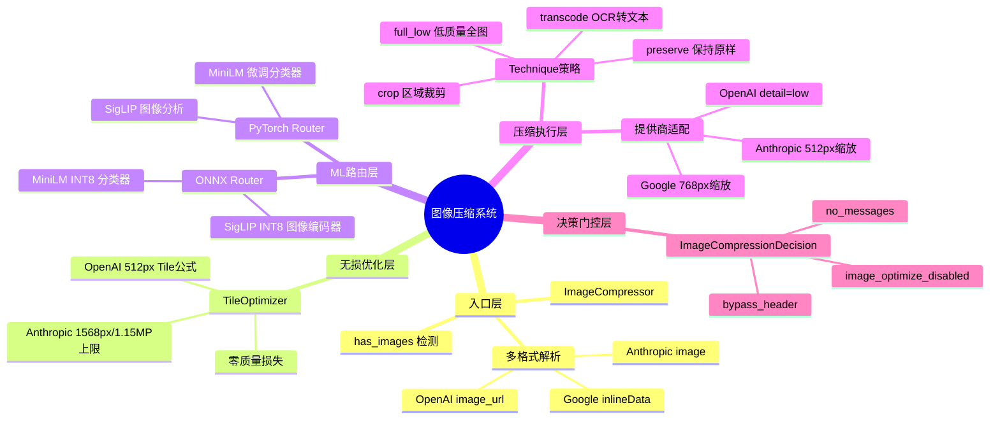
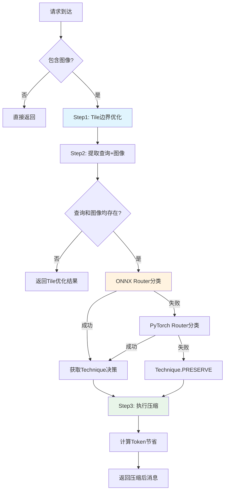
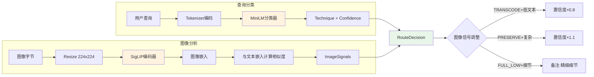
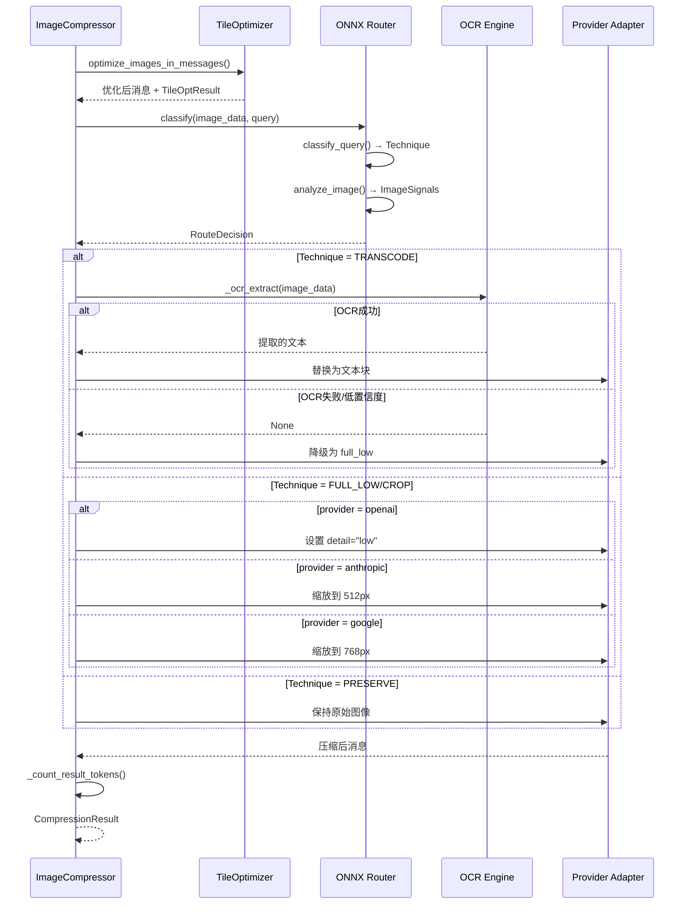
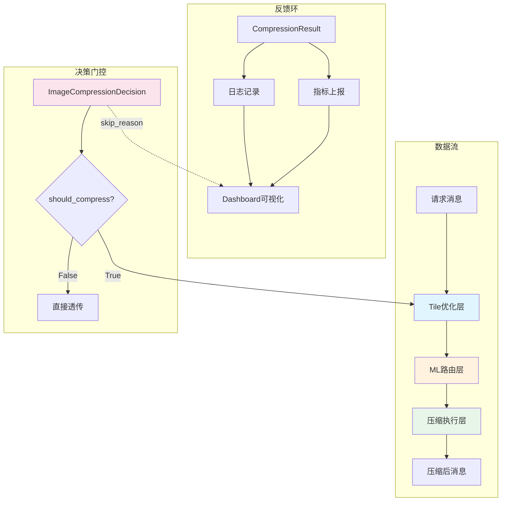

# 第13篇：图像压缩 — 智能视觉Token优化系统

## 一、总述

Headroom 的图像压缩系统是一个端到端的智能视觉 Token 优化管线，旨在将 LLM 请求中的图像 Token 开销降低 40%–90%，同时保持回答准确率。该系统由三个核心层次构成：**无损的 Tile 边界对齐**（纯数学，零质量损失）、**ML 驱动的技术路由**（ONNX INT8 模型，CPU 友好）、**提供商特定压缩执行**（OpenAI/Anthropic/Google 各自最优策略）。

整个管线的核心设计哲学是"**先无损，后有损**"——优先通过 Tile 边界优化消除结构性浪费，再根据查询意图和图像内容智能选择压缩策略，最后按提供商格式规范精确执行。





---

## 二、分述

### 2.1 图像压缩架构

图像压缩的入口是 [ImageCompressor](file:///workspace/headroom/image/compressor.py)，它是一个无状态的压缩门面，协调三个步骤的执行：

```python
class ImageCompressor:
    def compress(self, messages, provider="openai"):
        # Step 1: Tile-boundary optimization (always safe, pure math)
        messages, tile_results = optimize_images_in_messages(messages, provider)
        
        # Step 2: ML-based technique routing
        query = self._extract_query(messages)
        image_data = self._extract_image_data(messages)
        
        # Step 3: Apply compression technique
        compressed_messages = self._apply_compression(messages, technique, provider)
```

**关键设计点**：

1. **懒加载模型**：`_router` 和 `_ocr_engine` 均为懒加载，首次使用时才初始化，避免启动时加载大模型
2. **多格式兼容**：`has_images()` 和 `_extract_image_data()` 同时支持 OpenAI（`image_url`）、Anthropic（`image` + `source`）、Google（`inlineData`）三种格式
3. **优雅降级**：ONNX Router 失败 → PyTorch Router → PRESERVE（保持原样），确保任何情况下请求都不会被阻断

[CompressionResult](file:///workspace/headroom/image/compressor.py) 数据类记录了每次压缩的完整结果：

```python
@dataclass
class CompressionResult:
    technique: Technique
    original_tokens: int
    compressed_tokens: int
    confidence: float

    @property
    def savings_percent(self) -> float:
        return (1 - self.compressed_tokens / self.original_tokens) * 100
```

### 2.2 ML路由系统

ML 路由是图像压缩的核心智能，负责根据"用户问了什么"和"图像里有什么"来选择最优压缩策略。

#### 2.2.1 Technique 枚举

[Technique](file:///workspace/headroom/image/trained_router.py) 定义了四种压缩策略：

| 策略 | 节省率 | 适用场景 |
|------|--------|----------|
| `TRANSCODE` | ~99% | 文本提取（"读一下标牌"） |
| `FULL_LOW` | ~87% | 一般理解（"这是什么？"） |
| `CROP` | 50-90% | 区域特定（"右上角是什么？"） |
| `PRESERVE` | 0% | 精细细节（"数一下有多少个点"） |

#### 2.2.2 ONNX Router（生产路径）

[OnnxTechniqueRouter](file:///workspace/headroom/image/onnx_router.py) 是生产环境的推荐路由器，完全基于 ONNX Runtime，无需 PyTorch/GPU：

- **查询分类器**：MiniLM ONNX INT8（~32 MB，~5ms），从 HuggingFace 自动下载 `chopratejas/technique-router-onnx`
- **图像编码器**：SigLIP ONNX INT8（~95 MB，~30ms），从 HuggingFace 下载 `chopratejas/siglip-image-encoder-onnx`
- **文本嵌入**：预计算的文本嵌入向量（~25 KB），用于图像属性评分

```python
class OnnxTechniqueRouter:
    def classify(self, image_data: bytes, query: str) -> RouteDecision:
        # Step 1: Classify query intent
        technique, query_confidence = self.classify_query(query)
        
        # Step 2: Analyze image properties
        image_signals = self.analyze_image(image_data)
        
        # Step 3: Combine signals for final decision
        # Apply image-based adjustments to query classification
```

图像分析通过 SigLIP 计算图像嵌入与预定义文本描述的相似度，输出四个信号：

```python
@dataclass
class ImageSignals:
    has_text: float          # 图像中是否包含文字
    is_document: float       # 是否是文档/表单
    is_complex: float        # 是否是复杂场景
    has_small_details: float # 是否有精细细节
```

#### 2.2.3 PyTorch Router（开发/测试路径）

[TrainedRouter](file:///workspace/headroom/image/trained_router.py) 是基于 PyTorch + Transformers 的路由器，用于开发和测试：

- 使用 `MLModelRegistry` 共享模型实例，避免重复加载
- 支持本地模型路径和 HuggingFace Hub 模型
- 93.7% 验证集准确率，训练数据 1157 个样本



### 2.3 Tile优化与OCR

#### 2.3.1 Tile边界优化

[TileOptimizer](file:///workspace/headroom/image/tile_optimizer.py) 是纯数学优化，零质量损失。其核心思想是：LLM 提供商按 Tile 计费，图像尺寸略超 Tile 边界就会多算一整块 Tile 的费用。

**OpenAI 的计费公式**：

```
tokens = 85 + 170 × ceil(width/512) × ceil(height/512)
```

一个 770px 的图像 = 4 个 Tile（765 tokens），缩放到 512px = 1 个 Tile（255 tokens），节省 67%。

```python
def find_optimal_openai_dimensions(width: int, height: int) -> tuple[int, int]:
    """尝试减少Tile数量，同时保留≥40%的原始像素。"""
    for target_cols in range(1, math.ceil(width / 512) + 1):
        for target_rows in range(1, math.ceil(height / 512) + 1):
            tiles = target_cols * target_rows
            if tiles >= current_tiles:
                continue
            # 只接受保留≥40%像素的方案
            if nw * nh >= width * height * 0.4 and tiles < best_tiles:
                best_w, best_h = nw, nh
```

**Anthropic 的计费公式**：

```
tokens = (width × height) / 750, 最长边≤1568, 总像素≤1.15MP
```

预缩放到 Anthropic 的上限可节省上传带宽（它们服务器端也会缩放）。

#### 2.3.2 OCR转码（Transcode）

OCR 转码是最高效的压缩策略（~99% 节省），将图像中的文字提取为纯文本。[compressor.py](file:///workspace/headroom/image/compressor.py) 中的 `_ocr_extract()` 方法实现了对 RapidOCR 两个 API 版本的兼容：

```python
def _ocr_extract(self, image_data: bytes, min_confidence: float = 0.7) -> str | None:
    ocr_cls, api_version = _resolve_rapidocr()
    # v1: rapidocr-onnxruntime (Python <3.13) → 返回 (list[tuple], elapsed)
    # v3: rapidocr 3.x (Python 3.13+) → 返回 RapidOCROutput dataclass
```

OCR 转码的执行流程：

1. 解析 RapidOCR API 版本（v1/v3），运行时检测而非基于 Python 版本
2. 执行 OCR 识别，提取文本和置信度
3. 平均置信度 < 0.7 时放弃 OCR，降级为 `full_low`
4. 成功时替换图像为 `[OCR from image]\n{extracted_text}` 文本块

### 2.4 提供商特定处理

压缩执行阶段根据目标提供商和选定的 Technique 进行差异化处理。

#### 2.4.1 ImageCompressionDecision 门控

在压缩执行之前，[ImageCompressionDecision](file:///workspace/headroom/proxy/image_compression_decision.py) 作为不可变的值类型，统一了图像压缩的决策逻辑：

```python
@dataclass(frozen=True)
class ImageCompressionDecision:
    should_compress: bool
    passthrough_reason: str | None  # "bypass_header" | "image_optimize_disabled" | "no_messages"
    
    @classmethod
    def decide(cls, *, headers, config, messages) -> ImageCompressionDecision:
        if bypass:
            return cls(should_compress=False, passthrough_reason="bypass_header", ...)
        elif not image_ok:
            return cls(should_compress=False, passthrough_reason="image_optimize_disabled", ...)
        elif not has_msgs:
            return cls(should_compress=False, passthrough_reason="no_messages", ...)
        else:
            return cls(should_compress=True, passthrough_reason=None, ...)
```

决策结果通过 `apply_to_tags()` 方法写入 `RequestOutcome.tags["image_skip_reason"]`，供 Dashboard 切片分析。

#### 2.4.2 提供商适配时序



**提供商差异**：

| 提供商 | FULL_LOW 实现 | 缩放目标 | Token 估算公式 |
|--------|--------------|----------|---------------|
| OpenAI | `detail="low"` | 不缩放 | `85 + 170 × tiles` |
| Anthropic | PIL 缩放 | 512px | `(w × h) / 750` |
| Google | PIL 缩放 | 768px | 按 Tile 计算 |

Token 计算的关键细节：压缩后的 Token 不是简单估算，而是通过 `_count_result_tokens()` 检查实际结果——如果图像被 OCR 替换为文本，则按文本长度（~4 字符/Token）计算；如果被缩放，则从新尺寸重新估算。

---

## 三、总结

Headroom 的图像压缩系统体现了"**分层优化、智能路由、优雅降级**"的工程哲学：

1. **分层优化**：先无损（Tile 边界对齐），再有损（ML 路由 + 压缩执行），每一层独立贡献 Token 节省
2. **智能路由**：ML 模型同时理解查询意图和图像内容，而非简单的规则匹配，93.7% 的路由准确率确保了压缩决策的质量
3. **优雅降级**：ONNX → PyTorch → PRESERVE 的三级降级链，OCR 失败 → full_low 的二级降级，确保任何故障都不会阻断请求
4. **提供商感知**：每个提供商的计费公式和 API 格式差异被封装在执行层，路由层无需关心



这套系统的价值在于：它让图像 Token 优化从"一刀切"变为"因图制宜、因问制宜"，在保持回答质量的同时，将视觉 Token 开销降低了 40%–90%。
