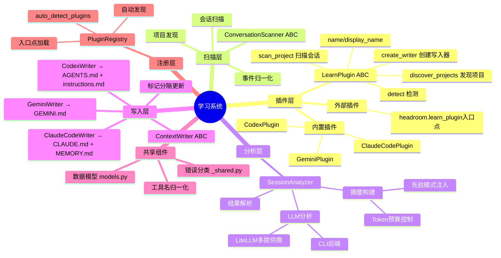
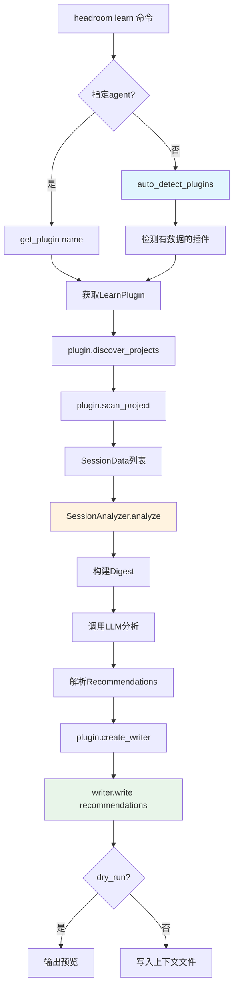
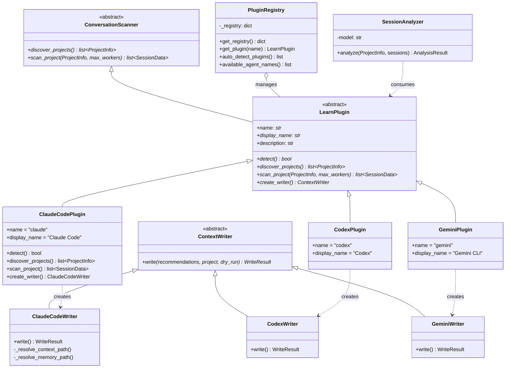
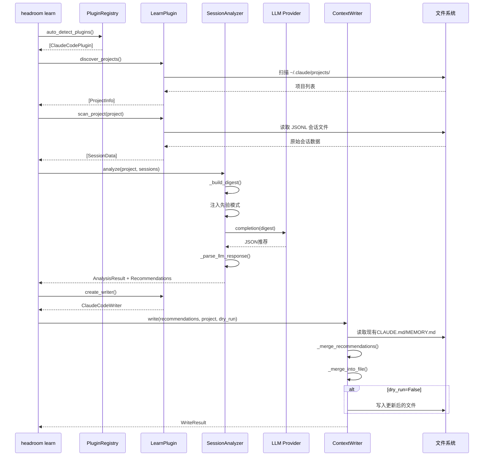
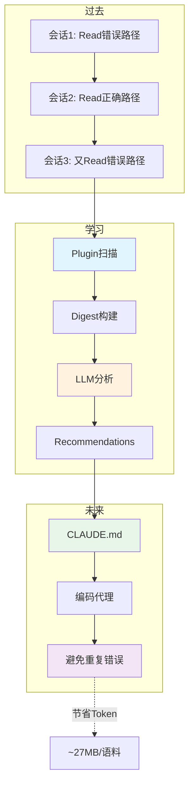

# 第14篇：学习系统 — 离线失败学习与智能推荐

## 一、总述

Headroom Learn 是一个离线失败学习系统，通过分析编码代理（Claude Code、Codex、Gemini CLI 等）的历史对话，发现失败模式、关联成功修正，并将可操作的规则写入代理原生的上下文文件（CLAUDE.md、AGENTS.md、GEMINI.md），从而在后续会话中预防相同的 Token 浪费。

系统的核心创新是**成功关联**（Success Correlation）：不仅记录"什么失败了"，更追踪"什么修正了失败"，从而产生具体的、可操作的纠正建议，而非泛泛的忠告。在 67,583 次工具调用的测试语料上，平均每个项目提取 164 条修正建议。

系统采用**插件架构**，每个编码代理是一个自包含的 LearnPlugin，捆绑了扫描、检测和写入功能。内置插件通过 `headroom.learn.plugins.*` 自动发现，外部插件通过 `headroom.learn_plugin` 入口点注册。





---

## 二、分述

### 2.1 Learn架构与类图

Headroom Learn 的架构围绕 [LearnPlugin](file:///workspace/headroom/learn/base.py) 抽象基类构建，它将身份、检测、扫描和写入捆绑为一个内聚单元：



### 2.2 核心组件

#### 2.2.1 数据模型

[models.py](file:///workspace/headroom/learn/models.py) 定义了工具无关的标准化数据模型，将任何代理系统的工具调用归一化为统一格式：

- **[ToolCall](file:///workspace/headroom/learn/models.py)**：单次工具调用及其结果，包含名称、输入、输出、错误状态和分类
- **[SessionEvent](file:///workspace/headroom/learn/models.py)**：会话中的任何事件（工具调用、用户消息、中断、子代理摘要），提供比 ToolCall 更丰富的上下文
- **[SessionData](file:///workspace/headroom/learn/models.py)**：单个对话会话的归一化数据
- **[ProjectInfo](file:///workspace/headroom/learn/models.py)**：项目信息，包含路径、数据路径和上下文/记忆文件路径
- **[Recommendation](file:///workspace/headroom/learn/models.py)**：具体的推荐项，包含目标文件、章节、内容、置信度和预估节省

```python
@dataclass
class ToolCall:
    name: str               # "Bash", "Read", "Grep" 等
    tool_call_id: str
    input_data: dict
    output: str
    is_error: bool
    error_category: ErrorCategory = ErrorCategory.UNKNOWN
    
    @property
    def input_summary(self) -> str:
        """Short summary of tool input for display."""
```

[ErrorCategory](file:///workspace/headroom/learn/models.py) 枚举覆盖了 15 种错误分类，从 `FILE_NOT_FOUND` 到 `BUILD_FAILURE`，为后续分析提供了结构化的错误语义。

#### 2.2.2 SessionAnalyzer — LLM 驱动的分析引擎

[SessionAnalyzer](file:///workspace/headroom/learn/analyzer.py) 是系统的核心智能，用 LLM 替代了所有正则表达式和启发式分析：

```python
class SessionAnalyzer:
    def analyze(self, project: ProjectInfo, sessions: list[SessionData]) -> AnalysisResult:
        all_calls = [tc for s in sessions for tc in s.tool_calls]
        failed_calls = [tc for tc in all_calls if tc.is_error]
        
        # Build compact digest
        digest = _build_digest(project, sessions)
        
        # Call LLM for analysis
        raw = _call_llm(digest, model)
        result.recommendations = _parse_llm_response(raw)
```

**LLM 后端选择**的优先级链：

1. `--model` 命令行参数
2. API Key 环境变量（`ANTHROPIC_API_KEY` → claude-sonnet-4-6，`OPENAI_API_KEY` → gpt-4o，`GEMINI_API_KEY` → gemini-2.0-flash）
3. `HEADROOM_LEARN_CLI` 环境变量
4. 自动检测已安装的 CLI 工具（`claude` > `gemini` > `codex`）

**Digest 构建**的关键设计：

- Token 预算控制：`_MAX_DIGEST_TOKENS = 80,000`，超出时截断后续会话
- 先验模式注入：将 CLAUDE.md/MEMORY.md 中已有的 Headroom 标记块注入 Digest，让 LLM 基于现有基线进行增量更新
- 事件格式化：错误调用包含截断的输出预览，成功调用仅显示大小



### 2.3 具体插件与共享组件

#### 2.3.1 插件注册表

[PluginRegistry](file:///workspace/headroom/learn/registry.py) 实现了双层自动发现机制：

```python
def _discover() -> dict[str, LearnPlugin]:
    plugins: dict[str, LearnPlugin] = {}
    
    # 1. 内置插件: 扫描 headroom.learn.plugins.* 子模块
    for _, mod_name, _ in pkgutil.iter_modules(plugins_pkg.__path__):
        mod = importlib.import_module(f"headroom.learn.plugins.{mod_name}")
        if hasattr(mod, "plugin"):
            p = mod.plugin
            if isinstance(p, LearnPlugin):
                plugins[p.name] = p
    
    # 2. 外部插件: entry_points(group="headroom.learn_plugin")
    for ep in entry_points(group="headroom.learn_plugin"):
        obj = ep.load()
        # 支持实例和工厂可调用对象
        if isinstance(obj, LearnPlugin):
            p = obj
        elif callable(obj):
            p = obj()
        plugins[p.name] = p  # 外部覆盖内置（名称冲突时）
    
    return plugins
```

**添加新代理支持的步骤**：

1. 创建 `headroom/learn/plugins/myagent.py`
2. 实现 `LearnPlugin` + `ConversationScanner`
3. 添加 `plugin = MyAgentPlugin()` 到模块作用域
4. 完成 — `headroom learn --agent myagent` 自动可用

#### 2.3.2 共享工具

[_shared.py](file:////workspace/headroom/learn/_shared.py) 提供了跨插件的共享工具：

**错误分类**：`classify_error()` 使用 15 个正则模式按优先级匹配，返回 `ErrorCategory` 枚举值：

```python
_ERROR_PATTERNS: list[tuple[re.Pattern[str], ErrorCategory]] = [
    (re.compile(r"No such file or directory|ENOENT|FileNotFoundError"), ErrorCategory.FILE_NOT_FOUND),
    (re.compile(r"ModuleNotFoundError|ImportError|No module named"), ErrorCategory.MODULE_NOT_FOUND),
    (re.compile(r"command not found", re.I), ErrorCategory.COMMAND_NOT_FOUND),
    # ... 15种模式
]
```

**工具名归一化**：`normalize_tool_name()` 将不同代理的工具名映射到跨代理标准名：

```python
_TOOL_NAME_MAP: dict[str, str] = {
    "shell": "Bash",
    "run_shell_command": "Bash",
    "read_file": "Read",
    "write_file": "Write",
    "edit_file": "Edit",
    "search_files": "Glob",
    "grep": "Grep",
    # ...
}
```

#### 2.3.3 Writer — 标记分隔更新

[ContextWriter](file:///workspace/headroom/learn/writer.py) 的核心机制是**标记分隔更新**：Headroom 管理的区块被 `<!-- headroom:learn:start -->` 和 `<!-- headroom:learn:end -->` 包裹，重新运行时只替换标记内的内容，用户手写的其他内容完整保留。

```python
_MARKER_START = "<!-- headroom:learn:start -->"
_MARKER_END = "<!-- headroom:learn:end -->"
```

**合并策略**（`_merge_recommendations`）：

- 当前运行产生的章节**覆盖**同名的先验章节（最新分析为准）
- 先验中未被当前运行重新提及的章节**自动保留**（不会丢失积累的学习）
- 要完全重建标记块，需手动删除标记后重新运行

**各 Writer 的文件映射**：

| Writer | CONTEXT_FILE | MEMORY_FILE |
|--------|-------------|-------------|
| [ClaudeCodeWriter](file:///workspace/headroom/learn/writer.py) | CLAUDE.md | MEMORY.md |
| [CodexWriter](file:///workspace/headroom/learn/writer.py) | AGENTS.md | instructions.md |
| [GeminiWriter](file:///workspace/headroom/learn/writer.py) | GEMINI.md | GEMINI.md |

ClaudeCodeWriter 还有一个特殊逻辑：当项目路径是用户主目录时，写入 `~/.claude/CLAUDE.md`（Claude Code 的全局位置），而非 `~/CLAUDE.md`。

---

## 三、总结

Headroom Learn 系统的核心价值在于将"**事后分析 → 事前预防**"的闭环落地为工程实践：

1. **插件化架构**：新代理支持只需一个文件 + 一个模块级实例，零配置自动发现
2. **LLM 驱动分析**：取代正则和启发式，用 LLM 理解完整对话上下文，产生结构化推荐
3. **成功关联**：不只记录失败，更追踪修正路径，产生具体的、可操作的纠正建议
4. **标记分隔更新**：非侵入式写入，保留用户手写内容，仅替换 Headroom 管理的区块
5. **无 API Key 也可用**：支持 CLI 后端（claude、gemini、codex），订阅用户无需 API Key



这套系统的数据飞轮效应：更多用户 → 更多压缩事件 → 更好的聚合推荐 → 更少的 Token 浪费。在 67,583 次工具调用的测试语料上，7.5% 的失败率中，平均每个项目提取 164 条修正建议，预估可预防 ~27 MB 的 Token 浪费。
