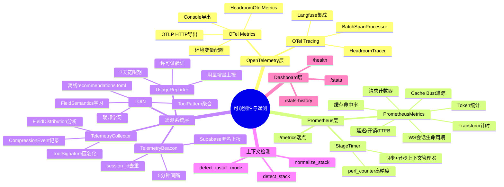
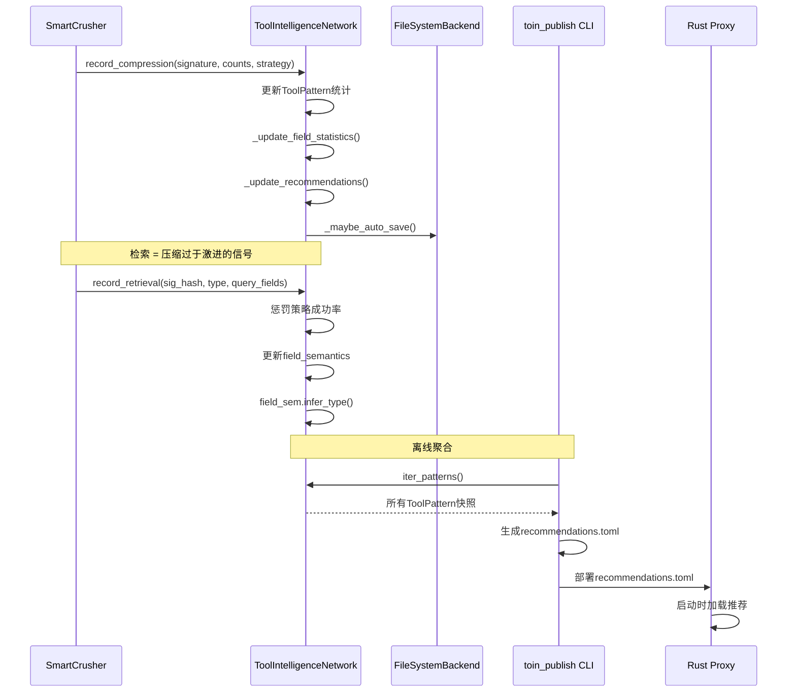

# 第15篇：可观测性与遥测 — 多层监控与智能学习系统

## 一、总述

Headroom 的可观测性与遥测系统采用**四层架构**，从内到外覆盖了从请求级计时到跨用户智能学习的完整链路：

1. **OpenTelemetry 集成层**：标准化的指标（OTEL Metrics）和追踪（OTEL Tracing / Langfuse），对接 Grafana、Datadog 等可观测性平台
2. **Prometheus 指标层**：内置 `/metrics` 端点，暴露请求计数、Token 统计、延迟分布、缓存命中率等核心运营指标
3. **遥测系统层**：匿名聚合信标（Supabase Beacon）+ TOIN（Tool Output Intelligence Network）+ TelemetryCollector，构成数据飞轮
4. **Dashboard 层**：`/stats`、`/stats-history`、`/health` 端点，提供实时和历史视图

四层系统遵循一个核心原则：**可观测性永远不能影响代理的正常运行**。任何遥测故障都会被静默吞掉，任何指标收集失败都不会阻断请求。



```mermaid
flowchart TD
    REQ[代理请求] --> ST[StageTimer计时]
    ST --> PIPE[压缩管线]
    PIPE --> PM[PrometheusMetrics]
    PIPE --> OM[HeadroomOtelMetrics]
    
    PM --> EXP[/metrics端点]
    OM --> OTLP[OTLP Collector]
    OM --> CONSOLE[Console输出]
    
    PIPE --> TC[TelemetryCollector]
    TC --> TOIN[TOIN学习]
    
    PIPE --> BEACON[TelemetryBeacon]
    BEACON --> SUPA[Supabase]
    
    PIPE --> UR[UsageReporter]
    UR --> CLOUD[Headroom Cloud]
    
    PM --> STATS[/stats端点]
    PM --> HIST[/stats-history端点]
    
    style PM fill:#e1f5fe
    style OM fill:#fff3e0
    style BEACON fill:#e8f5e9
    style TOIN fill:#f3e5f5
```

---

## 二、分述

### 2.1 OpenTelemetry集成

Headroom 的 OTEL 集成分为**指标**和**追踪**两个独立子系统，通过环境变量控制，与匿名遥测完全解耦。

#### 2.1.1 OTel Metrics

[HeadroomOtelMetrics](file:///workspace/headroom/observability/metrics.py) 是共享的 OTEL 指标门面，定义了 25+ 个标准指标：

**代理请求指标**：

| 指标名 | 类型 | 说明 |
|--------|------|------|
| `headroom.proxy.requests` | Counter | 总请求数 |
| `headroom.proxy.tokens.input` | Counter | 输入 Token |
| `headroom.proxy.tokens.saved` | Counter | 节省 Token |
| `headroom.proxy.request.duration` | Histogram | 端到端延迟 |
| `headroom.proxy.overhead.duration` | Histogram | Headroom 开销 |
| `headroom.proxy.ttfb.duration` | Histogram | 首字节时间 |

**压缩管线指标**：

| 指标名 | 类型 | 说明 |
|--------|------|------|
| `headroom.compression.runs` | Counter | 压缩运行次数 |
| `headroom.compression.tokens.saved` | Counter | 压缩节省 Token |
| `headroom.compression.pipeline.duration` | Histogram | 压缩管线耗时 |
| `headroom.compression.stage.duration` | Histogram | 单阶段耗时 |
| `headroom.compression.transforms` | Counter | 变换策略计数 |

**订阅窗口指标**（Anthropic OAuth）：

```python
self._meter.create_observable_gauge(
    "headroom.subscription.5h_utilization_pct",
    description="Anthropic 5-hour rate-limit window utilisation (0–100%).",
    callbacks=[_cb_5h_util],
)
```

Observable Gauge 通过回调模式实现，`record_subscription_window()` 更新支撑值，OTEL SDK 在采集时读取最新值。

**配置方式**：

```python
# 环境变量驱动
OTelMetricsConfig.from_env()
# HEADROOM_OTEL_METRICS_ENABLED=1
# HEADROOM_OTEL_METRICS_EXPORTER=otlp_http|console
# HEADROOM_OTEL_METRICS_ENDPOINT=http://127.0.0.1:4318/v1/metrics
```

[configure_otel_metrics()](file:///workspace/headroom/observability/metrics.py) 创建 `MeterProvider` + `PeriodicExportingMetricReader`，支持 OTLP HTTP 和 Console 两种导出器。

#### 2.1.2 OTel Tracing / Langfuse

[HeadroomTracer](file:///workspace/headroom/observability/tracing.py) 提供了标准化的 Span 创建接口：

```python
class HeadroomTracer:
    def start_as_current_span(self, name, *, attributes=None):
        return self._tracer.start_as_current_span(
            name, attributes=attributes,
            record_exception=True,
            set_status_on_exception=True,
        )
```

[LangfuseTracingConfig](file:///workspace/headroom/observability/tracing.py) 将 Langfuse 配置为 OTLP 追踪后端：

```python
@dataclass
class LangfuseTracingConfig:
    public_key: str   # LANGFUSE_PUBLIC_KEY
    secret_key: str   # LANGFUSE_SECRET_KEY
    base_url: str     # https://cloud.langfuse.com
    
    @property
    def endpoint(self) -> str:
        return f"{self.base_url}/api/public/otel/v1/traces"
    
    @property
    def auth_header(self) -> str:
        encoded = base64.b64encode(f"{self.public_key}:{self.secret_key}".encode()).decode()
        return f"Basic {encoded}"
```

Langfuse 集成使用 `BatchSpanProcessor` + `OTLPSpanExporter`，支持异步批量导出，不阻塞请求处理。

### 2.2 Prometheus指标与StageTimer

#### 2.2.1 PrometheusMetrics

[PrometheusMetrics](file:///workspace/headroom/proxy/prometheus_metrics.py) 是代理的核心指标收集器，维护了 50+ 个指标字段，覆盖请求、Token、延迟、缓存、WebSocket 等全维度：

**关键设计决策**：

1. **双锁策略**：`asyncio.Lock` 用于主指标更新（`record_request`），`threading.Lock` 用于阶段计时（`record_stage_timings`），避免 Prometheus 抓取时的字符串构建阻塞请求处理
2. **策略级计数**：`compressions_by_strategy` 和 `tokens_saved_by_strategy` 按压缩策略分桶，任何策略的静默回归在第一天就能被发现
3. **缓存感知**：`cache_by_provider` 按提供商追踪缓存读写、TTL 桶分布和 Bust 事件

```python
async def record_request(self, provider, model, input_tokens, output_tokens,
                         tokens_saved, latency_ms, cached=False, overhead_ms=0,
                         ttfb_ms=0, pipeline_timing=None, waste_signals=None,
                         cache_read_tokens=0, cache_write_tokens=0, ...):
    async with self._lock:
        # 更新所有计数器和直方图
        ...
    # 同时推送到 OTEL
    self._get_otel_metrics().record_proxy_request(...)
```

**Cache Bust 检测**：代理追踪压缩导致的缓存失效。当 Anthropic 的某个模型从"高缓存读取"突然变为"高缓存写入"时，标记为 Bust：

```python
if provider == "anthropic" and model_req_num > 0:
    total_cached = cache_read_tokens + cache_write_tokens
    if total_cached > 0 and cache_write_tokens > total_cached * 0.5:
        pc["bust_count"] += 1
        pc["bust_write_tokens"] += cache_write_tokens
```

#### 2.2.2 StageTimer

[StageTimer](file:///workspace/headroom/proxy/stage_timer.py) 是轻量级的请求级计时工具，同时支持同步和异步上下文管理器：

```python
timer = StageTimer()

with timer.measure("upstream_connect"):
    # 同步阶段
    ...

async with timer.measure("llm_inference"):
    # 异步阶段
    ...

summary = timer.summary()  # {"upstream_connect": 12.3, "llm_inference": 456.7}
```

**关键特性**：

- 使用 `time.perf_counter()` 实现单调、高精度计时
- `finally` 子句确保异常时也能记录部分耗时
- 并发 `measure()` 调用互不干扰，每个阶段独立记录
- `emit_stage_timings_log()` 输出结构化日志并推送到 Prometheus

```mermaid
flowchart LR
    subgraph 请求生命周期
        ST[StageTimer创建] --> M1[measure: upstream_connect]
        M1 --> M2[measure: compression]
        M2 --> M3[measure: llm_inference]
        M3 --> M4[measure: response_stream]
        M4 --> SUM[summary]
    end
    
    SUM --> LOG[结构化日志]
    SUM --> PM[PrometheusMetrics.record_stage_timings]
    SUM --> OM[OTEL stage_duration]
    
    PM --> EXP[/metrics端点]
    OM --> OTLP[OTLP Collector]
    
    style ST fill:#e1f5fe
    style SUM fill:#fff3e0
    style PM fill:#e8f5e9
```

### 2.3 遥测系统

遥测系统由三个独立但互补的子系统构成，分别服务于匿名产品改进、工具输出智能学习和许可证管理。

#### 2.3.1 TelemetryBeacon — 匿名聚合信标

[TelemetryBeacon](file:///workspace/headroom/telemetry/beacon.py) 每 5 分钟向 Supabase 发送一次匿名聚合统计：

**隐私保证**：

- 从不发送消息内容、API Key、提示词、工具结果或用户数据
- 只发送聚合计数：请求数、节省 Token、模型分布
- 所有通信通过 HTTPS
- 默认开启，可通过 `HEADROOM_TELEMETRY=off` 或 `--no-telemetry` 关闭

**身份字段**：

| 字段 | 来源 | 示例值 |
|------|------|--------|
| `session_id` | `uuid.uuid4().hex` | 每次代理运行唯一 |
| `instance_id` | `SHA256(hostname)[:16]` | 跨重启稳定的机器指纹 |
| `install_mode` | `detect_install_mode()` | `wrapped`/`persistent`/`on_demand` |
| `headroom_stack` | `detect_stack()` | `proxy`/`wrap_claude`/`mixed` |

[context.py](file:///workspace/headroom/telemetry/context.py) 中的 `normalize_stack()` 是标签基数的关键控制点：

```python
_STACK_SLUG_RE = re.compile(r"^[a-z][a-z0-9_]{0,63}$")
MAX_DISTINCT_STACKS = 32

def normalize_stack(raw: str | None) -> str | None:
    slug = raw.strip().lower()
    if not _STACK_SLUG_RE.match(slug):
        return None
    return slug
```

这确保了 Prometheus 标签和 Supabase 列的基数有界，防止任意 `X-Headroom-Stack` 头值导致标签爆炸。

#### 2.3.2 TOIN — Tool Output Intelligence Network

[TOIN](file:///workspace/headroom/telemetry/toin.py) 是 Headroom 最核心的智能学习系统，通过观察压缩和检索事件来学习工具输出的最优压缩策略。

**观察者契约（PR-B5）**：TOIN 只观察，永不修改请求时的压缩决策。请求路径是确定性的，TOIN 的角色是记录发生了什么，离线聚合器（`toin_publish`）在下次重启时生成 `recommendations.toml`。

**聚合键**：`(auth_mode, model_family, structure_hash)` — 每个租户切片和模型家族独立学习。

**核心数据结构**：

[ToolPattern](file:///workspace/headroom/telemetry/toin.py) 聚合了工具类型的全部学习结果：

```python
@dataclass
class ToolPattern:
    tool_signature_hash: str
    auth_mode: str = "unknown"
    model_family: str = "unknown"
    
    # 压缩统计
    total_compressions: int = 0
    avg_compression_ratio: float = 0.0
    avg_token_reduction: float = 0.0
    
    # 检索统计
    total_retrievals: int = 0
    full_retrievals: int = 0
    
    # 学习结果
    optimal_strategy: str = "default"
    optimal_max_items: int = 20
    skip_compression_recommended: bool = False
    preserve_fields: list[str] = field(default_factory=list)
    
    # 字段级语义
    field_semantics: dict[str, FieldSemantics] = field(default_factory=dict)
```

[FieldSemantics](file:///workspace/headroom/telemetry/models.py) 是 TOIN 的进化核心——从检索模式中学习字段语义：

```python
@dataclass
class FieldSemantics:
    field_hash: str  # SHA256[:8] of field name
    inferred_type: FieldSemanticType = "unknown"
    confidence: float = 0.0
    
    def infer_type(self) -> None:
        """纯数据驱动的语义推断算法"""
        # IDENTIFIER: 高唯一性 + 精确匹配查询
        if uniqueness_ratio > 0.8 and equals_ratio > 0.7:
            inferred = "identifier"
        # ERROR_INDICATOR: 有主导默认值 + 检索非默认值
        elif has_dominant_default and non_default_retrieval_ratio > 0.7:
            inferred = "error_indicator"
        # STATUS: 低唯一性 + 特定值检索
        elif uniqueness_ratio < 0.2 and retrieval_diversity < 0.5:
            inferred = "status"
```



#### 2.3.3 UsageReporter — 许可证与用量上报

[UsageReporter](file:///workspace/headroom/telemetry/reporter.py) 负责许可证验证和增量用量上报：

**许可证生命周期**：

1. 启动时验证 `license_key` → 获取 `LicenseInfo`（status: active/trial/expired/invalid）
2. 缓存到本地文件，7 天宽限期内即使云端不可达也允许使用
3. 每 300 秒发送增量用量（delta 计算：当前值 - 上次快照值）
4. 云端返回过期状态时更新本地缓存

**隐私保证**：从不发送消息内容、API Key、提示词、工具结果或用户数据，只发送聚合计数。

### 2.4 Dashboard与端点

Headroom 提供三个核心 HTTP 端点用于实时监控：

| 端点 | 用途 | 数据来源 |
|------|------|----------|
| `/stats` | 实时会话统计 | `PrometheusMetrics` + `CostTracker` + `SavingsTracker` |
| `/stats-history` | 历史节省趋势 | `SavingsTracker` 持久化文件 |
| `/metrics` | Prometheus 抓取 | `PrometheusMetrics.export()` |
| `/health` | 健康检查 | 版本 + 运行时间 |

`/stats` 端点返回的 JSON 包含 `otel` 和 `langfuse` 块，报告 OTEL/Langfuse 的配置状态，方便运维确认集成是否生效。

`/stats-history` 支持多种时间粒度（hourly/daily/weekly/monthly）和导出格式（JSON/CSV），为 Dashboard 提供图表数据。

---

## 三、总结

Headroom 的可观测性与遥测系统体现了"**分层观测、智能学习、隐私优先**"的工程哲学：

1. **分层观测**：StageTimer（请求级）→ PrometheusMetrics（会话级）→ OTEL（平台级）→ Beacon/TOIN（跨用户级），每层有独立的价值和受众
2. **智能学习**：TOIN 从压缩/检索事件中学习字段语义和最优策略，通过离线聚合避免请求时变异，实现"观察不干预"
3. **隐私优先**：所有遥测数据只记录模式不记录值，字段名 SHA256 哈希，工具名结构哈希，用户标识匿名化
4. **故障隔离**：任何遥测故障（网络超时、Supabase 宕机、文件写入失败）都不会影响代理正常运行
5. **双通道指标**：Prometheus `/metrics` 满足运维需求，OTEL 满足平台集成需求，两者独立控制

```mermaid
graph TB
    subgraph 请求路径
        REQ[代理请求] --> STAGE[StageTimer]
        STAGE --> COMP[压缩管线]
    end
    
    subgraph 指标通道
        COMP --> PM[PrometheusMetrics]
        COMP --> OM[OTEL Metrics]
        PM --> MET[/metrics]
        OM --> OTLP[OTLP Collector]
    end
    
    subgraph 学习通道
        COMP --> TC[TelemetryCollector]
        COMP --> TOIN[TOIN]
        TC --> EXP[export_stats]
        TOIN --> TOML[recommendations.toml]
    end
    
    subgraph 遥测通道
        COMP --> BEACON[Beacon → Supabase]
        COMP --> REPORTER[Reporter → Cloud]
    end
    
    subgraph 可视化
        PM --> STATS[/stats Dashboard]
        PM --> HIST[/stats-history]
        MET --> GRAF[Grafana]
        OTLP --> GRAF
    end
    
    TOML -.->|下次重启| COMP
    
    style STAGE fill:#e1f5fe
    style PM fill:#fff3e0
    style TOIN fill:#f3e5f5
    style BEACON fill:#e8f5e9
```

这套系统的核心价值在于：它让 Headroom 从"静态配置"进化为"动态学习"——TOIN 的数据飞轮效应确保了更多用户 → 更多压缩事件 → 更好的聚合推荐 → 更少的 Token 浪费，同时严格保护用户隐私。
