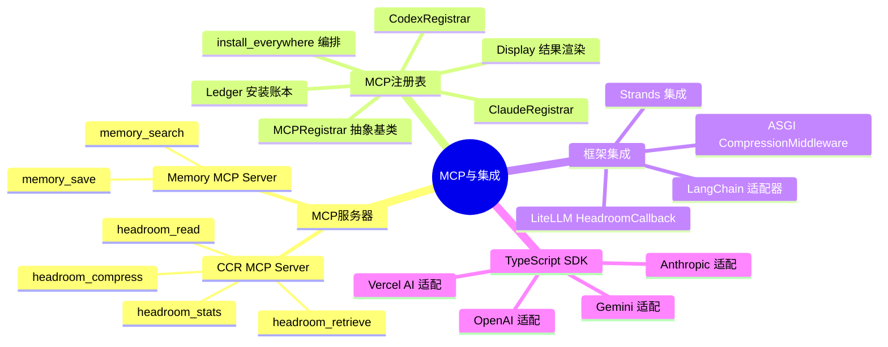
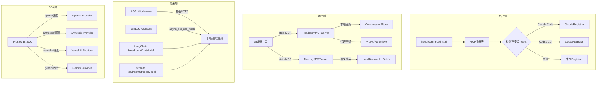
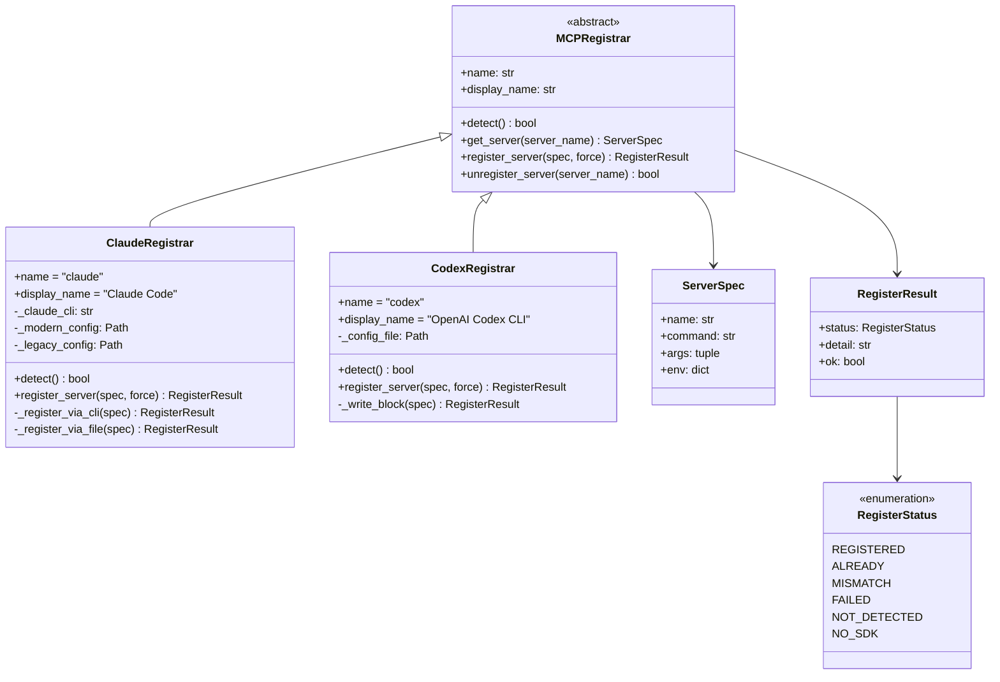
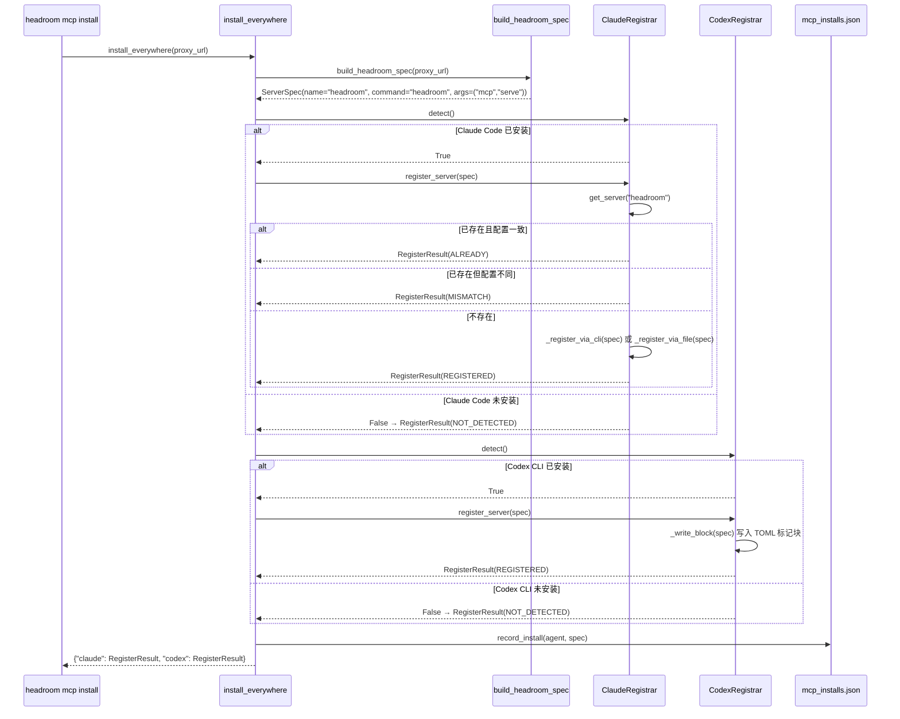
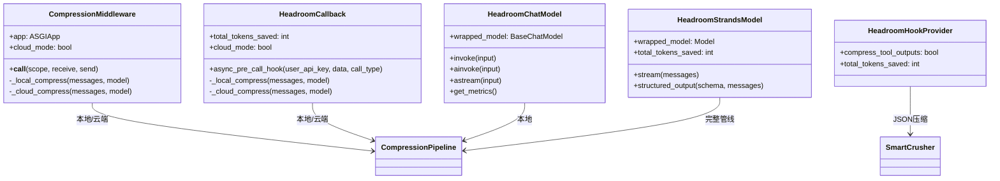
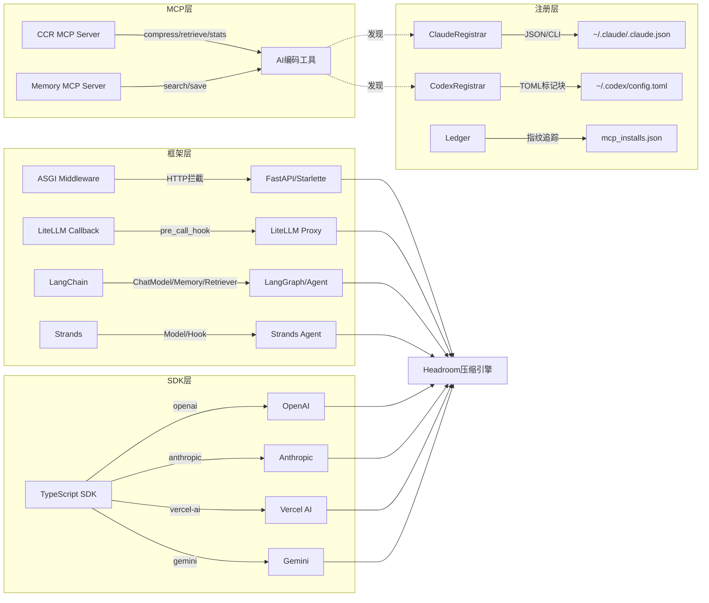

# 第16篇：MCP与集成

## 总：概述

Headroom 的 MCP（Model Context Protocol）与集成层是其生态扩展的核心枢纽。通过 MCP 协议，Headroom 将上下文压缩、内容检索、会话统计等核心能力以工具（Tool）形式暴露给任何兼容 MCP 的 AI 编码工具——Claude Code、Cursor、Codex 等。与此同时，MCP 注册表（Registry）负责将 Headroom MCP 服务器自动注册到各 AI 工具的配置中，实现"一行命令安装"的零摩擦体验。在框架集成层面，Headroom 通过 ASGI 中间件、LiteLLM 回调、LangChain 适配器、Strands 集成以及 TypeScript SDK，将压缩能力渗透到 Python 和 JavaScript 生态的每一个角落。





---

## 分：MCP服务器

### CCR MCP Server

CCR（Context Compression & Retrieval）MCP Server 是 Headroom 对外暴露压缩能力的核心入口，定义在 [mcp_server.py](file:///workspace/headroom/ccr/mcp_server.py) 中。它通过 stdio 传输运行，提供四个工具：

| 工具名 | 功能 | 关键参数 |
|--------|------|----------|
| `headroom_compress` | 按需压缩内容 | `content`（必填） |
| `headroom_retrieve` | 按 hash 检索原始内容 | `hash`（必填）、`query`（可选） |
| `headroom_stats` | 会话压缩统计 | 无 |
| `headroom_read` | 文件读取+缓存（Feature Flag） | `file_path`（必填）、`fresh`（可选） |

核心类 `HeadroomMCPServer` 的设计遵循"本地优先、代理回退"原则：

```python
# [mcp_server.py](file:///workspace/headroom/ccr/mcp_server.py) L308-322
class HeadroomMCPServer:
    """MCP Server exposing Headroom's context engineering toolkit.

    Modes:
        Standalone: Compression + retrieval happen locally. No proxy needed.
        With proxy: Retrieval also checks the proxy's compression store
                   (for content compressed by the proxy's automatic pipeline).
    """
```

检索流程的分层策略：先查本地 `CompressionStore`，再回退到代理 HTTP 端点：

```python
# [mcp_server.py](file:///workspace/headroom/ccr/mcp_server.py) L405-453
async def _retrieve_content(self, hash_key, query):
    # Check local store first
    store = self._get_local_store()
    if query:
        results = store.search(hash_key, query)
        if results:
            return {"hash": hash_key, "source": "local", ...}
    else:
        entry = store.retrieve(hash_key)
        if entry:
            return {"hash": hash_key, "source": "local", ...}

    # Fall back to proxy if available
    if self.check_proxy and HTTPX_AVAILABLE:
        result = await self._retrieve_via_proxy(hash_key, query)
        if "error" not in result:
            result["source"] = "proxy"
            return result
```

跨进程统计聚合通过共享 JSONL 文件实现，支持主会话和子代理的统计合并：

```python
# [mcp_server.py](file:///workspace/headroom/ccr/mcp_server.py) L179-193
def _append_shared_event(event):
    SHARED_STATS_DIR.mkdir(parents=True, exist_ok=True)
    event["pid"] = os.getpid()
    line = json.dumps(event, separators=(",", ":")) + "\n"
    with open(SHARED_STATS_FILE, "a") as f:
        if _HAS_FCNTL:
            fcntl.flock(f, fcntl.LOCK_EX)
        f.write(line)
        if _HAS_FCNTL:
            fcntl.flock(f, fcntl.LOCK_UN)
```

### Memory MCP Server

Memory MCP Server 将 Headroom 的持久化记忆后端暴露为 MCP 工具，定义在 [memory/mcp_server.py](file:///workspace/headroom/memory/mcp_server.py) 中。它提供两个工具：

- **`memory_search`**：语义搜索已存储的记忆，支持 `top_k` 参数控制返回数量
- **`memory_save`**：保存原子化事实到持久化存储，支持自动替代（supersede）语义相似度 ≥ 0.70 的已有记忆

启动时预热嵌入模型并补全缺失向量的记忆条目：

```python
# [mcp_server.py](file:///workspace/headroom/memory/mcp_server.py) L115-148
async def _warm_up_backend(backend, user_id):
    await backend._ensure_initialized()
    hm = backend._hierarchical_memory
    # Force-load the embedder now (not lazily on first search)
    _dummy = await hm._embedder.embed("warmup")

    # Ensure ALL memories are in the vector index
    all_memories = await backend.get_user_memories(user_id, limit=500)
    memories_missing_embeddings = [mem for mem in all_memories if mem.embedding is None]
    if memories_missing_embeddings:
        embeddings = await hm._embedder.embed_batch(
            [mem.content for mem in memories_missing_embeddings]
        )
        for mem, embedding in zip(memories_missing_embeddings, embeddings):
            mem.embedding = embedding
        await hm._store.save_batch(memories_missing_embeddings)
```

---

## 分：MCP注册表

### 架构设计

MCP 注册表的核心设计思想是：**MCP 协议本身是通用的，但每个 AI 工具发现 MCP 服务器的方式各不相同**。因此，注册表采用策略模式，为每个 Agent 定义独立的 Registrar。



### 注册流程时序



### ClaudeRegistrar：双路径注册

[ClaudeRegistrar](file:///workspace/headroom/mcp_registry/claude.py) 支持 CLI 和文件两种注册路径。优先使用 `claude mcp add` CLI 命令（现代 Claude Code 2.x），失败时回退到直接编辑 JSON 配置文件：

```python
# [claude.py](file:///workspace/headroom/mcp_registry/claude.py) L109-129
def _register_via_cli(self, spec):
    cmd = [str(self._claude_cli), "mcp", "add", spec.name, "-s", "user"]
    for k, v in spec.env.items():
        cmd += ["-e", f"{k}={v}"]
    cmd += ["--", spec.command, *spec.args]

    result = subprocess.run(cmd, capture_output=True, text=True)
    if result.returncode == 0:
        return RegisterResult(RegisterStatus.REGISTERED, "via `claude mcp add`")
    # CLI failed — try the file fallback
    file_result = self._register_via_file(spec)
    ...
```

### CodexRegistrar：标记块保护

[CodexRegistrar](file:///workspace/headroom/mcp_registry/codex.py) 使用 TOML 标记块（marker-delimited block）来保护 Headroom 写入的配置段，避免误删用户手动配置的同名条目：

```python
# [codex.py](file:///workspace/headroom/mcp_registry/codex.py) L27-28
_MARKER_START = "# --- Headroom MCP server ---"
_MARKER_END = "# --- end Headroom MCP server ---"
```

### 安装账本（Ledger）

[Ledger](file:///workspace/headroom/mcp_registry/ledger.py) 记录 Headroom 代替用户安装的 MCP 服务器信息，通过 `spec_fingerprint` 确保卸载时只移除 Headroom 安装的条目：

```python
# [ledger.py](file:///workspace/headroom/mcp_registry/ledger.py) L29-38
def spec_fingerprint(spec):
    payload = {
        "name": spec.name,
        "command": spec.command,
        "args": list(spec.args),
        "env": dict(sorted(spec.env.items())),
    }
    raw = json.dumps(payload, sort_keys=True, separators=(",", ":")).encode("utf-8")
    return hashlib.sha256(raw).hexdigest()
```

---

## 分：框架集成

### ASGI 中间件

[CompressionMiddleware](file:///workspace/headroom/integrations/asgi.py) 是一个即插即用的 ASGI 中间件，支持 FastAPI、Starlette、LiteLLM Proxy 等任何 ASGI 应用。它拦截发往 LLM 端点的 POST 请求，压缩消息后转发，并在响应头中注入压缩指标：

```python
# [asgi.py](file:///workspace/headroom/integrations/asgi.py) L42-47
_LLM_PATHS = (
    "/v1/messages",          # Anthropic
    "/v1/chat/completions",  # OpenAI
    "/v1/responses",         # OpenAI Responses API
    "/chat/completions",     # LiteLLM
)
```

中间件支持本地和云端两种压缩模式，通过 `api_key` 参数切换：

```python
# [asgi.py](file:///workspace/headroom/integrations/asgi.py) L86-89
@property
def cloud_mode(self) -> bool:
    """Whether cloud compression is enabled."""
    return self._api_key is not None
```

### LiteLLM 回调

[HeadroomCallback](file:///workspace/headroom/integrations/litellm_callback.py) 实现 LiteLLM 的 `CustomLogger` 接口（`async_pre_call_hook`），在每次 API 调用前压缩消息：

```python
# [litellm_callback.py](file:///workspace/headroom/integrations/litellm_callback.py) L84-122
async def async_pre_call_hook(self, user_api_key, data, call_type):
    if call_type not in ("completion", "acompletion"):
        return data

    messages = data.get("messages", [])
    model = data.get("model", "")

    if not messages:
        return data

    if self._api_key:
        result = await self._cloud_compress(messages, model)
    else:
        result = self._local_compress(messages, model)

    if result and result.get("tokens_saved", 0) > 0 and "messages" in result:
        data["messages"] = result["messages"]
        self._total_saved += result["tokens_saved"]

    return data
```

### LangChain 集成

LangChain 集成提供了六种集成模式，覆盖聊天模型、记忆、检索器、Agent 工具、流式指标和 LangSmith 追踪：

| 集成类 | 功能 | 核心方法 |
|--------|------|----------|
| `HeadroomChatModel` | 包装任意 BaseChatModel | `invoke` / `ainvoke` / `astream` |
| `HeadroomChatMessageHistory` | 自动压缩聊天历史 | `compress_threshold_tokens` |
| `HeadroomDocumentCompressor` | BM25 式文档过滤 | `max_documents` / `min_relevance` |
| `wrap_tools_with_headroom` | 工具输出压缩 | `min_chars_to_compress` |
| `StreamingMetricsTracker` | 流式指标追踪 | `add_chunk` / `finish` |
| `HeadroomLangSmithCallbackHandler` | LangSmith 追踪集成 | 自动注入 headroom 指标 |

### Strands 集成

Strands 集成提供两种模式：模型包装（`HeadroomStrandsModel`）和 Hook 提供者（`HeadroomHookProvider`）。模型包装压缩完整消息列表，Hook 提供者压缩单个工具结果，两者可叠加使用获得最大节省。



---

## 分：TypeScript SDK

[TypeScript SDK](file:///workspace/sdk/typescript/package.json)（`headroom-ai` npm 包 v0.22.4）为 JavaScript/TypeScript 生态提供压缩能力，支持四种框架适配器：

| 导出路径 | 适配框架 | Peer 依赖 |
|----------|----------|-----------|
| `headroom-ai/vercel-ai` | Vercel AI SDK | `ai` >= 6.0.0, `@ai-sdk/provider` >= 1.0.0 |
| `headroom-ai/openai` | OpenAI SDK | `openai` >= 4.0.0 |
| `headroom-ai/anthropic` | Anthropic SDK | `@anthropic-ai/sdk` >= 0.30.0 |
| `headroom-ai/gemini` | Google Gemini | — |

SDK 同时提供 ESM 和 CJS 双格式输出，通过 `exports` 字段的条件导出实现：

```json
// [package.json](file:///workspace/sdk/typescript/package.json) L14-25
"exports": {
    ".": {
        "import": { "types": "./dist/index.d.ts", "default": "./dist/index.js" },
        "require": { "types": "./dist/index.d.cts", "default": "./dist/index.cjs" }
    },
    "./vercel-ai": { ... },
    "./openai": { ... },
    "./anthropic": { ... },
    "./gemini": { ... }
}
```

所有 peer 依赖均为可选（`"optional": true`），确保用户只安装实际使用的框架依赖。

---

## 总：总结

Headroom 的 MCP 与集成层构建了一个从协议层到框架层、从 Python 到 TypeScript 的完整生态矩阵。其核心设计哲学可归纳为三点：

1. **协议标准化**：MCP 协议作为统一接口，让任何兼容工具都能零成本接入 Headroom 的压缩能力，而注册表系统则解决了"如何让工具发现 MCP 服务器"的最后一公里问题。

2. **分层回退**：从本地压缩到代理回退，从 CLI 注册到文件注册，从本地模式到云端模式，每一层都有优雅的降级策略，确保在任何环境下都能工作。

3. **生态渗透**：通过 ASGI 中间件、LiteLLM 回调、LangChain 适配器、Strands 集成和 TypeScript SDK，Headroom 的压缩能力可以嵌入到几乎所有主流 LLM 开发框架中，实现"一行代码接入"。



这张协作图揭示了 Headroom 集成架构的终极目标：**无论用户使用什么工具、什么框架、什么语言，Headroom 都能以最小的侵入性提供上下文压缩能力**。MCP 层服务 AI 编码工具，注册层解决自动发现，框架层覆盖 Python 应用开发，SDK 层覆盖 JavaScript/TypeScript 生态——四层协同，形成完整的集成闭环。
