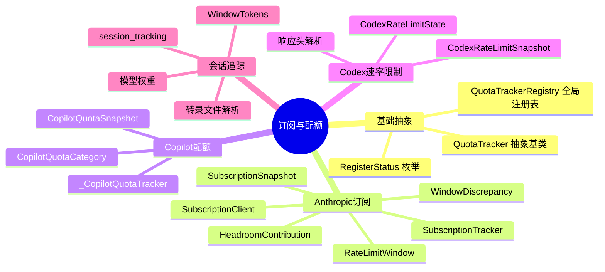
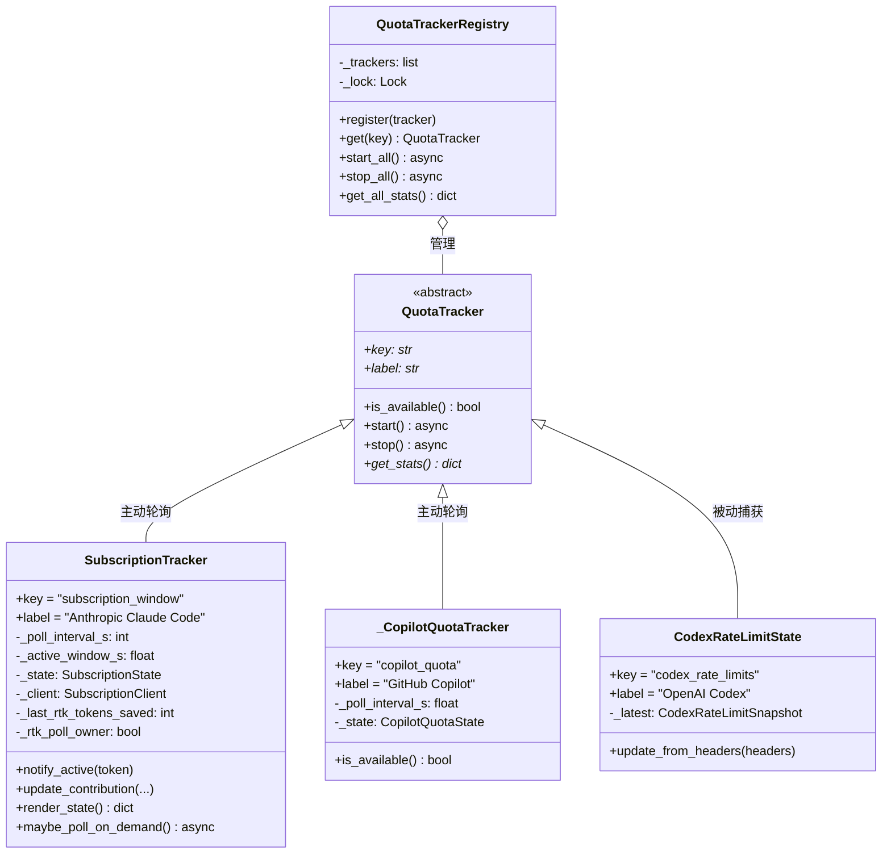
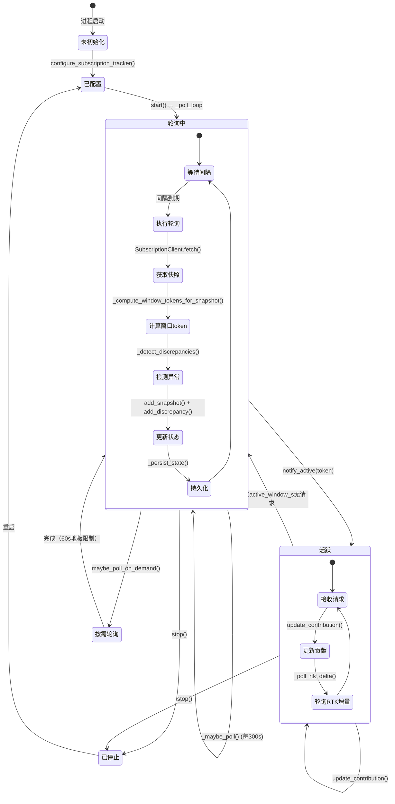

# 第17篇：订阅与配额

## 总：概述

Headroom 的订阅与配额系统是一个多提供商、多策略的统一追踪框架。它监控三大 AI 编码工具的用量窗口——Anthropic Claude Code 的 OAuth 订阅窗口、GitHub Copilot 的月度配额、OpenAI Codex 的速率限制——并通过可插拔的 `QuotaTracker` 抽象将它们统一注册到一个全局注册表中。系统不仅追踪"用了多少"，还通过转录文件（transcript）分析检测异常（如激增定价、缓存未命中），并量化 Headroom 自身的贡献（压缩节省、CLI 过滤节省、缓存读取节省、RTK 节省）。



```mermaid
flowchart
    subgraph 数据源
        A[Anthropic OAuth API<br/>GET /api/oauth/usage]
        B[GitHub API<br/>GET /copilot_internal/user]
        C[Codex响应头<br/>x-codex-*]
        D[Claude转录文件<br/>~/.claude/projects/**/*.jsonl]
    end

    subgraph 追踪器
        E[SubscriptionTracker<br/>key=subscription_window]
        F[_CopilotQuotaTracker<br/>key=copilot_quota]
        G[CodexRateLimitState<br/>key=codex_rate_limits]
    end

    subgraph 注册表
        H[QuotaTrackerRegistry]
    end

    subgraph 消费者
        I[/stats 端点]
        J[Dashboard]
        K[OTEL Metrics]
    end

    A -->|5min轮询| E
    B -->|60s轮询| F
    C -->|被动捕获| G
    D -->|转录分析| E

    E --> H
    F --> H
    G --> H

    H --> I
    H --> J
    H --> K
```

---

## 分：订阅架构

### QuotaTracker 抽象与注册表

[base.py](file:///workspace/headroom/subscription/base.py) 定义了整个订阅追踪体系的骨架。`QuotaTracker` 是每个提供商追踪器必须继承的抽象基类，`QuotaTrackerRegistry` 是进程级全局注册表：

```python
# [base.py](file:///workspace/headroom/subscription/base.py) L38-99
class QuotaTracker(abc.ABC):
    """Abstract base for a single AI-tool quota / rate-limit tracker."""

    @property
    @abc.abstractmethod
    def key(self) -> str:
        """Stats key used in /stats and the dashboard. Must be unique."""

    @property
    @abc.abstractmethod
    def label(self) -> str:
        """Human-readable name for log messages."""

    def is_available(self) -> bool:
        """Return True if this tracker should be activated."""
        return True

    async def start(self) -> None: ...   # launch background poll
    async def stop(self) -> None: ...    # cancel poll task

    @abc.abstractmethod
    def get_stats(self) -> dict[str, Any] | None:
        """Return the current snapshot as a serialisable dict, or None."""
```

注册表通过双重检查锁定实现线程安全的单例模式，并拒绝重复 key 的注册：

```python
# [base.py](file:///workspace/headroom/subscription/base.py) L135-144
def register(self, tracker: QuotaTracker) -> None:
    with self._lock:
        existing_keys = {t.key for t in self._trackers}
        if tracker.key in existing_keys:
            raise ValueError(
                f"A tracker with key '{tracker.key}' is already registered."
            )
        self._trackers.append(tracker)
```

### 类层次结构



三大追踪器的工作模式截然不同：

| 追踪器 | 模式 | 数据源 | 轮询间隔 |
|--------|------|--------|----------|
| `SubscriptionTracker` | 主动轮询 | Anthropic OAuth API | 300s（活跃时） |
| `_CopilotQuotaTracker` | 主动轮询 | GitHub Copilot API | 60s |
| `CodexRateLimitState` | 被动捕获 | API 响应头 | 无（随请求更新） |

### SubscriptionClient：OAuth 令牌解析

[SubscriptionClient](file:///workspace/headroom/subscription/client.py) 封装了 Anthropic 的 OAuth 用量端点，支持三级令牌解析：

```python
# [client.py](file:///workspace/headroom/subscription/client.py) L51-80
def read_cached_oauth_token():
    # 1. Env var
    env_token = os.environ.get("CLAUDE_CODE_OAUTH_TOKEN", "").strip()
    if env_token:
        return env_token

    # 2. Credentials file
    creds = _load_credentials_file()
    oauth = creds.get("claudeAiOauth") or {}
    token = oauth.get("accessToken") or ""

    # Check expiry (Anthropic stores timestamp in milliseconds)
    expires_at_ms = oauth.get("expiresAt")
    if expires_at_ms is not None:
        now_ms = time.time() * 1000
        if now_ms >= (expires_at_ms - _TOKEN_EXPIRY_BUFFER_S * 1000):
            return None

    return token
```

---

## 分：配额管理

### Anthropic 订阅窗口

[SubscriptionTracker](file:///workspace/headroom/subscription/tracker.py) 是最复杂的追踪器，它不仅轮询 Anthropic API，还执行转录分析、异常检测和 Headroom 贡献量化。

**数据模型层次**（定义在 [models.py](file:///workspace/headroom/subscription/models.py)）：

| 模型 | 用途 |
|------|------|
| `RateLimitWindow` | 单个滚动窗口（5h/7d）的用量数据 |
| `SubscriptionSnapshot` | 一次 API 轮询的完整快照 |
| `WindowTokens` | 转录文件导出的窗口 token 分解 |
| `HeadroomContribution` | Headroom 各层节省的 token 量化 |
| `WindowDiscrepancy` | 检测到的异常（激增定价/缓存未命中） |
| `ExtraUsage` | 超额使用块 |
| `SubscriptionState` | 追踪器完整持久化状态 |

**Headroom 贡献量化**：

```python
# [models.py](file:///workspace/headroom/subscription/models.py) L374-452
@dataclass
class HeadroomContribution:
    tokens_submitted: int = 0           # 代理实际转发的输入 token
    tokens_saved_compression: int = 0   # 代理压缩移除的 token
    tokens_saved_cli_filtering: int = 0 # CLI 上下文工具过滤的 token
    tokens_saved_rtk: int = 0           # RTK 节省的 token
    tokens_saved_cache_reads: int = 0   # 前缀缓存命中的 token

    def total_saved(self) -> int:
        return (self.tokens_saved_compression
                + self.cli_filtering_saved()
                + self.tokens_saved_cache_reads)

    def efficiency_pct(self) -> float:
        raw = self.raw_without_headroom()
        if raw == 0:
            return 0.0
        return round(self.total_saved() / raw * 100, 1)
```

**异常检测**：系统通过对比转录文件推算的预期用量与 API 报告的实际用量，检测两种异常：

1. **激增定价（surge_pricing）**：实际利用率比预期高 >15%，可能存在隐藏的权重加成
2. **缓存未命中（cache_miss）**：缓存读取率 <10% 且输入 token >50K，前缀缓存未有效利用

```python
# [tracker.py](file:///workspace/headroom/subscription/tracker.py) L883-928
def _detect_discrepancies(snapshot, window_tokens):
    discrepancies = []

    # Surge pricing detection
    if snapshot.five_hour.limit > 0 and window_tokens.weighted_token_equivalent > 0:
        expected_pct = window_tokens.weighted_token_equivalent / snapshot.five_hour.limit * 100
        actual_pct = snapshot.five_hour.utilization_pct
        delta = actual_pct - expected_pct
        if delta > _SURGE_THRESHOLD_PCT:
            discrepancies.append(WindowDiscrepancy(kind="surge_pricing", ...))

    # Cache miss detection
    total_input = window_tokens.input
    total_cache_reads = window_tokens.cache_reads
    if total_input > 50_000 and total_cache_reads < total_input * _CACHE_MISS_RATIO_THRESHOLD:
        discrepancies.append(WindowDiscrepancy(kind="cache_miss", ...))

    return discrepancies
```

### GitHub Copilot 配额

[_CopilotQuotaTracker](file:///workspace/headroom/subscription/copilot_quota.py) 通过 GitHub API 轮询 Copilot 的月度配额，追踪三个使用类别：`chat`、`completions`、`premium_interactions`。

令牌发现顺序：

```python
# [copilot_quota.py](file:///workspace/headroom/subscription/copilot_quota.py) L49-54
_TOKEN_ENV_VARS = [
    "GITHUB_COPILOT_GITHUB_TOKEN",
    "GITHUB_TOKEN",
    "COPILOT_GITHUB_TOKEN",
    "GITHUB_COPILOT_API_TOKEN",
]
```

每个类别的配额数据包含：`entitlement`（总额）、`remaining`（剩余）、`overage_count`（超额次数）、`unlimited`（是否无限）。

### Codex 速率限制

[CodexRateLimitState](file:///workspace/headroom/subscription/codex_rate_limits.py) 是一个被动追踪器，从 Codex API 响应头中提取速率限制数据：

```python
# [codex_rate_limits.py](file:///workspace/headroom/subscription/codex_rate_limits.py) L167-192
def parse_codex_rate_limits(headers):
    prefix = "x-codex"
    primary = _parse_window(headers, prefix, "primary")
    secondary = _parse_window(headers, prefix, "secondary")
    credits = _parse_credits(headers)

    if primary is None and secondary is None and credits is None:
        return None  # Not a Codex response

    return CodexRateLimitSnapshot(
        primary=primary,
        secondary=secondary,
        credits=credits,
    )
```

---

## 分：会话追踪

### 转录文件分析

[session_tracking.py](file:///workspace/headroom/subscription/session_tracking.py) 解析 Claude Code 的转录 JSONL 文件（`~/.claude/projects/**/*.jsonl`），按时间窗口聚合 token 用量。这是异常检测和 Headroom 贡献量化的数据基础。

**模型权重**（Sonnet 归一化）：

| 模型族 | 权重 | 说明 |
|--------|------|------|
| opus | 2.0× | 更高的速率限制成本 |
| sonnet | 1.0× | 基线 |
| haiku | 0.5× | 更便宜，更低的速率限制成本 |

```python
# [session_tracking.py](file:///workspace/headroom/subscription/session_tracking.py) L32-37
MODEL_FAMILY_WEIGHTS = {
    "opus": 2.0,
    "sonnet": 1.0,
    "haiku": 0.5,
}
```

`compute_window_tokens` 函数遍历所有转录文件，按时间窗口过滤并聚合：

```python
# [session_tracking.py](file:///workspace/headroom/subscription/session_tracking.py) L109-174
def compute_window_tokens(start_ts, end_ts):
    totals = WindowTokens()
    by_model = {}

    for path in find_transcript_files():
        for line in _read_transcript_lines(path):
            entry = json.loads(line)
            # Filter by timestamp window
            if ts < start_ts or ts >= end_ts:
                continue
            # Aggregate usage
            _add_usage_to_tokens(totals, usage)
            # Per-model breakdown
            if model_id:
                _add_usage_to_tokens(by_model[model_id], usage)

    # Compute Sonnet-normalised weighted equivalent
    weighted = sum(_total_token_count(mt) * get_model_weight(mid)
                   for mid, mt in by_model.items())
    totals.weighted_token_equivalent = weighted
    return totals
```

### 状态持久化与恢复

SubscriptionTracker 使用原子写入（`tempfile` + `os.replace`）持久化状态，确保跨重启不丢失贡献计数器：

```python
# [tracker.py](file:///workspace/headroom/subscription/tracker.py) L779-795
def _persist_state(self):
    with tempfile.NamedTemporaryFile(
        mode="w", dir=self._persist_path.parent,
        delete=False, suffix=".tmp", encoding="utf-8"
    ) as fh:
        json.dump(data, fh, indent=2)
        tmp_path = fh.name
    os.replace(tmp_path, self._persist_path)
```

加载时兼容新旧格式，特别是 RTK 计数器的迁移：

```python
# [tracker.py](file:///workspace/headroom/subscription/tracker.py) L830-843
is_legacy_state = "rtk_raw" not in saved
if is_legacy_state:
    # Pre-G2 semantic: rtk == cli_filtering. Carry forward.
    legacy_rtk_value = int(saved.get("rtk", cli_filtering))
    c.tokens_saved_rtk = legacy_rtk_value
else:
    c.tokens_saved_rtk = int(saved.get("rtk_raw", 0))
```

### 多 Worker 轮询去重

在多 uvicorn worker 部署中，每个 worker 独立运行追踪器，但 RTK 轮询需要去重以避免重复计数。通过文件锁实现 owner 选举：

```python
# [tracker.py](file:///workspace/headroom/subscription/tracker.py) L461-510
def _try_acquire_rtk_poll_lock(self) -> bool:
    if self._rtk_poll_owner is not None:
        return self._rtk_poll_owner

    lock_path = self._rtk_poll_lock_path()
    fd = open(lock_path, "w")
    fcntl.flock(fd, fcntl.LOCK_EX | fcntl.LOCK_NB)  # Non-blocking
    self._rtk_poll_lock_fd = fd
    self._rtk_poll_owner = True
    return True
```

### 会话状态流转



### 窗口重置后的渲染合成

当 5h 窗口在两次轮询之间重置时，缓存的 `utilization_pct` 已过时。`render_state()` 方法通过本地转录数据合成重置后的窗口状态，避免向用户展示错误的旧数据：

```python
# [models.py](file:///workspace/headroom/subscription/models.py) L112-227
def synthesize_window_render(window, *, used_since_reset, window_duration, window_name):
    if window is None or window.resets_at is None:
        return cached

    if current_now < window.resets_at:
        return cached  # 还没重置，使用缓存值

    # Past the reset boundary — synthesize
    capped_used = min(used_since_reset, limit)  # 永远不报告>100%
    next_reset = window.resets_at
    while next_reset <= current_now:
        next_reset = next_reset + window_duration

    return {
        "used": capped_used,
        "utilization_pct": round(capped_used / limit * 100, 2),
        "resets_at": _to_utc_iso(next_reset),
        "synthesized": True,
        "resets_at_estimated": True,
    }
```

---

## 总：总结

Headroom 的订阅与配额系统是一个精心设计的多提供商追踪框架，其核心价值在于三点：

1. **统一抽象**：`QuotaTracker` + `QuotaTrackerRegistry` 将 Anthropic、GitHub、OpenAI 三种截然不同的配额追踪模式（主动轮询 vs 被动捕获）统一到同一个接口下，新增提供商只需实现一个类。

2. **深度洞察**：不仅追踪"用了多少"，还通过转录文件分析推算"应该用多少"，从而检测激增定价和缓存未命中等异常，为用户提供超越 API 原生能力的透明度。

3. **贡献量化**：`HeadroomContribution` 精确量化了压缩、CLI 过滤、缓存命中、RTK 四个层面的 token 节省，并通过 `efficiency_pct` 给出直观的效率百分比，让用户清楚看到 Headroom 的价值。

```mermaid
flowchart TB
    subgraph 数据采集层
        A1[Anthropic OAuth API] -->|5min轮询| B1[SubscriptionTracker]
        A2[GitHub Copilot API] -->|60s轮询| B2[_CopilotQuotaTracker]
        A3[Codex响应头] -->|被动捕获| B3[CodexRateLimitState]
        A4[Claude转录JSONL] -->|按需扫描| B4[session_tracking]
    end

    subgraph 处理层
        B1 --> C1[SubscriptionSnapshot]
        B1 --> C2[HeadroomContribution]
        B1 --> C3[WindowDiscrepancy]
        B4 --> C4[WindowTokens]
        B2 --> C5[CopilotQuotaSnapshot]
        B3 --> C6[CodexRateLimitSnapshot]
    end

    subgraph 注册表层
        C1 --> D[QuotaTrackerRegistry]
        C2 --> D
        C3 --> D
        C5 --> D
        C6 --> D
    end

    subgraph 消费层
        D --> E1[/stats API]
        D --> E2[Dashboard]
        D --> E3[OTEL Metrics]
        C3 --> E4[异常告警]
        C2 --> E5[效率报告]
    end

    subgraph 持久化
        B1 -->|原子写入| F1[subscription_state.json]
        B1 -->|文件锁| F2[.rtk_poll_lock]
    end
```

这张协作图展示了从数据采集到消费的完整链路。三大追踪器各自独立运行，通过注册表统一暴露，而转录分析为 Anthropic 追踪器提供了额外的洞察维度。持久化机制确保跨重启不丢失数据，多 Worker 去重确保集群部署的正确性——整个系统在简洁的抽象下隐藏了丰富的工程细节。
