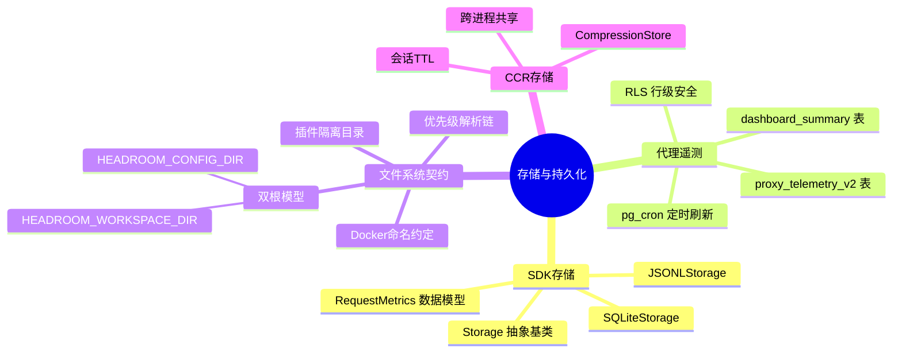
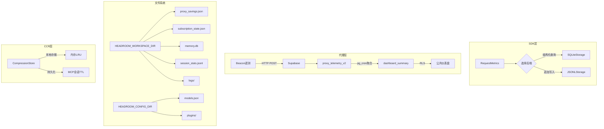
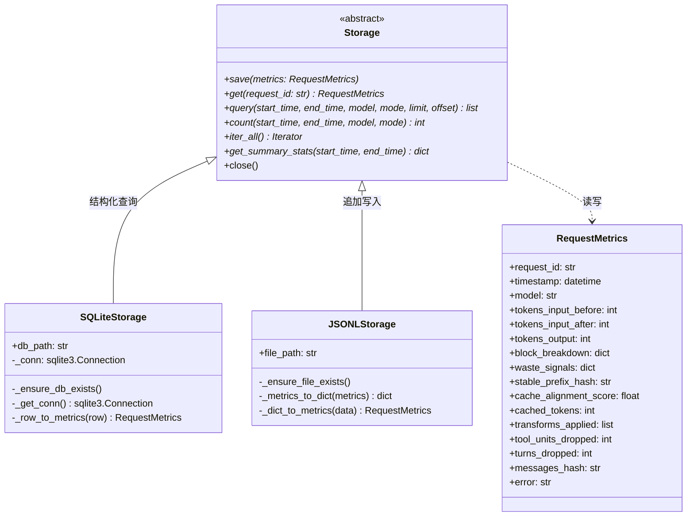
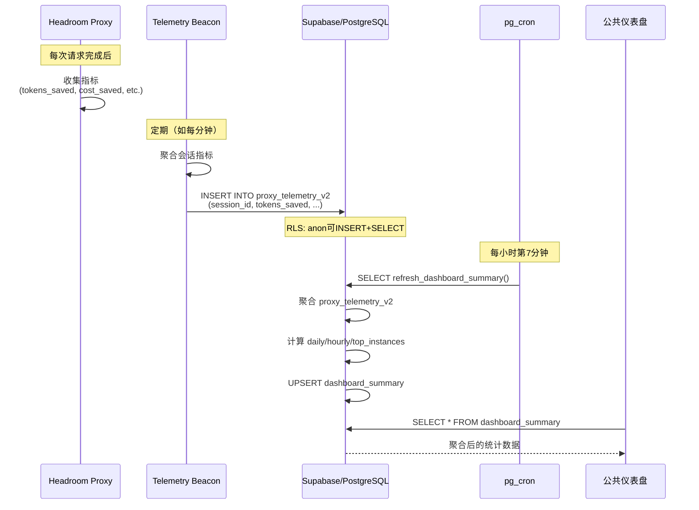
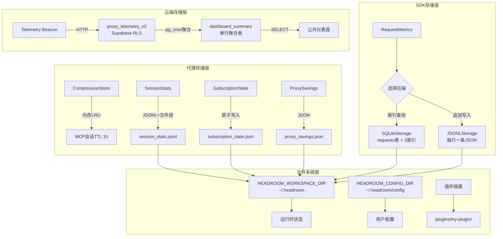

# 第18篇：存储与持久化

## 总：概述

Headroom 的存储与持久化层是整个系统数据流转的基石。从 SDK 级别的请求指标存储，到代理级别的遥测数据管道，再到文件系统契约（Filesystem Contract）定义的路径规范，每一层都有明确的职责边界和实现选择。SDK 层提供 `Storage` 抽象基类和 SQLite/JSONL 两种后端实现，满足不同场景下的性能和可移植性需求；代理层通过 Supabase/PostgreSQL 构建云端遥测管道和仪表盘聚合；文件系统契约则统一了所有运行时状态的路径解析规则，确保跨平台、跨部署模式的一致性。





---

## 分：存储架构

### Storage 抽象基类

[base.py](file:///workspace/headroom/storage/base.py) 定义了 SDK 级别的存储接口，包含七个抽象方法和上下文管理器支持：

```python
# [base.py](file:///workspace/headroom/storage/base.py) L13-124
class Storage(ABC):
    """Abstract base class for metrics storage."""

    @abstractmethod
    def save(self, metrics: RequestMetrics) -> None: ...

    @abstractmethod
    def get(self, request_id: str) -> RequestMetrics | None: ...

    @abstractmethod
    def query(self, start_time, end_time, model, mode, limit, offset) -> list[RequestMetrics]: ...

    @abstractmethod
    def count(self, start_time, end_time, model, mode) -> int: ...

    @abstractmethod
    def iter_all(self) -> Iterator[RequestMetrics]: ...

    @abstractmethod
    def get_summary_stats(self, start_time, end_time) -> dict[str, Any]: ...

    def close(self) -> None: pass  # 可选关闭

    def __enter__(self) -> Storage: return self
    def __exit__(self, exc_type, exc_val, exc_tb) -> None: self.close()
```

接口设计的关键决策：

| 方法 | 用途 | 典型调用者 |
|------|------|-----------|
| `save` | 写入单条指标 | 压缩管线完成后 |
| `get` | 按 ID 精确查找 | 调试/审计 |
| `query` | 多维过滤查询 | SDK `get_metrics()` |
| `count` | 统计匹配条数 | 分页/概览 |
| `iter_all` | 全量遍历 | 批量导出/迁移 |
| `get_summary_stats` | 聚合统计 | 仪表盘/报告 |

### 类层次结构



---

## 分：SQLite后端

### 表结构与索引

[SQLiteStorage](file:///workspace/headroom/storage/sqlite.py) 使用 SQLite 数据库存储请求指标，自动创建 `requests` 表和三个索引：

```python
# [sqlite.py](file:///workspace/headroom/storage/sqlite.py) L39-73
cursor.execute("""
    CREATE TABLE IF NOT EXISTS requests (
        id TEXT PRIMARY KEY,
        timestamp TEXT NOT NULL,
        model TEXT NOT NULL,
        stream INTEGER NOT NULL,
        mode TEXT NOT NULL,
        tokens_input_before INTEGER NOT NULL,
        tokens_input_after INTEGER NOT NULL,
        tokens_output INTEGER,
        block_breakdown TEXT NOT NULL,
        waste_signals TEXT NOT NULL,
        stable_prefix_hash TEXT,
        cache_alignment_score REAL,
        cached_tokens INTEGER,
        transforms_applied TEXT NOT NULL,
        tool_units_dropped INTEGER DEFAULT 0,
        turns_dropped INTEGER DEFAULT 0,
        messages_hash TEXT,
        error TEXT
    )
""")

# 索引
CREATE INDEX IF NOT EXISTS idx_timestamp ON requests(timestamp)
CREATE INDEX IF NOT EXISTS idx_model ON requests(model)
CREATE INDEX IF NOT EXISTS idx_mode ON requests(mode)
```

### 查询与聚合

SQLite 后端的 `query` 方法使用动态 SQL 构建，支持时间范围、模型、模式等多维过滤：

```python
# [sqlite.py](file:///workspace/headroom/storage/sqlite.py) L136-171
def query(self, start_time=None, end_time=None, model=None, mode=None, limit=100, offset=0):
    query = "SELECT * FROM requests WHERE 1=1"
    params = []

    if start_time is not None:
        query += " AND timestamp >= ?"
        params.append(format_timestamp(start_time))
    if end_time is not None:
        query += " AND timestamp <= ?"
        params.append(format_timestamp(end_time))
    if model is not None:
        query += " AND model = ?"
        params.append(model)
    if mode is not None:
        query += " AND mode = ?"
        params.append(mode)

    query += " ORDER BY timestamp DESC LIMIT ? OFFSET ?"
    params.extend([limit, offset])
```

`get_summary_stats` 使用 SQL 聚合函数一次性计算所有统计指标：

```python
# [sqlite.py](file:///workspace/headroom/storage/sqlite.py) L232-260
SELECT
    COUNT(*) as total_requests,
    SUM(tokens_input_before) as total_tokens_before,
    SUM(tokens_input_after) as total_tokens_after,
    SUM(tokens_input_before - tokens_input_after) as total_tokens_saved,
    AVG(tokens_input_before - tokens_input_after) as avg_tokens_saved,
    AVG(cache_alignment_score) as avg_cache_alignment,
    SUM(CASE WHEN mode = 'audit' THEN 1 ELSE 0 END) as audit_count,
    SUM(CASE WHEN mode = 'optimize' THEN 1 ELSE 0 END) as optimize_count
FROM requests
{where_clause}
```

### 连接管理

SQLite 后端采用延迟连接模式，首次访问时才建立数据库连接：

```python
# [sqlite.py](file:///workspace/headroom/storage/sqlite.py) L77-82
def _get_conn(self) -> sqlite3.Connection:
    if self._conn is None:
        self._conn = sqlite3.connect(self.db_path)
        self._conn.row_factory = sqlite3.Row
    return self._conn
```

---

## 分：JSONL后端与CCR存储

### JSONL 后端

[JSONLStorage](file:///workspace/headroom/storage/jsonl.py) 使用 JSONL（JSON Lines）格式存储指标，每行一条记录。它的设计哲学是"简单追加，全量扫描"：

```python
# [jsonl.py](file:///workspace/headroom/storage/jsonl.py) L82-86
def save(self, metrics: RequestMetrics) -> None:
    data = self._metrics_to_dict(metrics)
    with open(self.file_path, "a") as f:
        f.write(json.dumps(data) + "\n")
```

查询和统计操作需要全量遍历文件，适合写入频繁、查询较少的场景：

```python
# [jsonl.py](file:///workspace/headroom/storage/jsonl.py) L157-172
def iter_all(self) -> Iterator[RequestMetrics]:
    if not Path(self.file_path).exists():
        return
    with open(self.file_path) as f:
        for line in f:
            line = line.strip()
            if not line:
                continue
            try:
                data = json.loads(line)
                yield self._dict_to_metrics(data)
            except json.JSONDecodeError:
                continue
```

### 两种后端的对比

| 特性 | SQLiteStorage | JSONLStorage |
|------|--------------|--------------|
| 写入性能 | 中等（需 commit） | 高（纯追加） |
| 查询性能 | 高（索引加速） | 低（全量扫描） |
| 聚合统计 | SQL 原生聚合 | Python 遍历累加 |
| 按 ID 查找 | O(log n) 索引 | O(n) 全量扫描 |
| 并发安全 | SQLite 内置锁 | 需外部锁 |
| 可移植性 | 需 SQLite 库 | 纯文本 |
| 适用场景 | 长期运行、频繁查询 | 短期会话、追加为主 |

### CCR 存储与跨进程共享

CCR MCP Server 中的 `CompressionStore` 使用内存 LRU 缓存 + 可选持久化，支持跨进程共享统计：

```python
# [mcp_server.py](file:///workspace/headroom/ccr/mcp_server.py) L167-176
MCP_SESSION_TTL = 3600  # 1 hour session TTL

SHARED_STATS_DIR = _paths.workspace_dir()
SHARED_STATS_FILE = _paths.session_stats_path()
SESSION_WINDOW_SECONDS = 7200  # 2 hours pruning window
```

共享统计文件使用 `fcntl.flock` 实现跨进程互斥写入，并在读取时自动修剪过期条目：

```python
# [mcp_server.py](file:///workspace/headroom/ccr/mcp_server.py) L195-233
def _read_shared_events(window_seconds=SESSION_WINDOW_SECONDS):
    cutoff = time.time() - window_seconds
    events = []
    keep_lines = []

    for line in lines:
        evt = json.loads(line)
        if evt.get("timestamp", 0) >= cutoff:
            events.append(evt)
            keep_lines.append(line + "\n")

    # Prune old entries (only if we dropped some)
    if len(keep_lines) < len(lines):
        with open(SHARED_STATS_FILE, "w") as f:
            fcntl.flock(f, fcntl.LOCK_EX)
            f.writelines(keep_lines)
```

### 代理遥测管道时序



### 云端遥测表结构

[proxy_telemetry_v2](file:///workspace/sql/create_proxy_telemetry_v2.sql) 表存储每个会话的遥测信标数据，包含核心身份、效果指标、性能开销、管线时序等维度：

```sql
-- [create_proxy_telemetry_v2.sql](file:///workspace/sql/create_proxy_telemetry_v2.sql) L5-53
CREATE TABLE IF NOT EXISTS proxy_telemetry_v2 (
    id uuid DEFAULT gen_random_uuid() PRIMARY KEY,
    created_at timestamptz DEFAULT now() NOT NULL,

    -- Core identity
    session_id text NOT NULL,
    instance_id text,
    headroom_version text,
    os text,

    -- Effectiveness metrics
    tokens_saved bigint,
    requests integer,
    compression_percent real,
    cache_hit_rate real,
    cost_saved_usd real,

    -- Performance overhead
    overhead_avg_ms real,
    overhead_max_ms real,
    ttfb_avg_ms real,

    -- Pipeline timing (JSONB)
    pipeline_timing jsonb,

    -- CCR usage
    ccr jsonb,

    -- Waste signals
    waste_signals jsonb
);
```

[dashboard_summary](file:///workspace/sql/create_dashboard_summary.sql) 表是一个单行聚合表，由 `pg_cron` 每小时刷新，使用 `MAX-per-instance-per-day` 策略避免信标累积计数器的重复计算：

```sql
-- [create_dashboard_summary.sql](file:///workspace/sql/create_dashboard_summary.sql) L42-49
WITH instance_daily AS (
    SELECT
        instance_id,
        created_at::date AS day,
        MAX(COALESCE(tokens_saved, 0)) AS tokens_saved,
        MAX(COALESCE(cost_saved_usd, 0)) AS cost_saved,
        MAX(COALESCE(requests, 0)) AS requests
    FROM proxy_telemetry_v2
    GROUP BY instance_id, created_at::date
)
```

---

## 分：文件系统契约

### 双根模型

[filesystem-contract.md](file:///workspace/wiki/filesystem-contract.md) 定义了 Headroom 的双根路径模型：

| 变量 | 默认值 | 用途 | 访问模式 |
|------|--------|------|----------|
| `HEADROOM_CONFIG_DIR` | `~/.headroom/config` | 用户/管理员编写的配置 | 读多写少 |
| `HEADROOM_WORKSPACE_DIR` | `~/.headroom` | 代理和 CLI 写入的运行时状态 | 读写频繁 |

### 优先级解析链

每个资源的路径解析遵循三级优先级：

```
显式参数 → 每资源环境变量 → 从规范根派生 → 默认值
```

例如 `proxy_savings.json` 的解析：

1. `HEADROOM_SAVINGS_PATH=/custom/savings.json` → 直接使用
2. `HEADROOM_WORKSPACE_DIR=/mnt/state` → `/mnt/state/proxy_savings.json`
3. 均未设置 → `~/.headroom/proxy_savings.json`

### 工作区桶分配

| 资源 | 默认路径 | 旧环境变量 |
|------|----------|-----------|
| 代理节省账本 | `${WORKSPACE_DIR}/proxy_savings.json` | `HEADROOM_SAVINGS_PATH` |
| TOIN 遥测 | `${WORKSPACE_DIR}/toin.json` | `HEADROOM_TOIN_PATH` |
| 订阅追踪状态 | `${WORKSPACE_DIR}/subscription_state.json` | `HEADROOM_SUBSCRIPTION_STATE_PATH` |
| 记忆 SQLite | `${WORKSPACE_DIR}/memory.db` | CLI `--memory-db-path` |
| 会话统计 JSONL | `${WORKSPACE_DIR}/session_stats.jsonl` | — |
| 代理日志 | `${WORKSPACE_DIR}/logs/` | — |
| RTK 二进制 | `${WORKSPACE_DIR}/bin/rtk` | — |
| 信标锁文件 | `${WORKSPACE_DIR}/.beacon_lock_<port>` | — |

### 插件隔离

插件作者通过 `paths` 模块获取隔离的目录：

```python
from headroom import paths

cfg_dir = paths.plugin_config_dir("my-plugin")
# → ~/.headroom/config/plugins/my-plugin

state_dir = paths.plugin_workspace_dir("my-plugin")
# → ~/.headroom/plugins/my-plugin
```

### Docker 命名约定

`HEADROOM_WORKSPACE`（宿主侧绑定挂载）和 `HEADROOM_WORKSPACE_DIR`（容器内状态根）是两个不同的变量：

| 变量 | 作用域 | 含义 |
|------|--------|------|
| `HEADROOM_WORKSPACE` | 宿主侧（Docker） | 绑定挂载到容器的 `/workspace` |
| `HEADROOM_WORKSPACE_DIR` | 容器内 | Headroom 状态根，默认 `/tmp/headroom-home/.headroom` |

---

## 总：总结

Headroom 的存储与持久化层遵循"接口统一、实现多样、路径规范"的设计哲学：

1. **接口统一**：`Storage` 抽象基类定义了七种操作，SQLite 和 JSONL 两种后端各有侧重——SQLite 适合长期运行和频繁查询，JSONL 适合追加为主的短期会话。上层代码无需关心底层实现。

2. **云端管道**：从代理信标到 Supabase 遥测表，再到 pg_cron 驱动的仪表盘聚合，构建了完整的"采集→存储→聚合→展示"管道。`MAX-per-instance-per-day` 策略优雅地解决了累积计数器的去重问题。

3. **路径规范**：双根模型 + 三级优先级解析链 + 插件隔离，确保所有运行时状态都有明确的存放位置，跨平台、跨部署模式保持一致，同时向后兼容所有旧环境变量。



这张协作图揭示了 Headroom 存储架构的分层设计：SDK 层关注单请求指标的读写，代理层关注会话级状态的持久化和跨进程共享，云端层关注多实例遥测的聚合和展示，文件系统层则统一了所有路径的解析规则。四层各司其职，通过文件系统契约这一"宪法"保持一致性——无论数据存储在内存、SQLite、JSONL 文件还是 Supabase 数据库中，其路径和行为都遵循同一套规范。
