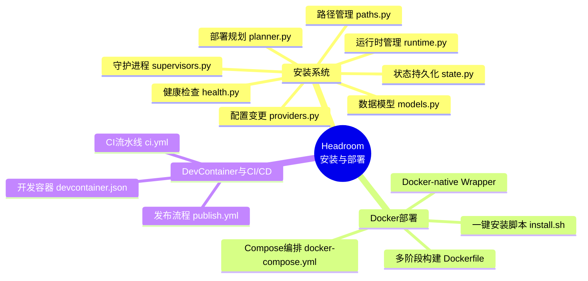
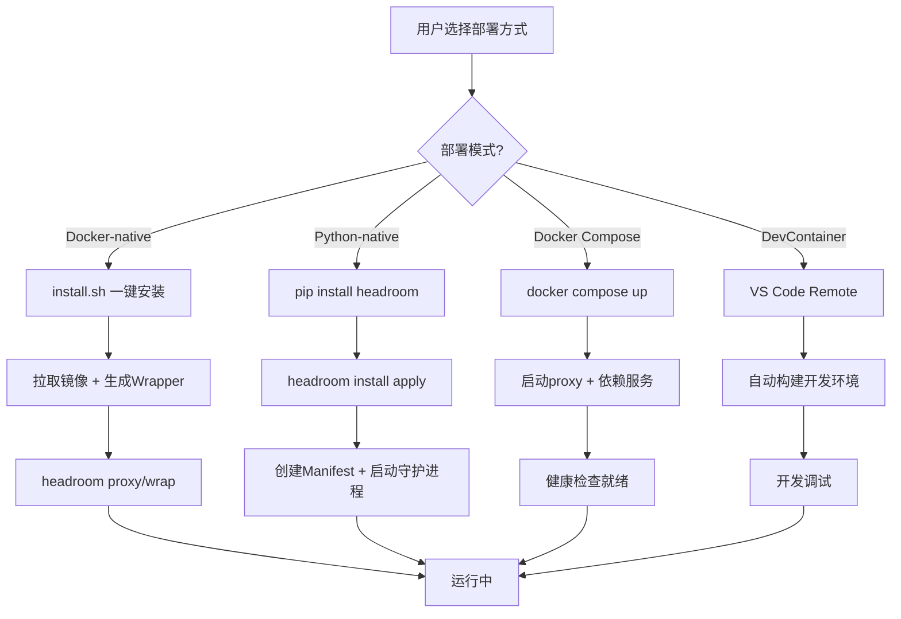
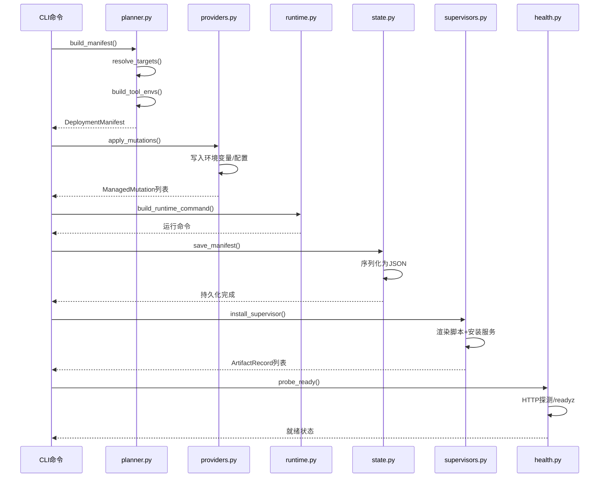
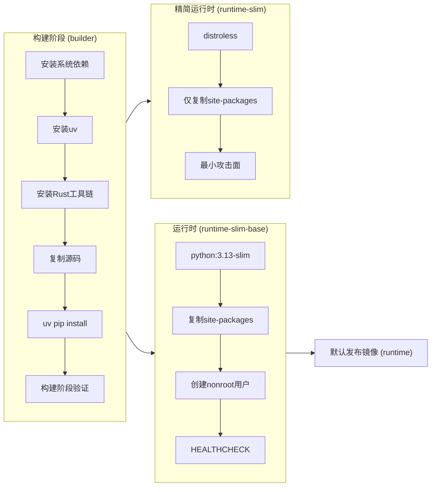
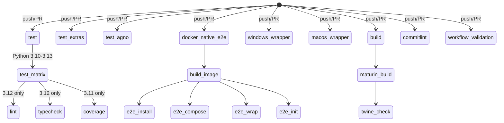

# 第19篇：安装与部署

## 一、总述：Headroom 安装与部署体系概览

Headroom 项目的安装与部署体系是一个精心设计的多层架构，旨在为不同场景提供灵活、可靠的部署方案。从一键安装脚本到 Docker 容器化部署，从开发容器到 CI/CD 流水线，整个体系覆盖了从本地开发到生产部署的全生命周期。

核心设计原则包括：**零依赖安装**（Docker-native 模式仅需 Docker）、**跨平台支持**（Linux/macOS/Windows）、**可逆变更**（所有配置修改均可回滚）、**声明式部署**（通过 Manifest 描述期望状态）。





---

## 二、分述：安装系统深度解析

### 2.1 安装系统架构

Headroom 的安装子系统位于 [headroom/install/](file:///workspace/headroom/install/) 目录下，由8个模块协同工作，形成完整的声明式部署引擎。



### 2.2 数据模型：DeploymentManifest

安装系统的核心数据结构是 `DeploymentManifest`，定义在 [models.py](file:///workspace/headroom/install/models.py) 中。它是一个完整的声明式部署描述：

```python
@dataclass
class DeploymentManifest:
    """Persisted deployment state for a named profile."""
    profile: str
    preset: str                    # persistent-service / persistent-task / persistent-docker
    runtime_kind: str              # python / docker
    supervisor_kind: str           # service / task / none
    scope: str                     # provider / user / system
    provider_mode: str             # auto / all / manual
    targets: list[str]             # claude, codex, aider, cursor, openclaw
    port: int
    host: str
    backend: str
    # ... 更多字段
    mutations: list[ManagedMutation] = field(default_factory=list)
    artifacts: list[ArtifactRecord] = field(default_factory=list)
```

关键枚举类型定义了部署的维度空间：

| 枚举 | 值 | 说明 |
|------|------|------|
| `InstallPreset` | `persistent-service` / `persistent-task` / `persistent-docker` | 部署预设模式 |
| `RuntimeKind` | `python` / `docker` | 运行时类型 |
| `SupervisorKind` | `service` / `task` / `none` | 守护进程类型 |
| `ConfigScope` | `provider` / `user` / `system` | 配置作用域 |
| `ToolTarget` | `claude` / `copilot` / `codex` / `aider` / `cursor` / `openclaw` | 工具目标 |

`ManagedMutation` 记录了所有可逆变更，确保部署可以被干净地回滚：

```python
@dataclass
class ManagedMutation:
    """A reversible change applied by `headroom install`."""
    target: str
    kind: str
    path: str | None = None
    data: dict[str, Any] = field(default_factory=dict)
```

### 2.3 部署规划：planner.py

[planner.py](file:///workspace/headroom/install/planner.py) 负责将用户意图转化为具体的部署清单。核心流程包括：

1. **目标检测**：`detect_targets()` 自动扫描主机上可用的工具（claude、codex、aider 等）
2. **目标解析**：`resolve_targets()` 根据 provider_mode（auto/all/manual）确定最终配置目标
3. **环境构建**：`build_tool_envs()` 为每个工具生成所需的环境变量
4. **清单生成**：`build_manifest()` 组装完整的 DeploymentManifest

```python
def resolve_targets(
    provider_mode: str, requested_targets: Iterable[str], *, scope: str = ConfigScope.USER.value
) -> list[str]:
    if provider_mode == ProviderSelectionMode.ALL.value:
        return [target.value for target in valid_targets]
    if provider_mode == ProviderSelectionMode.AUTO.value:
        detected = [target for target in detect_targets() if target in valid]
        return detected or [ToolTarget.CLAUDE.value, ToolTarget.CODEX.value, ...]
```

### 2.4 配置变更：providers.py

[providers.py](file:///workspace/headroom/install/providers.py) 实现了跨平台的配置变更管理，支持 Unix（shell profile）和 Windows（PowerShell 环境变量）两种模式：

- **Unix 模式**：使用标记块（marker block）写入 `.bashrc`、`.zshrc`、`.profile` 等文件
- **Windows 模式**：通过 PowerShell `[Environment]::SetEnvironmentVariable()` 设置用户/系统级变量
- **Provider Scope**：调用 `apply_provider_scope_mutations()` 处理特定工具的配置变更

关键设计是使用正则匹配的标记块确保幂等性：

```python
_ENV_MARKER_START = "# >>> headroom persistent env >>>"
_ENV_MARKER_END = "# <<< headroom persistent env <<<"
_ENV_PATTERN = re.compile(
    re.escape(_ENV_MARKER_START) + r".*?" + re.escape(_ENV_MARKER_END), re.DOTALL,
)
```

### 2.5 运行时管理：runtime.py

[runtime.py](file:///workspace/headroom/install/runtime.py) 是部署系统的执行引擎，负责构建运行命令、管理进程生命周期和环境变量透传：

```python
PASSTHROUGH_ENV_PREFIXES = (
    "HEADROOM_", "ANTHROPIC_", "OPENAI_", "GEMINI_",
    "AWS_", "AZURE_", "VERTEX_", "GOOGLE_", "GOOGLE_CLOUD_",
    "MISTRAL_", "GROQ_", "OPENROUTER_", "XAI_", "TOGETHER_",
    "COHERE_", "OLLAMA_", "LITELMM_", "OTEL_", "SUPABASE_",
    "QDRANT_", "NEO4J_", "LANGSMITH_",
)
```

对于 Docker 运行时，`build_runtime_command()` 构建完整的 `docker run` 命令，包括：
- 卷挂载：`~/.headroom`、`~/.claude`、`~/.codex`、`~/.gemini`
- 环境变量透传：所有 `PASSTHROUGH_ENV_PREFIXES` 前缀的变量
- 用户映射：`--user $(id -u):$(id -g)` 确保文件权限一致
- 文件系统契约：`HEADROOM_WORKSPACE_DIR` 和 `HEADROOM_CONFIG_DIR`（issue #175）

### 2.6 状态持久化与路径管理

[state.py](file:///workspace/headroom/install/state.py) 负责 Manifest 的序列化/反序列化，将部署状态持久化到 `~/.headroom/deploy/<profile>/manifest.json`：

```python
def save_manifest(manifest: DeploymentManifest) -> None:
    try:
        root = profile_root(manifest.profile)
        root.mkdir(parents=True, exist_ok=True)
        manifest.updated_at = iso_utc_now()
        path = manifest_path(manifest.profile)
        path.write_text(json.dumps(asdict(manifest), indent=2) + "\n")
    except OSError as e:
        logger.warning("Cannot save deployment manifest: %s — continuing without persistence", e)
```

[paths.py](file:///workspace/headroom/install/paths.py) 定义了所有路径约定：

| 路径函数 | 位置 | 用途 |
|----------|------|------|
| `deploy_root()` | `~/.headroom/deploy/` | 部署根目录 |
| `profile_root(profile)` | `~/.headroom/deploy/<profile>/` | 配置文件根目录 |
| `manifest_path(profile)` | `~/.headroom/deploy/<profile>/manifest.json` | 部署清单 |
| `log_path(profile)` | `~/.headroom/deploy/<profile>/runner.log` | 运行日志 |
| `pid_path(profile)` | `~/.headroom/deploy/<profile>/runner.pid` | PID 文件 |

### 2.7 守护进程管理：supervisors.py

[supervisors.py](file:///workspace/headroom/install/supervisors.py) 实现了跨平台的守护进程安装，支持四种操作系统和两种守护模式：

| 平台 | Service 模式 | Task 模式 |
|------|-------------|-----------|
| Linux | systemd unit | cron @reboot + */5 |
| macOS | launchd plist (KeepAlive) | launchd plist (StartInterval) |
| Windows | sc.exe Windows Service | schtasks 计划任务 |

```python
def install_supervisor(manifest: DeploymentManifest) -> list[ArtifactRecord]:
    records = render_runner_scripts(manifest)
    if manifest.supervisor_kind == SupervisorKind.NONE.value:
        return records
    # Linux systemd / cron
    # macOS launchd
    # Windows sc.exe / schtasks
```

### 2.8 健康检查：health.py

[health.py](file:///workspace/headroom/install/health.py) 提供了简洁的健康探测机制，通过 HTTP 请求 `/readyz` 端点判断服务是否就绪：

```python
def probe_ready(url: str, timeout: float = 2.0) -> bool:
    payload = probe_json(url, timeout=timeout)
    if not isinstance(payload, dict):
        return False
    return bool(payload.get("ready", False) or payload.get("status") == "healthy")
```

---

## 三、分述：Docker 部署体系

### 3.1 多阶段 Dockerfile

[Dockerfile](file:///workspace/Dockerfile) 采用了精心设计的多阶段构建，分为三个阶段：



关键设计亮点：

1. **Rustls 全面替代 OpenSSL**：`rustls-everywhere` 重构消除了 `openssl-sys` 依赖，无需安装系统级 OpenSSL
2. **构建阶段验证**：在 builder 阶段即验证 `_core` 扩展可加载，避免运行时才发现问题
3. **双运行时变体**：`runtime-slim-base`（基于 python-slim）和 `runtime-slim`（基于 distroless）
4. **健康检查**：内置 `HEALTHCHECK` 指令，间隔 30s 探测 `/readyz`

```dockerfile
# 构建阶段验证
RUN cd /tmp && python -c "from headroom._core import DiffCompressor, SmartCrusher; \
    print(f'build-stage rust core verify OK: {DiffCompressor.__name__}, {SmartCrusher.__name__}')"
```

### 3.2 Docker Compose 编排

[docker-compose.yml](file:///workspace/docker-compose.yml) 定义了完整的服务栈，包含三个服务：

| 服务 | 镜像 | 端口 | 用途 |
|------|------|------|------|
| `headroom-proxy` | 本地构建 | 8787 | 核心代理服务 |
| `qdrant` | qdrant:v1.17.1 | 6333/6334 | 向量数据库 |
| `neo4j` | neo4j:5.15.0 | 7474/7687 | 图数据库 |

proxy 服务依赖 qdrant 和 neo4j，通过 `depends_on` 确保启动顺序，并配置了与 Dockerfile 一致的健康检查。

### 3.3 Docker-native 一键安装

[install.sh](file:///workspace/scripts/install.sh) 是一个 1600+ 行的 Bash 脚本，实现了完整的 Docker-native 安装体验：

1. **环境检测**：验证 Docker 可用性、Bash 版本（≥4.3）
2. **Wrapper 生成**：将完整的 Headroom CLI 封装为 Docker 运行命令
3. **PATH 配置**：自动更新 `.bashrc`、`.zshrc`、`.profile`
4. **镜像拉取**：支持自定义 `HEADROOM_DOCKER_IMAGE`

Wrapper 的核心逻辑是将所有 `headroom` 命令透明地转发到 Docker 容器中：

```bash
run_headroom() {
  local args=()
  args=(docker run --rm)
  append_tty_args args
  append_common_container_args args
  args+=(--entrypoint headroom "${HEADROOM_IMAGE}" "$@")
  "${args[@]}"
}
```

环境变量透传机制确保所有 Provider 认证信息自动进入容器：

```bash
append_passthrough_envs() {
  for name in $(compgen -e); do
    case "${name}" in
      HEADROOM_*|ANTHROPIC_*|OPENAI_*|GEMINI_*|AWS_*|AZURE_*|...)
        ref+=(--env "${name}")
        ;;
    esac
  done
}
```

---

## 四、分述：DevContainer 与 CI/CD

### 4.1 DevContainer 开发环境

[devcontainer.json](file:///workspace/.devcontainer/devcontainer.json) 定义了完整的 VS Code 远程开发环境：

- **基础镜像**：使用项目 Dockerfile 构建
- **DevContainer Features**：Node.js 20、GitHub CLI、Rust 1.95.0
- **卷挂载**：独立的 venv、uv 缓存、pip 缓存卷
- **端口转发**：8787（Headroom proxy）自动转发并通知
- **VS Code 扩展**：Python、Pylance、Ruff、Docker、GitHub Actions

```json
"containerEnv": {
    "UV_PROJECT_ENVIRONMENT": "/home/vscode/.venvs/headroom"
},
"forwardPorts": [8787],
"portsAttributes": {
    "8787": { "label": "Headroom proxy", "onAutoForward": "notify" }
}
```

### 4.2 CI 流水线

[ci.yml](file:///workspace/.github/workflows/ci.yml) 定义了7个 CI Job，形成完整的质量门禁：



关键 CI 特性：

1. **多版本矩阵**：Python 3.10-3.13 全覆盖
2. **Rust 扩展构建**：CI 中通过 maturin 构建 `_core` 扩展
3. **Docker E2E 测试**：构建镜像后运行完整的安装/Compose/Wrap/Init 测试
4. **跨平台验证**：Windows 和 macOS 上测试原生安装器
5. **提交规范**：commitlint 强制 Conventional Commits

### 4.3 发布流程

[publish.yml](file:///workspace/.github/workflows/publish.yml) 是手动触发的 PyPI 发布后备方案：

- 使用 `maturin` 构建 wheel + sdist
- 生成 CycloneDX SBOM（软件物料清单）
- 通过 Trusted Publishing 发布到 PyPI

---

## 五、总述：部署架构全景

Headroom 的安装与部署体系体现了"**渐进复杂度**"的设计哲学：从最简单的 Docker-native 一键安装，到声明式的 `headroom install` 系统，再到完整的 Docker Compose 编排，用户可以根据需求选择合适的部署层级。

```mermaid
flowchart TB
    subgraph 用户入口
        U1[一键安装 curl|bash]
        U2[pip install headroom]
        U3[docker compose up]
        U4[DevContainer]
    end

    subgraph 安装系统
        I1[DeploymentManifest]
        I2[ManagedMutation]
        I3[ArtifactRecord]
    end

    subgraph 运行时
        R1{RuntimeKind}
        R1 -->|python| R2[本地进程]
        R1 -->|docker| R3[容器进程]
    end

    subgraph 守护进程
        S1{SupervisorKind}
        S1 -->|service| S2[systemd/launchd/sc.exe]
        S1 -->|task| S3[cron/launchd-interval/schtasks]
        S1 -->|none| S4[Docker restart policy]
    end

    subgraph 基础设施
        F1[Qdrant 向量库]
        F2[Neo4j 图库]
        F3[健康检查 /readyz]
    end

    U1 --> I1
    U2 --> I1
    U3 --> R3
    U4 --> R2

    I1 --> R1
    I1 --> S1
    I2 --> I1
    I3 --> S1

    R2 --> F3
    R3 --> F3
    S2 --> F3
    S3 --> F3

    R3 --> F1
    R3 --> F2
```

**核心洞察**：

1. **声明式优于命令式**：`DeploymentManifest` 作为单一事实来源，所有部署操作都基于 Manifest 的期望状态驱动
2. **可逆性是一等公民**：`ManagedMutation` 记录每一次配置变更，`revert_mutations()` 确保干净卸载
3. **Docker-native 零摩擦**：install.sh 生成的 Wrapper 让用户无需感知 Docker 的存在，同时享受容器化的隔离性
4. **跨平台一致性**：supervisors.py 为 Linux/macOS/Windows 提供统一的守护进程抽象，屏蔽平台差异
5. **构建即验证**：Dockerfile 的构建阶段验证确保镜像产出即可用，避免运行时才发现扩展加载失败
