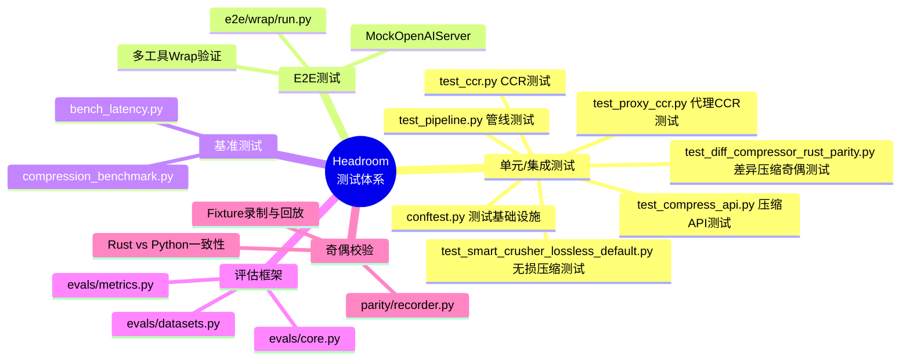
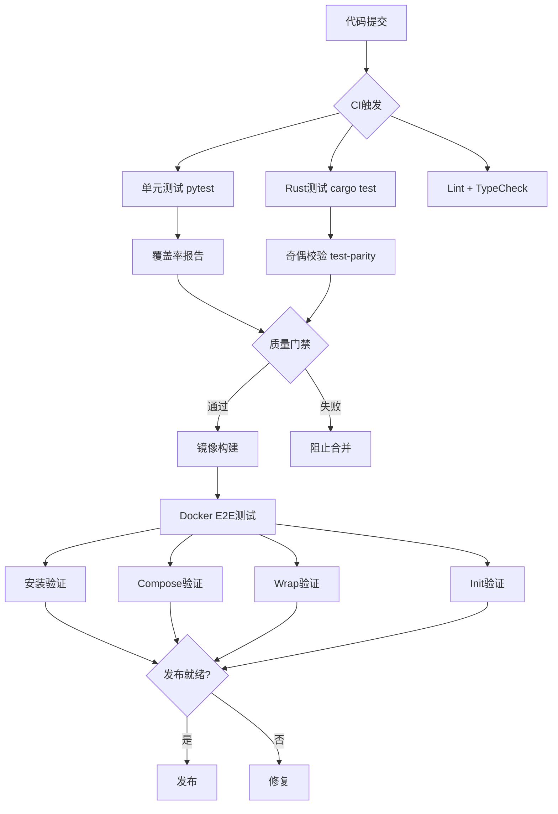
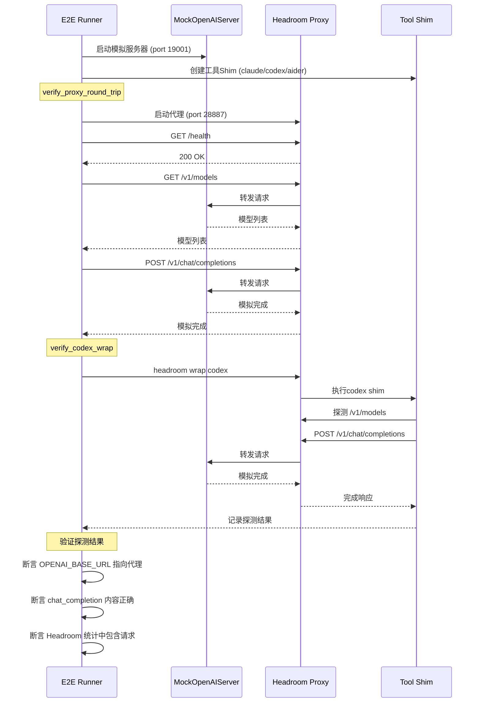
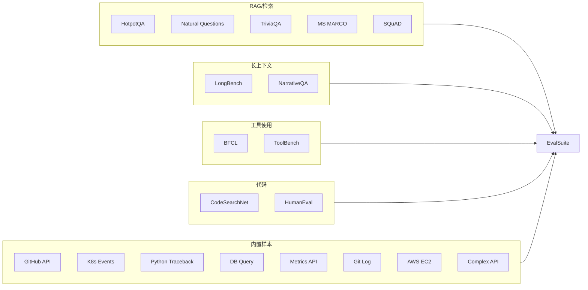
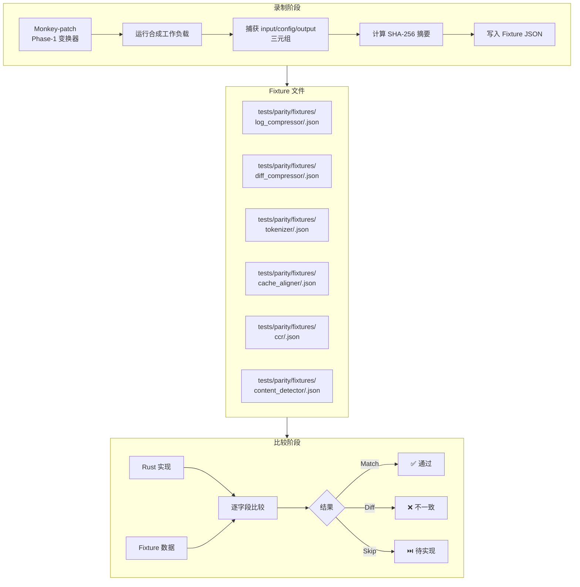
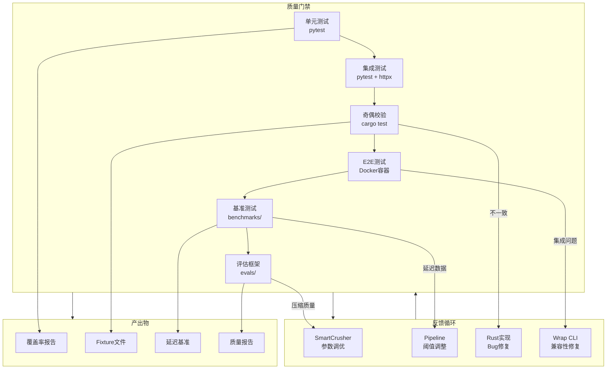

# 第20篇：测试体系

## 一、总述：Headroom 测试体系概览

Headroom 项目构建了一个多层次、多维度的测试体系，从单元测试到端到端验证，从基准测试到奇偶校验，形成了完整的质量保障网络。该体系的核心设计原则是：**压缩可验证、奇偶可校验、性能可度量、回归可检测**。

测试体系覆盖五个层级：单元/集成测试（pytest）、端到端测试（e2e/wrap）、基准测试（benchmarks）、评估框架（evals）、奇偶校验（parity）。每一层都有独立的运行入口和验收标准，共同确保 Headroom 在压缩质量、性能开销和跨语言一致性上的可靠性。





---

## 二、分述：测试架构

### 2.1 测试基础设施：conftest.py

[conftest.py](file:///workspace/tests/conftest.py) 是整个测试体系的基础设施层，提供了共享的 fixture、工具函数和测试配置。它定义了测试运行时的环境搭建逻辑，包括：

- **代理服务 fixture**：自动启动/停止 Headroom 代理实例
- **模拟上游服务**：提供可预测的响应，避免依赖外部 API
- **临时目录管理**：每个测试用例运行在隔离的文件系统环境中
- **环境变量注入**：确保测试环境与生产环境的一致性

### 2.2 测试分层架构

Headroom 的测试遵循经典测试金字塔模型，但在压缩系统的特殊性上做了针对性设计：

| 层级 | 工具 | 覆盖范围 | 运行频率 |
|------|------|----------|----------|
| 单元测试 | pytest | 单个压缩器、工具函数 | 每次提交 |
| 集成测试 | pytest + httpx | 管线、代理+压缩器 | 每次提交 |
| 奇偶校验 | cargo test | Rust vs Python 一致性 | 每次提交（目标） |
| E2E测试 | Python subprocess | 完整代理+工具链 | CI Docker阶段 |
| 基准测试 | 自定义脚本 | 压缩率、延迟 | 手动/发布前 |
| 评估框架 | evals模块 | 压缩质量 | 手动/发布前 |

---

## 三、分述：单元/集成测试

### 3.1 CCR 测试：test_ccr.py

[test_ccr.py](file:///workspace/tests/test_ccr.py) 验证 CCR（Compress-Cache-Retrieve）系统的核心功能：

- **压缩存储**：验证原始内容可被正确存储和检索
- **哈希键生成**：确保相同输入产生相同哈希
- **TTL 过期**：验证缓存条目的自动过期机制
- **检索 API**：测试 `/v1/retrieve` 端点的正确性
- **工具注入**：验证 `ccr_retrieve` 工具的正确注入

### 3.2 压缩 API 测试：test_compress_api.py

[test_compress_api.py](file:///workspace/tests/test_compress_api.py) 覆盖了 `/v1/compress` 端点的各种场景：

- **JSON 数组压缩**：验证 SmartCrusher 对不同结构 JSON 的处理
- **纯文本压缩**：测试非 JSON 内容的压缩行为
- **空输入处理**：确保边界条件的优雅降级
- **大负载处理**：验证大规模输入的压缩性能

### 3.3 管线测试：test_pipeline.py

[test_pipeline.py](file:///workspace/tests/test_pipeline.py) 验证完整的压缩管线行为：

- **管线顺序**：CacheAligner → SmartCrusher → RollingWindow 的执行顺序
- **组合效果**：多个变换器的协同工作
- **旁路逻辑**：当压缩不适用时的正确旁路行为
- **幂等性**：重复压缩不改变结果

### 3.4 代理 CCR 测试：test_proxy_ccr.py

[test_proxy_ccr.py](file:///workspace/tests/test_proxy_ccr.py) 验证代理层面的 CCR 集成：

- **请求拦截**：代理正确拦截需要压缩的请求
- **工具注入透传**：`ccr_retrieve` 工具通过代理正确注入
- **响应处理**：代理正确处理 CCR 工具调用响应

### 3.5 无损压缩测试：test_smart_crusher_lossless_default.py

[test_smart_crusher_lossless_default.py](file:///workspace/tests/test_smart_crusher_lossless_default.py) 是 Headroom 测试体系中最关键的测试之一，验证 SmartCrusher 的无损默认行为：

```python
# 核心断言模式
def test_smart_crusher_preserves_errors():
    """错误项必须被保留，无论压缩策略如何"""
    input_data = [
        {"status": "ok", "value": 1},
        {"status": "error", "message": "connection refused"},
        {"status": "ok", "value": 2},
    ]
    result = SmartCrusher().crush(input_data)
    error_items = [item for item in result if item.get("status") == "error"]
    assert len(error_items) > 0, "Error items must be preserved"
```

### 3.6 差异压缩奇偶测试：test_diff_compressor_rust_parity.py

[test_diff_compressor_rust_parity.py](file:///workspace/tests/test_diff_compressor_rust_parity.py) 验证 DiffCompressor 的 Rust 实现与 Python 实现的一致性，是奇偶校验体系的关键组成部分。

---

## 四、分述：E2E 测试

### 4.1 E2E 测试框架

[e2e/wrap/run.py](file:///workspace/e2e/wrap/run.py) 是一个 900+ 行的端到端测试框架，在 Docker 容器中验证 Headroom 的完整工具链集成。



### 4.2 MockOpenAIServer

E2E 测试的核心是 `MockOpenAIServer`——一个轻量级的 HTTP 服务器，模拟 OpenAI API 的行为：

```python
class MockOpenAIHandler(BaseHTTPRequestHandler):
    def do_GET(self):
        if self.path == "/v1/models":
            self._write_json(200, {
                "object": "list",
                "data": [{"id": "gpt-4o-mini", "object": "model"}]
            })

    def do_POST(self):
        if self.path == "/v1/chat/completions":
            self._write_json(200, {
                "id": "chatcmpl-e2e",
                "choices": [{
                    "message": {"content": "mock completion from upstream"}
                }]
            })
```

### 4.3 工具 Shim 系统

E2E 测试使用 Shim 替代真实的 CLI 工具，每个 Shim 记录调用参数和探测结果：

| Shim | 验证内容 |
|------|----------|
| `claude` | `ANTHROPIC_BASE_URL` 指向代理 |
| `codex` | `OPENAI_BASE_URL` 指向代理 + 完整请求链路 |
| `aider` | `OPENAI_API_BASE` + `ANTHROPIC_BASE_URL` 双向验证 |
| `cursor` | `.cursorrules` 文件创建 + RTK 标记注入 |
| `cline` | `.clinerules` 文件创建 + `--prepare-only` 模式 |
| `continue` | `.continue/config.json` + systemMessage 注入 |
| `goose` | `.goosehints` 文件创建 |
| `openhands` | `--prepare-only` 模式验证 |

### 4.4 OpenClaw 插件 E2E

OpenClaw 的 E2E 测试最为复杂，涉及 TypeScript SDK 构建、插件编译和网关启动：

```python
def verify_openclaw_wrap(base_env, project_dir, plugin_dir):
    # 1. 构建本地 SDK
    run(["npm", "install"], cwd=sdk_dir)
    run(["npm", "run", "build"], cwd=sdk_dir)
    run(["npm", "pack"], cwd=sdk_dir)

    # 2. 安装插件
    run(["headroom", "wrap", "openclaw", "--plugin-path", str(plugin_dir)])

    # 3. 验证插件配置
    state = json.loads(config_path.read_text())
    assert state["plugins"]["entries"]["headroom"]["enabled"] is True
    assert state["plugins"]["slots"]["contextEngine"] == "headroom"

    # 4. 验证 unwrap 恢复
    run(["headroom", "unwrap", "openclaw"])
    state = json.loads(config_path.read_text())
    assert state["plugins"]["slots"]["contextEngine"] == "legacy"
```

---

## 五、分述：基准测试与评估框架

### 5.1 压缩基准测试

[compression_benchmark.py](file:///workspace/benchmarks/compression_benchmark.py) 测量 Headroom 在不同内容类型上的压缩效果：

- **JSON 数组**：不同大小（10/100/1000 项）的字典数组
- **日志输出**：pytest、npm、cargo 等构建日志
- **搜索结果**：模拟搜索 API 返回
- **Diff 输出**：Git diff 格式内容
- **混合内容**：多类型组合场景

### 5.2 延迟基准测试

[bench_latency.py](file:///workspace/benchmarks/bench_latency.py) 测量压缩的端到端延迟影响：

- **冷启动延迟**：首次压缩的额外开销
- **稳态延迟**：连续压缩的平均延迟
- **P50/P95/P99**：延迟分布统计
- **净延迟分析**：压缩节省的传输时间 vs 压缩计算时间

### 5.3 评估框架核心

[evals/core.py](file:///workspace/headroom/evals/core.py) 定义了评估系统的核心数据结构：

```python
@dataclass
class EvalCase:
    """Single evaluation case."""
    id: str
    context: str           # 待压缩的上下文
    query: str             # 用户查询
    ground_truth: str | None  # 期望答案
    metadata: dict[str, Any] = field(default_factory=dict)

@dataclass
class EvalSuite:
    """Collection of evaluation cases."""
    name: str
    cases: list[EvalCase]

    def run(self, compressor, tokenizer) -> EvalResult:
        """Run all cases through a compressor and evaluate."""
```

### 5.4 评估指标

[evals/metrics.py](file:///workspace/headroom/evals/metrics.py) 定义了压缩质量的量化指标：

| 指标 | 计算方式 | 意义 |
|------|----------|------|
| `compression_ratio` | `compressed_tokens / original_tokens` | 压缩率 |
| `information_retention` | `answerable_questions / total_questions` | 信息保留率 |
| `retrieval_accuracy` | `correct_retrievals / total_retrievals` | CCR 检索准确率 |
| `latency_overhead_ms` | `compressed_latency - baseline_latency` | 延迟开销 |

### 5.5 评估数据集

[evals/datasets.py](file:///workspace/headroom/evals/datasets.py) 提供了丰富的评估数据集，覆盖5大类别：



数据集注册表提供了统一入口：

```python
DATASET_REGISTRY = {
    "hotpotqa": {"loader": load_hotpotqa, "category": "rag"},
    "natural_questions": {"loader": load_natural_questions, "category": "rag"},
    "bfcl": {"loader": load_bfcl, "category": "tool_use"},
    "codesearchnet": {"loader": load_codesearchnet, "category": "code"},
    "tool_outputs": {"loader": load_tool_output_samples, "category": "tool_use"},
    # ... 更多数据集
}
```

---

## 六、分述：奇偶校验

### 6.1 录制器架构

[parity/recorder.py](file:///workspace/tests/parity/recorder.py) 是 Headroom 奇偶校验体系的核心，实现了 Python → Rust 迁移过程中的行为一致性验证。



### 6.2 @record 装饰器

录制器的核心是 `@record` 装饰器，它包装任何 `(input, ...) -> output` 可调用对象，使每次调用都写入一个 Fixture：

```python
def record(
    transform_name: str,
    *,
    root: Path | None = None,
    input_arg: int = 0,
    input_kw: str | None = None,
    config_attr: str = "config",
) -> Callable:
    """Wrap a callable so every call writes a fixture."""
    def decorator(fn):
        @functools.wraps(fn)
        def wrapper(*args, **kwargs):
            result = fn(*args, **kwargs)
            _write_fixture(
                fn=fn, transform_name=transform_name,
                args=args, kwargs=kwargs, result=result, ...
            )
            return result
        return wrapper
    return decorator
```

每个 Fixture 文件包含完整的输入/输出快照：

```json
{
    "transform": "log_compressor",
    "input": "<原始输入>",
    "config": {"max_total_lines": 100},
    "output": "<序列化输出>",
    "recorded_at": "2026-04-23T00:00:00Z",
    "input_sha256": "<规范摘要>"
}
```

### 6.3 record_all()：批量 Monkey-Patch

`record_all()` 函数一次性 patch 所有 Phase-1 变换器类，使整个工作负载的每次调用都产生 Fixture：

```python
def record_all(root: Path | None = None) -> dict[str, str]:
    statuses = {}
    # LogCompressor.compress
    _wrap_method(LogCompressor, "compress", "log_compressor", root=root)
    # DiffCompressor.compress
    _wrap_method(DiffCompressor, "compress", "diff_compressor", root=root)
    # Tokenizer.count_text
    _wrap_method(Tokenizer, "count_text", "tokenizer", root=root)
    # CacheAligner.apply
    _wrap_method(CacheAligner, "apply", "cache_aligner", root=root)
    # CCRToolInjector.inject_tool_definition
    _wrap_method(CCRToolInjector, "inject_tool_definition", "ccr", root=root)
    # detect_content_type (module-level function)
    _wrap_function(_cd_mod, "detect_content_type", "content_detector", root=root)
    return statuses
```

### 6.4 合成工作负载

`run_default_workload()` 驱动合成输入通过所有已 patch 的变换器，生成覆盖各种边界条件的 Fixture：

| 变换器 | 输入变体数 | 覆盖场景 |
|--------|-----------|----------|
| `log_compressor` | 20+ | 短日志、pytest输出、npm输出、cargo输出、make输出、大日志 |
| `diff_compressor` | 20+ | 微小diff、中等diff、大diff、新文件、重命名、合并diff、无换行标记 |
| `tokenizer` | 20 | 空串、短文本、代码、SQL、Unicode、重复模式 |
| `cache_aligner` | 20 | 多轮消息批次 |
| `ccr` | 25 | anthropic/openai provider 交替 |
| `content_detector` | 21 | JSON数组/对象、git diff、HTML、搜索结果、构建日志、多语言代码 |

特别值得注意的是，diff_compressor 的输入包含了 Bug 修复路径的覆盖：

```python
# Bug-fix path coverage
out.append(f"{rename_diff}\n# bugfix:rename")
out.append(f"{combined_diff}\n# bugfix:combined-diff-3way")
out.append(f"{no_newline_diff}\n# bugfix:no-newline-marker")
out.append(f"{pre_diff_content}\n# bugfix:pre-diff-content")
# Routing-gap path coverage
out.append(f"{merge_combined_diff}\n# bugfix:diff-combined")
out.append(f"{merge_cc_diff}\n# bugfix:diff-cc")
out.append(f"{long_pre_diff}\n# bugfix:long-pre-diff")
```

---

## 七、总述：测试协作全景

Headroom 的测试体系体现了"**分层验证、逐级收窄**"的设计哲学：单元测试确保组件正确性，集成测试验证组件协作，E2E 测试确认端到端行为，基准测试量化性能特征，评估框架度量压缩质量，奇偶校验保障跨语言一致性。



**核心洞察**：

1. **录制-回放模式**：parity/recorder.py 采用录制-回放模式，先录制 Python 实现的输入/输出对作为 Fixture，再与 Rust 实现的输出逐字段比较，确保迁移过程中行为一致性
2. **Shim 替代策略**：E2E 测试使用轻量级 Shim 替代真实 CLI 工具，既能验证环境变量注入和请求路由，又避免了依赖外部工具的安装和配置
3. **Bug-fix 路径覆盖**：合成工作负载显式包含了历史 Bug 修复的路径覆盖（如 rename diff、combined diff、no-newline marker），确保回归不会重新引入已修复的问题
4. **多维度评估**：evals 框架不仅度量压缩率，还通过 ground_truth 验证压缩后的信息保留率，确保压缩不会丢失关键信息
5. **渐进式校验**：从 `Skipped`（待实现）→ `Diff`（不一致）→ `Match`（一致），奇偶校验的比较器采用渐进式策略，允许逐步提升覆盖率
