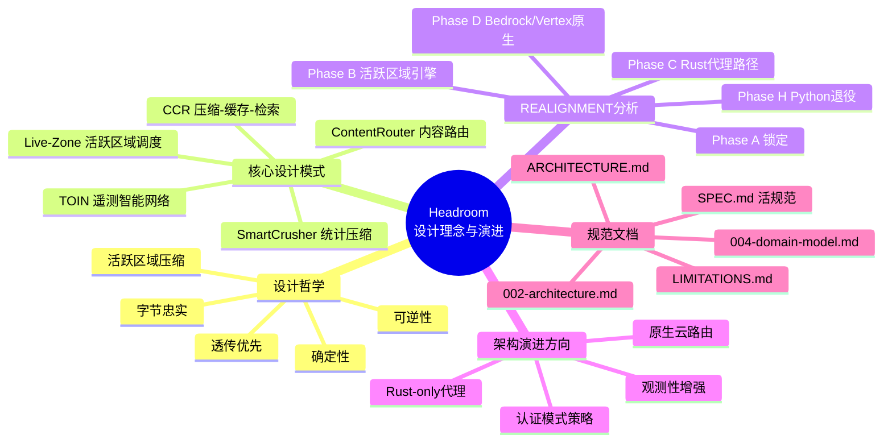
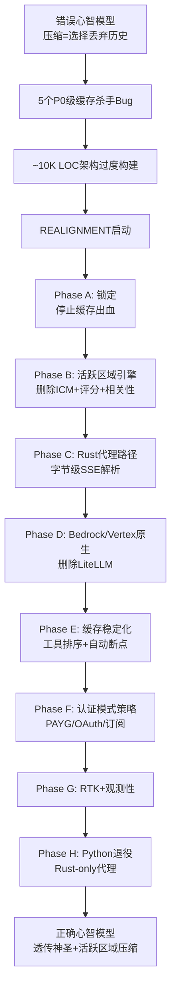
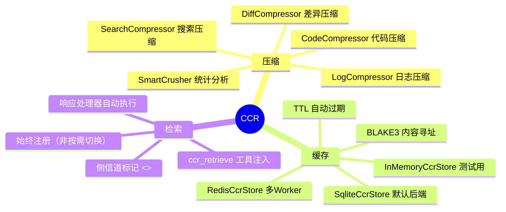
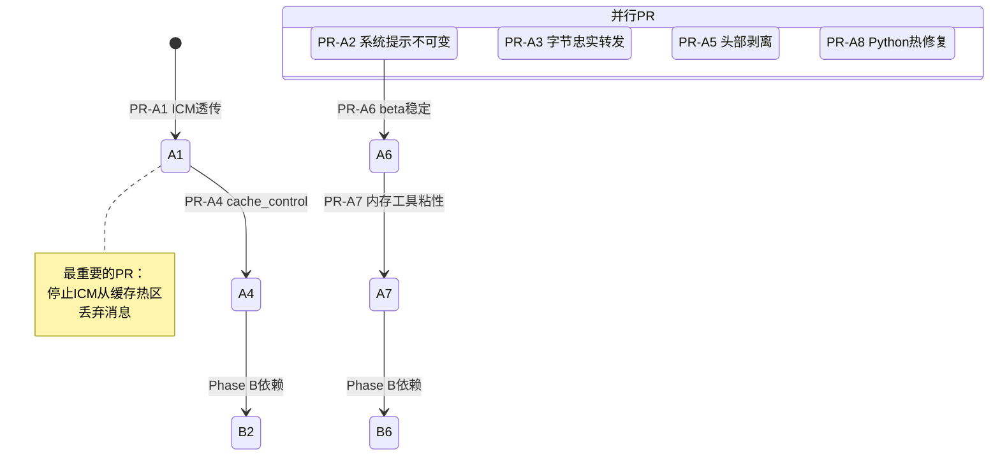
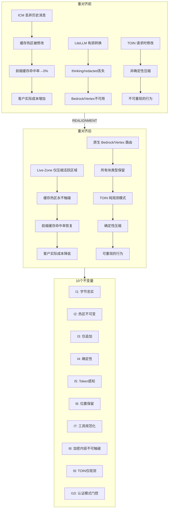

# 第21篇：设计理念与演进

## 一、总述：Headroom 设计理念与架构演进

Headroom 项目经历了一次深刻的认知革命——从"压缩意味着选择丢弃什么"到"直通是神圣的，仅压缩活跃区域"。这一转变不仅修正了核心设计假设，更驱动了一次涉及9个阶段、40个PR、约13周工作量的全面架构重对齐（REALIGNMENT）。

本文从设计哲学、核心设计模式、REALIGNMENT 分析、架构演进方向和规范文档五个维度，深入剖析 Headroom 的设计理念及其演进轨迹。





---

## 二、分述：设计哲学

### 2.1 透传优先（Passthrough is Sacred）

Headroom 最根本的设计原则是：**未被修改的字节必须逐字节透传**。这不是性能优化，而是正确性要求。

在 LLM 代理场景中，上游提供商（Anthropic、OpenAI）使用前缀缓存来降低成本和延迟。任何微小的字节变化——哪怕是一个空格、一个 `\uXXXX` 转义、一个浮点数精度差异——都会导致缓存失效，使客户的缓存命中率趋近于零。

这一原则体现在 REALIGNMENT 的不变量 I1 中：

> **不变量 I1 — 字节忠实透传**：对于每个请求，发送到上游的字节与从客户端接收的字节在 SHA-256 级别相等，**仅允许被变换显式修改的字节范围除外**。不允许通过 `Value` 类型重新序列化，不允许 JSON 美化空格插入，不允许 `\uXXXX` ASCII 转义。

### 2.2 活跃区域压缩（Live-Zone-Only Compression）

正确的压缩心智模型是：**缓存热区永不触碰，仅压缩活跃区域**。

缓存热区包括：
- `system` 提示词
- `tools` 定义
- 所有历史对话轮次
- `thinking` 块（含 `signature`）
- `redacted_thinking` 数据
- `compaction` 条目

活跃区域仅包括：
- 最新的用户消息内容
- 最新的 `tool_result`
- 最新的 `function_call_output`
- 最新的 `local_shell_call_output`

### 2.3 可逆性（Reversibility）

CCR（Compress-Cache-Retrieve）架构确保压缩是可逆的：原始内容被缓存，LLM 可以通过 `ccr_retrieve` 工具按需检索。这意味着压缩不会造成永久性信息丢失。

### 2.4 确定性（Determinism）

对于相同的 `(input bytes, frozen_count, auth_mode)`，压缩器必须产生逐字节相等的输出。不允许时间戳、随机种子或时间依赖的决策。TOIN 被重构为纯观测模式，推荐在部署间隔发布，不在请求时修改。

### 2.5 认证模式感知（Auth-Mode Awareness）

不同的认证模式需要不同的压缩策略：

| 模式 | 压缩策略 | 原因 |
|------|----------|------|
| PAYG | 激进（全活跃区域+CCR+工具注入） | 用户直接付费，最大化节省 |
| OAuth | 仅无损（活跃区域无损+无自动缓存标记） | 可能超出 OAuth scope |
| Subscription | 隐身优先（同OAuth+保留accept-encoding） | 避免指纹泄露导致订阅撤销 |

---

## 三、分述：核心设计模式

### 3.1 CCR：压缩-缓存-检索

CCR 是 Headroom 的核心架构模式，解决了"压缩可能丢失重要信息"的根本矛盾。



CCR 的关键设计决策：
- **`ccr_retrieve` 始终注册**：一旦会话执行过 CCR 压缩，工具在后续每个请求中都存在，避免工具列表翻转导致缓存失效
- **侧信道标记**：`<<ccr:HASH>>` 标记作为压缩内容的兄弟文本块注入，而非在原始块上添加字段
- **持久化后端**：从内存存储升级到 SQLite（默认）/ Redis（多 Worker），代理重启后仍可检索

### 3.2 TOIN：遥测智能网络

TOIN（Tool Output Intelligence Network）是一个观测-学习系统，记录压缩模式并生成推荐。关键约束是**纯观测模式**：

```python
# 重对齐前（错误）：TOIN 在请求时修改压缩决策
def get_recommendation(self, tool_name):
    return CompressionHint(max_items=15, aggressiveness=0.7)

# 重对齐后（正确）：TOIN 仅观测，推荐在部署间隔发布
class Telemetry:
    def record_compression(self, auth_mode, model, structure_hash, outcome):
        """Record only — no request-time hint API. Period."""
```

### 3.3 SmartCrusher：统计压缩

SmartCrusher 是 Headroom 的旗舰压缩器，基于统计分析而非规则匹配：

1. **字段分析**：计算每个字段的 `unique_ratio`、`variance`、`change_points`
2. **模式检测**：识别 TIME_SERIES、LOGS、SEARCH_RESULTS、GENERIC
3. **自适应 K**：使用 Kneedle 算法在信息覆盖曲线上找到拐点
4. **安全保证**：错误项、数值异常、字符串长度异常、变化点始终保留

### 3.4 ContentRouter：内容路由

ContentRouter 是架构上正确的组件（~2150 LOC Python），负责：
- 检测内容类型（JSON/日志/Diff/HTML/代码/纯文本）
- 将内容分派到类型感知的压缩器
- 管理压缩管线的执行顺序

### 3.5 Live-Zone 调度器

Live-Zone 调度器是 REALIGNMENT Phase B 引入的新架构核心，替代了被删除的 ICM：

```rust
pub fn compress_live_zone(
    body_raw: &serde_json::value::RawValue,
    frozen_message_count: usize,
    auth_mode: AuthMode,
) -> Result<LiveZoneOutcome> {
    // 1. 仅解析 messages 字段
    // 2. 从尾部识别活跃区域块
    // 3. 逐块内容类型检测 + 分派压缩器
    // 4. Token 验证 + 回退
    // 5. CCR: hash-key, store, marker
    // 6. 原地替换块字节
}
```

---

## 四、分述：REALIGNMENT 分析

### 4.1 问题根源：错误的心智模型

[00-overview.md](file:///workspace/REALIGNMENT/00-overview.md) 揭示了 Headroom 的根本问题：项目建立在错误的心智模型之上——"压缩意味着选择从对话历史中丢弃什么"。这导致了 `IntelligentContextManager`（ICM）+ `DropByScoreStrategy` + `MessageScorer` + 相关性评分 + 滚动窗口 + 渐进式摘要器的整个架构过度构建。

[01-bug-list.md](file:///workspace/REALIGNMENT/01-bug-list.md) 列出了72个 Bug，按优先级分布：

| 优先级 | 数量 | 影响 |
|--------|------|------|
| P0（缓存杀手） | 7 | 所有客户受影响 |
| P1（线格式） | 10 | 流式传输损坏 |
| P2（过度构建） | 10 | ~10K LOC 待删除 |
| P3（缺失基础设施） | 9 | 缓存稳定化缺失 |
| P4（长尾+Bedrock） | 12 | Bedrock/Vertex 伪造 |
| P5（认证+观测） | 14 | 指纹泄露风险 |
| P6（测试基础设施） | 10 | 奇偶校验不足 |

### 4.2 Phase A：缓存安全锁定

[03-phase-A-lockdown.md](file:///workspace/REALIGNMENT/03-phase-A-lockdown.md) 定义了8个PR，目标是在一周内停止缓存出血：



关键 PR 的影响：

- **PR-A1**：使 `/v1/messages` 成为纯透传，消除 P0-3/P0-4/P0-5/P1-13
- **PR-A3**：切换到 `content=raw_bytes`，消除 P0-2（影响最大的单PR）
- **PR-A4**：启用 `arbitrary_precision` + `raw_value`，使用 `RawValue` 保留未修改消息的原始字节

### 4.3 Phase B：活跃区域引擎

[04-phase-B-live-zone.md](file:///workspace/REALIGNMENT/04-phase-B-live-zone.md) 是架构重对齐的核心——删除 ~10K LOC 过度构建，构建正确的替代：

**删除清单**：
- `headroom/transforms/intelligent_context.py`（1077 LOC）
- `headroom/transforms/rolling_window.py`（395 LOC）
- `headroom/transforms/progressive_summarizer.py`（508 LOC）
- `headroom/transforms/scoring.py`（459 LOC）
- `headroom/transforms/tool_crusher.py`（338 LOC）
- `crates/headroom-core/src/scoring/*.rs`（~1500 LOC）
- `crates/headroom-core/src/relevance/*.rs`（~1600 LOC）
- `crates/headroom-core/src/context/*.rs`（~1500 LOC，除 safety.rs）

**构建清单**：
- `crates/headroom-core/src/transforms/live_zone.rs`：活跃区域块调度器
- Token 验证门控 + 按内容类型的字节阈值
- TOIN 纯观测重构
- 内存子系统重构（活跃区域尾部注入）
- CCR 持久化后端 + 始终注册工具

### 4.4 Phase C：Rust 代理路径

[05-phase-C-rust-proxy.md](file:///workspace/REALIGNMENT/05-phase-C-rust-proxy.md) 将所有代理表面移植到 Rust，包括字节级 SSE 解析器和完整的流式状态机：

```rust
pub struct AnthropicStreamState {
    pub message_id: Option<String>,
    pub blocks: HashMap<usize, BlockState>,  // 按 index 键控
    pub stop_reason: Option<String>,
    pub usage: UsageBuilder,
    pub status: StreamStatus,
}

pub struct BlockState {
    pub block_type: String,
    pub text_buffer: String,
    pub partial_json: String,
    pub signature: Option<String>,
    pub citations: Vec<Citation>,
    pub complete: bool,
}
```

### 4.5 Phase D：Bedrock/Vertex 原生

[06-phase-D-bedrock-vertex.md](file:///workspace/REALIGNMENT/06-phase-D-bedrock-vertex.md) 删除了伪造的 LiteLLM 转换器，构建原生路由：

- **Bedrock**：`/model/{model}/invoke` + SigV4 签名 + 二进制 EventStream 解析
- **Vertex**：`/v1beta1/projects/.../rawPredict` + ADC 认证 + SSE 流式

关键收益：`thinking`、`redacted_thinking`、`document`、`search_result`、`image`、`server_tool_use`、`mcp_tool_use` 块在 Bedrock/Vertex 路径上得到完整保留。

### 4.6 Phase H：Python 退役

[10-phase-H-python-retirement.md](file:///workspace/REALIGNMENT/10-phase-H-python-retirement.md) 是重对齐的终点——删除 ~20K LOC Python 代理代码，仅保留 Python 在其擅长的领域：

| 保留模块 | 原因 |
|----------|------|
| `headroom/cli/wrap/*.py` | 离路径；文件系统+子进程编排 |
| `headroom/evals/` | 离路径；研究/批处理工具 |
| `headroom/telemetry/toin.py` | 离路径；纯观测模式 |
| `headroom/subscription/` | 离路径；订阅使用轮询 |

---

## 五、分述：架构演进方向

### 5.1 Rust-only 代理

[02-architecture.md](file:///workspace/REALIGNMENT/02-architecture.md) 描述了 Phase H 后的目标架构——纯 Rust 代理，包含10个不变量：

| 不变量 | 核心要求 |
|--------|----------|
| I1 | 字节忠实透传 |
| I2 | 缓存热区永不修改 |
| I3 | 仅追加（Append-only） |
| I4 | 确定性 |
| I5 | Token 感知（非字节感知） |
| I6 | 位置保留 |
| I7 | 工具定义规范化（非压缩） |
| I8 | signature/encrypted_content/redacted_thinking 不可触碰 |
| I9 | TOIN 仅观测，永不修改请求字节 |
| I10 | 认证模式门控压缩策略 |

### 5.2 原生云路由

Phase D 的 Bedrock/Vertex 原生路由为 Marketplace BYOC（Bring Your Own Cloud）场景奠定了基础。每个云提供商的原生路由避免了 LiteLLM 的有损转换，恢复了缓存保真度。

### 5.3 观测性增强

Phase G 引入了完整的可观测性栈：
- Prometheus 指标：缓存命中率、压缩比直方图、Token 验证拒绝计数
- RTK（Return Token Kit）：每次调用的 Prometheus 指标
- 请求 ID 捕获：上游 `request-id` 记录到日志

### 5.4 认证模式策略

Phase F 引入了 `classify_auth_mode(headers)` 辅助函数，返回 `payg | oauth | subscription`，驱动差异化的压缩策略。这解决了指纹泄露风险（P5-49 到 P5-56）。

---

## 六、分述：规范文档

### 6.1 活规范：SPEC.md

[SPEC.md](file:///workspace/docs/spec/SPEC.md) 是 Headroom 的规范权威来源，包含21个章节，覆盖从愿景到测试的完整规范：

| 规则 | 描述 |
|------|------|
| **Canonical** | 当代码与规范分歧时，规范是目标；代码需要更新 |
| **Living** | 行为变更需要规范更新（PR 检查清单） |
| **Comprehensive** | 覆盖每个用户可见的表面、行为和保证 |
| **Language-agnostic** | 规范支持用任何语言完整重写并保持一致性 |
| **Versioned** | 变更递增版本；破坏性变更需要主版本升级 |

核心保证：
1. **默认永不记录提示**——除非配置了导出器，否则提示数据不离开代理
2. **默认永不离开代理**——所有数据默认保留在本地
3. **可组合**——与现有工具（Claude Code、Copilot 等）协同工作
4. **透明**——对压缩内容和原因的完整可观测性

### 6.2 架构规范：002-architecture.md

[002-architecture.md](file:///workspace/docs/spec/002-architecture.md) 定义了系统组件规范，包括代理服务器、SDK、Wrap CLI、CCR MCP 服务器、压缩层和学习系统。

值得注意的是，该文档描述的是**当前架构**（包含 ICM、RollingWindow 等），而 REALIGNMENT 描述的是**目标架构**。两者之间的差异正是 REALIGNMENT 要消除的。

### 6.3 领域模型：004-domain-model.md

[004-domain-model.md](file:///workspace/docs/spec/004-domain-model.md) 定义了核心实体：

- **Session**：对话上下文
- **Message**：单条消息
- **Request**：API 请求记录
- **Savings**：Token 节省记录
- **CacheEntry**：缓存条目
- **ToolDefinition**：工具定义
- **CCRContext**：CCR 上下文跟踪
- **SubscriptionState**：订阅状态

### 6.4 架构说明：ARCHITECTURE.md

[ARCHITECTURE.md](file:///workspace/wiki/ARCHITECTURE.md) 是面向用户的完整架构说明，详细描述了 Headroom 的工作原理、组件交互和数据流。它包含了 CCR 的6个阶段（压缩存储→检索API→工具注入→反馈循环→响应处理→上下文跟踪）和 SmartCrusher 的深入分析。

### 6.5 限制说明：LIMITATIONS.md

[LIMITATIONS.md](file:///workspace/wiki/LIMITATIONS.md) 诚实地记录了 Headroom 的局限性和已知行为：

| 内容类型 | 压缩率 | 延迟影响 |
|----------|--------|----------|
| JSON 字典数组 | 86-100% | 净延迟收益 |
| JSON 字符串数组 | 60-90% | 净延迟收益 |
| 结构化日志 | 82-95% | 净延迟收益 |
| 代理对话 | 56-81% | 持平到净收益 |
| 纯文本 | 43-46% | 增加延迟（仅成本节省） |
| 代码 | 透传 | 最小开销 |

关键限制：
- **代码压缩**：AST 感知但被安全保护门控，大多数场景下透传
- **ML 压缩**：Kompress 可选但增加延迟，仅用于成本节省而非速度
- **TOIN 冷启动**：新工具类型无学习模式，回退到统计启发式

---

## 七、总述：设计演进全景

Headroom 的设计演进体现了一个核心教训：**在缓存敏感的代理系统中，正确性比功能更重要**。ICM 的"智能"上下文管理实际上是最昂贵的设计错误——它通过丢弃历史消息来"节省"Token，却摧毁了上游提供商的前缀缓存，导致客户实际成本增加而非减少。



**核心洞察**：

1. **心智模型决定架构**：从"压缩=丢弃"到"透传+活跃区域"的转变，不是增量优化而是根本重构。错误的心智模型导致了 ~10K LOC 的过度构建，正确的模型只需要 ~800 LOC 的 Live-Zone 调度器
2. **缓存是第一公民**：在 LLM 代理系统中，前缀缓存命中率直接决定成本。任何破坏缓存的设计，无论看起来多"智能"，都是净负面的
3. **可逆性是安全网**：CCR 确保压缩不会造成永久性信息丢失，这是 Headroom 区别于简单截断的核心价值
4. **确定性是信任基础**：TOIN 的纯观测重构确保了压缩行为的可重现性，这是企业级采用的必要条件
5. **规范先于代码**：SPEC.md 的"Canonical"规则——当代码与规范分歧时，规范是目标——确保了设计意图不会被实现细节侵蚀
