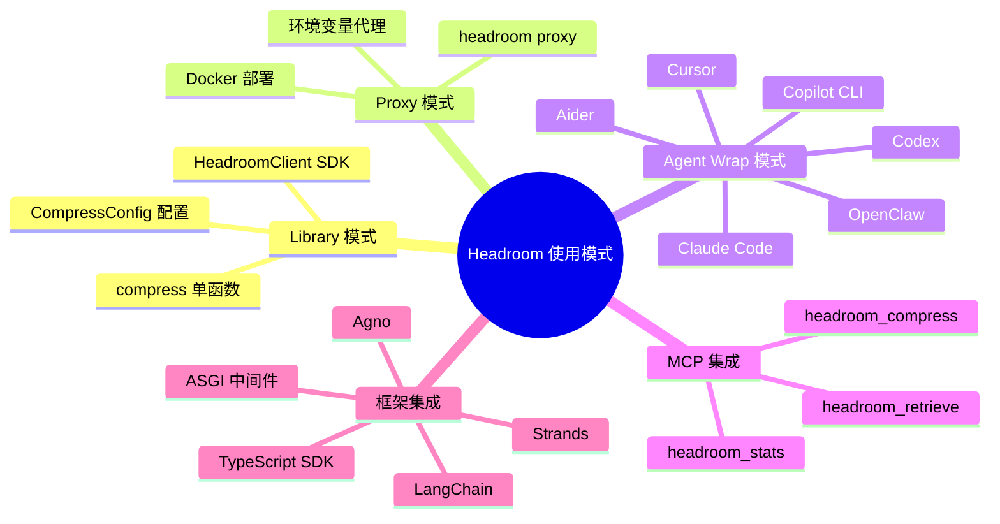
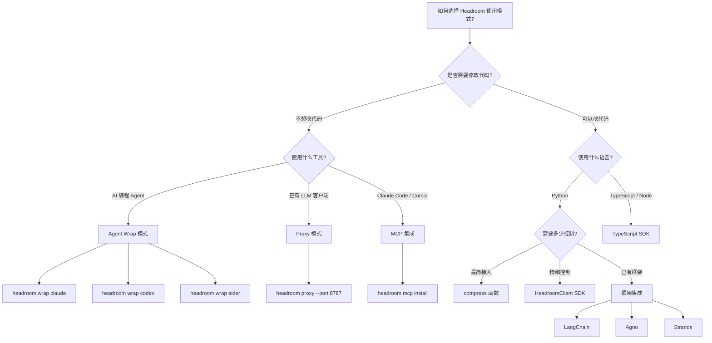
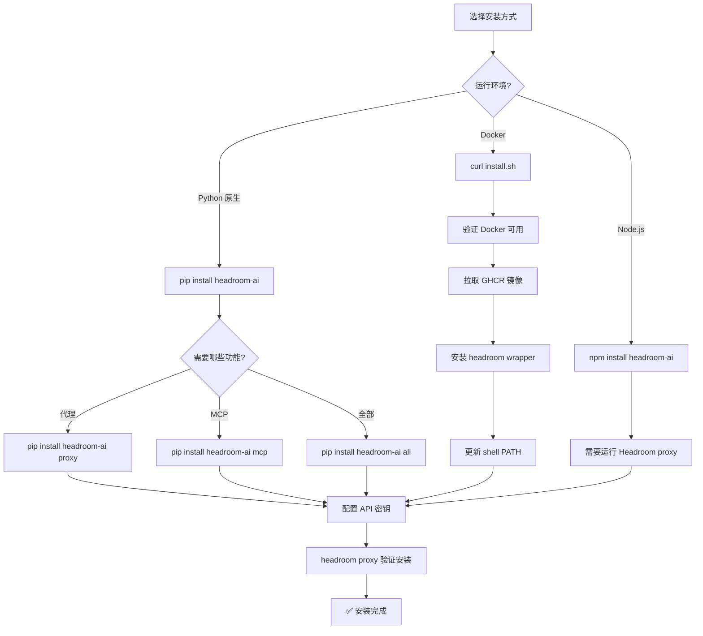
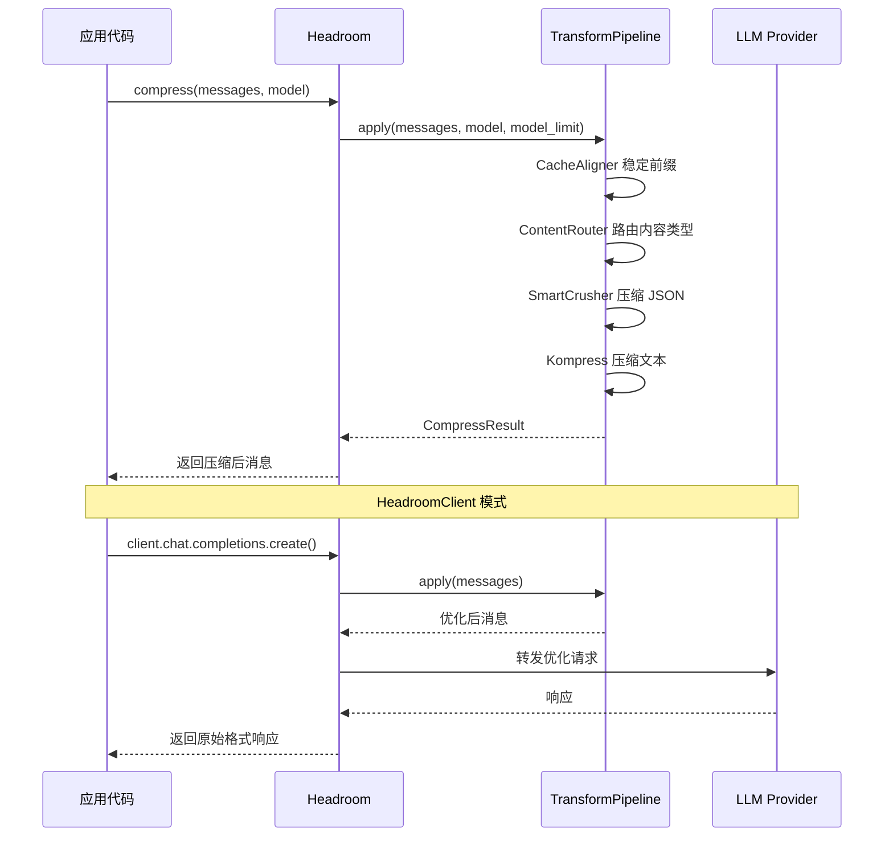
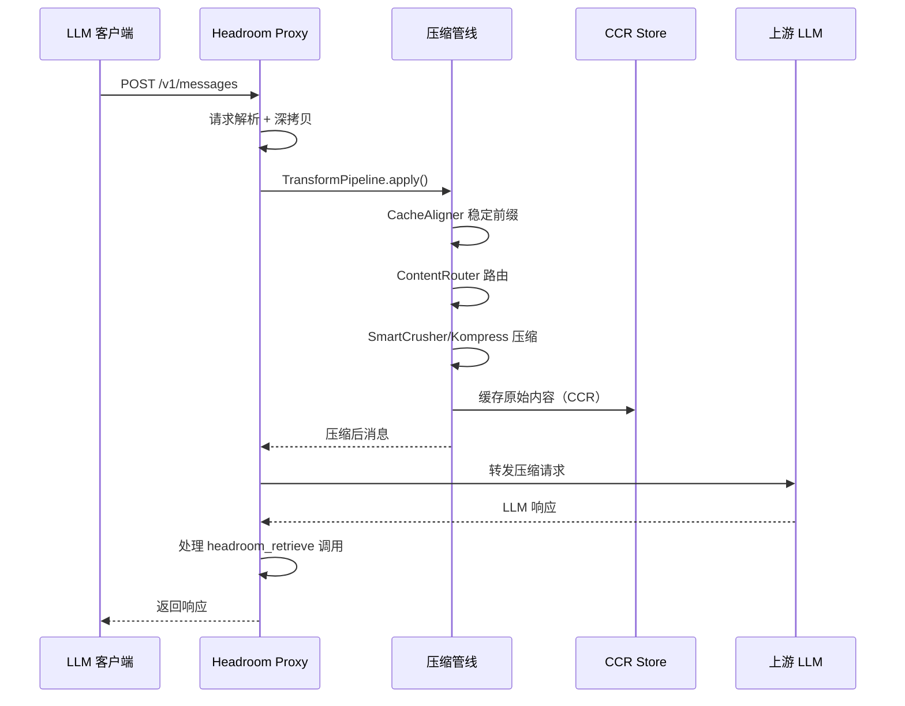
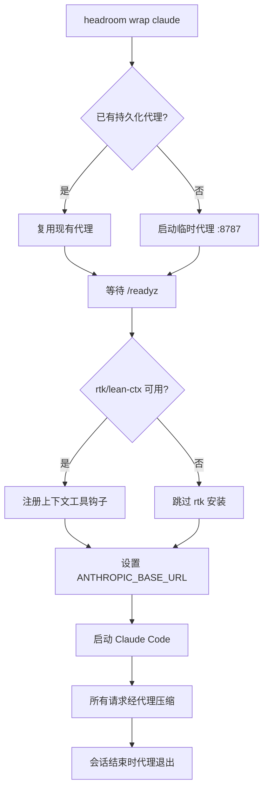
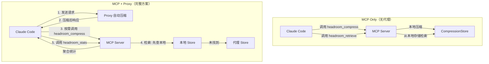
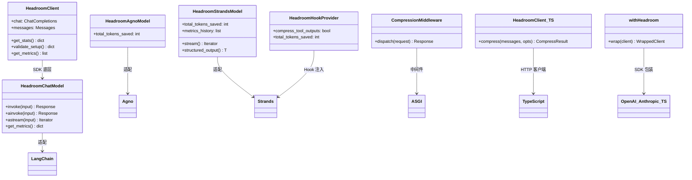
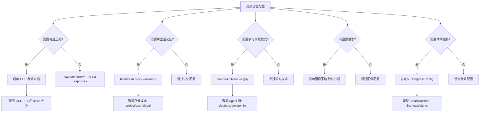
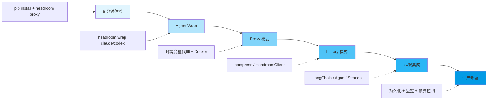

# 22. Headroom 使用指南与实践

> **一句话定义**：从零到生产级的完整使用手册——5 种使用模式、8 大核心功能、端到端代码示例，助你在任何场景下用最短路径接入 Headroom 的上下文压缩能力。

---

## 总（概述）

Headroom 是 AI Agent 的上下文压缩层，能在不改变答案质量的前提下，将 LLM 输入 token 减少 60%–95%。它提供 5 种互补的使用模式，从零代码代理到精细 API 控制，覆盖所有技术栈和部署场景。

### 图 22-1: Headroom 使用方式知识脑图



### 图 22-2: Headroom 使用模式选择决策图



### 核心使用模式概览表

| 模式 | 命令/接口 | 零代码 | 适用场景 | 典型节省 |
|------|-----------|--------|----------|----------|
| **Library** | `compress()` / `HeadroomClient` | ❌ | Python 应用内嵌 | 60–95% |
| **Proxy** | `headroom proxy` | ✅ | 任何语言、已有工具 | 60–95% |
| **Agent Wrap** | `headroom wrap <agent>` | ✅ | Claude/Codex/Aider 等 | 60–92% |
| **MCP** | `headroom mcp install` | ✅ | MCP 兼容客户端 | 按需压缩 |
| **框架集成** | 各框架适配器 | ❌ | LangChain/Agno/Strands | 60–90% |

---

## 分（详细分析）

### 1. 安装与初始化

#### pip install 安装

```bash
# 核心包（最小依赖）
pip install headroom

# 带代理服务器
pip install "headroom-ai[proxy]"

# 带 MCP 工具
pip install "headroom-ai[mcp]"

# 带语义相关性评分
pip install "headroom-ai[relevance]"

# 带 ML 压缩（Kompress 模型）
pip install "headroom-ai[ml]"

# 带 LangChain 集成
pip install "headroom-ai[langchain]"

# 全部安装
pip install "headroom-ai[all]"
```

> 需要 **Python 3.10+**。使用 `pipx` 时请指定解释器：`pipx install --python python3.13 "headroom-ai[all]"`

#### Docker 安装

```bash
# 一键安装（Linux）
curl -fsSL https://raw.githubusercontent.com/chopratejas/headroom/main/scripts/install.sh | bash

# macOS（需 bash 4.3+）
curl -fsSL https://raw.githubusercontent.com/chopratejas/headroom/main/scripts/install.sh | "$(brew --prefix bash)/bin/bash"

# Windows PowerShell
irm https://raw.githubusercontent.com/chopratejas/headroom/main/scripts/install.ps1 | iex

# 直接拉取镜像
docker pull ghcr.io/chopratejas/headroom:latest
```

安装脚本会将 `headroom` wrapper 写入 `~/.local/bin`，自动挂载 `~/.headroom`、`~/.claude`、`~/.codex`、`~/.gemini` 到容器内，保持与原生安装一致的行为。详见 [install.sh](file:///workspace/scripts/install.sh)。

#### npm 安装（TypeScript SDK）

```bash
npm install headroom-ai
```

#### 环境变量配置

| 变量 | 说明 | 默认值 |
|------|------|--------|
| `ANTHROPIC_API_KEY` | Anthropic API 密钥 | — |
| `OPENAI_API_KEY` | OpenAI API 密钥 | — |
| `HEADROOM_HOST` | 代理绑定主机 | `127.0.0.1` |
| `HEADROOM_PORT` | 代理端口 | `8787` |
| `HEADROOM_MODE` | 优化模式（token/cache） | `token` |
| `HEADROOM_BUDGET` | 每日预算上限（USD） | — |
| `HEADROOM_WORKSPACE_DIR` | 状态存储根目录 | `~/.headroom` |
| `HEADROOM_CONFIG_DIR` | 配置文件根目录 | `~/.headroom/config` |
| `HEADROOM_CODE_AWARE_ENABLED` | 启用 AST 代码压缩 | `false` |

### 图 22-3: 安装流程图



---

### 2. Library 模式：Python API

#### compress() 单函数接口

最简单的集成方式——两行代码即可接入：

```python
from headroom import compress

# 压缩消息
result = compress(messages, model="claude-sonnet-4-5-20250929")

# 使用压缩后的消息
response = your_client.create(messages=result.messages)

print(f"节省 {result.tokens_saved} tokens ({result.compression_ratio:.0%})")
```

`compress()` 返回 `CompressResult` 对象，包含以下字段：

| 字段 | 类型 | 说明 |
|------|------|------|
| `messages` | `list[dict]` | 压缩后的消息（格式与输入相同） |
| `tokens_before` | `int` | 压缩前 token 数 |
| `tokens_after` | `int` | 压缩后 token 数 |
| `tokens_saved` | `int` | 节省的 token 数 |
| `compression_ratio` | `float` | 压缩比（0.0 = 无节省, 1.0 = 全部移除） |
| `transforms_applied` | `list[str]` | 应用的转换列表 |

核心实现见 [compress.py](file:///workspace/headroom/compress.py)，内部使用单例 `TransformPipeline`（CacheAligner → ContentRouter → SmartCrusher/Kompress）。

#### CompressConfig 配置选项

```python
from headroom import compress
from headroom.compress import CompressConfig

# 编程 Agent（默认——跳过用户消息，保护最近对话）
result = compress(messages, model="gpt-4o")

# 金融文档（压缩所有内容，保留 50%）
result = compress(
    messages,
    model="claude-opus-4-20250514",
    compress_user_messages=True,
    target_ratio=0.5,
    protect_recent=0,
)

# 激进模式（日志、搜索结果）
result = compress(messages, model="gpt-4o", target_ratio=0.2)
```

| 参数 | 默认值 | 说明 |
|------|--------|------|
| `compress_user_messages` | `False` | 是否压缩用户消息 |
| `compress_system_messages` | `True` | 是否压缩系统消息 |
| `protect_recent` | `4` | 保护最近 N 条消息不被压缩 |
| `protect_analysis_context` | `True` | 检测"分析"意图并保护代码 |
| `target_ratio` | `None` | Kompress 保留比例（None = 模型决定） |
| `min_tokens_to_compress` | `250` | 最小压缩 token 阈值 |
| `kompress_model` | `None` | Kompress 模型 ID（`"disabled"` 跳过 ML 压缩） |

#### HeadroomClient 高级客户端

```python
from headroom import HeadroomClient, OpenAIProvider
from openai import OpenAI

# 创建包装客户端
client = HeadroomClient(
    original_client=OpenAI(),
    provider=OpenAIProvider(),
    default_mode="optimize",
)

# 使用方式与原始客户端完全一致
response = client.chat.completions.create(
    model="gpt-4o",
    messages=[
        {"role": "system", "content": "You are a helpful assistant."},
        {"role": "user", "content": "Hello!"},
    ],
)
```

`HeadroomClient` 支持三种模式：

| 模式 | 行为 | 用途 |
|------|------|------|
| `audit` | 观察并记录，不修改请求 | 生产监控、基线测量 |
| `optimize` | 应用安全的确定性转换 | 生产优化 |
| `simulate` | 返回计划但不调用 API | 测试、成本估算 |

实现细节见 [client.py](file:///workspace/headroom/client.py)，核心流程：`parse_messages` → `TransformPipeline.apply` → `CacheOptimizer.optimize` → `call_client_transport`。

#### Anthropic SDK 集成

```python
from anthropic import Anthropic
from headroom import HeadroomClient, AnthropicProvider

client = HeadroomClient(
    original_client=Anthropic(),
    provider=AnthropicProvider(),
    default_mode="optimize",
)

response = client.messages.create(
    model="claude-3-5-sonnet-20241022",
    max_tokens=1024,
    messages=[{"role": "user", "content": "Hello!"}],
)
```

#### OpenAI SDK 集成

```python
from openai import OpenAI
from headroom import compress

client = OpenAI()
messages = [
    {"role": "user", "content": "Analyze these results"},
    {"role": "tool", "content": big_json_output, "tool_call_id": "call_1"},
]

compressed = compress(messages, model="gpt-4o")
response = client.chat.completions.create(
    model="gpt-4o",
    messages=compressed.messages,
)
```

#### LiteLLM 集成

```python
import litellm
from headroom import compress

messages = [...]
compressed = compress(messages, model="bedrock/claude-sonnet")
response = litellm.completion(model="bedrock/claude-sonnet", messages=compressed.messages)
```

或使用回调模式：

```python
import litellm
from headroom.integrations.litellm_callback import HeadroomCallback

litellm.callbacks = [HeadroomCallback()]

# 所有调用自动压缩
response = litellm.completion(model="gpt-4o", messages=[...])
```

### 图 22-4: Library 模式调用时序图



---

### 3. Proxy 模式：零代码集成

#### 启动代理服务器

```bash
# 基本启动
headroom proxy

# 自定义端口
headroom proxy --port 8080

# 完整配置
headroom proxy \
  --host 0.0.0.0 \
  --port 8787 \
  --mode token \
  --log-file /var/log/headroom.jsonl \
  --budget 100.0 \
  --memory \
  --learn
```

CLI 实现见 [proxy.py](file:///workspace/headroom/cli/proxy.py)，通过 Click 定义所有选项并构建 `ProxyConfig`。

#### 环境变量代理设置

```bash
# Claude Code
ANTHROPIC_BASE_URL=http://localhost:8787 claude

# OpenAI 兼容客户端
OPENAI_BASE_URL=http://localhost:8787/v1 your-app

# GitHub Copilot CLI
headroom wrap copilot -- --model claude-sonnet-4-20250514
```

#### 运行模式

| 模式 | 说明 | 适用场景 |
|------|------|----------|
| `token` | 优先压缩，可重写历史轮次 | 最大化即时节省 |
| `cache` | 冻结历史轮次，仅压缩最新轮 | 长对话，保持前缀缓存命中 |

```bash
headroom proxy --mode token       # 最大化压缩
HEADROOM_MODE=cache headroom proxy  # 保持缓存稳定
```

#### 认证与安全

代理默认绑定 `127.0.0.1`（仅本地访问），API 密钥直接透传到上游 LLM 提供商：

```bash
# 安全：仅本地可访问
headroom proxy --host 127.0.0.1

# 危险：对外暴露（需配合防火墙）
headroom proxy --host 0.0.0.0
```

#### API 端点

| 端点 | 方法 | 说明 |
|------|------|------|
| `/v1/messages` | POST | Anthropic 格式请求 |
| `/v1/chat/completions` | POST | OpenAI 格式请求 |
| `/v1/compress` | POST | 仅压缩，不调用 LLM |
| `/livez` | GET | 存活检查 |
| `/readyz` | GET | 就绪检查 |
| `/health` | GET | 聚合健康状态 |
| `/stats` | GET | 详细统计 |
| `/stats-history` | GET | 历史节省数据 |
| `/metrics` | GET | Prometheus 指标 |

`/v1/compress` 端点特别适用于 TypeScript SDK 和任何 HTTP 客户端：

```bash
curl -X POST http://localhost:8787/v1/compress \
  -H "Content-Type: application/json" \
  -d '{"messages": [...], "model": "gpt-4o"}'
```

#### Docker 部署方案

```dockerfile
FROM python:3.11-slim
RUN apt-get update && apt-get install -y --no-install-recommends build-essential \
    && pip install "headroom-ai[proxy]" \
    && apt-get purge -y build-essential && apt-get autoremove -y \
    && rm -rf /var/lib/apt/lists/*
EXPOSE 8787
CMD ["headroom", "proxy", "--host", "0.0.0.0"]
```

使用 Docker Compose 持久化部署：

```bash
export HEADROOM_HOST_HOME="$HOME"
export HEADROOM_WORKSPACE="$PWD"
docker compose -f docker/docker-compose.native.yml up -d proxy
```

#### macOS 持久化部署

使用 LaunchAgent 实现开机自启、崩溃自动重启：

```bash
# 自动安装
cd examples/deployment/macos-launchagent
./install.sh

# 自定义端口
./install.sh --port 9000

# 查看状态
launchctl print gui/$(id -u)/com.headroom.proxy

# 重启
launchctl kickstart -k gui/$(id -u)/com.headroom.proxy
```

详见 [macos-deployment.md](file:///workspace/wiki/macos-deployment.md)。

#### Linux 持久化部署

使用 `headroom install` 命令：

```bash
# 持久化服务
headroom install apply --preset persistent-service --providers auto

# 持久化 Docker
headroom install apply --preset persistent-docker --scope user --providers auto

# 查看状态
headroom install status

# 重启
headroom install restart
```

详见 [persistent-installs.md](file:///workspace/wiki/persistent-installs.md)。

### 图 22-5: Proxy 请求处理时序图



---

### 4. Agent Wrap 模式：一键包装

`headroom wrap` 是最便捷的 Agent 集成方式——一条命令即可启动代理并配置 Agent。

#### 支持的 Agent

| Agent | 命令 | 机制 |
|-------|------|------|
| **Claude Code** | `headroom wrap claude` | 设置 `ANTHROPIC_BASE_URL` + 启动代理 |
| **Codex** | `headroom wrap codex` | 设置 `OPENAI_BASE_URL` + 启动代理 |
| **Cursor** | `headroom wrap cursor` | 启动代理 + 打印配置指引 |
| **Aider** | `headroom wrap aider` | 设置 `OPENAI_API_BASE` + 启动代理 |
| **Copilot CLI** | `headroom wrap copilot` | BYOK 提供商设置 + 启动代理 |
| **OpenClaw** | `headroom wrap openclaw` | 安装 Headroom 插件 + 配置 |

#### Claude Code

```bash
# 基本用法
headroom wrap claude

# 恢复会话
headroom wrap claude --resume <session-id>

# 自定义端口
headroom wrap claude --port 9999

# 启用记忆
headroom wrap claude --memory

# 复用已有代理
headroom wrap claude --no-proxy
```

#### Codex

```bash
# 基本用法
headroom wrap codex

# 传递参数
headroom wrap codex -- "fix the bug"

# 使用 anyllm 后端
headroom wrap codex --backend anyllm --anyllm-provider groq
```

#### Aider

```bash
headroom wrap aider
headroom wrap aider -- --model gpt-4o
headroom wrap aider --backend litellm-vertex --region us-central1
```

#### Cursor

```bash
headroom wrap cursor
# 输出配置指引，代理保持运行
# 在 Cursor 设置中填入 base URL
```

#### Copilot CLI

```bash
headroom wrap copilot -- --model claude-sonnet-4-20250514
headroom wrap copilot --backend anyllm --anyllm-provider groq -- --model gpt-4o
```

#### OpenClaw

```bash
headroom wrap openclaw
# 安装 Headroom 插件并配置为 contextEngine
```

#### 环境变量注入机制

`headroom wrap` 的核心机制是环境变量注入：

| Agent | 注入的环境变量 | 效果 |
|-------|---------------|------|
| Claude Code | `ANTHROPIC_BASE_URL=http://127.0.0.1:8787` | 请求走 Headroom 代理 |
| Codex | `OPENAI_BASE_URL=http://127.0.0.1:8787/v1` | 请求走 Headroom 代理 |
| Aider | `OPENAI_API_BASE` + `ANTHROPIC_BASE_URL` | 双提供商支持 |
| Copilot | BYOK 提供商设置 | 代理路由到正确后端 |

实现见 [wrap.py](file:///workspace/headroom/cli/wrap.py) 和 [install.sh](file:///workspace/scripts/install.sh) 中的 Docker-native wrapper。

#### 最佳实践

1. **优先使用 `--no-proxy` 复用代理**：如果已有持久化代理运行，避免启动第二个
2. **启用 `--memory`**：跨会话记忆，Agent 能记住之前的工作上下文
3. **启用 `--learn`**：自动学习失败模式，减少重复错误
4. **Docker 模式下使用 `--no-rtk`**：如果不需要 rtk 上下文工具

### 图 22-6: Agent Wrap 启动流程图



---

### 5. MCP 集成

MCP（Model Context Protocol）集成让任何 MCP 兼容客户端直接使用 Headroom 的压缩、检索和统计工具。

#### 安装

```bash
# 安装 MCP 依赖
pip install "headroom-ai[mcp]"

# 注册到 Claude Code（一次性）
headroom mcp install

# 自定义代理 URL
headroom mcp install --proxy-url http://127.0.0.1:9000

# 查看状态
headroom mcp status

# 卸载
headroom mcp uninstall
```

#### 三个 MCP 工具

| 工具 | 说明 | 参数 |
|------|------|------|
| `headroom_compress` | 按需压缩内容 | `content`（必需） |
| `headroom_retrieve` | 检索原始未压缩内容 | `hash`（必需）, `query`（可选） |
| `headroom_stats` | 会话压缩统计 | 无 |

**headroom_compress 使用示例**：

```
Claude: 让我压缩这个大输出以节省上下文空间。

→ headroom_compress(content="[5000 lines of grep results...]")

← {
    "compressed": "[key matches with context...]",
    "hash": "a1b2c3d4e5f6...",
    "original_tokens": 12000,
    "compressed_tokens": 3200,
    "savings_percent": 73.3,
    "transforms": ["router:search:0.27"]
  }
```

**headroom_retrieve 使用示例**：

```
Claude: 我需要查看完整的原始数据。

→ headroom_retrieve(hash="a1b2c3d4e5f6")

← {
    "original_content": "[完整 5000 行...]",
    "source": "local"
  }
```

#### 安全模式

MCP 工具的存储有 TTL 限制：

| 来源 | TTL | 说明 |
|------|-----|------|
| `headroom_compress` 压缩的内容 | 1 小时 | 会话级存储 |
| Proxy 自动压缩的内容 | 5 分钟 | 代理级存储 |

#### MCP + Proxy 完整架构

MCP 和 Proxy 不冲突——Proxy 在 HTTP 层自动压缩，MCP 工具在 LLM 接收内容后按需操作，不会双重压缩。

### 图 22-7: MCP 集成架构图



---

### 6. 框架集成

#### LangChain 集成

```bash
pip install "headroom-ai[langchain]"
```

**Chat Model 包装**：

```python
from langchain_openai import ChatOpenAI
from headroom.integrations import HeadroomChatModel

llm = HeadroomChatModel(ChatOpenAI(model="gpt-4o"))
response = llm.invoke("Hello!")

# 查看节省
print(llm.get_metrics())
# {'tokens_saved': 12500, 'savings_percent': 45.2, 'requests': 50}
```

**Memory 集成**：

```python
from headroom.integrations import HeadroomChatMessageHistory

compressed_history = HeadroomChatMessageHistory(
    base_history,
    compress_threshold_tokens=4000,
    keep_recent_turns=5,
)
```

**Retriever 集成**：

```python
from headroom.integrations import HeadroomDocumentCompressor

compressor = HeadroomDocumentCompressor(
    max_documents=10,
    min_relevance=0.3,
    prefer_diverse=True,
)
```

**Agent Tool 包装**：

```python
from headroom.integrations import wrap_tools_with_headroom

wrapped_tools = wrap_tools_with_headroom(
    tools,
    min_chars_to_compress=1000,
)
```

**LangGraph 压缩节点**：

```python
from headroom.integrations.langchain import create_compress_tool_messages_node

graph.add_node("compress", create_compress_tool_messages_node(
    min_tokens_to_compress=100,
))
graph.add_edge("tools", "compress")
graph.add_edge("compress", "agent")
```

#### Agno 集成

```python
from agno.agent import Agent
from agno.models.anthropic import Claude
from headroom.integrations.agno import HeadroomAgnoModel

model = HeadroomAgnoModel(Claude(id="claude-sonnet-4-20250514"))
agent = Agent(model=model, tools=[your_tools])
response = agent.run("Investigate the issue")
```

#### Strands 集成

```python
from strands import Agent
from strands.models.bedrock import BedrockModel
from headroom.integrations.strands import HeadroomStrandsModel, HeadroomHookProvider

# 模型包装（压缩对话历史）
model = BedrockModel(model_id="us.anthropic.claude-sonnet-4-20250514-v1:0")
optimized = HeadroomStrandsModel(wrapped_model=model)

# Hook 提供者（压缩工具输出）
hooks = HeadroomHookProvider(
    compress_tool_outputs=True,
    min_tokens_to_compress=200,
    preserve_errors=True,
)

# 两者结合，最大化节省
agent = Agent(model=optimized, hooks=[hooks])
```

#### ASGI 中间件

适用于 FastAPI、Starlette、LiteLLM Proxy 等任何 ASGI 应用：

```python
from headroom.integrations.asgi import CompressionMiddleware

# FastAPI
app = FastAPI()
app.add_middleware(CompressionMiddleware)

# LiteLLM Proxy
from litellm.proxy.proxy_server import app
app.add_middleware(CompressionMiddleware)
```

中间件拦截 `/v1/messages`、`/v1/chat/completions`、`/v1/responses` 的 POST 请求，其余请求直接透传。

#### TypeScript SDK

```typescript
import { compress } from 'headroom-ai';

const result = await compress(messages, { model: 'gpt-4o' });
console.log(`Saved ${result.tokensSaved} tokens`);
```

**Vercel AI SDK 中间件**：

```typescript
import { headroomMiddleware } from 'headroom-ai/vercel-ai';
import { wrapLanguageModel } from 'ai';
import { openai } from '@ai-sdk/openai';

const model = wrapLanguageModel({
  model: openai('gpt-4o'),
  middleware: headroomMiddleware(),
});
```

**OpenAI SDK 包装**：

```typescript
import { withHeadroom } from 'headroom-ai/openai';
import OpenAI from 'openai';

const client = withHeadroom(new OpenAI());
const response = await client.chat.completions.create({
  model: 'gpt-4o',
  messages: longConversation,
});
```

**Anthropic SDK 包装**：

```typescript
import { withHeadroom } from 'headroom-ai/anthropic';
import Anthropic from '@anthropic-ai/sdk';

const client = withHeadroom(new Anthropic());
```

### 图 22-8: 框架集成类图



---

### 7. 高级功能实践

#### CCR 可逆压缩实践

CCR（Compress-Cache-Retrieve）让压缩变得可逆——原始数据始终可检索：

```bash
# 启用 CCR（默认开启）
headroom proxy --port 8787

# 禁用 CCR 响应处理
headroom proxy --no-ccr-responses

# 禁用主动扩展
headroom proxy --no-ccr-expansion
```

CCR 配置选项（[config.py](file:///workspace/headroom/config.py) 中的 `CCRConfig`）：

| 参数 | 默认值 | 说明 |
|------|--------|------|
| `enabled` | `True` | 启用 CCR |
| `store_max_entries` | `1000` | 最大缓存条目 |
| `store_ttl_seconds` | `300` | 缓存 TTL（5 分钟） |
| `inject_retrieval_marker` | `True` | 添加检索提示 |
| `feedback_enabled` | `True` | 跟踪检索事件用于学习 |
| `inject_tool` | `True` | 注入 `headroom_retrieve` 工具 |

**CCR 工作流程**：

1. SmartCrusher 将 1000 项压缩为 20 项
2. 原始 1000 项缓存，生成 hash=abc123
3. 压缩输出添加标记：`[1000 items compressed to 20. Retrieve more: hash=abc123]`
4. LLM 通常用 20 项即可完成任务（90% 节省）
5. 如需更多数据，LLM 调用 `headroom_retrieve(hash=abc123)`

#### 记忆系统配置与使用

```bash
# 启用记忆
headroom proxy --memory

# 自定义记忆数据库路径
headroom proxy --memory --memory-db-path /path/to/memory.db

# 记忆存储模式
headroom proxy --memory --memory-storage project  # 按项目隔离（默认）
headroom proxy --memory --memory-storage user     # 按用户隔离
headroom proxy --memory --memory-storage global   # 全局共享

# 注入记忆数量
headroom proxy --memory --memory-top-k 15

# 禁用记忆工具注入
headroom proxy --memory --no-memory-tools

# 禁用记忆上下文注入
headroom proxy --memory --no-memory-context
```

**Python API 使用记忆**：

```python
from openai import OpenAI
from headroom import with_memory

# 一行启用记忆
client = with_memory(OpenAI(), user_id="alice")

# 正常使用——记忆自动提取和注入
response = client.chat.completions.create(
    model="gpt-4o",
    messages=[{"role": "user", "content": "I prefer Python for backend work"}]
)

# 新会话中自动回忆
response = client.chat.completions.create(
    model="gpt-4o",
    messages=[{"role": "user", "content": "What language should I use?"}]
)
# → 回忆起 Python 偏好
```

**记忆管理 CLI**：

```bash
# 列出记忆
headroom memory list
headroom memory list --scope USER --since 7d
headroom memory list -q "budget"

# 查看记忆详情
headroom memory show 1234abcd

# 编辑记忆
headroom memory edit 1234abcd --content "Updated note"
headroom memory edit 1234abcd --importance 0.9

# 清理记忆
headroom memory prune --older-than 30d --dry-run
headroom memory prune --scope SESSION --force

# 导出/导入
headroom memory export --output export.json
headroom memory import export.json
```

#### headroom learn 学习模式

`headroom learn` 从过去的失败会话中学习，生成纠正建议写入 Agent 配置文件：

```bash
# 预览建议（dry-run）
headroom learn

# 写入建议到 CLAUDE.md / AGENTS.md
headroom learn --apply

# 分析特定项目
headroom learn --project ~/my-project --apply

# 分析所有项目
headroom learn --all --apply

# 指定 Agent 源
headroom learn --agent codex --apply
```

学习内容类型：

| 类型 | 写入文件 | 示例 |
|------|----------|------|
| 环境事实 | CLAUDE.md | `Python: use uv run python (not python3)` |
| 文件路径纠正 | CLAUDE.md | `axion-common/... → axion-spark-common/...` |
| 搜索范围 | CLAUDE.md | `Don't search axion-model/ → use axion/` |
| 命令模式 | CLAUDE.md | `user_prefers_manual: show command, don't execute` |
| 已知大文件 | CLAUDE.md | `proxy/server.py (~8000 lines) — always use offset/limit` |
| 重试预防 | MEMORY.md | 具体纠正建议 |
| 权限说明 | MEMORY.md | 被拒绝的命令应建议用户执行 |

#### 图像压缩配置

Headroom 自动压缩 LLM 请求中的图像，节省 40–90% token：

```bash
# 启用图像压缩（默认开启）
headroom proxy --image-optimize

# 禁用图像压缩
headroom proxy --no-image-optimize
```

**Python API**：

```python
from headroom.image import ImageCompressor

compressor = ImageCompressor()
compressed_messages = compressor.compress(messages, provider="openai")
print(f"Saved {compressor.last_savings:.0f}% tokens")
```

压缩技术由训练好的 ML Router 自动选择：

| 技术 | 节省 | 适用场景 |
|------|------|----------|
| `full_low` | ~87% | 一般理解问题 |
| `preserve` | 0% | 需要精细细节 |
| `crop` | 50–90% | 区域特定查询 |
| `transcode` | ~99% | 文本提取 |

#### 自定义压缩策略

**SmartCrusher 配置**：

```python
from headroom.transforms import SmartCrusherConfig

config = SmartCrusherConfig(
    max_items_after_crush=15,
    min_tokens_to_crush=200,
    relevance_tier="bm25",
    preserve_fields=["error", "warning", "failure"],
)
```

**IntelligentContext 配置**：

```python
from headroom.config import IntelligentContextConfig, ScoringWeights

weights = ScoringWeights(
    recency=0.20,
    semantic_similarity=0.20,
    toin_importance=0.25,
    error_indicator=0.15,
    forward_reference=0.15,
    token_density=0.05,
)

config = IntelligentContextConfig(
    enabled=True,
    keep_system=True,
    keep_last_turns=2,
    output_buffer_tokens=4000,
    use_importance_scoring=True,
    scoring_weights=weights,
)
```

**Compression Hooks（高级）**：

```python
from headroom import compress, CompressionHooks, CompressContext

class MyHooks(CompressionHooks):
    def pre_compress(self, messages, ctx):
        return messages

    def compute_biases(self, messages, ctx):
        return {5: 1.5, 6: 0.5}  # 保留消息 5，压缩消息 6

    def post_compress(self, event):
        print(f"Saved {event.tokens_saved} tokens")

result = compress(messages, model="gpt-4o", hooks=MyHooks())
```

### 图 22-9: 高级功能配置决策图



---

### 8. 生产环境最佳实践

#### 性能调优参数

```bash
headroom proxy \
  --host 0.0.0.0 \
  --port 8787 \
  --mode token \
  --workers 4 \
  --limit-concurrency 2000 \
  --max-connections 1000 \
  --max-keepalive 200 \
  --anthropic-pre-upstream-concurrency 16 \
  --anthropic-pre-upstream-acquire-timeout-seconds 30 \
  --connect-timeout-seconds 15 \
  --retry-max-attempts 5 \
  --budget 500.0 \
  --memory \
  --learn \
  --no-telemetry \
  --stateless
```

关键调优参数说明：

| 参数 | 生产建议 | 说明 |
|------|----------|------|
| `--workers` | 4–8 | Uvicorn 工作进程数 |
| `--limit-concurrency` | 2000 | 最大并发连接 |
| `--anthropic-pre-upstream-concurrency` | 16 | Anthropic 预上游并发上限 |
| `--budget` | 根据预算设置 | 每日 USD 预算上限 |
| `--stateless` | 容器化/负载均衡 | 禁用所有文件系统写入 |

#### 监控与可观测性

**内置端点**：

```bash
# 存活检查
curl http://localhost:8787/livez

# 就绪检查（含子系统状态）
curl http://localhost:8787/readyz

# 健康状态（含部署元数据）
curl http://localhost:8787/health

# 详细统计
curl http://localhost:8787/stats

# 历史节省数据
curl http://localhost:8787/stats-history

# Prometheus 指标
curl http://localhost:8787/metrics
```

**OpenTelemetry 集成**：

```bash
pip install "headroom-ai[proxy,otel]"

export HEADROOM_OTEL_METRICS_ENABLED=1
export HEADROOM_OTEL_METRICS_EXPORTER=otlp_http
export HEADROOM_OTEL_METRICS_ENDPOINT=http://127.0.0.1:4318/v1/metrics
export HEADROOM_OTEL_SERVICE_NAME=headroom-proxy
```

**Langfuse Trace 集成**：

```bash
export HEADROOM_LANGFUSE_ENABLED=1
export LANGFUSE_PUBLIC_KEY=pk-lf-...
export LANGFUSE_SECRET_KEY=sk-lf-...
export LANGFUSE_BASE_URL=https://cloud.langfuse.com
```

**性能日志**：

```bash
# 查看代理性能
headroom perf
headroom perf --hours 24
headroom perf --raw
```

#### 常见问题排查

| 问题 | 排查方法 |
|------|----------|
| 代理无法启动 | 检查端口占用：`lsof -iTCP:8787` |
| 压缩率低 | 检查 `--no-optimize` 是否误开；确认内容类型 |
| CCR 检索失败 | 检查 TTL 是否过期；确认代理正在运行 |
| 记忆不持久 | 检查 `--memory-db-path` 是否一致；确认文件可写 |
| MCP 工具不可见 | 运行 `headroom mcp status`；重启 Claude Code |
| 高延迟 | 使用本地嵌入：`EmbedderBackend.LOCAL`；降低 `--memory-top-k` |
| 预算超限 | 检查 `--budget` 设置；查看 `/stats` 中的成本统计 |

#### 安全注意事项

1. **API 密钥安全**：使用环境变量，不要硬编码或提交到版本控制
2. **网络隔离**：默认绑定 `127.0.0.1`，对外暴露需配合防火墙
3. **数据隐私**：所有压缩在本地执行，数据不离开你的基础设施
4. **预算控制**：设置 `--budget` 防止成本失控
5. **速率限制**：默认启用，使用 `--no-rate-limit` 需谨慎

#### 成本优化策略

1. **选择正确的模式**：`token` 模式最大化压缩，`cache` 模式优化缓存命中
2. **启用记忆系统**：跨会话记忆减少重复上下文传输
3. **调整 SmartCrusher 参数**：降低 `max_items_after_crush` 提高压缩率
4. **使用图像压缩**：视觉请求自动选择最优压缩技术
5. **监控 `/stats`**：实时跟踪节省率和成本
6. **设置预算上限**：`--budget` 自动拒绝超限请求

---

## 总（总结）

### 5 种使用模式选择指南总结表

| 模式 | 适合谁 | 接入成本 | 控制粒度 | 最佳场景 |
|------|--------|----------|----------|----------|
| **Library** | Python 开发者 | 2 行代码 | 精细 | 自定义应用、需要 per-request 控制 |
| **Proxy** | 任何语言用户 | 1 条命令 | 全局 | 已有工具、不想改代码 |
| **Agent Wrap** | AI Agent 用户 | 1 条命令 | 自动 | Claude Code / Codex / Aider 等 |
| **MCP** | MCP 客户端用户 | 1 条命令 | 按需 | Claude Code 原生集成 |
| **框架集成** | 框架用户 | 1 行包装 | 框架级 | LangChain / Agno / Strands |

### 从入门到生产的推荐路径

| 阶段 | 推荐操作 | 时间 |
|------|----------|------|
| **5 分钟体验** | `pip install headroom-ai[all]` → `headroom proxy` → 设置 `ANTHROPIC_BASE_URL` | 5 分钟 |
| **Agent 集成** | `headroom wrap claude` 或 `headroom wrap codex` | 1 分钟 |
| **Python 应用** | `from headroom import compress` → 两行代码 | 10 分钟 |
| **框架集成** | `HeadroomChatModel(ChatOpenAI())` 或对应适配器 | 15 分钟 |
| **生产部署** | `headroom install apply --preset persistent-service --providers auto` | 30 分钟 |
| **深度优化** | 自定义 CompressConfig + CCR + 记忆 + learn | 持续 |

### 图 22-10: 使用模式演进路线图



### 常见问题 FAQ

**Q: Headroom 会改变 LLM 的响应格式吗？**
A: 不会。Headroom 只修改输入消息，LLM 返回的响应格式完全不变。

**Q: 压缩会不会丢失 LLM 需要的信息？**
A: CCR 架构确保压缩可逆。LLM 可以通过 `headroom_retrieve` 随时获取原始数据。压缩标记会告诉 LLM 有哪些内容可用。

**Q: Headroom 增加多少延迟？**
A: 15–200ms，取决于内容大小和类型。但 token 节省通常在 LLM 侧节省更多时间——50% 的 token 减少在 Sonnet 调用上可节省数秒生成时间。

**Q: 支持流式响应吗？**
A: 支持。压缩在请求发送前完成，流式响应不受影响。

**Q: 如何选择 token 模式还是 cache 模式？**
A: `token` 模式优先压缩，适合最大化即时节省；`cache` 模式冻结历史轮次，适合长对话中保持前缀缓存命中。大多数场景用 `token` 即可。

**Q: Docker-native 和 Python-native 有什么区别？**
A: Docker-native 无需在主机安装 Python，Headroom 运行在容器内；Python-native 直接在主机运行。功能上基本等价，Docker-native 的 `wrap copilot` 暂不支持。

**Q: 记忆系统支持哪些嵌入后端？**
A: 支持三种：`LOCAL`（all-MiniLM-L6-v2，推荐，快速免费）、`OPENAI`（text-embedding-3-small，高质量但收费）、`OLLAMA`（本地服务器，多模型可选）。

**Q: 如何禁用匿名遥测？**
A: 设置 `HEADROOM_TELEMETRY=off` 或启动时加 `--no-telemetry`。

**Q: Headroom 支持哪些 LLM 后端？**
A: Anthropic（直连）、AWS Bedrock、OpenRouter、AnyLLM（100+ 提供商）、LiteLLM-Vertex、Azure OpenAI 等。通过 `--backend` 参数选择。
