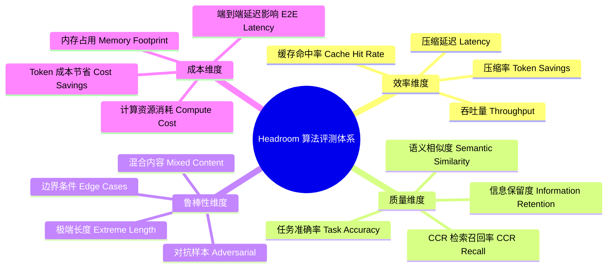
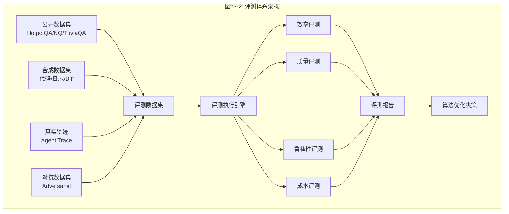
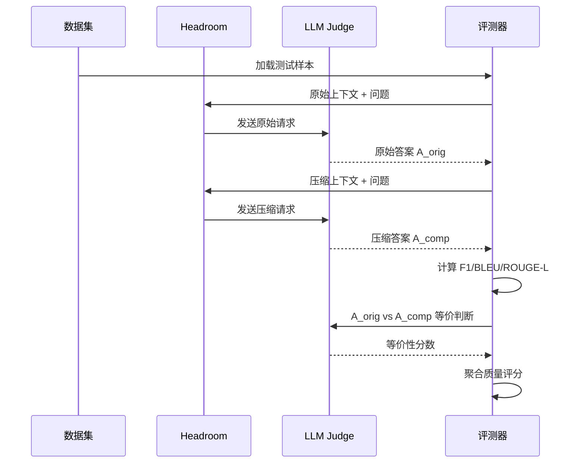
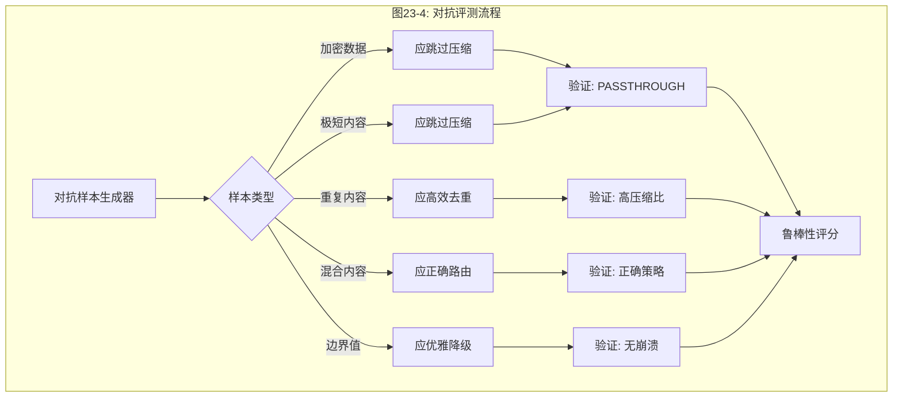
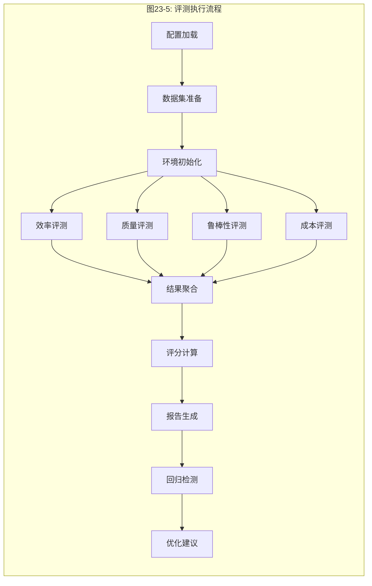
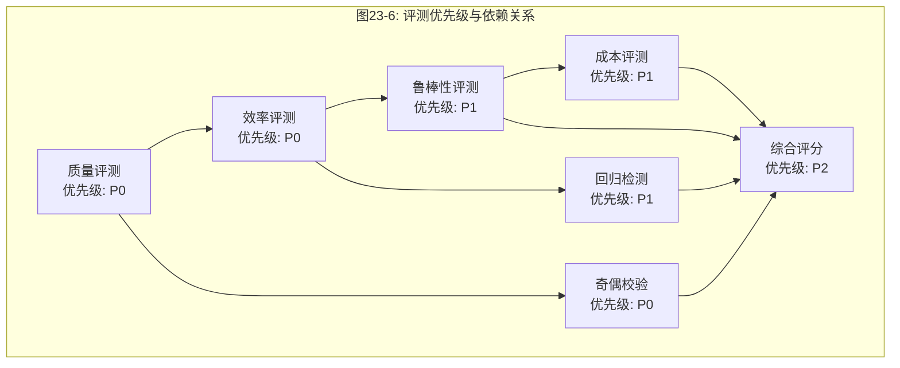

# 23 — Headroom 算法体系评测方案

## 总（概述）

Headroom 算法体系评测方案是对 Headroom 全部压缩算法、路由策略、缓存优化和相关性评估的系统性评测框架。本方案基于项目已有的 [evals](file:///workspace/headroom/evals/core.py) 和 [benchmarks](file:///workspace/benchmarks/compression_benchmark.py) 基础设施，构建一套覆盖**效率、质量、鲁棒性、成本**四维度的完整评测体系。



*图23-1: Headroom 算法评测体系知识脑图*



*图23-2: 评测体系架构总览*

---

## 分（详细分析）

### 一、评测对象清单

#### 1.1 压缩算法

| 算法 | 源文件 | 目标内容类型 | 核心机制 |
|------|--------|------------|---------|
| SmartCrusher | [smart_crusher.py](file:///workspace/headroom/transforms/smart_crusher.py) | JSON/结构化数据 | 锚点选择+分类+去重+键名缩短 |
| CodeCompressor | [code_compressor.py](file:///workspace/headroom/transforms/code_compressor.py) | 源代码 | AST 感知+结构保留 |
| KompressCompressor | [kompress_compressor.py](file:///workspace/headroom/transforms/kompress_compressor.py) | 通用文本 | ModernBERT+ONNX INT8 量化推理 |
| DiffCompressor | [diff_compressor.py](file:///workspace/headroom/transforms/diff_compressor.py) | Git Diff | Hunk 选择+上下文保留 |
| LogCompressor | [log_compressor.py](file:///workspace/headroom/transforms/log_compressor.py) | 构建/测试日志 | 错误/警告保留+堆栈追踪提取 |
| SearchCompressor | [search_compressor.py](file:///workspace/headroom/transforms/search_compressor.py) | 搜索结果 | 去重+排序+摘要 |
| HTMLExtractor | [html_extractor.py](file:///workspace/headroom/transforms/html_extractor.py) | HTML | trafilatura 纯文本提取 |

#### 1.2 路由与策略

| 组件 | 源文件 | 职责 |
|------|--------|------|
| ContentRouter | [content_router.py](file:///workspace/headroom/transforms/content_router.py) | 内容类型检测→策略路由 |
| CompressionPolicy | [compression_policy.py](file:///workspace/headroom/transforms/compression_policy.py) | 压缩决策门控 |
| AdaptiveSizer | [adaptive_sizer.py](file:///workspace/headroom/transforms/adaptive_sizer.py) | 自适应压缩目标比 |
| CacheAligner | [cache_aligner.py](file:///workspace/headroom/transforms/cache_aligner.py) | 缓存前缀对齐 |

#### 1.3 辅助系统

| 组件 | 源文件 | 职责 |
|------|--------|------|
| CCR | [ccr/](file:///workspace/headroom/ccr/__init__.py) | 可逆压缩+检索 |
| Relevance | [relevance/](file:///workspace/headroom/relevance/base.py) | BM25/Embedding/Hybrid 相关性评分 |
| CompressionFeedback | [compression_feedback.py](file:///workspace/headroom/cache/compression_feedback.py) | 压缩质量反馈 |
| TagProtector | [tag_protector.py](file:///workspace/headroom/transforms/tag_protector.py) | XML/HTML 标签保护 |

---

### 二、评测数据集设计

#### 2.1 公开基准数据集

基于 [evals/datasets.py](file:///workspace/headroom/evals/datasets.py) 已有的数据集加载器：

| 数据集 | 规模 | 内容类型 | 评测目标 |
|--------|------|---------|---------|
| HotpotQA | 500 samples | 多跳问答 | 长上下文信息保留 |
| Natural Questions | 500 samples | 事实问答 | 搜索结果压缩质量 |
| TriviaQA | 300 samples | 知识问答 | 通用文本压缩 |
| MS MARCO | 500 samples | 搜索排序 | 搜索结果压缩 |
| SQuAD | 500 samples | 阅读理解 | 精确信息保留 |
| LongBench | 200 samples | 长文本 | 极端长度压缩 |
| ToolUsage | 200 samples | 工具调用 | CCR 检索召回 |

#### 2.2 合成数据集

| 数据集 | 生成方式 | 规模 | 评测目标 |
|--------|---------|------|---------|
| CodeSnippets | 多语言代码生成器 | 1000 samples | CodeCompressor |
| BuildLogs | CI/CD 日志模拟器 | 500 samples | LogCompressor |
| GitDiffs | 仓库 diff 采样 | 500 samples | DiffCompressor |
| SearchResults | 搜索引擎模拟 | 500 samples | SearchCompressor |
| JSONPayloads | API 响应生成器 | 1000 samples | SmartCrusher |
| HTMLPages | 网页爬取采样 | 300 samples | HTMLExtractor |
| MixedContent | 上述混合拼接 | 500 samples | ContentRouter |

#### 2.3 真实轨迹数据集

| 数据集 | 来源 | 规模 | 评测目标 |
|--------|------|------|---------|
| AgentTraces | Claude/Codex 会话 | 200 traces | 端到端压缩质量 |
| AdversarialTraces | [adversarial_benchmark](file:///workspace/benchmarks/headroom_adversarial_benchmark.py) | 100 traces | 极端场景鲁棒性 |

#### 2.4 对抗数据集

基于 [headroom_adversarial_benchmark.py](file:///workspace/benchmarks/headroom_adversarial_benchmark.py) 的对抗样本类型：

| 类型 | 描述 | 评测目标 |
|------|------|---------|
| 加密数据 | Base64/Hex 编码内容 | 不误压缩 |
| 极短内容 | <100 字符 | 最小压缩阈值 |
| 对话上下文 | 多轮对话历史 | 保护对话流 |
| 代码+自然语言混合 | 注释密集代码 | 混合路由准确性 |
| 重复内容 | 高冗余文本 | 去重效果上限 |
| 结构化表格 | Markdown/ASCII 表格 | 表格结构保留 |

---

### 三、效率维度评测

#### 3.1 压缩率评测

**指标定义**：

| 指标 | 公式 | 目标值 | 权重 |
|------|------|--------|------|
| Token 压缩比 | `compressed_tokens / original_tokens` | ≤ 0.40 | 30% |
| 节省百分比 | `(1 - compressed_tokens / original_tokens) * 100` | ≥ 60% | 20% |
| 有效压缩率 | 压缩比 × 质量保留度 | ≥ 0.55 | 30% |
| 缓存命中节省 | `cache_hit_tokens / total_tokens` | ≥ 0.15 | 20% |

**评测方法**：

```python
# 基于 evals/core.py 的 CompressionEvaluator 扩展
class EfficiencyEvaluator:
    def evaluate_compression_ratio(self, content: str, strategy: str) -> RatioResult:
        original_tokens = self.tokenizer.count(content)
        compressed = self.router.compress(content, strategy=strategy)
        compressed_tokens = self.tokenizer.count(compressed.compressed)
        return RatioResult(
            original_tokens=original_tokens,
            compressed_tokens=compressed_tokens,
            ratio=compressed_tokens / original_tokens,
            savings_pct=(1 - compressed_tokens / original_tokens) * 100
        )
```

**分算法压缩率目标**：

| 算法 | 目标压缩比 | 最低可接受 |
|------|-----------|-----------|
| SmartCrusher | 0.20-0.35 | 0.45 |
| CodeCompressor | 0.40-0.55 | 0.65 |
| KompressCompressor | 0.50-0.65 | 0.75 |
| DiffCompressor | 0.30-0.50 | 0.60 |
| LogCompressor | 0.25-0.40 | 0.55 |
| SearchCompressor | 0.35-0.50 | 0.60 |
| HTMLExtractor | 0.15-0.30 | 0.40 |

#### 3.2 延迟评测

**指标定义**：

| 指标 | 说明 | 目标值 |
|------|------|--------|
| P50 压缩延迟 | 中位数压缩耗时 | ≤ 50ms |
| P95 压缩延迟 | 95 分位耗时 | ≤ 200ms |
| P99 压缩延迟 | 99 分位耗时 | ≤ 500ms |
| 首次压缩延迟 | 含模型加载的冷启动 | ≤ 3s |
| 增量压缩延迟 | 热路径压缩耗时 | ≤ 20ms |

**评测方法**：

```python
# 基于 bench_transforms.py 的 BenchmarkTransforms 扩展
class LatencyEvaluator:
    def measure_latency(self, content: str, strategy: str, warmup: int = 5, runs: int = 100):
        # Warmup
        for _ in range(warmup):
            self.router.compress(content, strategy=strategy)

        # Measurement
        latencies = []
        for _ in range(runs):
            start = time.perf_counter_ns()
            self.router.compress(content, strategy=strategy)
            latencies.append(time.perf_counter_ns() - start)

        return LatencyResult(
            p50=np.percentile(latencies, 50) / 1e6,   # ms
            p95=np.percentile(latencies, 95) / 1e6,
            p99=np.percentile(latencies, 99) / 1e6,
            mean=np.mean(latencies) / 1e6,
            std=np.std(latencies) / 1e6,
        )
```

**分算法延迟目标**：

| 算法 | P50 目标 | P95 目标 | 备注 |
|------|---------|---------|------|
| SmartCrusher | ≤ 10ms | ≤ 30ms | 纯规则，无模型 |
| CodeCompressor | ≤ 30ms | ≤ 80ms | AST 解析开销 |
| KompressCompressor | ≤ 50ms | ≤ 200ms | ONNX 推理 |
| DiffCompressor | ≤ 15ms | ≤ 40ms | 纯规则 |
| LogCompressor | ≤ 10ms | ≤ 30ms | 纯规则 |
| SearchCompressor | ≤ 15ms | ≤ 40ms | 纯规则 |
| HTMLExtractor | ≤ 20ms | ≤ 60ms | trafilatura |

#### 3.3 吞吐量评测

| 指标 | 说明 | 目标值 |
|------|------|--------|
| 单线程 QPS | 每秒压缩请求数 | ≥ 100 QPS |
| 多线程 QPS | 8 线程并发 QPS | ≥ 500 QPS |
| 批量吞吐 | 批量模式 tokens/s | ≥ 50K tokens/s |

#### 3.4 缓存效率评测

基于 [compression_feedback.py](file:///workspace/headroom/cache/compression_feedback.py) 的反馈机制：

| 指标 | 说明 | 目标值 |
|------|------|--------|
| KV 缓存命中率 | 前缀匹配命中比例 | ≥ 30% |
| 压缩结果缓存命中率 | 重复内容复用率 | ≥ 20% |
| Skip Set 命中率 | 不可压缩内容跳过率 | ≥ 10% |
| 缓存对齐收益 | CacheAligner 节省比例 | ≥ 5% |

---

### 四、质量维度评测

#### 4.1 信息保留度评测

基于 [evals/metrics.py](file:///workspace/headroom/evals/metrics.py) 的指标体系：

| 指标 | 公式/方法 | 说明 | 权重 |
|------|----------|------|------|
| 精确匹配率 | `exact_match(predicted, reference)` | 答案完全一致 | 10% |
| F1 分数 | `2 * P * R / (P + R)` | Token 级精确率/召回率 | 15% |
| BLEU | n-gram 精确率几何平均 | 翻译质量 | 10% |
| ROUGE-L | 最长公共子序列 F1 | 摘要质量 | 15% |
| 语义相似度 | cosine(embedding(a), embedding(b)) | 语义保留度 | 25% |
| 答案等价性 | LLM-as-Judge 二元判断 | 功能等价 | 25% |

**评测方法：Before/After 对比**



*图23-3: Before/After 质量评测时序图*

**质量目标**：

| 算法 | F1 最低 | 语义相似度最低 | 答案等价率最低 |
|------|---------|--------------|--------------|
| SmartCrusher | 0.90 | 0.85 | 0.95 |
| CodeCompressor | 0.85 | 0.80 | 0.90 |
| KompressCompressor | 0.80 | 0.75 | 0.85 |
| DiffCompressor | 0.85 | 0.80 | 0.90 |
| LogCompressor | 0.85 | 0.80 | 0.90 |
| SearchCompressor | 0.85 | 0.80 | 0.90 |
| HTMLExtractor | 0.80 | 0.75 | 0.85 |

#### 4.2 CCR 检索召回率评测

| 指标 | 公式 | 目标值 |
|------|------|--------|
| 检索触发率 | `retrieve_calls / total_compressions` | ≤ 0.30 |
| 检索成功率 | `successful_retrieves / retrieve_calls` | ≥ 0.95 |
| 信息完整度 | 检索原文与原始内容的 overlap | ≥ 0.99 |
| 端到端准确率 | 使用 CCR 后的答案等价率 | ≥ 0.90 |

**评测方法**：

```python
class CCRRetrivalEvaluator:
    def evaluate(self, session: list[dict]) -> CCREvalResult:
        # 1. 压缩会话，启用 CCR
        compressed_session = self.compress_with_ccr(session)

        # 2. 模拟 LLM 调用 headroom_retrieve
        retrieve_calls = self.simulate_retrieval(compressed_session)

        # 3. 验证检索内容完整性
        for call in retrieve_calls:
            original = self.ccr_store.get(call.key)
            retrieved = call.retrieved_content
            completeness = self.compute_overlap(original, retrieved)

        return CCREvalResult(
            trigger_rate=retrieve_calls / total,
            success_rate=successful / retrieve_calls,
            completeness=np.mean(completeness_scores),
            e2e_accuracy=answer_equivalence_rate
        )
```

#### 4.3 相关性评分评测

基于 [relevance/](file:///workspace/headroom/relevance/base.py) 的三种评分器：

| 评分器 | 方法 | 适用场景 | 目标相关性 |
|--------|------|---------|-----------|
| BM25Relevance | [bm25.py](file:///workspace/headroom/relevance/bm25.py) | 精确 ID/关键词匹配 | ≥ 0.80 |
| EmbeddingRelevance | [embedding.py](file:///workspace/headroom/relevance/embedding.py) | 语义相似度 | ≥ 0.75 |
| HybridRelevance | [hybrid.py](file:///workspace/headroom/relevance/hybrid.py) | 自适应融合 | ≥ 0.82 |

**评测方法**：对压缩后内容与原始内容计算相关性分数，确保关键信息不丢失。

#### 4.4 结构保留评测

| 指标 | 说明 | 目标值 |
|------|------|--------|
| JSON 可解析率 | 压缩后 JSON 仍可解析 | 100% |
| 代码可编译率 | 压缩后代码仍可解析 | ≥ 95% |
| 表格结构保留率 | 表格行列结构完整 | ≥ 90% |
| 标签完整率 | TagProtector 保护的标签无损 | 100% |

---

### 五、鲁棒性维度评测

#### 5.1 对抗样本评测

基于 [headroom_adversarial_benchmark.py](file:///workspace/benchmarks/headroom_adversarial_benchmark.py)：



*图23-4: 对抗评测流程图*

| 对抗类型 | 输入 | 期望行为 | 评分标准 |
|---------|------|---------|---------|
| 加密数据 | Base64/Hex 编码 | PASSTHROUGH 或极低压缩 | 不破坏数据得 1 分 |
| 极短内容 | < 100 字符 | 跳过压缩 | 不压缩得 1 分 |
| 空内容 | 空字符串 / None | 优雅处理 | 无异常得 1 分 |
| 超长内容 | > 100K tokens | 正常压缩 | 无 OOM 得 1 分 |
| 重复内容 | 同一内容重复 100 次 | 高压缩比 | 比率 < 0.05 得 1 分 |
| 混合内容 | 代码+日志+JSON 混合 | 正确路由 | 策略匹配得 1 分 |
| 格式错误 | 不完整 JSON/代码 | 优雅降级 | 无崩溃得 1 分 |
| Unicode | 多语言/Emoji 内容 | 正确处理 | 无乱码得 1 分 |
| 注入攻击 | Prompt 注入内容 | 不执行注入 | 安全得 1 分 |

#### 5.2 混合内容路由准确性

| 指标 | 说明 | 目标值 |
|------|------|--------|
| 路由准确率 | 正确策略选择比例 | ≥ 90% |
| 混合拆分准确率 | 正确识别内容边界 | ≥ 85% |
| 策略回退合理性 | 回退到次优策略的合理性 | ≥ 95% |

**评测方法**：

```python
class RoutingAccuracyEvaluator:
    # 人工标注的内容类型→策略映射
    GOLD_STANDARD = {
        "python_code": CompressionStrategy.CODE_AWARE,
        "json_array": CompressionStrategy.SMART_CRUSHER,
        "git_diff": CompressionStrategy.DIFF,
        "build_log": CompressionStrategy.LOG,
        "search_results": CompressionStrategy.SEARCH,
        "html_page": CompressionStrategy.HTML,
        "plain_text": CompressionStrategy.KOMPRESS,
    }

    def evaluate_routing(self, samples: list[TaggedSample]) -> RoutingResult:
        correct = 0
        for sample in samples:
            detected = self.router._detect_content(sample.content)
            actual = self.router._strategy_from_detection(detected)
            expected = self.GOLD_STANDARD[sample.tag]
            if actual == expected:
                correct += 1
        return RoutingResult(
            accuracy=correct / len(samples),
            confusion_matrix=self._build_confusion_matrix(samples)
        )
```

#### 5.3 Python/Rust 奇偶校验

基于 [headroom-parity](file:///workspace/crates/headroom-parity/) crate：

| 组件 | 评测方法 | 一致性目标 |
|------|---------|-----------|
| SmartCrusher | 同输入对比 Python/Rust 输出 | 100% |
| DiffCompressor | 同输入对比 Python/Rust 输出 | 100% |
| LogCompressor | 同输入对比 Python/Rust 输出 | 100% |
| ContentDetector | 同输入对比分类结果 | 100% |

---

### 六、成本维度评测

#### 6.1 Token 成本评测

基于 [agent_cost_benchmark.py](file:///workspace/benchmarks/agent_cost_benchmark.py) 和 [pricing/](file:///workspace/headroom/pricing/litellm_pricing.py)：

| 指标 | 公式 | 目标值 |
|------|------|--------|
| 输入成本节省 | `(1 - compressed_cost / original_cost) * 100` | ≥ 50% |
| 端到端成本节省 | 含 CCR 检索成本后的净节省 | ≥ 40% |
| 缓存成本节省 | KV 缓存命中节省的比例 | ≥ 15% |

**分模型成本评测**：

| 模型 | 输入价格/1M tokens | 60% 节省后成本 | 月度节省估算(1B tokens) |
|------|-------------------|--------------|----------------------|
| Claude 3.5 Sonnet | $3.00 | $1.20 | $1,800 |
| GPT-4o | $2.50 | $1.00 | $1,500 |
| Gemini 1.5 Pro | $1.25 | $0.50 | $750 |

#### 6.2 端到端延迟影响

| 指标 | 说明 | 目标值 |
|------|------|--------|
| 压缩开销占比 | 压缩时间 / 总请求时间 | ≤ 5% |
| 首Token延迟增加 | 压缩导致的 TTFT 增加 | ≤ 100ms |
| 缓存命中加速 | KV 缓存命中的 TTFT 减少 | ≥ 200ms |

#### 6.3 资源消耗评测

| 指标 | 说明 | 目标值 |
|------|------|--------|
| 峰值内存 | 压缩过程最大内存 | ≤ 512MB |
| 模型内存 | Kompress ONNX 模型内存 | ≤ 200MB |
| CPU 利用率 | 压缩过程 CPU 峰值 | ≤ 80% |
| GPU 利用率 | ONNX 推理 GPU 占用 | ≤ 50% |

---

### 七、评测执行框架

#### 7.1 评测套件定义

基于 [suite_runner.py](file:///workspace/headroom/evals/suite_runner.py) 扩展：

```python
class AlgorithmEvalSuite:
    """算法体系评测套件"""

    suites = {
        "efficiency": EfficiencyEvaluator,
        "quality": QualityEvaluator,
        "robustness": RobustnessEvaluator,
        "cost": CostEvaluator,
        "parity": ParityEvaluator,
        "routing": RoutingAccuracyEvaluator,
    }

    def run_full_eval(self, config: EvalConfig) -> FullEvalReport:
        results = {}
        for name, evaluator_cls in self.suites.items():
            evaluator = evaluator_cls(config)
            results[name] = evaluator.run()

        return FullEvalReport(
            efficiency=results["efficiency"],
            quality=results["quality"],
            robustness=results["robustness"],
            cost=results["cost"],
            parity=results["parity"],
            routing=results["routing"],
            overall_score=self._compute_weighted_score(results),
            recommendations=self._generate_recommendations(results)
        )
```

#### 7.2 评测执行流程



*图23-5: 评测执行流程图*

#### 7.3 综合评分模型

**权重分配**：

| 维度 | 权重 | 子指标 |
|------|------|--------|
| 效率 | 30% | 压缩比(15%) + 延迟(10%) + 缓存(5%) |
| 质量 | 35% | 信息保留(15%) + 语义相似(10%) + CCR召回(10%) |
| 鲁棒性 | 20% | 对抗(10%) + 路由准确(5%) + 奇偶(5%) |
| 成本 | 15% | Token节省(8%) + 延迟影响(4%) + 资源(3%) |

**综合评分公式**：

```
Overall = 0.30 × Efficiency + 0.35 × Quality + 0.20 × Robustness + 0.15 × Cost

其中每个维度分数 = Σ(子指标得分 × 子权重) / 满分
```

**评级标准**：

| 等级 | 分数范围 | 含义 |
|------|---------|------|
| A+ | ≥ 90 | 生产级优秀 |
| A | 80-89 | 生产级良好 |
| B | 70-79 | 可用，需优化 |
| C | 60-69 | 基本可用，有明显缺陷 |
| D | < 60 | 不可用，需重大改进 |

#### 7.4 回归检测

| 检测项 | 方法 | 阈值 |
|--------|------|------|
| 压缩率回归 | 与基线对比 | 下降 > 5% 报警 |
| 质量回归 | F1/语义相似度对比 | 下降 > 3% 报警 |
| 延迟回归 | P95 对比 | 增加 > 20% 报警 |
| 新增崩溃 | 对抗样本测试 | 任何崩溃阻断发布 |

---

### 八、评测报告模板

#### 8.1 单算法评测报告

```markdown
# [算法名] 评测报告

## 基本信息
- 评测日期: YYYY-MM-DD
- 代码版本: commit hash
- 评测配置: [配置摘要]

## 效率评测
| 指标 | 结果 | 目标 | 状态 |
|------|------|------|------|
| 压缩比 | 0.35 | ≤ 0.40 | ✅ |
| P95 延迟 | 45ms | ≤ 80ms | ✅ |

## 质量评测
| 指标 | 结果 | 目标 | 状态 |
|------|------|------|------|
| F1 | 0.88 | ≥ 0.85 | ✅ |
| 语义相似度 | 0.82 | ≥ 0.80 | ✅ |

## 鲁棒性评测
| 对抗类型 | 结果 | 状态 |
|---------|------|------|
| 加密数据 | PASSTHROUGH | ✅ |

## 综合评分: A (85/100)
```

#### 8.2 全局评测仪表盘

| 维度 | 评分 | 等级 | 趋势 |
|------|------|------|------|
| 效率 | 82 | A | ↑ |
| 质量 | 78 | B | → |
| 鲁棒性 | 85 | A | ↑ |
| 成本 | 80 | A | → |
| **综合** | **81** | **A** | **↑** |

---

### 九、评测实施计划

| 阶段 | 内容 | 交付物 |
|------|------|--------|
| Phase 1 | 数据集构建 + 评测脚本开发 | 数据集 + 脚本 |
| Phase 2 | 效率 + 质量基准评测 | 基准报告 |
| Phase 3 | 鲁棒性 + 对抗评测 | 鲁棒性报告 |
| Phase 4 | 成本评测 + 综合评分 | 综合报告 |
| Phase 5 | CI 集成 + 回归检测 | CI Pipeline |

---

## 总（总结）

### 评测体系核心价值

| 价值 | 说明 |
|------|------|
| 量化决策 | 用数据驱动算法优化，而非直觉 |
| 质量守门 | 确保压缩不损害 LLM 输出质量 |
| 回归防护 | 每次变更自动检测性能退化 |
| 成本透明 | 精确量化压缩的经济价值 |

### 评测维度优先级



*图23-6: 评测优先级与依赖关系图*

### 关键原则

1. **质量不可妥协**：任何压缩比的提升不能以质量下降为代价
2. **Before/After 对比**：所有质量评测必须对比压缩前后的 LLM 输出
3. **真实场景优先**：Agent Trace 数据集的权重高于合成数据集
4. **对抗思维**：始终考虑最坏情况下的系统行为
5. **持续评测**：评测不是一次性活动，而是 CI/CD 的一部分

### 与现有基础设施的关系

| 现有组件 | 本方案扩展 |
|---------|-----------|
| [evals/core.py](file:///workspace/headroom/evals/core.py) | 新增 EfficiencyEvaluator / RobustnessEvaluator |
| [evals/metrics.py](file:///workspace/headroom/evals/metrics.py) | 新增结构保留 / CCR 召回指标 |
| [evals/datasets.py](file:///workspace/headroom/evals/datasets.py) | 新增合成数据集 / 对抗数据集 |
| [benchmarks/compression_benchmark.py](file:///workspace/benchmarks/compression_benchmark.py) | 新增分算法延迟基准 |
| [benchmarks/headroom_adversarial_benchmark.py](file:///workspace/benchmarks/headroom_adversarial_benchmark.py) | 扩展对抗样本类型 |
| [relevance/](file:///workspace/headroom/relevance/base.py) | 作为质量评测的子组件 |
